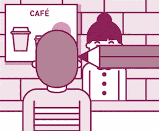

# 2016 年客户体验趋势!

> 原文：<https://medium.com/hackernoon/las-tendencias-de-experiencia-de-cliente-para-el-2016-b034e5db003c>

开始新的一年,重新设计你希望客户使用你的产品或服务的体验。在价格或容量上竞争并不一定会转化为竞争优势,您必须提供理想的,有用的和有意义的体验,以确保消费者对您的品牌忠诚。

以下是一些关键趋势,供您考虑今年要实施的策略:

*   **全渠道体验(T1)**

消费者需要不间断的服务。客户服务必须集中不同的在线和模拟渠道,以满足和跟踪客户的需求。

**贵公司的所有联络点是否都已连接并保持最新状态?(T3 )**

*   **自助服务工具**

很多时候,客户不想与某人交谈以获取信息,雇用或使用产品或服务。他们要求工具,使他们能够做到这一点,而不需要中间人。

6、你是否给客户提供直接与你的产品或服务相关的工具?(T7 )

*   投资于你的员工(T9)

即使您不相信,您的员工体验与您的客户体验同样重要。毕竟,员工是那些与客户直接接触并履行品牌承诺的人。越来越多的公司正在重新设计员工体验,以适应消费者的体验,从而形成全面的客户服务战略。

10、什么样的体验对你的员工来说是令人满意和有用的?(T11)

*   预测技术(T13)

公司正在使用技术工具来预测客户的品味和兴趣,从而能够个性化他们的体验。例如,当客户打电话给公司时,系统会识别他们并知道他们的需求。

你是否使用技术来预测客户的需求?(T15)

*   手机是第一位的。(T17)

以消费者为中心的公司不再将移动应用程序视为客户体验的补充,而是通过移动设备引导客户的接触点。

**你如何使用手机来驱动客户体验?**

一些罕见的专家在疾病方面的经验，对客户来说有多重要。contáctanos en o en nuestras sociales[**https://twitter.com/noescomun**](https://twitter.com/noescomun)**y**[**https://www.facebook.com/noescomun**](https://www.facebook.com/noescomun)

**#不常见**

> [黑客中午](http://bit.ly/Hackernoon)是黑客如何开始他们的下午。我们是阿妹家庭的一员。我们现在[接受投稿](http://bit.ly/hackernoonsubmission)并乐意[讨论广告&赞助](mailto:partners@amipublications.com)的机会。
> 
> 如果你喜欢这个故事，我们推荐你阅读我们的[最新科技故事](http://bit.ly/hackernoonlatestt)和[趋势科技故事](https://hackernoon.com/trending)。直到下一次，不要把世界的现实想当然！

