# LastPass——主动重新设计

> 原文：<https://medium.com/hackernoon/lastpass-an-unsolicited-redesign-8d04794ad664>

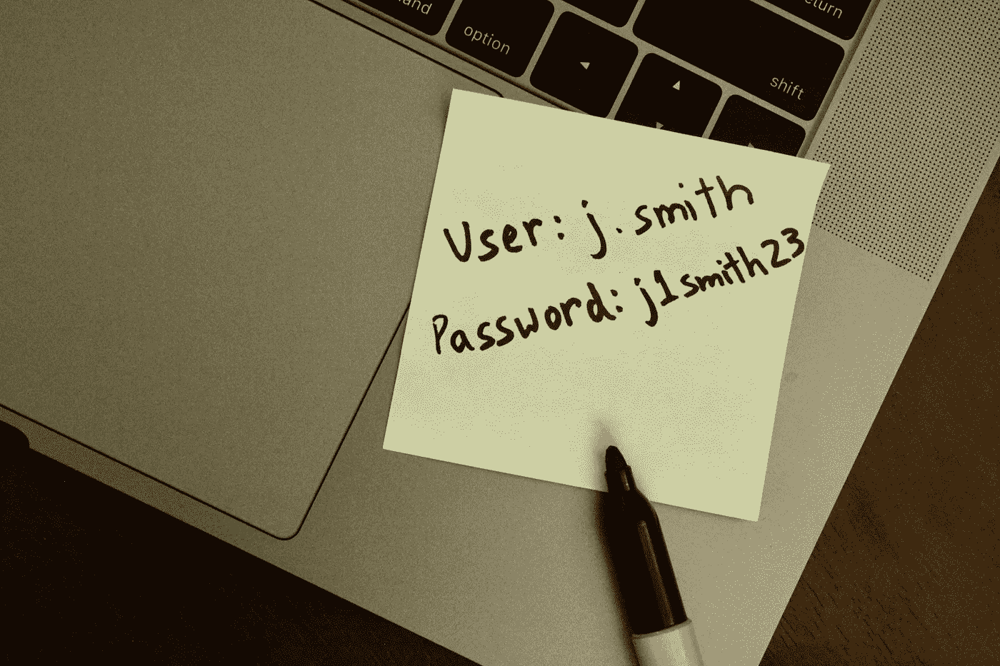

# **背景**

几个月前，在不断被一个朋友纠缠之后，我终于建立了一个 LastPass 账户，并开始在我的 iPhone 上使用它。如果你不熟悉 LastPass，这里有一个关于它的简要概述:

*LastPass 是一个密码管理器，可以创建并记住你的密码。它还允许您安全地保存信用卡信息和笔记。所有这些都锁在一个安全的主密码后面。*

LastPass 是一款强大的产品，尤其是在隐私和[安全需求日益增长的情况下。在尴尬的使用谷歌文档管理我的密码后，我最终决定使用 LastPass。](https://hackernoon.com/tagged/security)

Uhh…Google Docs?

然而，在将该应用程序集成到我的日常工作流程中后，有些功能使用起来感觉非常繁琐。所以我终于挠痒痒重新设计了这个应用。重新设计是不请自来的，所以它完全基于我作为用户和设计师对 iOS 平台的体验。由于我无法获得用户数据和/或关于 LastPass 当前设计的研究，我尽最大努力考虑每一个细节，并保持应用程序的整体感觉完好无损。

我将重新设计分为两个阶段:

1.  当前设计分析—对当前应用程序的评估
2.  主动重新设计—建议通过更直观的用户界面获得更好的用户体验

# **当前设计分析**

我发现最大的痛点是应用程序的信息架构。一个突出的挫折是糟糕的导航和应用程序中分散的功能造成的混乱。我将当前的信息架构可视化，以了解发生了什么:

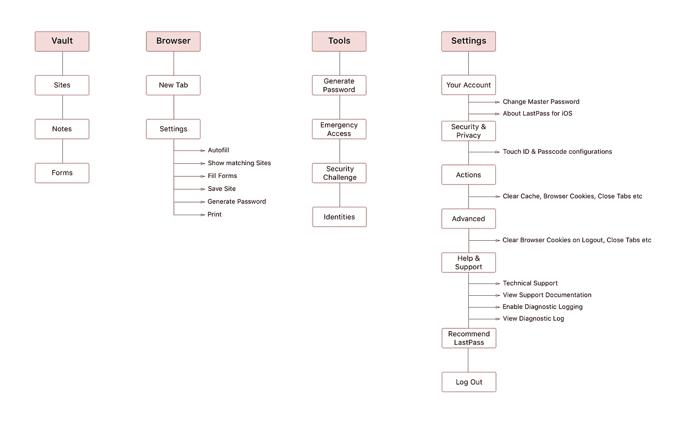

Current Information Architecture

## 棘手问题

1.  **隐藏的&无组织的功能** — LastPass 的最佳功能分散在整个应用中。例如，紧急访问和身份是当前放在工具**、**下的功能，这是不直观的。
2.  **重叠特征** —有多种方式触发相似特征。这方面的一个例子是清除缓存和注销时清除缓存，它们位于应用程序的不同部分。
3.  **令人困惑的语言—** 用于描述整个应用程序特性和功能的文本过于冗长。下面的“添加访问权限”屏幕就是一个例子:

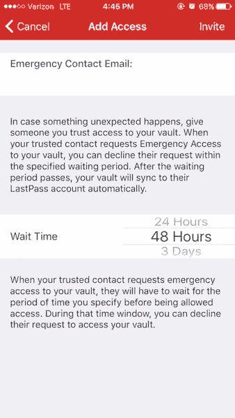

Add Emergency Access

# **重新设计—让我们开始工作**

在这一部分，我重新安排了信息架构(IA)并重新设计了一些用户界面(UI)。让我们来解决一些问题:

**修订后的信息架构**

我重组信息体系结构的主要目标是:

1.  增加应用程序中关键功能的可见性，以便于访问
2.  删除一些不太有用的重复功能。

以下是我对 IA 版本的修改:

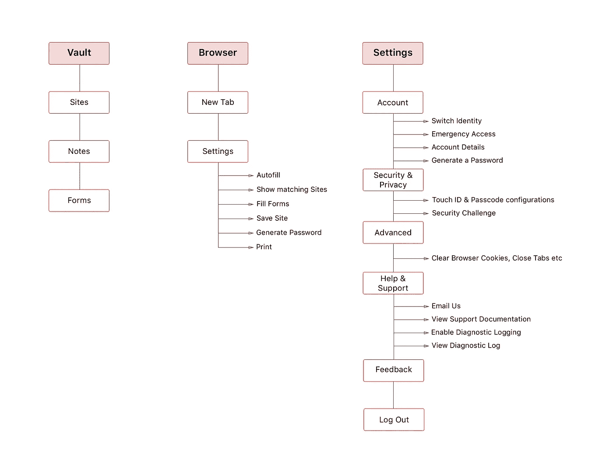

Revised Information Architecture

## **构思和纸上原型**

在我致力于高保真设计之前，我决定草拟一些解决方案来构建不同的想法。

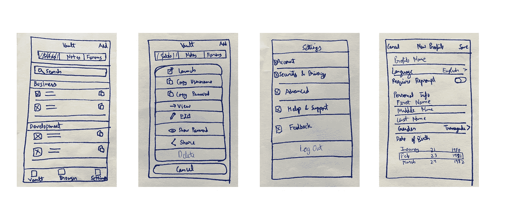

Initial Sketches

## **UX 的建议和重新设计**

## 体验 1:设置

我做的最重要的改变之一是去掉了标签栏中的工具部分，把它的内容组织到设置部分。

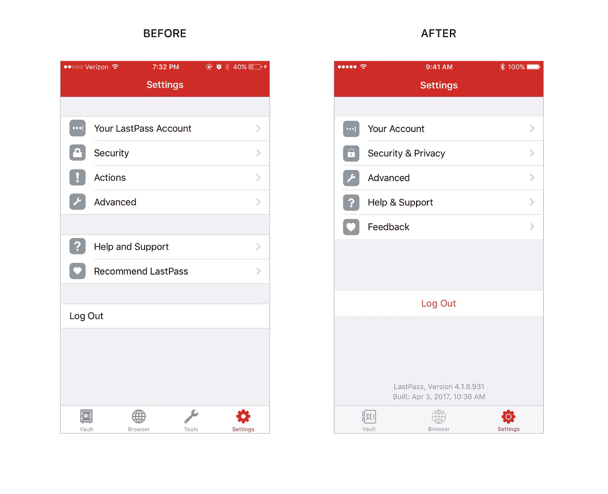

Settings

## **体验#2:跳马(主屏幕)**

我增加了每个单元格中文本的字体大小，因为当前的字体大小有点难以阅读。

Vault (Home Screen)

## 经验 3:对保存的密码采取进一步行动的行动表

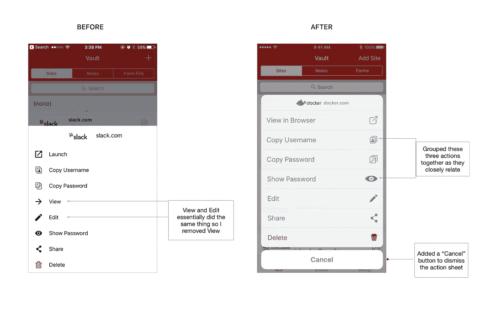

Action Sheet

## 体验#4:改变用户身份

切换身份是一项更适合用户帐户而不是工具的任务。我还根据 [iOS 人机界面指南清理了动作单。](https://developer.apple.com/ios/human-interface-guidelines/ui-views/action-sheets/)

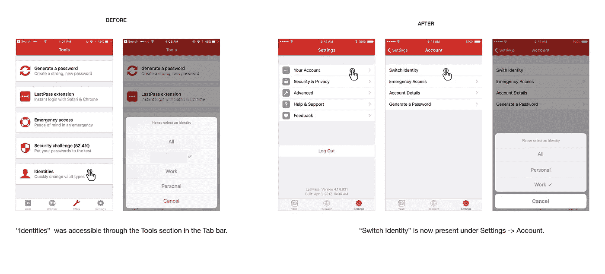

Switch Identity

## 经验之五:给你的账户添加紧急访问权限

在这个工作流中，我把重点放在了添加访问屏幕上，使它不那么描述性和通风，而不损害必要的细节。

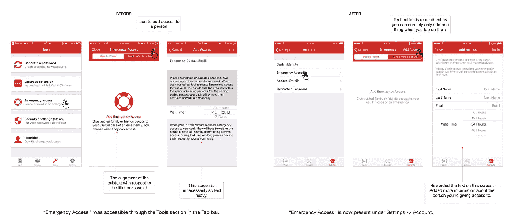

Emergency Access

## 经验之六:账户详情

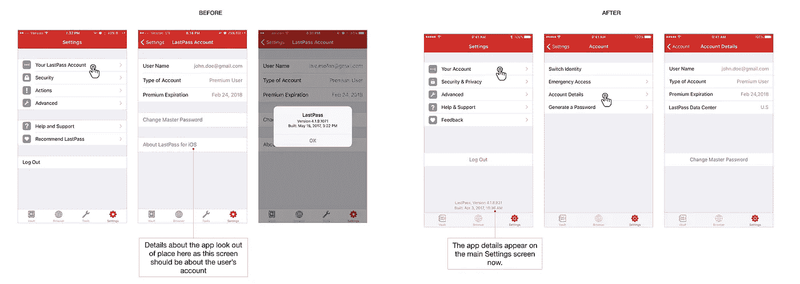

Account Details

## 经验 7:生成新密码

密码设置和要求的配置当前隐藏在“显示更多设置”下。我重新设计了屏幕，使有用的设置出现在同一个屏幕上，便于用户使用。

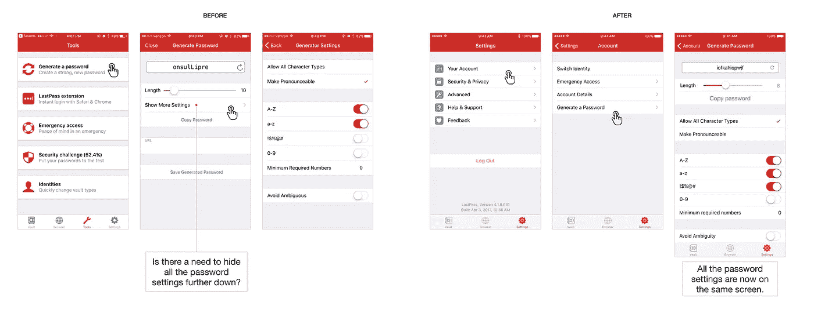

Generate Passsword

## 体验#8:高级设置

LastPass 在两个不同的地方提供了清除浏览器 cookies、浏览器缓存等的选项——动作子菜单和高级子菜单，都在设置中。在“操作”下，您可以手动清除 cookies、缓存等，而在“高级”下，您可以在注销时打开开关来清除这些设置。我决定在高级设置下只保留前者的选项，因为注销时清除缓存不应该暴露给用户，而是默认打开。

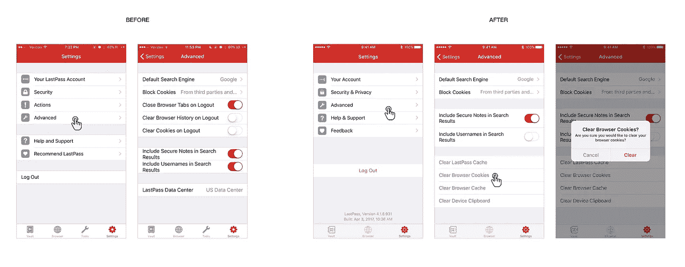

Advanced Settings

## 经验 9:帮助和支持

帮助和支持屏幕上的技术支持当前会打开一个电子邮件草稿窗口。我把它换成了一个标有“给我们发邮件”的淡蓝色按钮，以表明它是一个可点击的按钮。这个屏幕上的其他选项是不言自明的，所以我去掉了伴随每个按钮的详细文本。

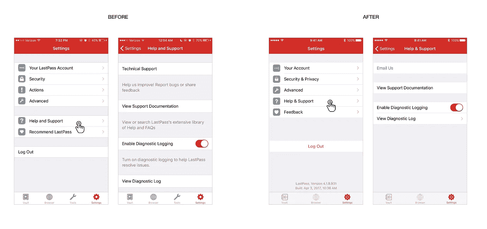

Help & Support

# 对我在这里工作的反思

一开始是抱怨“为什么这个应用程序这么难用？”变成了长达一个月的努力，去理解最简单的行为是如何与糟糕的设计混淆的。虽然我低估了重新设计一个应用程序和理解各种用例及工作流程的细微差别所需要的工作量，但这个项目对我来说是一个鞭策自己和磨练自己设计技能的绝佳机会。

> "认识到需求是设计的首要条件."—查尔斯·伊姆斯

我希望你喜欢阅读它，就像我喜欢写它一样。请务必在下面❤️，并留下评论/建议。

## 👉🏽📱这是我的全交互原型的链接。你可以随意摆弄它。😀

注意:LastPass 刚刚更新了他们的应用程序，并将“工具”选项卡重命名为“安全”。其他一切还是老样子。

编辑(07–25–17)——LastPass 团队联系了我，我和他们的产品设计负责人聊得很开心。