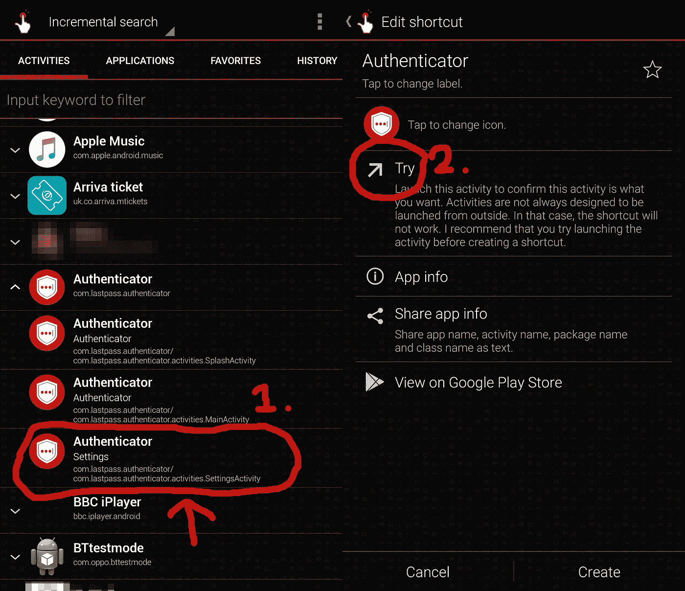

# “LastPass”验证器应用程序不安全

> 原文：<https://medium.com/hackernoon/lastpass-authenticator-app-is-not-secure-77b9743c3007>

更新:问题已被修复。请看下文。

我发现了一个非常简单的方法来绕过指纹/PIN 认证，保护您所有的 2FA 代码。LastPass 生产的 Android 应用程序没有使用他们旗舰应用程序使用的相同保护措施(如空闲时锁定、关闭屏幕时锁定等)。

你所需要的只是访问个人活动(应用程序的“屏幕”)。你不需要 root 来访问这些；pre-Oreo 你可以使用像 Adam Szalkowski 的 [Activity Launcher](https://play.google.com/store/apps/details?id=de.szalkowski.activitylauncher) 这样的应用，或者如果你在 Oreo 上，你可以使用 sika524 的 [QuickShortcutMaker](https://play.google.com/store/apps/details?id=com.sika524.android.quickshortcut) 。

您需要访问的活动是**com . lastpass . authenticator . activities . settings activity**:

The settings activity

打开设置活动，你会看到(惊喜，惊喜)设置页面。按左上方的返回箭头(或您的返回箭头按钮)会将您带到主活动，您的 2FA 代码就在这里。请注意，您在任何时候都不需要提供您的 PIN/指纹来访问此活动。

这种保护的缺乏是可以自动化的，因为它只是一个标准的 Android 活动。不幸的是，该应用程序不包括在 Bugcrowd bounty 计划中，但我觉得让人们知道这一点很重要。目前最好的解决方法是使用一个好的应用程序锁，例如 OxygenOS 中的内置锁或 KeepSafe 的[应用程序锁](https://play.google.com/store/apps/details?id=com.getkeepsafe.applock)。

(编辑#1，27/12，7.30pm GMT):很多人都说这个缺陷需要物理访问。然而，正如我上面指出的，您不需要物理访问，恶意安装的应用程序可以很容易地访问活动并捕获代码。)

(编辑#2，28/12 下午 4.50pm GMT):该 bug 已在即将发布的 1.2.0.1145 版本中修复。感谢你分享这篇文章并提供支持，也感谢 LastPass 解决了这个问题。)

负责任的披露时间表:

【2017 年 6 月 13 日:向 LastPass 支持报告，并提供证明。LP 的 Jed 确认他可以重现该问题

**6 月 20 日**:跟进询问预计到达时间。支持确认没有 ETA

**12 月 7 日**:跟进，票推至“三级支持”。来自 LP 的 Johnny 确认没有更新，并且“仍在调查中”。

**12 月 8 日**:知情支持表示我将公布详细信息，但没有收到回复。