# 潜在空间可视化—深度学习比特#2

> 原文：<https://medium.com/hackernoon/latent-space-visualization-deep-learning-bits-2-bd09a46920df>

*精选*:插值，t-SNE 投影(附 gif&示例！)

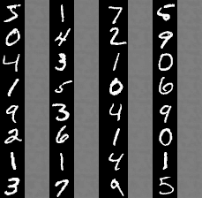

在“*深度学习 bits* ”系列中，我们将**而不是**看到如何像我们在[***a . I . Odyssey***](/@juliendespois/talk-to-you-computer-with-you-eyes-and-deep-learning-a-i-odyssey-part-2-7d3405ab8be1)***中所做的那样，端到端地使用深度学习来解决复杂问题。*** 我们更愿意看看不同的技术，以及一些**例子和应用。**别忘了看看 [*深度学习比特#1*](https://hackernoon.com/autoencoders-deep-learning-bits-1-11731e200694) ！

> ***如果你喜欢人工智能，一定要去*** [***订阅时事通讯***](http://eepurl.com/cATXvT) ***来接收关于文章和更多的更新！***

# 介绍

[上次](https://hackernoon.com/autoencoders-deep-learning-bits-1-11731e200694)，我们已经了解了什么是自动编码器，以及它们是如何工作的。今天，我们将看到它们如何帮助我们以非常酷的方式将数据可视化。为此，我们将使用卷积自动编码器架构( *CAE* )来处理图像。

## 又有什么潜在空间？

自动编码器由两部分组成，这里有一个快速提示。 ***编码器*** 将来自高维输入的数据带到一个 ***瓶颈*** 层，这里的神经元数量最少。然后， ***解码器*** 获取该编码输入，并将其转换回原始输入形状——在我们的例子中是图像。 ***潜在空间是*** 数据位于瓶颈层的空间。

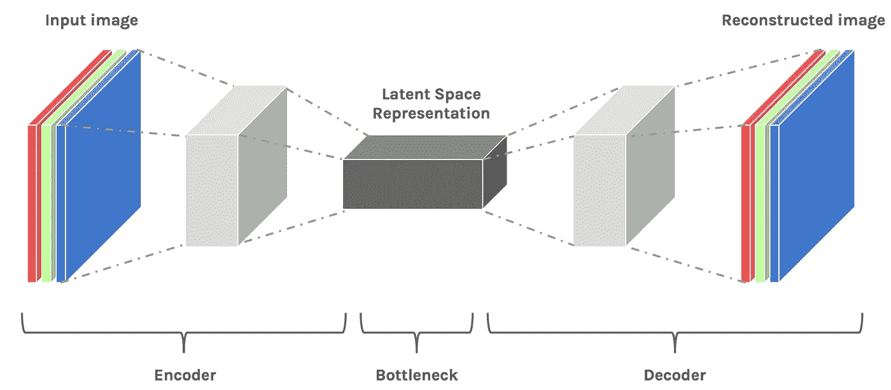

Convolutional Encoder-Decoder architecture

潜在空间包含图像的**压缩**表示，这是**允许解码器使用的唯一信息**以尽可能忠实地 **重建输入**。为了表现良好，网络必须学会提取瓶颈中最相关的特征。****

**让我们看看我们能做些什么！**

# **数据集**

**我们将改变上次的数据集。与其看着[我的眼睛](https://hackernoon.com/talk-to-you-computer-with-you-eyes-and-deep-learning-a-i-odyssey-part-2-7d3405ab8be1#.scd7s8ej4)或[蓝色方块](https://hackernoon.com/autoencoders-deep-learning-bits-1-11731e200694#.6qgkt12jm)，我们将致力于可能是计算机视觉最著名的*:*手写数字*的 [MNIST](http://yann.lecun.com/exdb/mnist/) 数据集*。我通常更喜欢使用不太传统的数据集，只是为了多样化，但是 MNIST 对于我们今天要做的事情来说非常方便。**

*****注意:*** 虽然 MNIST 可视化在互联网上很常见*，但这篇文章中的图像是 100%从代码中生成的**，**，所以你可以在你自己的模型中使用这些技术。***

***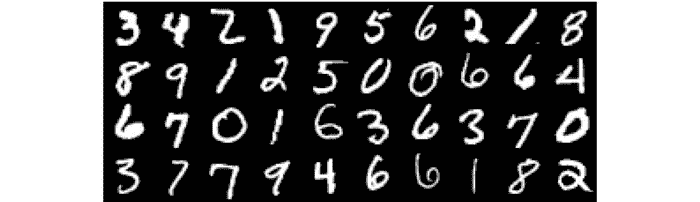***

***MNIST is a labelled dataset of 28x28 images of handwritten digits***

# ***基线—自动编码器的性能***

***为了理解编码器能够从输入中提取出什么样的特征，我们可以先看一下图像的**重建。**如果这个**听起来很熟悉**，那很正常，我们上次已经做过了。然而，这一步是**必要的**，因为它为我们对模型的*期望*设定了基线。***

******注:*** 对于这个岗位来说，瓶颈层只有 **32 个单位**，这是有些*真的*，*真的*野蛮降维。如果它是一个图像，它甚至不会是 6x6 像素。***

***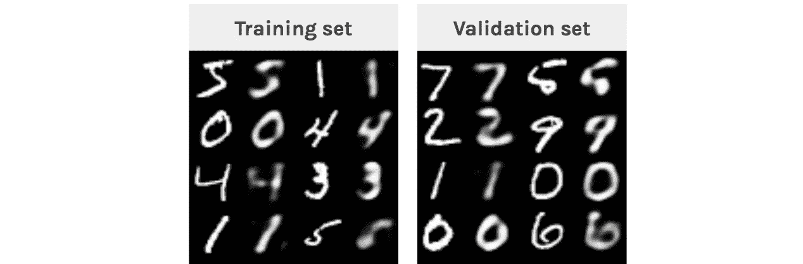***

***Each digit is displayed next to its blurry reconstruction***

***我们可以看到自动编码器**成功地**重建了数字。**重建模糊**，因为输入在瓶颈层被**压缩**。我们需要查看*验证样本*的原因是以确保我们没有*过度拟合*训练集。***

******加成*** : *下面是训练过程动画****

******

***Reconstruction of **training**(left) and **validation**(right) samples at each step***

# ***t-SNE 可视化***

## ***什么是 t-SNE？***

***当处理数据集时，我们想做的第一件事是以一种*有意义的*方式**可视化**数据。在我们的例子中，**图像** *(或像素)* **空间**有 784 个维度(28 **28*1* )，我们显然*无法*出图。挑战在于将所有这些维度压缩到我们可以把握的东西中，比如 2D 或 3D。***

***这里出现了 [t-SNE](http://jmlr.org/papers/volume9/vandermaaten08a/vandermaaten08a.pdf) ，一种将**高维空间**映射到 **2D 或 3D 空间**的算法，同时试图**保持点**之间的距离**相同**。我们将使用这种技术来绘制数据集的嵌入，*首先直接来自**图像空间**，然后*来自**较小的** **潜在空间**。*****

******注:*** *t-SNE 比它的表亲*[*PCA*](http://www.cs.cmu.edu/~elaw/papers/pca.pdf)*和*[*ICA*](http://www2.hawaii.edu/~kyungim/papers/baek_cvprip02.pdf)*更好的可视化。****

## ***投影像素空间***

***让我们从绘制数据集的 t-SNE 嵌入(来自图像空间)开始，看看它看起来像什么。***

***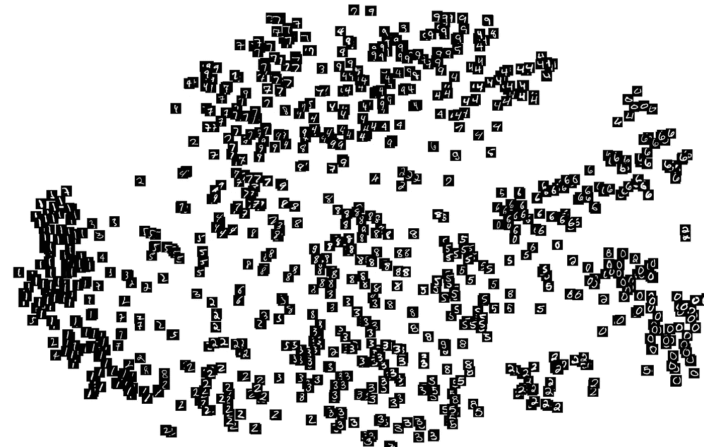***

***t-SNE projection of **image space** representations from the validation set***

***我们已经可以看到有些数字是*大致* **簇在一起**的。那是因为数据集真的很简单*，我们可以在像素上使用简单的*试探法*对样本进行分类。看看数字 **8、5、7 和 3** 怎么没有聚类，那是因为它们都是由**相同的像素**组成的，只有微小的变化才能区分它们。***

*****对更复杂的数据，如* [*RGB 图像*](https://www.cs.toronto.edu/~kriz/cifar.html)***只有*** ***簇*** *才会对***的图像产生相同的一般颜色。*****

## ****投射潜在空间****

****我们知道*潜在空间*包含****比像素空间**更简单的图像表示**，所以我们可以希望 t-SNE 会给我们一个有趣的**潜在空间**的二维投影。********

******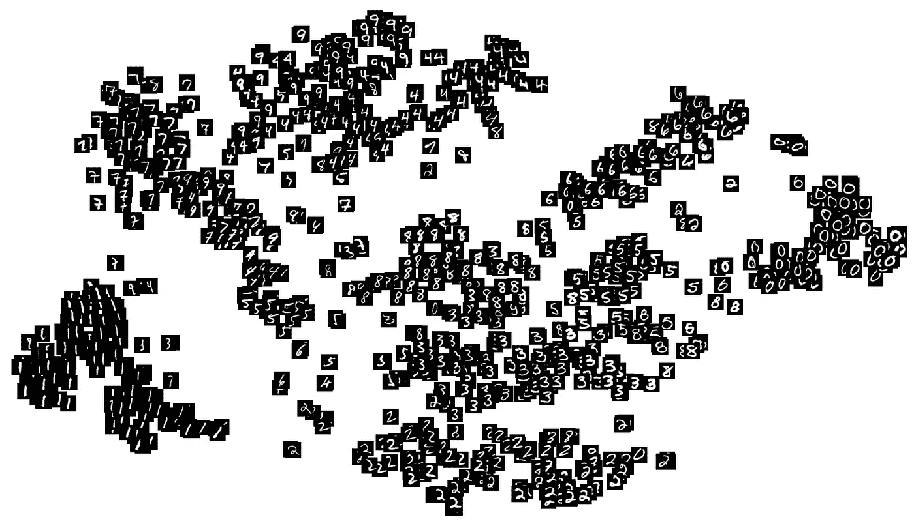******

******t-SNE projection of **latent space** representations from the validation set******

******虽然*并不完美*，但是投影显示了**更密集的**星团。这表明在潜在空间中，相同的数字彼此接近。我们可以看到数字 **8、7、5 和 3** 现在更容易区分，并且出现在*小*簇中。******

# ******插入文字******

******现在我们知道了模型能够提取的细节层次，我们可以探测潜在空间的结构。为此，我们将比较**插值**在*图像空间*和*潜在空间*中的样子。******

## ******图像空间中的线性插值******

******我们首先从数据集中获取**两幅图像，并在它们之间进行线性插值。实际上，这个*以一种**幽灵般的**方式混合*图像。********

****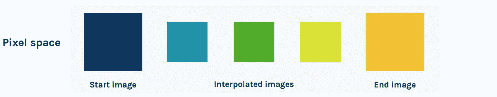********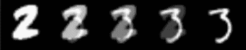************

****Interpolation in **pixel space******

****这种杂乱过渡的原因是像素空间本身的**结构。在图像空间中，从一幅图像平滑地过渡到另一幅图像是不可能的。这就是为什么混合空玻璃杯*的图像和满玻璃杯*的图像*不会给出半满玻璃杯*的图像的原因。********

## ***潜在空间中的线性插值***

***现在，让我们在潜在空间做同样的事情。我们获取相同的开始和结束图像，然后**将它们馈送给编码器**以获得它们的*潜在空间表示。*然后，我们在两个潜在向量之间进行插值，并将这些插入到**解码器**中。***

***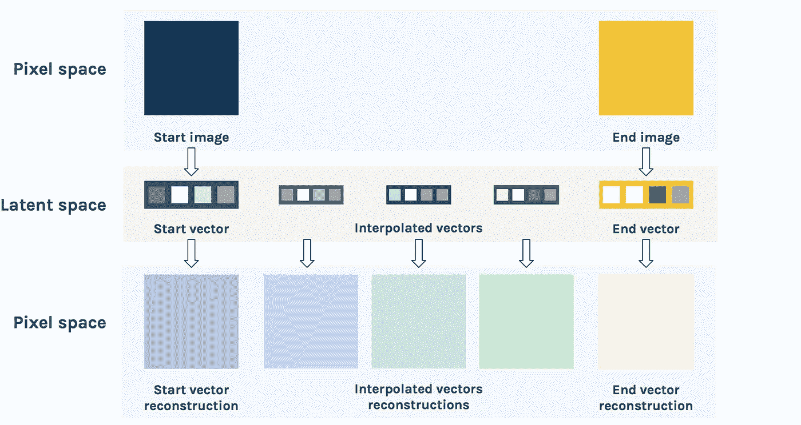******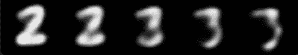*********

***Interpolation in **latent space*****

***结果是**更有说服力**。我们清楚地看到，这两个数字的形状慢慢地从一个*转变为另一个*，而不是有一个*褪色* *叠加*。这显示了潜在空间**对图像结构**的理解程度。***

******奖励:*** 这里有几个两个空间插值的动画***

***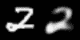******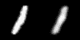******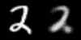******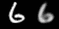***

***Linear interpolation in **image space** (left) and **latent space** (right)***

# ***更多技术和示例***

## ***插值示例***

***在**更丰富的**数据集上，借助**更好的**模型，我们可以获得*难以置信的*视觉效果。***

******

***[3-way **Latent space** interpolation for **faces**](https://arxiv.org/pdf/1609.04468.pdf)***

******

***Interpolation of [**3D shapes**](http://3dgan.csail.mit.edu)***

## ***潜在空间算法***

***我们还可以在潜空间**里做**算术**。**这意味着用**代替** **插值，我们可以加减**潜在空间表示法。***

****比如有脸，戴眼镜的男人——不戴眼镜的男人+不戴眼镜的女人=戴眼镜的女人。这项技术带来了令人兴奋的结果。****

***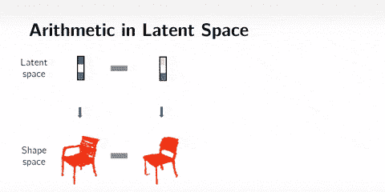***

***Arithmetics on [**3D shapes**](http://3dgan.csail.mit.edu)***

******注意:*** 我已经在代码中为其添加了一个函数，但在 MNIST 上看起来很糟糕。***

# ***结论***

***在这篇文章中，我们看到了几种技术来可视化嵌入在自动编码器神经网络潜在空间中的**学习到的**特征*。这些可视化有助于理解网络正在学习什么。由此，我们可以为****压缩*** 以及许多其他应用开发潜在空间。*****

> ******如果你喜欢人工智能，一定要去*** [***订阅时事通讯***](http://eepurl.com/cATXvT) ***来接收关于文章和更多的更新！******

***你可以玩那边的代码:***

 ***[## GitHub-desp oisj/LatentSpaceVisualization:一个潜在空间的可视化技术…

### Keras 中卷积自动编码器潜在空间的可视化技术

github.com](https://github.com/despoisj/LatentSpaceVisualization)*** 

***感谢阅读这篇文章，敬请关注！***