# 🔥最新的深度学习 OCR 与 Keras 和 Supervisely 在 15 分钟内

> 原文：<https://medium.com/hackernoon/latest-deep-learning-ocr-with-keras-and-supervisely-in-15-minutes-34aecd630ed8>

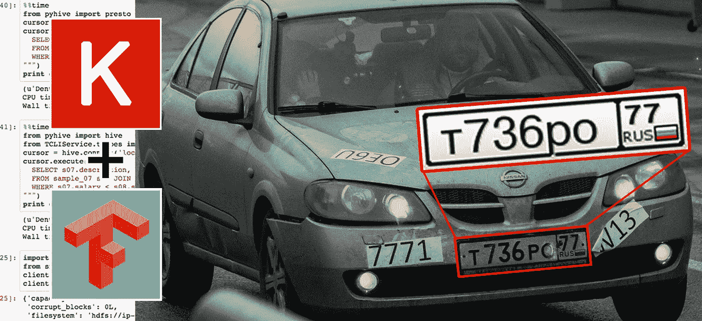

你好世界。本教程温和地介绍了如何在 15 分钟内使用深度学习构建现代文本识别系统。它将教你如何使用 [Keras](https://keras.io/) 和[supervised](https://supervise.ly/)解决这个问题的主要思想。本指南适用于对使用深度学习进行图像中的文本识别感兴趣但不知道从哪里开始的任何人。

我们将考虑一个简单的现实世界的例子:车牌识别。这是一个很好的起点，您可以轻松地为您的任务定制它。关于如何检测车牌的简单教程你可以在这里找到。

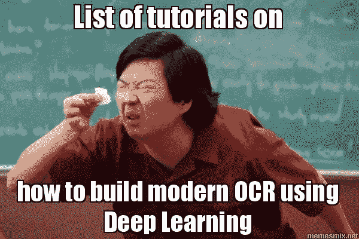

当我们进入这个领域时，我们面临着互联网上资料的缺乏。通过长期的研究和阅读许多论文，我们已经对创建有效的识别系统背后的主要原则有了理解。我们在两个小型视频讲座([第一部分](/towards-data-science/lecture-on-how-to-build-a-recognition-system-part-1-best-practices-46208e1ae591)和[第二部分](https://goo.gl/KwWR48))中与社区分享了我们的理解，并用简单的语言解释了它是如何工作的。我们认为这些内容非常有价值，因为不可能找到关于如何构建现代识别系统的简单而又好的解释。我们强烈建议在你开始之前观看它们，因为它们会给你这个话题背后的很多直觉。

要顺利通过这个教程，你需要 Ubuntu，GPU 和 Docker。

所有资源都可以在 [github](https://github.com/DeepSystems/supervisely-tutorials) 获得。源代码位于[单个 jupyther 笔记本](https://github.com/DeepSystems/supervisely-tutorials/blob/master/anpr_ocr/src/image_ocr.ipynb)上，带有注释和有用的可视化。

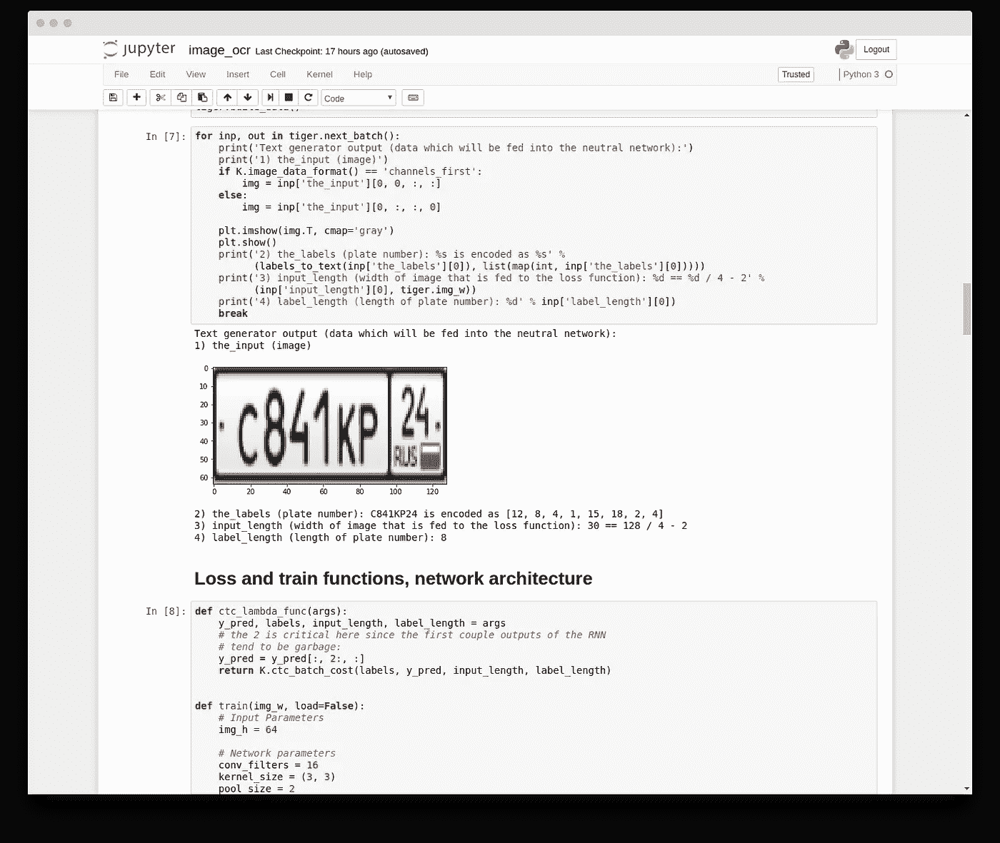

# 从哪里获取训练数据？

对于本教程，我们已经生成了超过 10K 图像的人工数据集，非常类似于真实的车牌。图像看起来像这样。

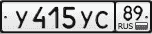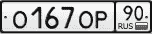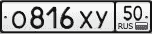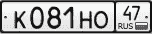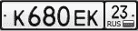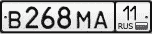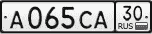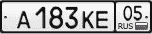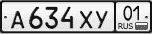

你可以很容易地从[supervised](https://supervise.ly/)得到这个数据集。让我们对此说几句话。我们在 [DeepSystems](https://deepsystems.ai) 做了很多计算机视觉开发，比如[自动驾驶汽车](https://deepsystems.ai/solutions/autonomous-driving)，收据识别系统[，道路缺陷检测](https://deepsystems.ai/solutions/road-defects-detection)等等。作为数据科学家，我们花费大量时间来处理训练数据:创建自定义图像注释，将我们的数据与公共数据集合并，进行数据扩充等等。[超级管理](https://supervise.ly/)简化了您处理培训数据的方式，并自动化了许多常规任务。我们相信你会发现它在你的日常工作中很有用。

第一步是[在](https://app.supervise.ly/signup)[中监督注册](https://supervise.ly/)。下一步是进入“导入”—>“数据集库”标签，点击“anpr_ocr”项目。

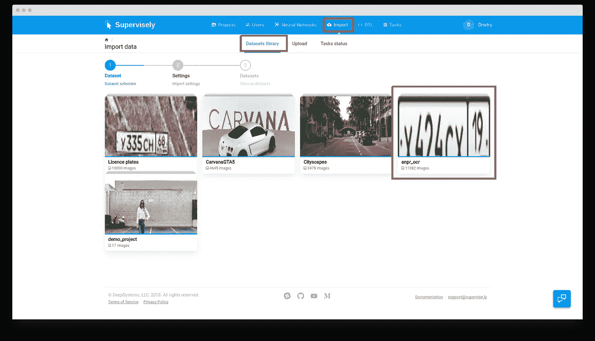

在那之后输入名字“anpr_ocr”并且点击“下一步”按钮。

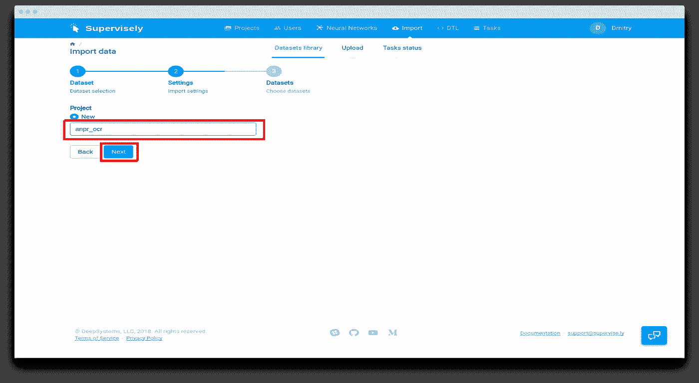

然后点击“上传”按钮。仅此而已。现在项目“anpr_ocr”被添加到您的帐户中。

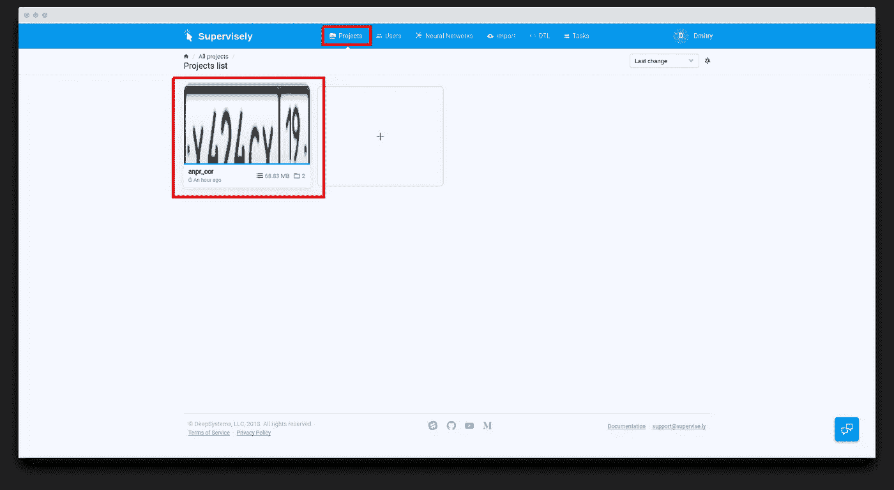

它由两个数据集组成:“训练”和“测试”。

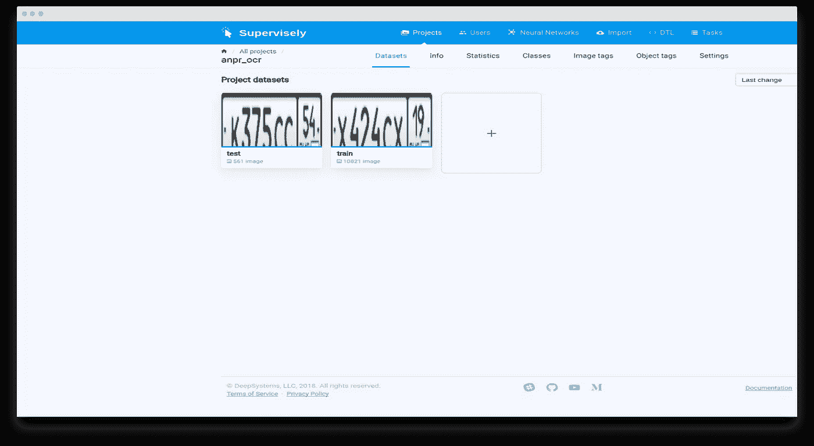

如果你想预览图像，只需点击数据集，你会立即进入注释工具。对于每个图像，我们都有一个文本描述，它将被用作训练我们系统的基础事实。要查看它，只需点击所选图像对面的小图标(红色市场)。

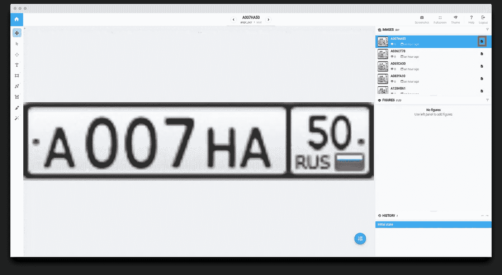

现在我们必须以特定的格式下载它。为此，只需点击“DTL”页面，并将此[配置](https://github.com/DeepSystems/supervisely-tutorials/blob/master/anpr_ocr/src/export_config.json)插入文本区域。它看起来会像这样。

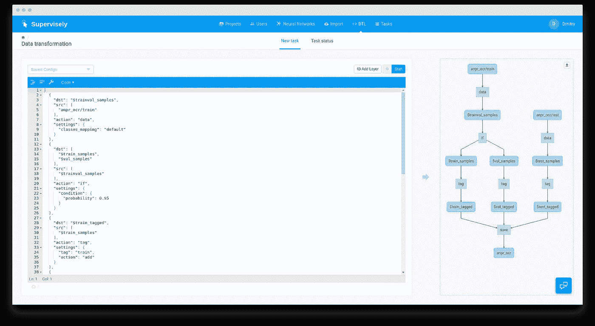

在上面的截图中，您可以看到说明导出步骤的方案。我们不会深究技术细节(如果需要，您可以阅读[文档](https://docs.supervise.ly)),但是尝试在下面解释这个过程。在我们的“anpr_ocr”项目中，我们有两个数据集。“测试”数据集按原样导出(所有图像将被标记为“测试”)。“train”数据集被分成两组:“Train”和“val”。随机 95%的图像将被标记为“火车”，其余 5%被标记为“val”。

现在你可以点击“开始”按钮，等待两分钟，系统准备下载档案。点击“DTL”->“任务状态”->“三个竖点”->“下载”按钮，获取培训数据(红色标记)。

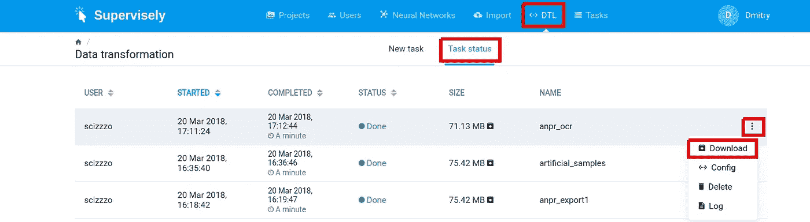

# 让我们开始实验吧

我们在我们的 [git 仓库](https://github.com/DeepSystems/supervisely-tutorials)中准备了您需要的所有东西。使用以下命令克隆它

```
git clone [https://github.com/DeepSystems/supervisely-tutorials.git](https://github.com/DeepSystems/supervisely-tutorials.git) 
cd supervisely-tutorials/anpr_ocr
```

目录结构如下

```
.
├── data
├── docker
│   ├── build.sh
│   ├── Dockerfile
│   └── run.sh
└── src
    ├── architecture.png
    ├── export_config.json
    └── image_ocr.ipynb
```

将下载的 zip 存档文件放入“data”目录，并运行下面的命令

```
unzip <archive name>.zip -d .
```

在我的例子中，命令是

```
unzip anpr_ocr.zip -d .
```

现在让我们用准备好的工作环境(tensorflow 和 keras)构建并运行 docker 容器。只需转到“docker”目录并运行以下命令

```
./build.sh
./run.sh
```

在那之后，你将进入集装箱。运行下一个命令启动 Jupyther 笔记本

```
jupyter notebook
```

在终端中，您会看到类似这样的内容

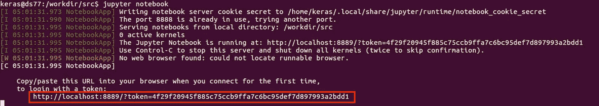

你必须复制选定的链接，并将其粘贴到网络浏览器。请注意，您的链接将与我的略有不同。

最后一步是运行整个“image_ocr.ipynb”笔记本。点击“单元格”->“全部运行”。

笔记本由几个主要部分组成:数据加载和可视化，模型训练，测试集上的模型评估。对于该数据集，训练过程平均需要大约 30 分钟。

如果一切正常，您将看到以下输出

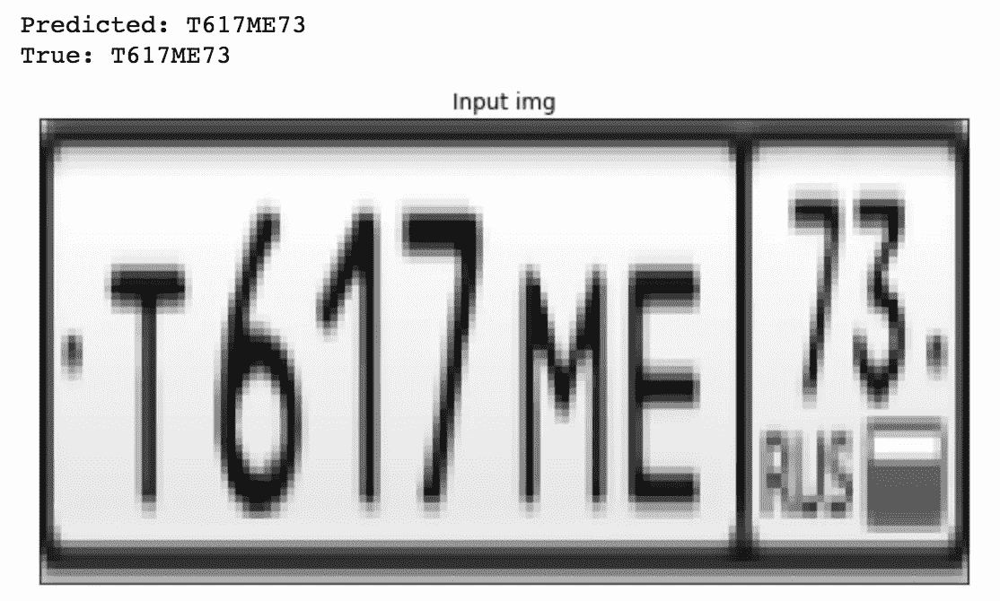

如你所见，预测的字符串将与地面真相相同。因此，我们在一个漂亮的[清晰的 jupyther 笔记本](https://github.com/DeepSystems/supervisely-tutorials/blob/master/anpr_ocr/src/image_ocr.ipynb)中构建了现代 OCR 系统。在本教程的下一章，我们将涵盖和解释它如何工作的所有主要原则。

# 它是如何工作的

对于我们来说，对神经网络架构的理解是关键。请不要偷懒，花 15 分钟看一下我们的小而简单的[视频讲座](https://youtu.be/uVbOckyUemo)关于 NN 架构的高级概述，这是在开始时提到的。它会让你有个大概的了解。如果你已经做了—太好了！:-)

在这里，我将尝试给你简短的解释。高层次的概述如下

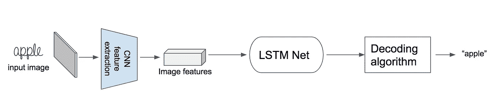

首先，将图像送入 CNN 提取图像特征。下一步是将[递归神经网络](/towards-data-science/lecture-evolution-from-vanilla-rnn-to-gru-lstms-58688f1da83a)应用于这些特征，然后是特殊的解码算法。这种解码算法从每个时间步长获取 lstm 输出，并产生最终的标记。

详细的架构如下。FC —全连接层，SM — softmax 层。

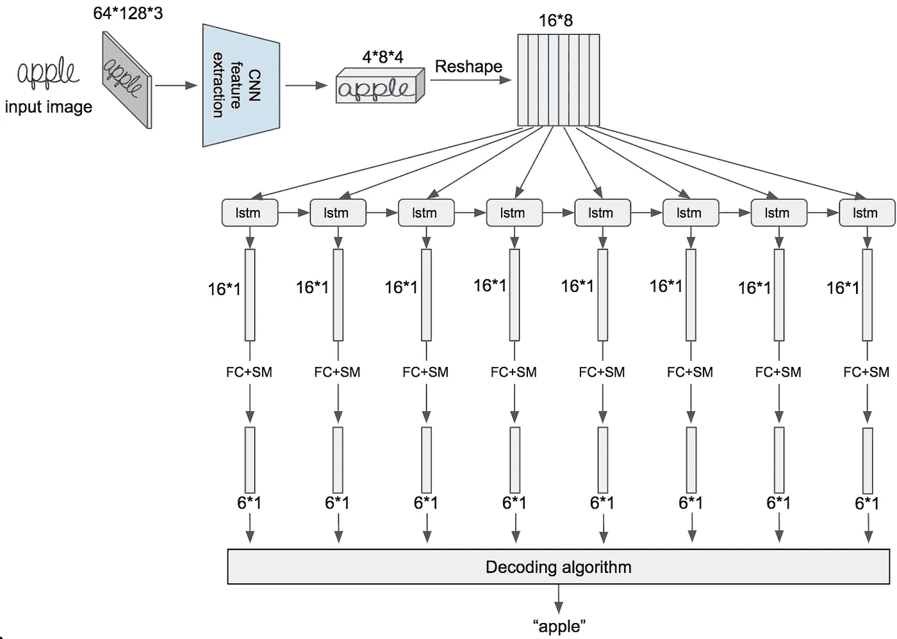

图像具有以下形状:高度等于 64，宽度等于 128，通道数等于 3。

正如你之前看到的，我们将这个图像张量输入到 CNN 特征提取器，它产生形状为 4*8*4 的张量。我们把图像“苹果”放到特征张量中，这样你就能理解如何解释它。高度等于 4，宽度等于 8(这些是空间维度)，通道数等于 4。因此，我们将具有 3 个通道的输入图像变换为 4 个通道的张量。实际上，通道的数量应该更大，但我们构建了一个小型演示网络，因为幻灯片上的所有内容都很合适。

接下来我们做整形手术。之后，我们得到 16 个元素的 8 个向量的序列。之后，我们将这 8 个向量馈送到 LSTM 网络，并获得其输出——也是 16 个元素的向量。然后，我们应用全连接层，接着是 softmax 层，并获得 6 个元素的向量。这个向量包含在每个 LSTM 步骤中观察到的字母符号的概率分布。

实际上，CNN 输出向量的数量可以达到 32、64 或更多。选择将取决于具体的任务。此外，在生产中，最好使用多层双向 LSTM。但是这个简单的例子只解释了最重要的概念。

但是解码算法是如何工作的呢？在上图中，我们在每个 LSTM 时间步有八个概率向量。让我们在每个时间步取最可能的符号。结果，我们获得了八个字符的字符串——每个时间步一个最可能的字母。然后，我们必须将所有连续的重复字符粘合成一个。在我们的例子中，两个字母“e”粘在了一起。特殊空白字符允许我们拆分原始标签中重复的符号。我们将空白符号添加到字母表中，以教会我们的神经网络预测这种大小写符号之间的空白。然后我们删除所有空白符号。看下面的插图

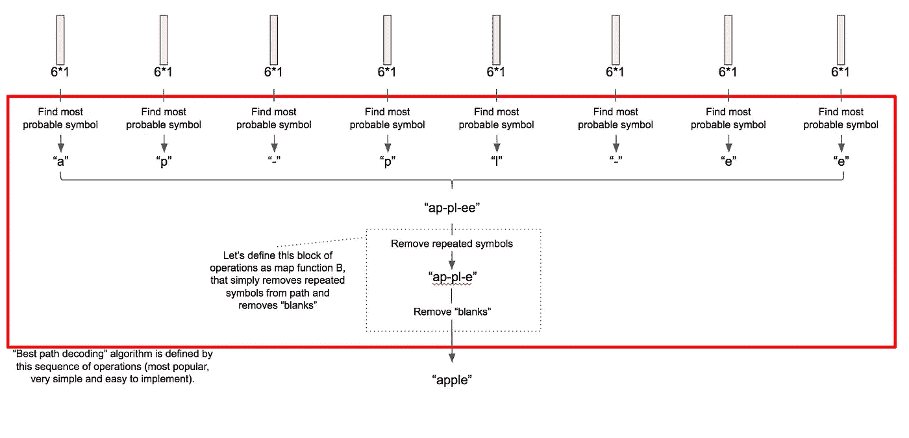

当我们训练我们的网络时，我们用 CTC 丢失层代替解码算法。在我们的第二次视频讲座中会有解释。现在它只有俄语版本，很抱歉。但好消息是:我们有英文幻灯片，我们将很快发布英文版本。

在我们的实现中使用了有点复杂的神经网络结构。架构如下，但主要原理仍然相同。


在模型训练后，我们将它应用于测试集的图像，并获得了非常高的精度。我们还将每个 RNN 步骤的概率分布可视化为一个矩阵。下面是例子。

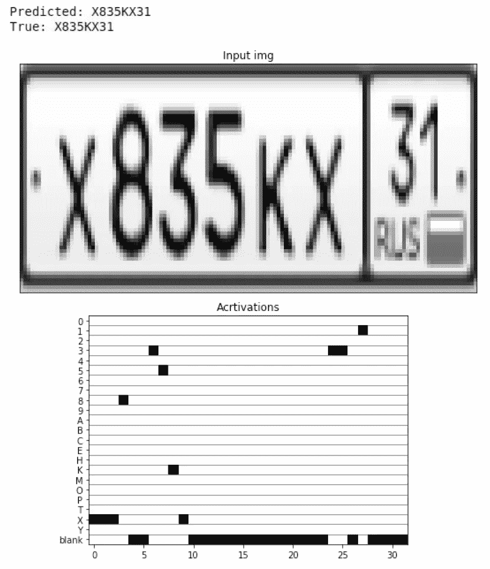

该矩阵的行对应于所有字母符号加上“空白”。列对应于 RNN 步骤。

# 结论

我们很乐意与社区分享我们的经验。我们相信视频讲座、本教程、现成的人工数据和源代码将帮助您获得基本的直觉，并且每个人都可以从头开始构建现代 OCR 系统。

有什么问题尽管问！谢谢大家！