# 你需要知道的拉丁美洲比特币和区块链初创公司

> 原文：<https://medium.com/hackernoon/latin-americas-bitcoin-blockchain-startups-you-need-to-know-e5562d7c8ba>

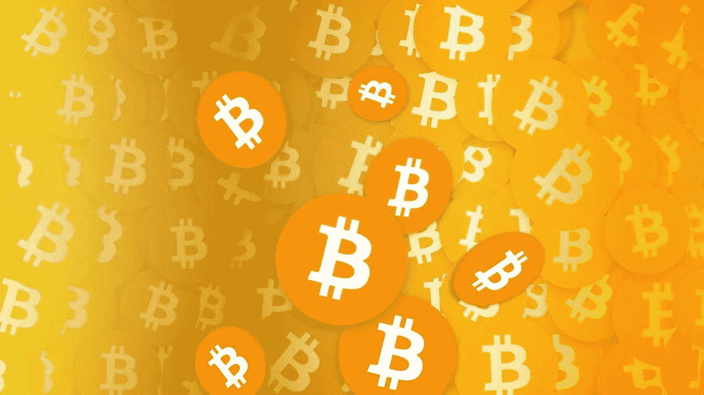

没有人确切知道拉丁美洲和加勒比海地区有多少人“没有银行账户”，或者金融服务不足。然而，据估计，这一数字高达 70%，即超过 4 亿人，这是一个巨大的市场，对于那些知道如何进入的人来说，充满了巨大的机会。

近年来，出现了许多加密货币和区块链公司，作为服务于这一大部分银行服务不足人口的一种方式。这些初创公司为消费者提供了进入信贷市场和全球经济的新方式，在拉丁美洲，[阿根廷](https://www.nytimes.com/2015/05/03/magazine/how-bitcoin-is-disrupting-argentinas-economy.html)是人均比特币爱好者最多的地方之一。

阿根廷的比特币实际用户数量相对较少，但该国是世界上少数几个普通人定期使用比特币进行真实交易的地方之一。在阿根廷等国家使用比特币，有助于消费者规避政府对接收海外资金的严格限制。

在拉丁美洲，比特币持有者享受着比委内瑞拉玻利瓦尔高出 400%以上、比巴西雷亚尔高出 92%以上、比墨西哥比索高出 65%以上、比阿根廷比索高出 41%以上的收益。

比特币的采用正在打破拉丁美洲的记录，这并不是因为人们普遍感兴趣，而是因为确实需要一种替代传统银行系统的方式，特别是在委内瑞拉、阿根廷、巴西和墨西哥等国家。

为了跟上拉丁美洲的比特币和区块链生态系统，我们收集了一些你需要知道的该地区顶级初创公司、交易所和公司。

# 1.[里皮奥](https://www.ripio.com/en/)

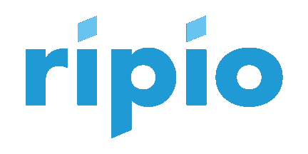

Ripio 原名 Bitpagos，是一家金融支付公司，为拉丁美洲的企业提供电子支付解决方案。Ripio 利用区块链技术为新兴市场提供一系列金融服务。该公司帮助商家用信用卡或比特币处理国际交易，只需支付一小部分费用。在阿根廷、巴西、智利和厄瓜多尔，用户也可以用现金立即购买比特币。Ripio 最近筹集了 225 万美元的 A 轮融资，以继续为其国际扩张提供资金，该服务声称每月处理数百万美元。

# 2.[比特索](https://bitso.com/?l=en)

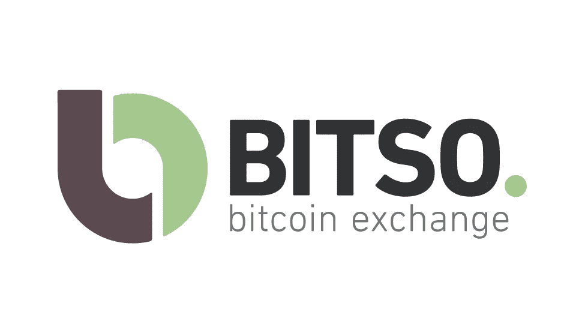

墨西哥第一家比特币交易所 Bitso 为目前没有银行账户的墨西哥大部分人口提供了一个用墨西哥比索交易比特币的平台。凭借[迄今为止 435 万美元](https://www.crunchbase.com/organization/bitso#/entity)的资金，Bitso 正在将比特币用作降低成本和提高交易速度的机制。该公司于 2014 年初推出，并声称其交易量逐月增长超过 [40%](https://cointelegraph.com/news/bitcoin-boom-town-mexican-bitcoin-exchange-bitso-secures-25-million-investment-round) 。

# 3. [BitInka/Inkapay](https://www.bitinka.com//bitinka/login)

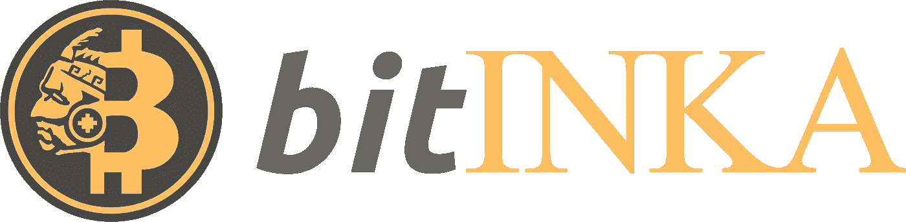

Bitinka 成立于 2013 年，是一个促进整个拉丁美洲比特币购买和销售的平台。Bitinka 目前在阿根廷、玻利维亚、巴西、智利、哥伦比亚、西班牙、秘鲁、委内瑞拉和美国运营，并提供本币比特币交易。该公司正计划通过实现信用卡集成以及为电子商务集成设计的新 API 来扩展其受欢迎的比特币支付应用 Inkapay。Inkapay 也将于 9 月推出一款手机应用。

# 4.[沃拉比特](https://www.volabit.com/en)

Volabit 是一家位于墨西哥的比特币交易所，通常用于汇款和全球商业，比特币学习曲线很短。Volabit 账户可以通过网上银行转账或在墨西哥的任何 7-Eleven、Farmacias Benavides、Farmacias del Ahorro 或 Extra 进行现金存款。

# 5. [RSK 实验室](http://www.rsk.co/)

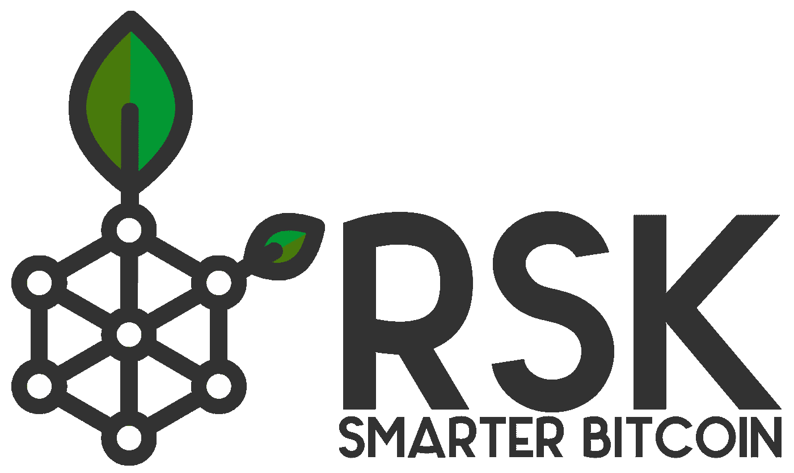

总部位于阿根廷的 RSK 实验室是智能合约平台“根茎”的幕后推手，该平台与比特币区块链双向挂钩。自 2013 年初以来，RSK 创始人一直积极参与比特币生态系统和智能合约的开发。该公司成立于 2015 年，最近获得了 350 万美元的额外 A 轮融资。

# 6. [Bitex.la](https://bitex.la/)

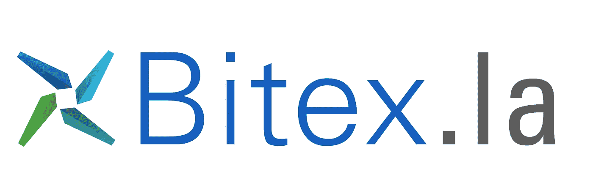

Bitex.la 是一家比特币交易所和经纪商，为许多南美国家提供服务，包括阿根廷、巴西、智利、墨西哥、秘鲁和乌拉圭。Bitex.la 账户可以用现金或 AstroPay 进行融资。Bitex.la 由一家英国投资公司的 [$2M](https://www.coindesk.com/latin-america-bitcoin-exchange-bitex-la-2-million/) 投资支持。

# 7. [SatoshiTango](https://satoshitango.com/home)

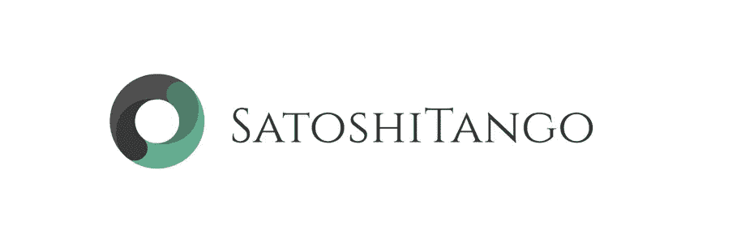

SatoshiTango 成立于 2014 年，是一个让用户能够买卖比特币的在线平台。在巴西、智利、哥伦比亚、哥斯达黎加、厄瓜多尔、萨尔瓦多、危地马拉、洪都拉斯、墨西哥、尼加拉瓜、巴拿马和秘鲁，用户可以通过国际电汇或当地支付方式进行支付。通过 SatoshiTango，用户还可以用比特币支付阿根廷的任何账单。

# 8.[比特币给你](https://www.bitcointoyou.com/)

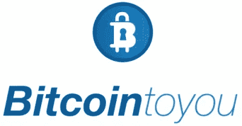

Bitcoin To You 于 2014 年推出，是一家在线比特币交易中心，位于巴西库里蒂巴，计划在圣保罗、里约热内卢、萨尔瓦多、巴西利亚和弗洛里亚诺波利斯等主要城市开展业务。[比特币对你](https://www.coindesk.com/bitcoin-center-brazil/)对其交易所完成的交易向客户收取一定比例的费用，并为其所在地更广泛的服务提供每月会员资格。

# 9.[密码买家](https://cryptobuyer.io/en/)

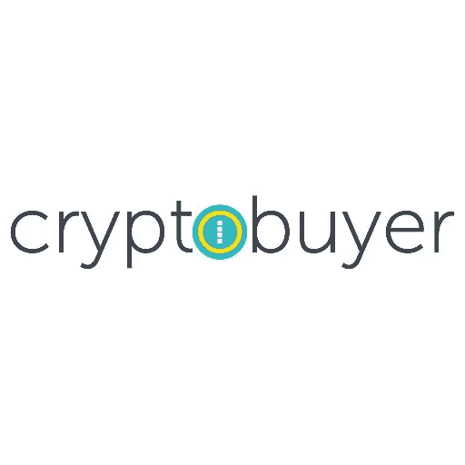

总部位于委内瑞拉的 Cryptobuyer 是拉丁美洲领先的加密货币和数字资产公司，也是首家在巴拿马城两家商业银行安装比特币自动取款机(btm)的公司。Cryptobuyer 最近与 Dash 社区合作，利用比特币和 Dash 实现更多汇款解决方案。这包括日常交易、手机充值和预付卡充值服务。Cryptobuyer 计划在整个拉丁美洲扩展他们的比特币 ATM 机，宣布打算在整个南美洲再开设 20 多台比特币 ATM 机。

# 10. [FoxBit](https://foxbit.com.br/)

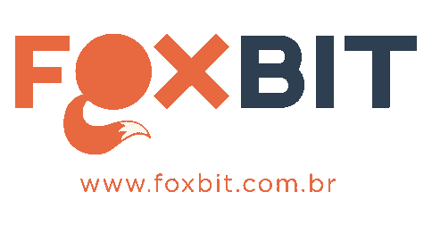

FoxBit 是一家总部位于巴西的经纪公司，旨在促进比特币支付。2016 年，该公司收购了支付处理器 [BitInvest](https://www.coindesk.com/brazil-foxbit-exchange-acquires-bitinvest/) ，以帮助巩固其在巴西比特币市场的地位。鉴于 BitInvest 的早期影响力，这笔收购值得关注，当时该公司与一家大型房地产公司和拉丁美洲最大的商户达成了接受比特币的协议。

# 11.[迪文蒂](http://www.diventi.com.ar/)

总部设在阿根廷的 Diventi 公司帮助那些有兴趣开发基于区块链技术的解决方案的公司。凭借在比特币、以太坊、根茎、侧链、Bitshares、OpenChain、Hyperledger 和智能合约方面的专业知识，Diventi 能够处理从原型阶段到最终开发阶段的项目。

# 12.[梅尔卡多比特币](https://www.mercadobitcoin.com.br/)

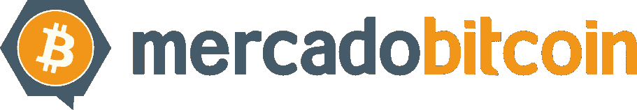

Mercado 比特币是巴西和南美最大的交易所。该平台允许用户交易比特币、莱特币和巴西雷亚尔，并在加密社区拥有超过 10 万名使用其服务的客户。

# 13. [CoinBR](https://coinbr.net/coinbr)

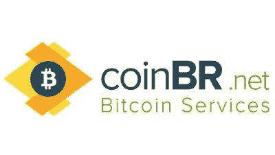

作为巴西和整个拉丁美洲区块链服务的领导者，CoinBR 提供比特币和其他加密货币的开采和兑换服务。该公司成立于 2013 年，在巴西圣保罗和弗洛里亚诺波利斯设有办事处，并于 2015 年收购了比特币银行平台 Coinverse。

# 14.[外科医生](https://www.surbtc.com/chile)

SurBTC 是一家技术公司，在智利和哥伦比亚开发和运营使用比特币技术的服务。比特币交易所最近筹集了[30 万美元](https://www.coindesk.com/227606-2/)种子资金，增加了该公司已经通过 [CORFO](http://www.english.corfo.cl/#top) 筹集的[10 万美元资金，CORFO 是智利政府运营的一个商业创新孵化器。](https://www.coindesk.com/227606-2/)

# 15.[货币联盟](https://www.coinfabrik.com/)

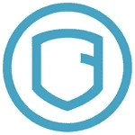

总部位于阿根廷的 Coinfabrik 是一家全栈区块链开发和咨询公司。Coinfabrik 的服务允许其客户保护传统钱包和多签名钱包，通过多因素认证控制交易，实施智能合同，安全存储和备份加密货币，在游戏中使用加密货币等。

*拉丁美洲有没有我们错过的比特币或区块链创业公司？请在评论中与我们分享。*

[*这个帖子最初出现在 Launchway Media 上。*](https://www.launchwaymedia.com/blog/2017/8/7/15-latin-american-bitcoin-blockchain-startups-you-need-to-know)