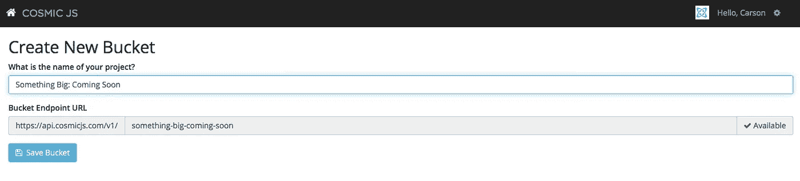
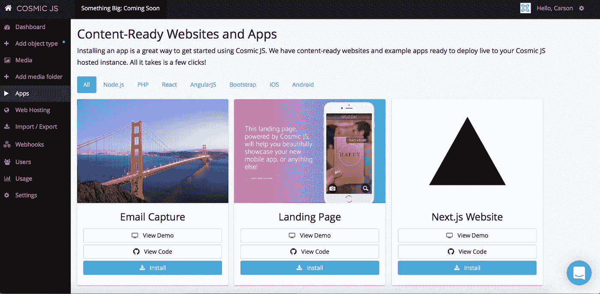
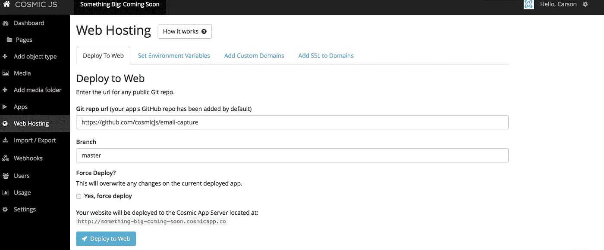
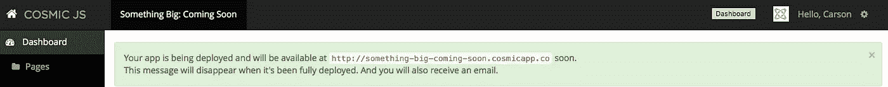
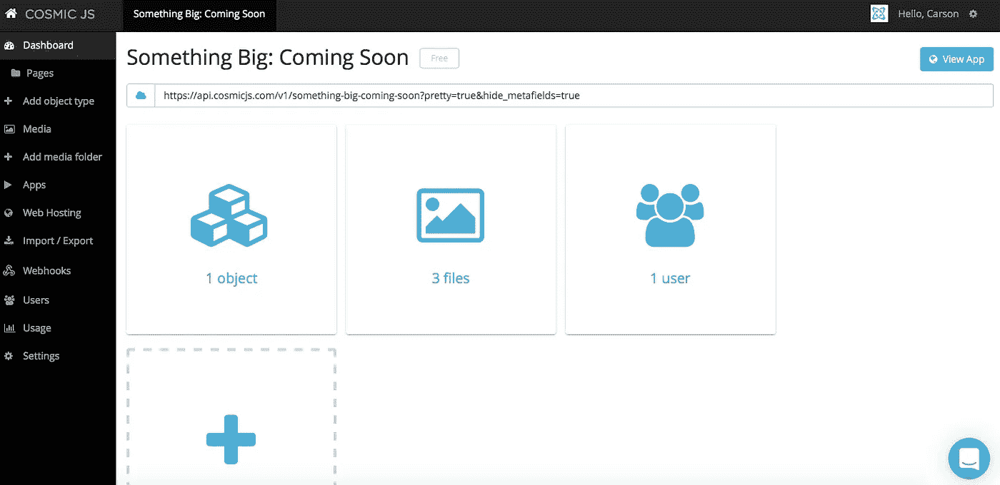
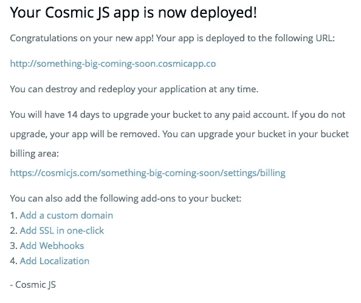

# 分 4 步启动启动页面

> 原文：<https://medium.com/hackernoon/launch-a-splash-page-in-4-steps-706a93598632>

我还记得我在代理公司的日子里，“临时解决方案”这个古老的难题。您已经确定了应用项目的范围、框架、设计和开发，现在终于到了发布的时候了。客户的现有网站需要去黑暗，而新的网站宣传和来到生活。你还记得“即将推出”那一页吗？有些人用几个星期(其他人几个月😂)但无论你是谁，在你职业生涯的某个时刻，你都会为客户推出一个即将到来的页面。不管有没有预先思考，它都会发生。

今天，我将向您展示如何建立一个简单的即将推出的启动页面。我将使用的 splash page 是一个来自于 [Cosmic JS](https://cosmicjs.com/) 的内容就绪的 web 应用程序。登录页面捕获电子邮件地址，并将它们直接传输到 MailChimp。它具有美丽的整页旋转背景图像。

一旦你完成了应用程序的安装和部署，你就可以编辑它的对象，改变背景图片，复制，按钮操作等等。如果您想将 splash 页面转移到生产中，您可以轻松地在 web 应用程序上添加一个自定义域并进行部署，然后在新网站上线后简单地删除该存储桶，或者您可以为下一个需要临时修复的客户编辑并缩减该存储桶。

Cosmic JS 是一个 [API 优先的 CMS](https://cosmicjs.com/) ，它使得管理和构建网站和应用程序更加快速和直观。通过将内容从代码中分离出来，Cosmic JS 增强了开发人员的灵活性，同时确保内容编辑人员能够以最适合他们的方式规划和部署内容。我们将使用 Cosmic JS 来安装我们的示例应用程序，部署和更新来自[基于云的内容管理平台](https://cosmicjs.com/)的内容。

从[报名](https://cosmicjs.com/signup)参加[宇宙 JS](https://cosmicjs.com/) 开始。下面提供了有用的资源来简化您的开发操作。

# 1.创建新的存储桶

您的 bucket 的名称是您正在构建的网站、项目、客户端或 web 应用程序的名称。为了保持示例博客的简洁，我将我的博客命名为“大事件:即将到来”。

# 2.安装电子邮件捕获登录页面应用程序

一旦你注册并命名了你的桶，你将被提示从头开始或者“查看一些应用”。对于这个博客，我简单地点击了右键“查看一些应用程序”，这样我就可以开始安装[宇宙 JS 电子邮件捕获应用程序](https://cosmicjs.com/apps/email-capture)。

# 应用程序安装选项

[Cosmic JS](https://cosmicjs.com/) 让你能够在编程语言之间进行过滤，比如 [Node.js](https://cosmicjs.com/apps) 、 [PHP](https://cosmicjs.com/apps) 、 [React](https://cosmicjs.com/apps) 、 [AngularJS](https://cosmicjs.com/apps) 等等。

只需点击[电子邮件捕获](https://cosmicjs.com/apps/email-capture)图标下方的“安装”即可开始，或者访问[宇宙 JS 应用页面](https://cosmicjs.com/apps)。

# 3.部署到 Web

我点击了“部署到 Web”。然后，我可以在部署 web 应用程序时编辑对象。您将收到一封电子邮件，确认您的 web 应用程序的部署。如果您在部署过程中遇到任何问题，您可能会被转到 [Cosmic JS 故障排除页面](https://cosmicjs.com/troubleshooting)。

# 确认部署位置和分支

# 展开，展开

一个小小的保证，你很快就会生活和捕捉线索！

# 4.编辑全局对象

现在你可以编辑全局对象、文件、用户、媒体等等。要编辑电子邮件捕获应用程序的内容和电子邮件触发器，请点击“页面”并向下滚动到“元字段”以编辑社交链接、MailChimp 列表 URL、行动号召按钮文本等。编辑是在宇宙 JS 仪表盘中实现的梦想。要了解更多关于如何在考虑编辑内容的情况下构建 [Cosmic JS](https://cosmicjs.com/) 的信息，请阅读[在考虑内容编辑器的情况下构建](https://cosmicjs.com/blog/building-with-the-content-editor-in-mind)。

# 应用部署确认

就像注册、创建新的存储桶、安装 web 应用程序、编辑对象和部署一样简单！我收到了访问我的 web 应用程序的确认电子邮件，还看到了我的桶升级选项，如[自定义域、一键式 SSL、webhooks 和本地化](https://cosmicjs.com/features)。

[Cosmic JS](https://cosmicjs.com/) 是一个 API 首创的基于云的内容管理平台，可以轻松管理应用和内容。如果你对 Cosmic JS API 有任何疑问，请通过 [Twitter](https://twitter.com/cosmic_js) 或 [Slack](https://cosmicjs.com/community) 联系创始人。

[卡森·吉本斯](https://twitter.com/carsoncgibbons)是[宇宙 JS](https://cosmicjs.com/) 的联合创始人& CMO，宇宙 JS 是一个 API 第一的基于云的[内容管理平台](https://cosmicjs.com/)，它将内容与代码分离，允许开发者用他们想要的任何编程语言构建流畅的应用和网站。

> [黑客中午](http://bit.ly/Hackernoon)是黑客如何开始他们的下午。我们是 AMI 家庭的一员。我们现在[接受投稿](http://bit.ly/hackernoonsubmission)并乐意[讨论广告&赞助](mailto:partners@amipublications.com)机会。
> 
> 如果你喜欢这个故事，我们推荐你阅读我们的[最新科技故事](http://bit.ly/hackernoonlatestt)和[趋势科技故事](https://hackernoon.com/trending)。直到下一次，不要把世界的现实想当然！

