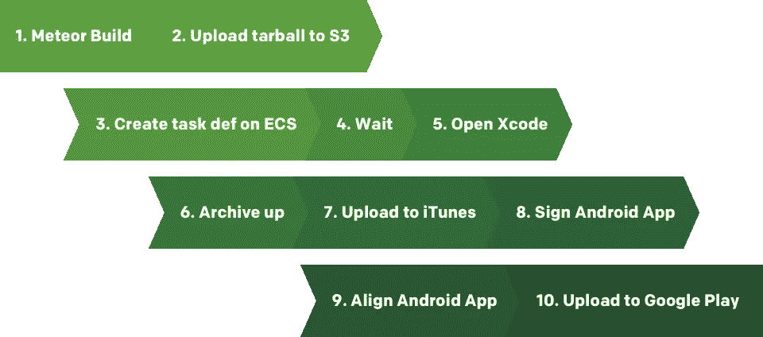

# 启动—持续的流星应用程序部署

> 原文：<https://medium.com/hackernoon/launch-continuous-meteor-app-deploys-21929c4cd5e2>

2016 年 7 月 21 日更新:我已经将网站的链接从 Galaxy 改为 Heroku。所有的星系信息仍然适用，只是使用 Heroku，因为它是免费的。

上周，我在[陨石坑远程会议](http://conf.crater.io/)上做了一个关于我们如何自动构建、部署和分发[流星](https://meteor.com)科尔多瓦应用的演讲。视频还没有，但是幻灯片可以在[这里](https://launch-presentation.surge.sh)找到。所以你不必翻阅所有这些，这里是演示的要点。

## TL；博士；医生

如果我告诉你，你可以像这样构建、部署和分发一个用 Meteor 构建的 iOS 应用程序，会怎么样？[发射](https://github.com/newspring/meteor-launch)到了。

```
launch build myapp.com 
launch galaxy myapp.com 
launch testflight
```


# 背景故事

我们目前正在开发一款适用于 iOS 和 Android 的应用。我们选择了 Meteor，这样我们可以使用相同的代码库来定位两个平台(感谢 Meteor 构建工具和 Cordova)。开发体验非常棒，但是我们很早就做出了决定，我们希望能够每周发布 1 个 alpha 版本。这将允许我们向我们的利益相关者展示进展，并让应用程序经常在我们的团队手中。

## 当前构建过程



我们当前的构建过程非常复杂，手动操作非常繁琐。如果你把一切都准备好了，记住了流程，并且每天都过得很愉快，这大约需要 30 分钟。每周一次，牺牲 30 分钟并不难。但在糟糕的一天，这可能会持续很久。这也不利于团队中的每个人都可以部署。

# 有更好的方法

我们开发了一个名为 [launch](https://github.com/newspring/meteor-launch) 的工具，可以自动完成这个过程！您可以在本地或配置项上运行它。这样，我们可以专注于编写代码，并基于拉请求或发布标签进行部署。

## :allthethings: launch 可以做什么

1.  构建 iOS 应用程序
2.  构建 Android 应用程序
3.  部署到[星系](https://galaxy.meteor.com)
4.  部署到[曲棍球](https://hockeyapp.net)(iOS 和 Android)
5.  部署到 iTunes Store/TestFlight
6.  部署到 Google Play

# 入门指南

```
npm install -g meteor-launch 
launch init # adds launch.json 
vim launch.json # fill out the vars
```

这就是你在新的或现有的 Meteor 项目中添加 launch 所要做的一切。有关于所有支持的动作的[文档](http://newspring.github.io/meteor-launch/)，以及关于如何获得你将需要的变量的解释。

# 例子

我们已经设置了几个如何使用 launch 的例子，包括如何在 [Travis](https://travis-ci.org) 上运行它们。

## 启动基本示例

这个项目是您从 meteor create 获得的样板文件，演示了如何构建一个 Android 应用程序，将其部署到 Galaxy，并使用以下命令将应用程序上传到 Hockey 进行分发:

```
launch build [https://launch-basic-example.meteorapp.com](https://launch-basic-example.meteorapp.com) launch galaxy [https://launch-basic-example.meteorapp.com](https://launch-basic-example.meteorapp.com) launch hockey
```

*   [源代码](https://github.com/NewSpring/launch-basic-example)
*   [特拉维斯配置](https://github.com/NewSpring/launch-basic-example/blob/master/.travis.yml)
*   [特拉维斯打造](https://travis-ci.org/NewSpring/launch-basic-example/)
*   [Heroku 上的直播网站](https://launch-basic-example.herokuapp.com)
*   [曲棍球下载](https://rink.hockeyapp.net/apps/9c21ad20059c4486baf98fb9ef472a9c)

## 启动待办事项示例

我们还有 Meteor Todos 示例，它演示了如何使用所有的启动操作:

```
launch build [https://launch-todos-example.meteorapp.com](https://launch-todos-example.meteorapp.com) 
launch galaxy [https://launch-todos-example.meteorapp.com](https://launch-todos-example.meteorapp.com) 
launch hockey # uploads iOS and Android 
launch testflight launch playstore
```

*   [源代码](https://github.com/NewSpring/launch-todos-example)
*   [特拉维斯配置](https://github.com/NewSpring/launch-todos-example/blob/master/.travis.yml)
*   [特拉维斯打造](https://travis-ci.org/NewSpring/launch-todos-example/)
*   [Heroku 上的直播网站](https://launch-todos-example.herokuapp.com/)
*   [安卓曲棍球下载](https://rink.hockeyapp.net/apps/a6221f3834f149599f8da90bd23fd147)
*   [iOS 曲棍球下载](https://rink.hockeyapp.net/manage/apps/351335)

试飞和谷歌 Play 商店上传你将不得不相信我的话，但尝试一下，看看你自己！

# 发布如何帮助我们

我们最初的目标是在应用程序开发期间每周发布 1 个 alpha 版本。随着发布:**我们一直在一天内发布多个版本**。现在，对于我们团队中的任何人来说，只需创建一个 GitHub release 标签，就可以轻松地将一个版本发布到我们的 alpha 和 beta 环境中。我们的利益相关者对进展了如指掌(他们也很高兴)。自私地说，我超级高兴，因为构建和部署是最糟糕的。

一天手动发布 2 个构建需要一周 5 个多小时。只需花一小部分时间来设置启动，然后你就再也不用考虑它了。

# 仔细讨论

*   [在 GitHub 上发布](https://github.com/newspring/meteor-launch)
*   [在 NPM 发布](https://www.npmjs.com/package/meteor-launch)
*   [文档网站](http://newspring.github.io/meteor-launch/)

演示文稿和文档详细介绍了如何设置一切，以及如何在配置项上运行。

如果有任何问题，请告诉我！我很乐意帮忙。

*原载于 2016 年 7 月 18 日*[*www . johnpinkerton . me*](http://www.johnpinkerton.me/2016/07/18/launch-continuous-meteor-app-deploys/)*。*

> [黑客中午](http://bit.ly/Hackernoon)是黑客如何开始他们的下午。我们是 AMI 家庭的一员。我们现在[接受投稿](http://bit.ly/hackernoonsubmission)并乐意[讨论广告&赞助](mailto:partners@amipublications.com)机会。
> 
> 要了解更多信息，请[阅读我们的“关于”页面](https://goo.gl/4ofytp)、[喜欢/在脸书给我们发消息](http://bit.ly/HackernoonFB)，或者简单地说， [tweet/DM @HackerNoon。](https://goo.gl/k7XYbx)
> 
> 如果你喜欢这个故事，我们推荐你阅读我们的[最新科技故事](http://bit.ly/hackernoonlatestt)和[趋势科技故事](https://hackernoon.com/trending)。直到下一次，不要把世界的现实想当然！