# 发布会亮点

> 原文：<https://medium.com/hackernoon/launch-festival-highlights-12f4d50a08dc>

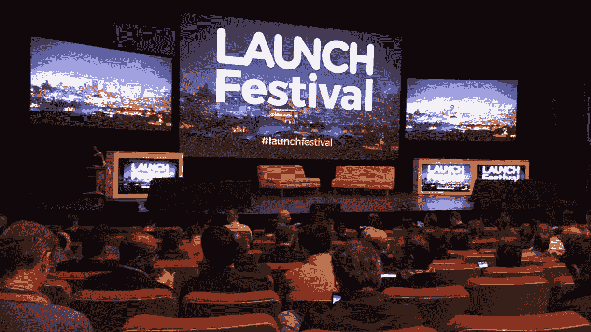

上周，我和我的联合创始人托尼·斯皮罗有机会参加了在三藩市举行的 T2 发布会。发布会在美丽的[艺术宫](https://www.palaceoffinearts.org/)举行，横跨整个机库，有多个舞台、演示坑和会议区。我们花时间在演示区与联合创始人和代表互动，并在秤台上参加聚光灯会议。节日舞台充当了主厅，展示了阵容中令人惊叹的演讲者和小组，从天使投资人到风险资本家，到老牌创始人，再到首次推介自己公司的创始人。

我写了这篇简短的博客来强调我从这个节日中得到的一些重要收获。除了精彩部分，我还加入了我个人相机里的照片、会议期间发布的实时推文等等。

> **投资者展望面板**:
> [**Gil pen China**](https://twitter.com/gilpenchina)，[flight . VC](https://cosmicjs.com/carson-gibbons/edit-object/Flight.vc)
> [**Cyan Banister**](https://twitter.com/cyantist)，[founders fund](http://foundersfund.com/)
> [**Ryan Feit**](https://twitter.com/ryanfeit)， [SeedInvest](https://www.seedinvest.com/)

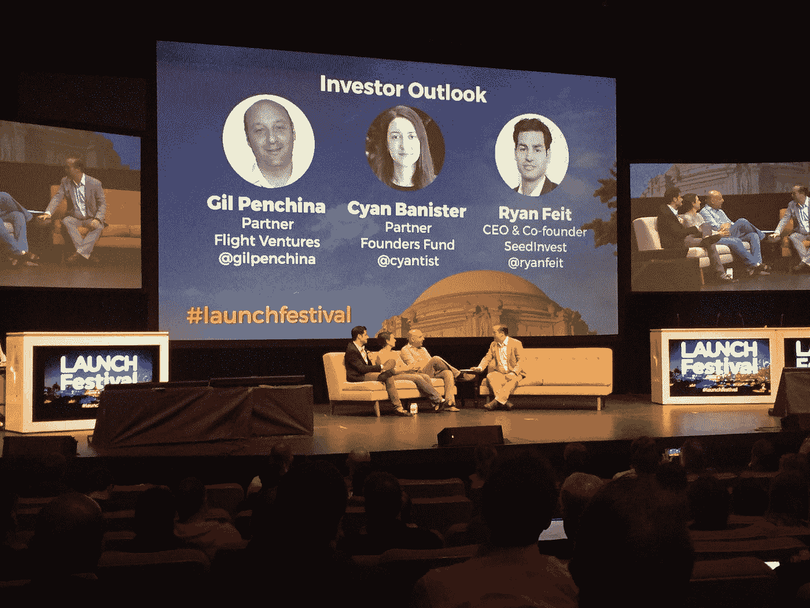

Gil、Cyan 和 Ryan 分享了他们的投资历史，Cyan 从 FoundersFund 的天使投资人转型为风险投资家，Ryan 创办了 Seedinvest，开始了股权众包的新时代。

> **投资者展望面板:**
> [**猎人漫步**，](https://twitter.com/hunterwalk) [家酿](http://www.homebrew.co/)
> [**梅根·奎因**](https://twitter.com/msquinn) ，[星火资本](http://www.sparkcapital.com/)
> [**贾拉克·乔班普拉**](https://twitter.com/jalak/with_replies) ， [FuturePerfect VC](http://futureperfectventures.com/home/)

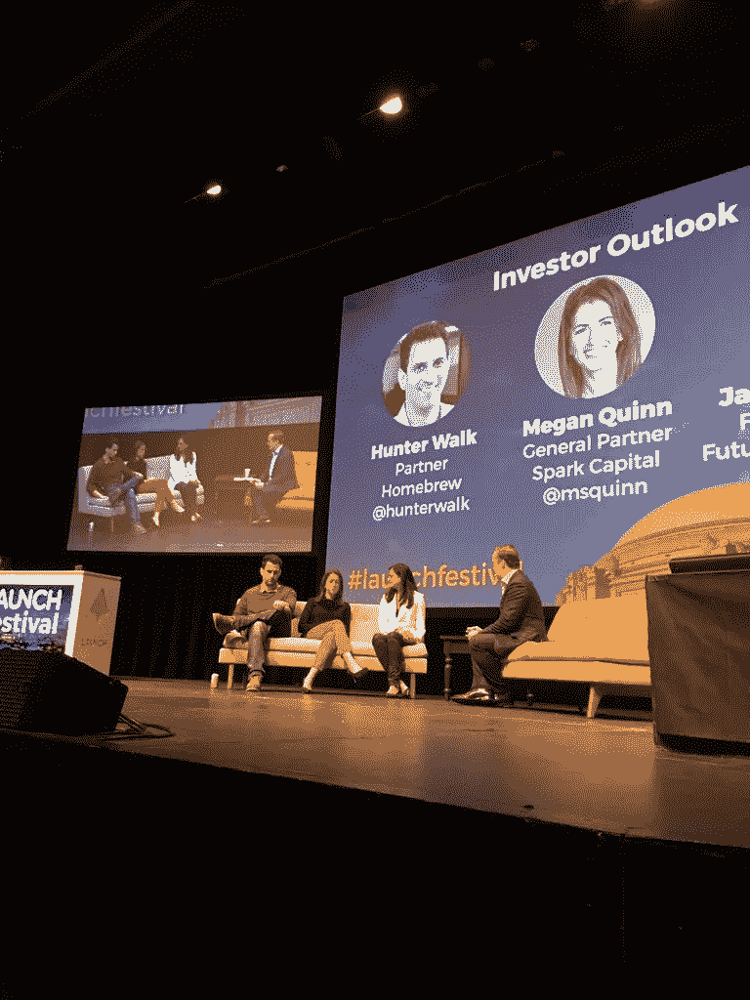

Hunter、Megan 和 Jalak 讨论了投资历史、风险投资社区内的平等以及 VR / AR 领域内可部署产品的未来，因为据报道，未来 36 个月内市场上将会出现大量耳机。梅根谈到她多么希望自己可以说风投界的女性平等正在上升，但随着风投界上层领导/合伙人中男女比例达到 96 / 4，她并不乐观。Jason 向每个小组成员提出了这个问题:“离每天有 1000 万活跃用户使用 VR 头戴设备执行任务还有多长时间？

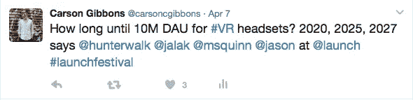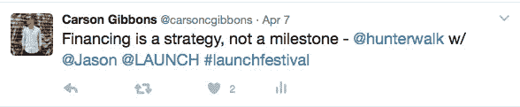

> **聚光灯面板:**
> [**帕特里克·科利森**](https://twitter.com/patrickc) ，[条纹](https://stripe.com/)

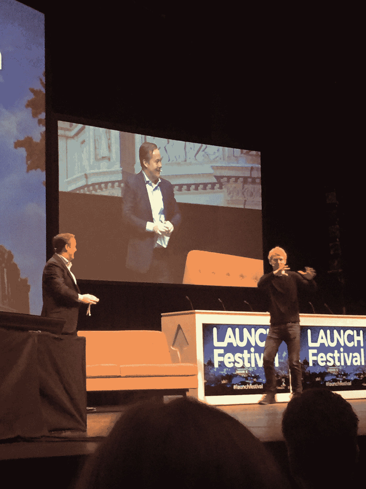

多好的款待啊。Stripe 的帕特里克·科利森讨论了 Stripe 的形成，他与哥哥和联合创始人约翰·科利森在爱尔兰乡下长大的童年，以及促使他们推出 Stripe Atlas 的生活事件，这是一项无缝服务，让全球企业家只需 500 美元就可以轻松地在网上建立一家特拉华州公司。

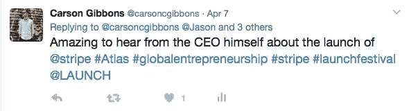

> **聚光灯面板:**
> [**莎拉·塔维尔、**](https://twitter.com/sarahtavel) [格雷洛克伙伴](http://www.greylock.com/)
> 【缩放 Pinterest 的 10 个教训】

前 Pinterest 的 Sarah Tavel 分享了她的故事，当 Pinterest 拥有 3 万注册用户时，她加入了 Pinterest，并通过关注他们的核心指标将用户群增长到 1 亿月活跃用户:当一个新用户注册时，他们需要固定一些东西。Pinterest 定义的神奇时刻不仅仅是注册或浏览，而是通过锁定他们感兴趣的东西来积极参与。阅读她的博客"["从扩展 Pinterest 中得到的五个教训。](https://news.greylock.com/five-more-lessons-from-scaling-pinterest-9c10fe97d325)

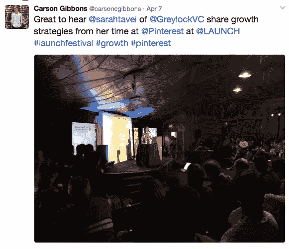

> **群众演员**:
> SaaStr 联名出售空间 +观光

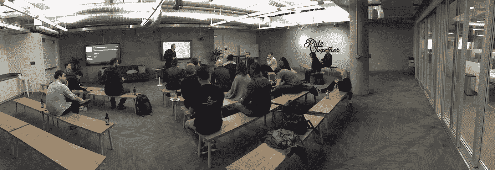

我们参加了旧金山 SaaStr CoSelling Space 的一次聚会，并听取了几家初创公司和公司的意见，其中包括 SaaS 的一家公司[rall spyware](https://www.rallyware.com/)，该公司致力于对员工、资源和公益活动的追随者进行动态管理。Rallyware 首席执行官 George Elfond 主持了一场关于从 1.5 万美元的 MRR 扩展到 15 万美元的 MRR 的讨论。

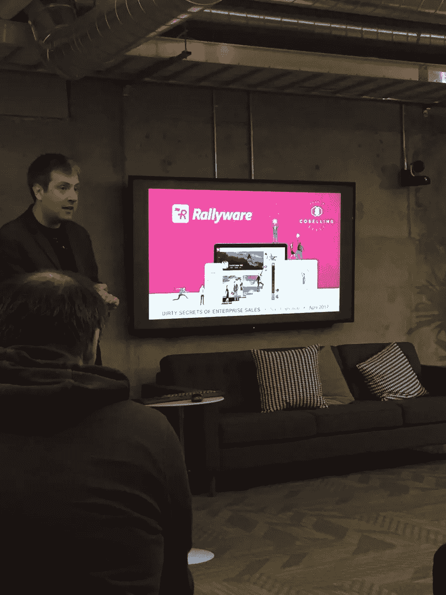

随后，会场开始向初创公司开放，因此[Cosmic JS](https://cosmicjs.com/)CEO[Tony Spiro](https://twitter.com/tonyspiro)使用 [Cosmic JS CMS API](https://cosmicjs.com/) 在云中推介 API 优先的应用开发。

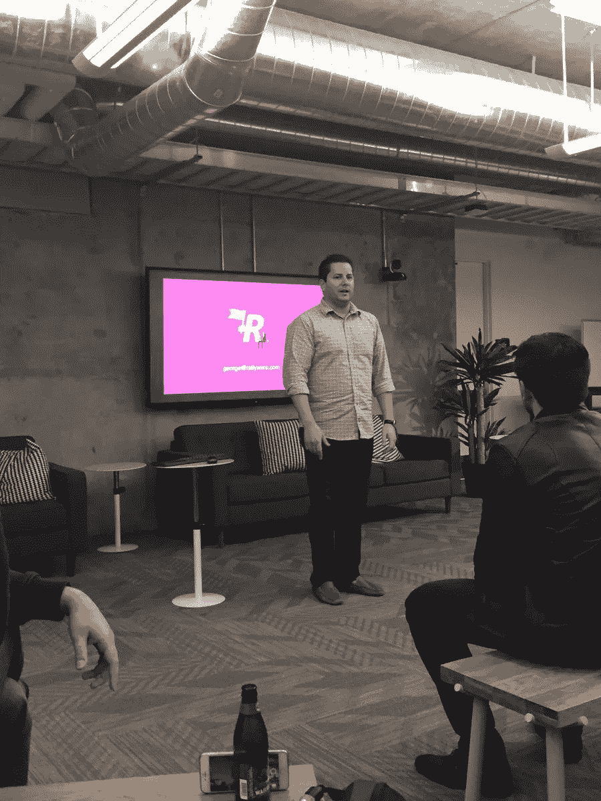

我也有一点时间去观光，朋友们，旧金山不会让你们失望的。

[卡森·吉本斯](https://twitter.com/carsoncgibbons)是 [Cosmic JS](https://cosmicjs.com/) 的联合创始人& CMO，这是一个基于 API 的第一云[内容管理平台](https://cosmicjs.com/)，它将内容从代码中分离出来，允许开发人员用他们想要的任何编程语言构建流畅的应用程序和网站。

> [黑客中午](http://bit.ly/Hackernoon)是黑客如何开始他们的下午。我们是这个大家庭的一员。我们现在[接受投稿](http://bit.ly/hackernoonsubmission)并乐意[讨论广告&赞助](mailto:partners@amipublications.com)机会。
> 
> 如果你喜欢这个故事，我们推荐你阅读我们的[最新科技故事](http://bit.ly/hackernoonlatestt)和[趋势科技故事](https://hackernoon.com/trending)。直到下一次，不要把世界的现实想当然！

