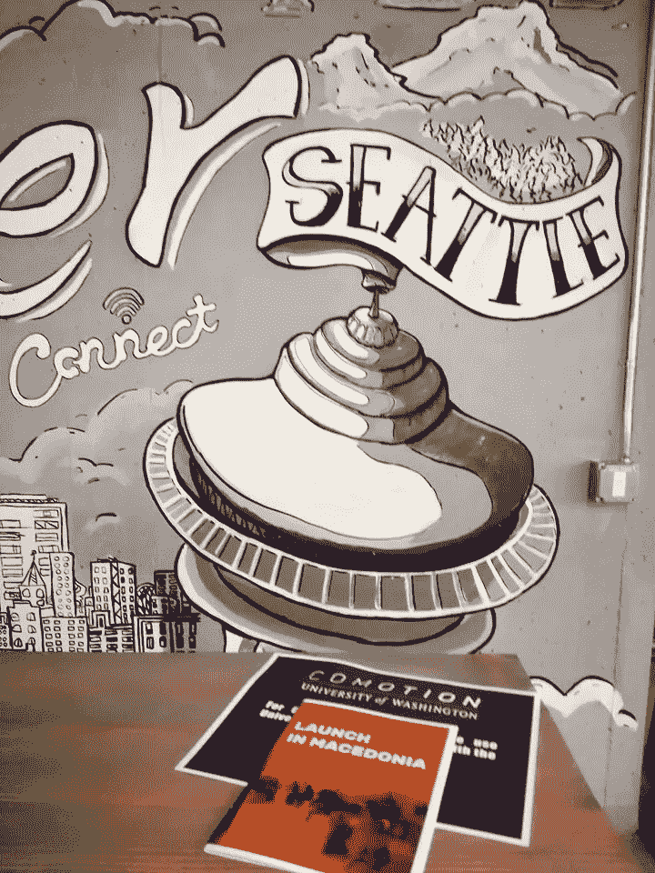
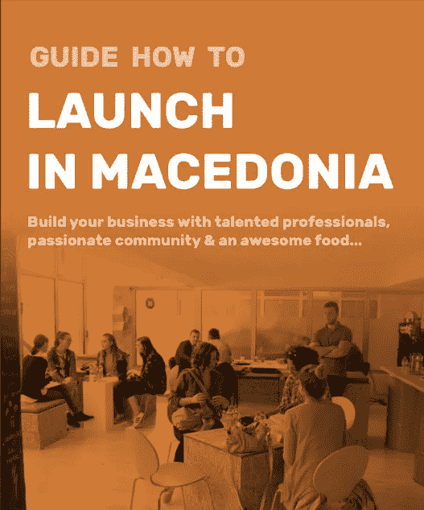
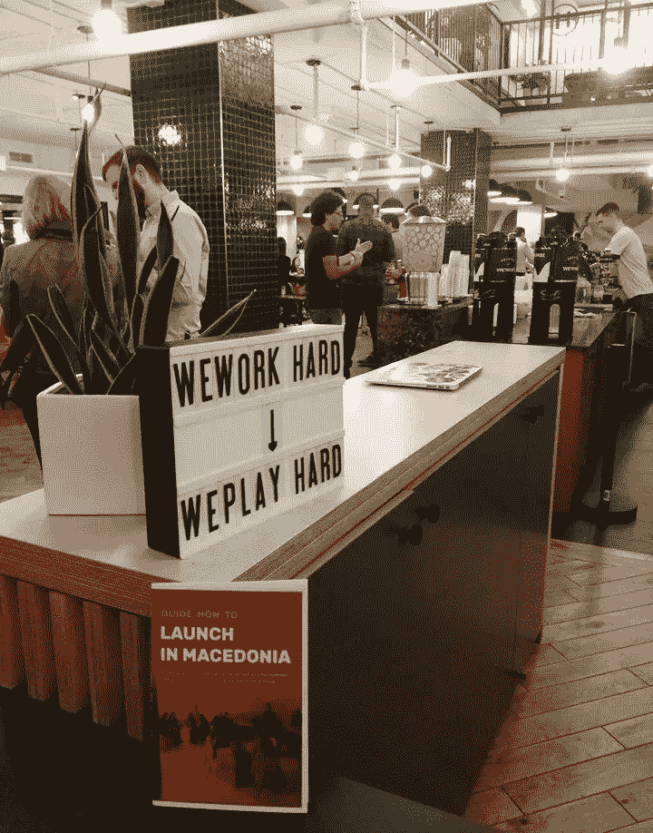
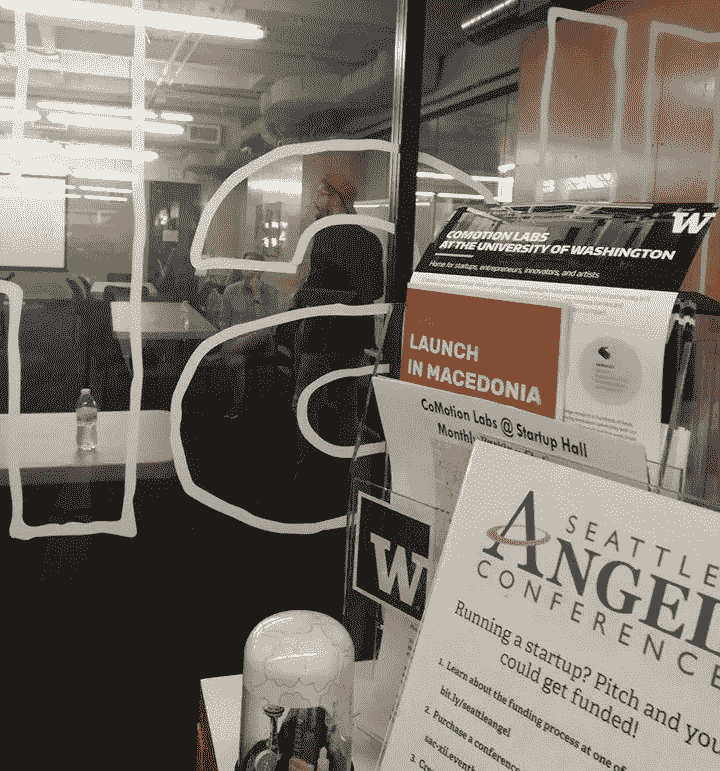
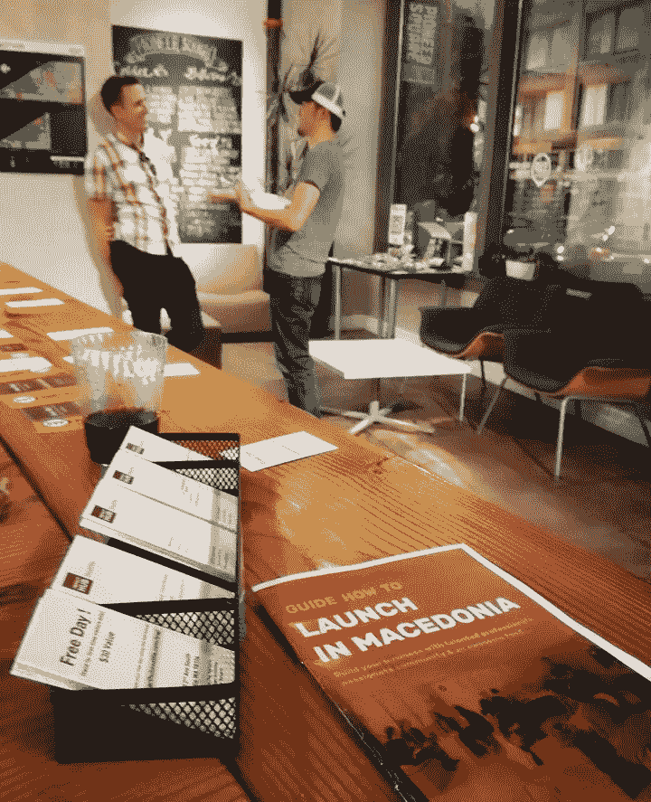
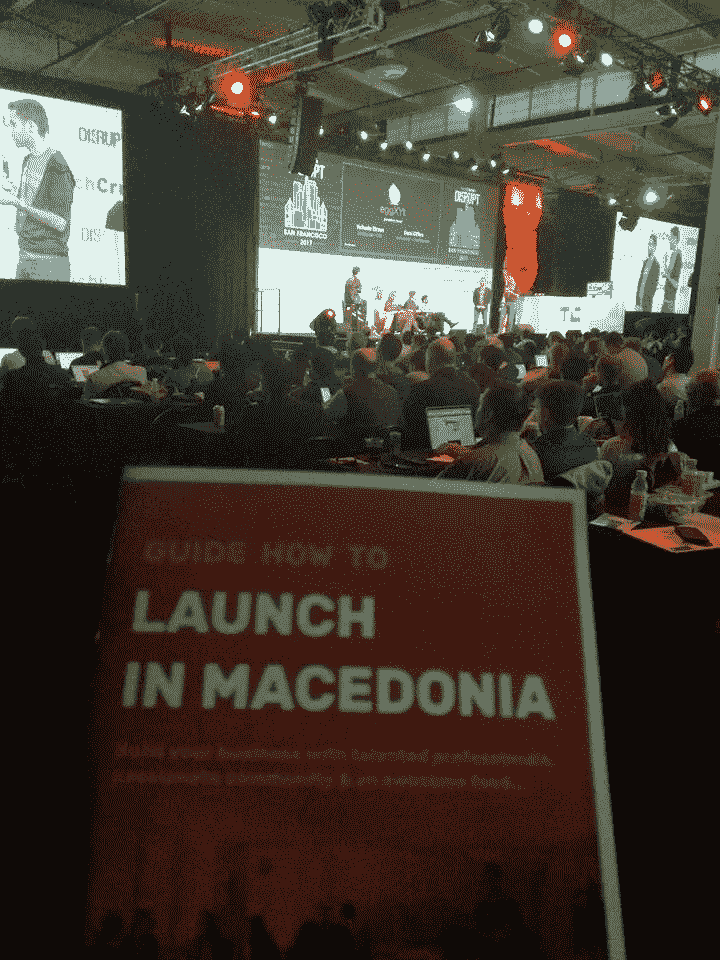
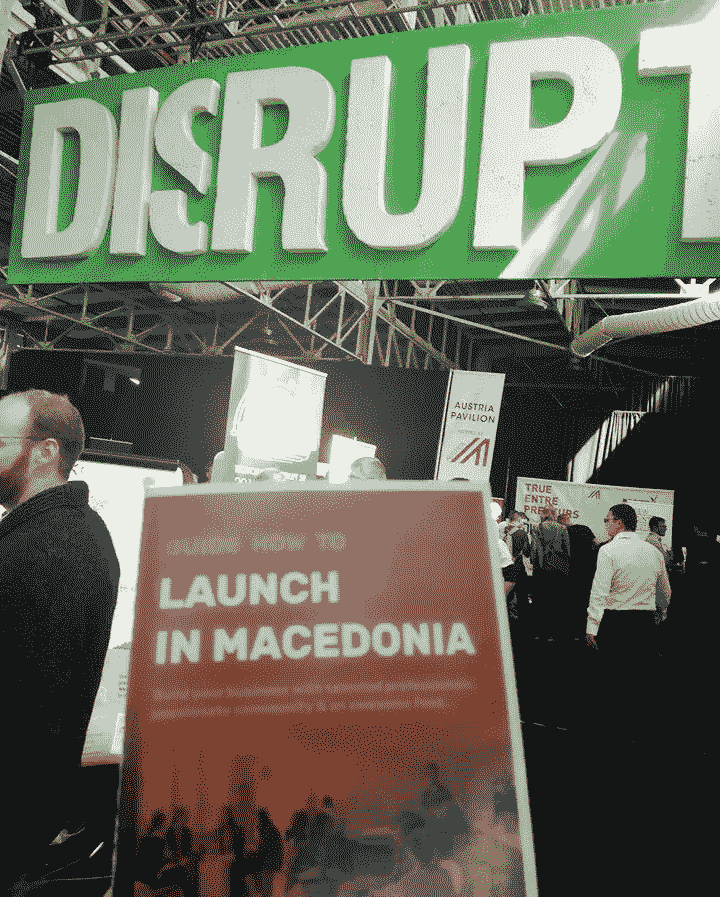
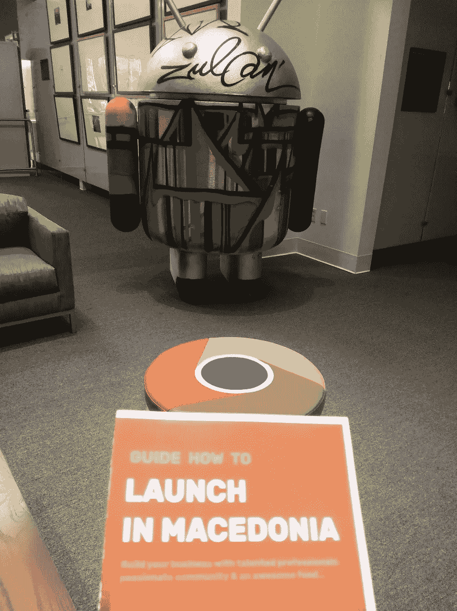

# 在马其顿推出#SwissEP 常驻企业家计划，在美国推广

> 原文：<https://medium.com/hackernoon/launch-in-macedonia-swissep-entrepreneur-in-residence-program-promoted-in-the-us-4fbe80974c1b>

[**9 月在美国**](https://startupselfie.wordpress.com/2017/12/01/september-in-the-states-startups-seattle-and-7-lessons-learned/) 是我推广[初创企业马其顿](https://startupmacedonia.mk/) : [**在马其顿**](https://startupmacedonia.mk/launchinmacedonia/) 发布的第一个“产品”的理想机会，小册子和我们的 [#SwissEP](https://www.facebook.com/search/posts/?q=%23SwissEP) [**常驻企业家**](https://www.entrepreneur-in-residence.net/) 项目的细节。

在过去的三年里，我一直积极参与马其顿创业生态系统的开发，现在作为一名#SwissEP 常驻企业家经理( [**EiR**](https://www.entrepreneur-in-residence.net/) )和生态系统促进者，我们从美国引进了大量短期专家和 EiR，与我们的合作伙伴(支持组织)和创业公司合作。被选为 100 名跨大西洋年轻创新领袖之一( [**)是加强跨大西洋创业桥梁的完美补充。**](https://share.america.gov/ytili/)

2017 年 9 月，我以专业和私人身份访问了 5 个美国城市(华盛顿州、DC；华盛顿州西雅图市；加利福尼亚州旧金山；内华达州拉斯维加斯；加利福尼亚州洛杉矶)并会见了许多经验丰富的企业家和年轻的专业人士，在那里我得以宣传我的国家马其顿是数字游牧民和创业的理想之地，同时也邀请他们注册成为 eir 并回馈新兴的创业社区。

在马其顿发布的 [**手册**](https://startupmacedonia.mk/launchinmacedonia/) 中，您可以找到以下有用信息:

*   在一个以负担得起的生活方式、优秀的人才和美味的食物而闻名的国家创业；
*   成立您的公司只需 24 小时；
*   获得工作和居留许可只需要 15 天。

如果你想在这个地区“试水”,在“新来者”的所有细节中，有关于瑞士正在五个巴尔干国家实施的**#瑞士**[EiR 计划](https://www.entrepreneur-in-residence.net/) 的所有信息:马其顿；塞尔维亚；波斯尼亚和黑塞哥维那；科索沃，阿尔巴尼亚，全球到越南和秘鲁。

回报新兴欧洲新兴创业中心的创业者，在当地创业中心或孵化器做 1 到 3 个月的常驻创业者！

今天就注册，或者与对这个机会感兴趣的朋友分享，因为

分享就是关爱！

WeWork White House, Washington, DC

CoMotion Labs, UW, Seattle, WA

Startup Hall, UW, Seattle, WA

Impact Hub Seattle, WA

TechCrunch Disrupt, San Francisco, CA

Googleplex, Mountain View, CA

干杯