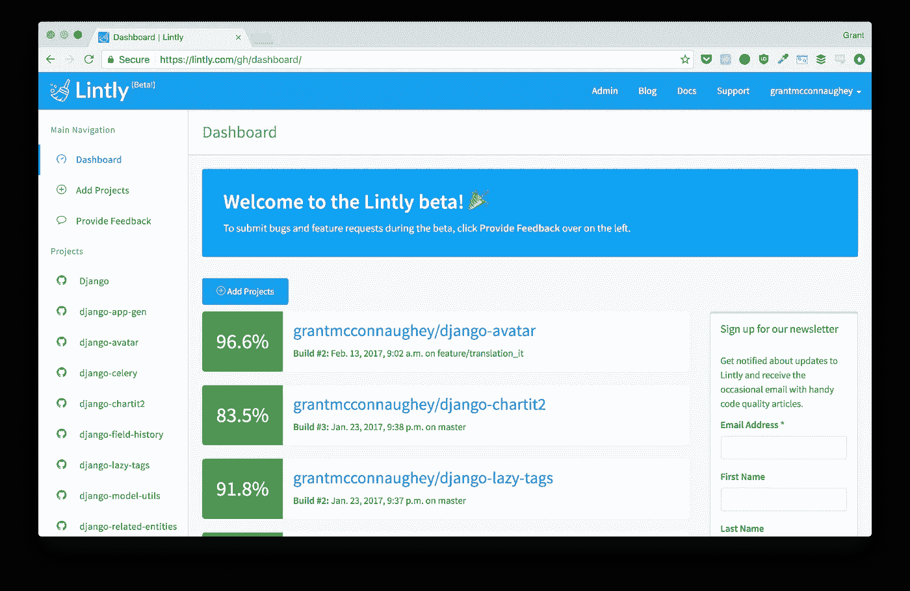
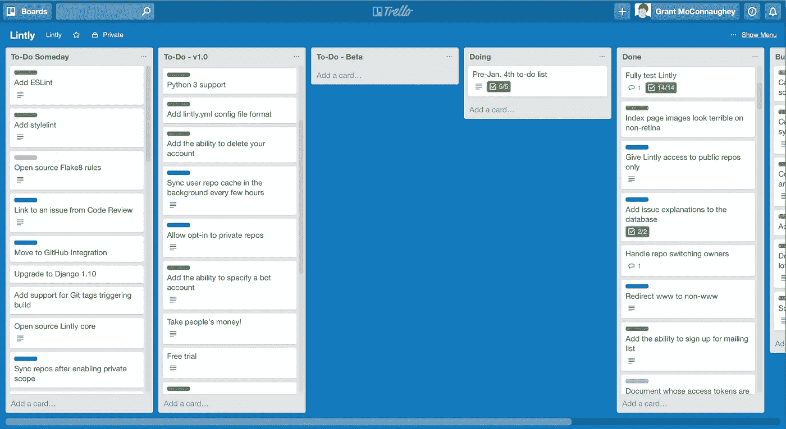

# 发布时间:一个月后

> 原文：<https://medium.com/hackernoon/launching-lintly-one-month-in-959078221048>

自从[我推出](http://blog.lintly.com/2017/01/04/introducing-lintly/)我的应用 [**Lintly**](https://lintly.com) 以来，大约一个月了，这是一个为[Python](https://hackernoon.com/tagged/python)[JavaScript](https://hackernoon.com/tagged/javascript)和 CSS 自动编写代码的林挺网站。在过去的 6 个月里，我在开发和部署 Lintly 的过程中学到了很多。在这篇文章中，我将回顾 Lintly 的第一个月，并讨论构建生产应用程序的所有内容。

具体来说，我就说说…

*   我的**计划策略**应用程序
*   我在**开发**期间使用的项目管理
*   我用于**部署**的 AWS 服务
*   我如何不花一分钱就推广了这个应用
*   该应用的**资助**(我在 Lintly 上花的每一块钱的明细)

The Lintly Dashboard

# 数字

让我们先来看一些统计数据。以下是 Lintly 上个月的表现:

*   已经有 78 名用户注册了
*   131 个 GitHub repos 正在被链接
*   **642 次** Lintly 有 linted 代码
*   320，146 行代码

还不错！我告诉妻子，如果第一周有 10 个人注册，我会很高兴。所以一个月有 75 个用户，我当然很高兴。

现在我们来谈谈构建和部署应用程序。首先:规划。

# 规划

计划是我花时间最少的地方。关于一个人应该在一个副业项目上执行多少计划可能会有哲学上的争论，但是这些最好留给更聪明的开发人员去做。

我确实喜欢做一点计划:**调查竞争对手**。我知道在 Python 领域已经有了一个类似的应用程序(wink，nudge ),以及其他几个使用各种语言的竞争对手。所以我去了所有这些网站的主页，阅读了它们的特点。我还查阅了这些应用程序的文档。

我这样做是为了让我更好地理解所有代码林挺站点之间的通用特性。例如，所有的网站都集成了 GitHub webhooks，所以我知道这很重要。另一方面，有些网站只是简单地拉取请求，而不存储结果，所以这可能不是一个必需的特性。

我写下了所有必需的和非必需的功能。所有必需的功能都包含在测试版功能集中。所有不重要的东西都加入了 Someday 或 1.0 版本的特性集。

# 发展

在计划之后，是时候开始黑这个东西了。我非常熟悉 Python 和 Django，所以这些是我用来构建 Lintly 的。在最终发布之前，我利用业余时间在 Lintly 上工作了大约 6 个月。有时候，我不会一次在 Lintly 上工作几个星期。然而，**设定了一个目标**在一月的第一周发布，这帮助我最终聚焦并发布了一个工作产品。

我使用 **Trello** 来帮助跟踪需要完成的特性。我把 Trello 板分成 5 个通道:

1.  待办事项——有一天
2.  待办事项—1.0 版
3.  待办事项—测试版
4.  做
5.  完成的

**待办事项—总有一天**通道包含了一些很好拥有的功能，但根本不是必需的。**To-Do-v 1.0**用于需要在 1.0 版本中的功能(如接受私人回购付款)，但不需要在测试版中。**To-Do-Beta**通道用于发布测试版所需的功能。

通过使用这 5 条路线，我能够**专注于发布功能测试版**所需的特性。这比听起来容易，因为我经常发现自己在测试版中加入新功能。但总的来说，这个系统对我来说效果很好。

My trusty Trello board

# 部署

当我最终完成了特雷罗的**To-Do-Beta**通道中的所有卡片时，我已经准备好部署了。我决定选择 **AWS** ，因为我们在我工作的地方[使用了很多 AWS 服务](http://britecore.com)，也因为了解 AWS 是如今必须具备的一项重要技能。AWS 还提供了一个[免费层](https://aws.amazon.com/free/)，它允许我尝试不同的服务，并在最初部署应用程序时无需支付一分钱。

AWS 对于那些不熟悉它的人来说是势不可挡的。AWS 有几十个服务供开发者使用。最后，我使用这些服务来部署 Lintly:

*   弹性豆茎——一个 Heroku 式的 web 服务器环境
*   **RDS** —托管 Postgres 数据库
*   ECS 运行一组 Docker 容器(我为 Lintly 芹菜工人使用这些容器)
*   **ElasticCache** —托管 Redis 缓存
*   **SQS**——集成芹菜的消息排队系统
*   **路由 53** — DNS 管理
*   **S3** —存储 Lintly 的静态资产
*   **CloudFront**—Lintly 静态资产前面的一个 CDN

这只是 AWS 所能提供的冰山一角。然而，我相信这些服务是最需要学习的。如果你理解它们，那么你应该能够在世界范围内部署大多数标准的网络应用。

*边注:如果你想在 AWS 上部署一个 Django app，需要一个开始的地方，* [*这篇文章很优秀*](https://realpython.com/blog/python/deploying-a-django-app-and-postgresql-to-aws-elastic-beanstalk/) *。*

# 营销

为了营销，你必须以这样或那样的形式提供价值。提供价值的最简单的方法是付钱给一个网站来放置广告或推广一条其他人会看到的推文。大多数独立开发者不想花很多钱来营销一个应用，尤其是他们认为是副业的应用。我当然也不例外，这意味着我需要找到其他方式让人们了解 Lintly。

> 为了营销，你必须以某种形式提供价值。

我决定**写一些关于 Lintly** 的文章，并将它们发布在 Medium、Twitter 和 Reddit 上。这些文章(很像这篇)旨在教读者一些东西。我写的一篇文章叫做[“我在编写 Django 应用时犯的错误(以及我如何修复这些错误)”](https://hackernoon.com/mistakes-i-made-writing-a-django-app-and-how-i-fixed-them-16de4e632042#.964j9d9y8)，其中谈到了 Lintly 以及我在使用它时犯的一些错误。本文向读者展示了 Django 应用程序的真实例子，为他们提供了价值。它还通知他们关于 Lintly 的信息。大家都赢了！

# 资产

林特利还没有办法接受钱。最终我会对私人回购收费，但一开始我想免费提供，让人们试用并报告错误。不过，我可以谈谈 Lintly 的价格。

到目前为止，Lintly 还没花那么多钱。以下是我的支出明细:

*   $ 9—lintly.com 域名
*   $18 —自举主题
*   4.69 美元—2016 年 12 月的 AWS 成本
*   56.39 美元—2017 年 1 月的 AWS 成本

2017 年 1 月是迄今为止我度过的最昂贵的一个月。这主要是因为在一月中旬，我试图以多种不同的方式改变应用程序的部署方式。我尝试使用单容器 Docker 实例、多容器 Docker 实例、常规弹性 Beanstalk、 [Zappa](https://github.com/Miserlou/Zappa) 和 ECS。所有这些停止和启动各种 EC2 实例的费用加起来，账单是 56.39 美元。

从那以后，我发现了一个我非常喜欢的部署——用于 web 服务器的 Elastic Beanstalk 和用于芹菜工人容器的 ECS。这两个都运行在 t2.micro EC2 实例上(现在流量不是很大),所以成本非常低。

# 前进

Lintly 度过了令人兴奋和有趣的第一个月。我不知道从金钱的角度来看，这是否会被认为是一次成功，但我认为这无关紧要。对我来说，无论如何这都是成功的。

即使赚不到一美元，我也要干下去。

我建造它是因为它很有趣。

*感谢阅读！如果你想* ***跟踪你的 Python、JavaScript 或 CSS 代码质量*** *，那么我很乐意让你试试 Lintly。在 lintly.com 的* [检查一下。](https://lintly.com)

*此外，如果你对推特感兴趣，请关注我*[*@ gmconnaugney*](https://twitter.com/gmconnaughey)*。*

> 黑客中午是黑客如何开始他们的下午。我们是这个家庭的一员。我们现在[接受投稿](http://bit.ly/hackernoonsubmission)并乐意[讨论广告&赞助](mailto:partners@amipublications.com)机会。
> 
> 如果你喜欢这个故事，我们推荐你阅读我们的[最新科技故事](http://bit.ly/hackernoonlatestt)和[趋势科技故事](https://hackernoon.com/trending)。直到下一次，不要把世界的现实想当然！

