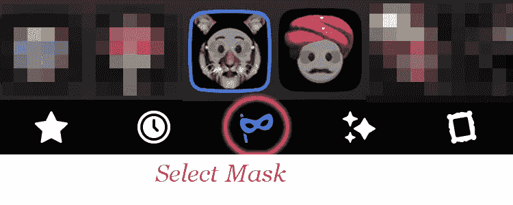

# 使用 AR Studio 在脸书的相机上启动 MaskUp(测试版)

> 原文：<https://medium.com/hackernoon/launching-maskup-on-facebooks-camera-using-ar-studio-beta-f1cfe2f0e806>

【2017 年 8 月 18 日更新

我们现在对脸书有了更多的影响。看这里:【http://www.maskup.me/fbeffects.html】T2

自从[脸书宣布 AR 工作室](https://developers.facebook.com/blog/post/2017/04/18/Introducing-Camera-Effects-Platform/)以来，我们一直急切地等待在脸书的相机平台上创建增强现实自拍效果。所以，几周前，我们收到了测试计划的邀请，我们有机会使用 AR Studio 创建自拍体验。

我们已经使用脸书的 AR 工作室(Beta)制作了两个相机效果，强大的老虎和头巾狂热，并且我们正在进行更多的工作。以下是你获得它们的方法:

1.  喜欢我们的页面[https://www.facebook.com/maskupme](https://www.facebook.com/maskupme)
2.  打开 FB 相机(点击 FB feed 左上角的相机图标)
3.  点击底部导航栏上的面具图标，我们的两个面具，强大的老虎和头巾狂热，应该会出现在那里。

Facebook Camera Selection

不用说，AR Studio 平台非常强大，我们刚刚开始与它合作。我们将不断开发新的效果，使用 AR Studio 上的许多可用功能。

**威武之虎**

Mighty Tiger Icon

这种效果是一种体验性的单人效果，是向印度的国宝动物老虎致敬。效果从一个戴着眼镜、可爱而又逼真的老虎版本开始，一张开嘴，我们就会看到一个发光、有点吓人的老虎版本(老虎嘴里发出惊人的烟雾效果)。试试看！

**穆斯林狂热**

Turban Mania Icon

社交，乐趣，舞蹈，音乐！这种效果具有所有这些成分，使与朋友一起拍一些很酷的自拍变得很有趣。我们最多支持 4 张面孔，每张面孔都有不同的头巾。为了配合效果，我们有一个乐观的 Bhangra 节拍([https://en . Wikipedia . org/wiki/bhan gra _(music)](https://en.wikipedia.org/wiki/Bhangra_(music)))。这一定会很有趣，很有娱乐性！

就像我们的 https://www.facebook.com/maskupme 脸书页面[一样](https://www.facebook.com/maskupme)

MaskUp: http://www.maskup.me