# Waydev 产品搜索发布案例研究🚀用船🚢

> 原文：<https://medium.com/hackernoon/launching-on-product-hunt-8a6dcf487f83>

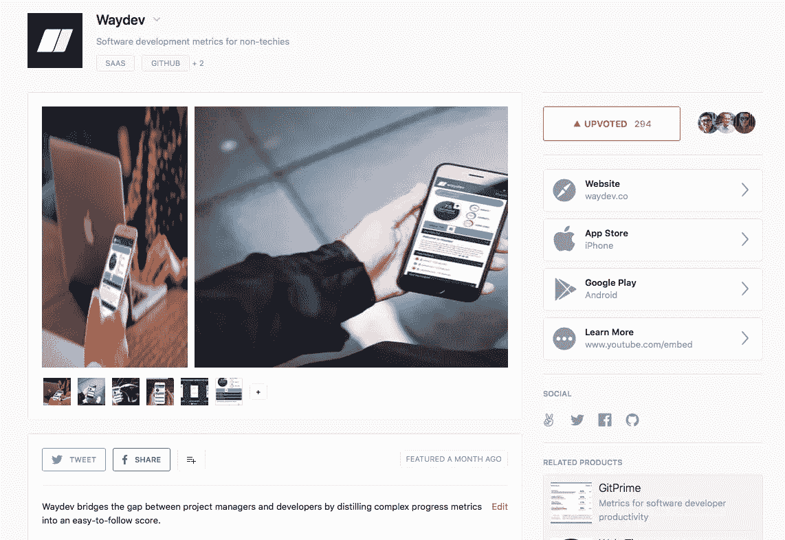

This is a case study for a product with a **very specific audience.** For a broader audience, scale up the numbers.

## 局外人对如何进行产品发布、做出选择和吸取经验教训的观点:

*   什么是[product hunt](https://www.producthunt.com)以及它能为您做什么
*   你应该追求的目标
*   为发布做准备
*   大日子要做的事情
*   技巧和见解

## WAYDEV 做什么——面向非技术人员的软件开发指标

查看源代码管理统计数据，并将它们浓缩成一个易于理解的数字，它可以让您一目了然地知道项目是否在正轨上

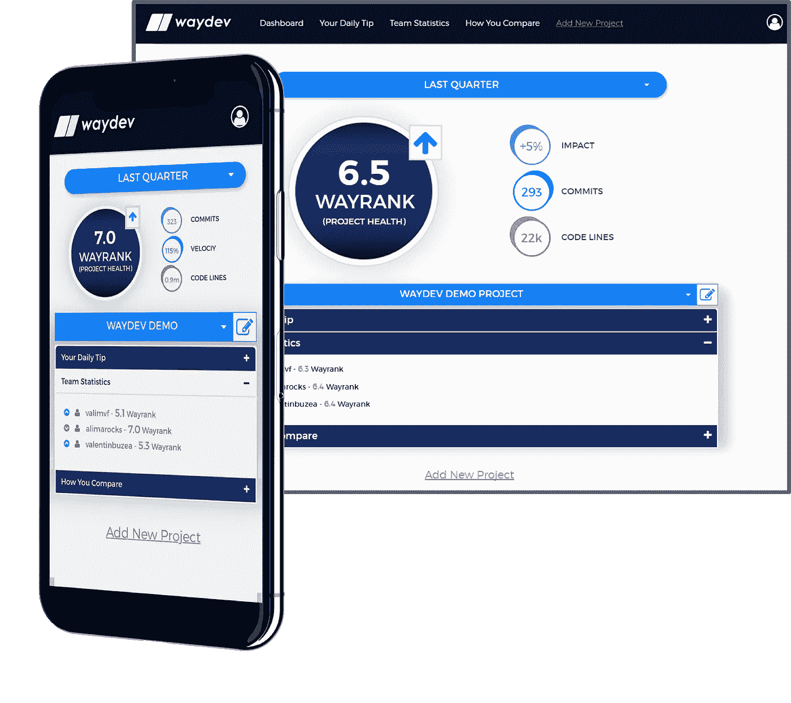

这是一个针对某个**特定受众的产品的案例研究。**为了更广泛的受众，扩大数量

> 没有人会找到你的产品，除非你**被推荐**

**精选** —这意味着什么？

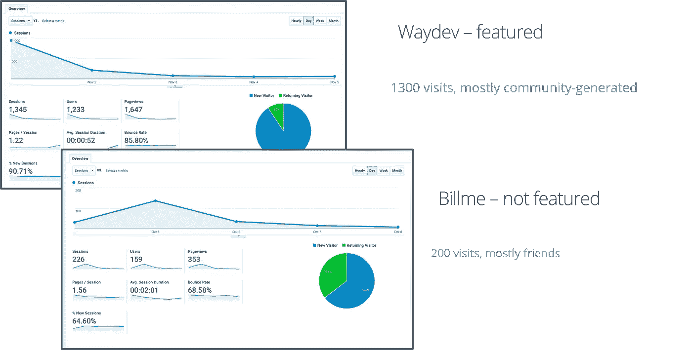

**目标** —定义成功的发布

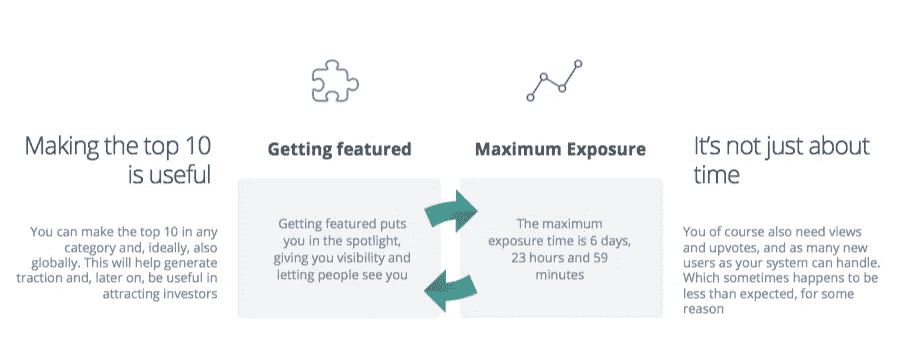

进入前 10 名是很有用的——你可以在任何领域进入前 10 名，理想情况下，还可以是全球范围的。这将有助于产生牵引力，并在以后有助于吸引投资者

这不仅仅是时间的问题— **你当然还需要浏览量和 upvotes，以及你的系统所能处理的尽可能多的新用户。由于某种原因，有时会比预期的少**

> 进入前 10 名让你多了一周的曝光率

**发布于 PH** —如果你记得一张幻灯片，这张应该就是了

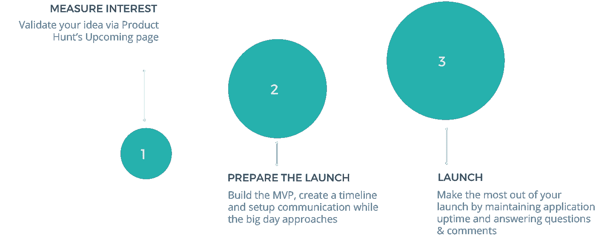

**即将发布的船舶页面—** 创建船舶及其作用

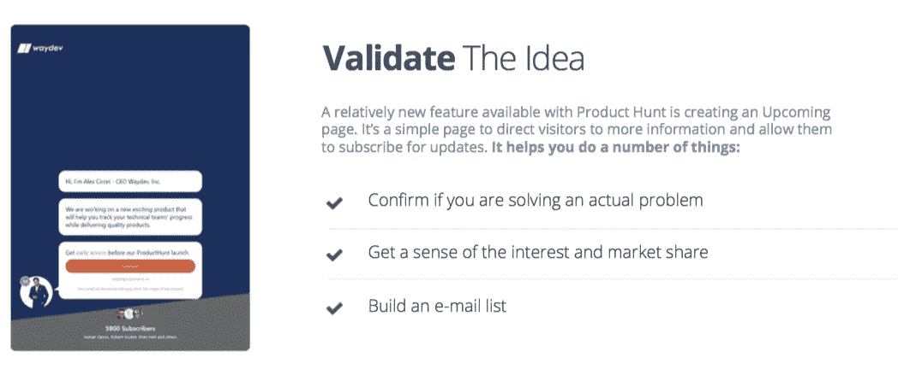

**创建即将发布的页面，提供您可能需要的功能—**

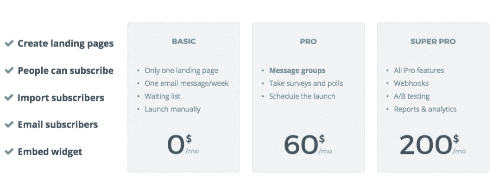

**使用即将到来的页面—** 获得良好的开端

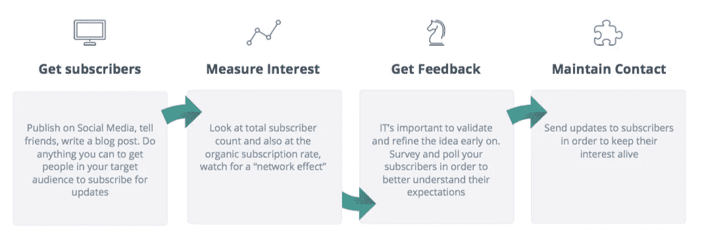

> 现在建立一个 MVP 是有意义的

**管理 MVP —** 充分利用您构建的产品

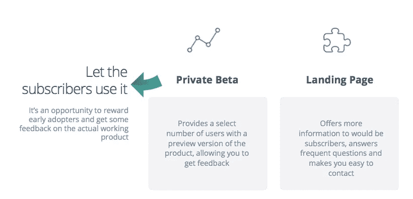

## **准备发布**

设定日期— 给自己足够的时间，但也要督促自己

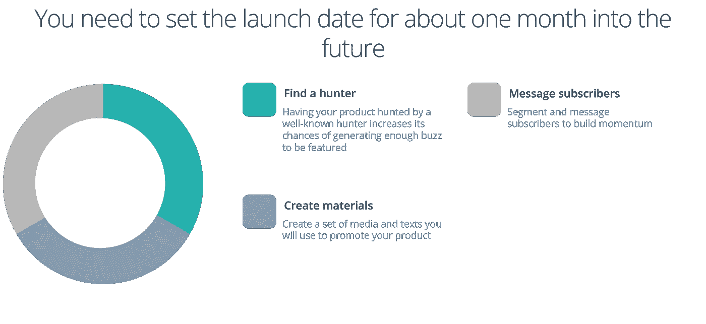

你需要的材料——好的写作增加你成功的机会

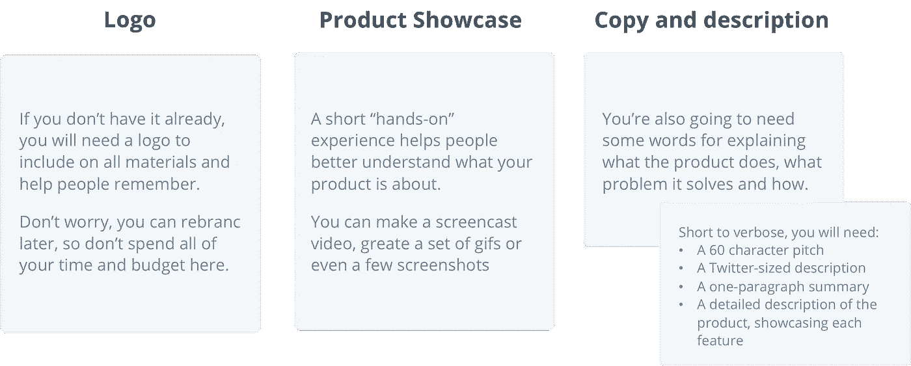

**向即将发布的订户发送消息**——提醒他们他们感兴趣的东西即将发布

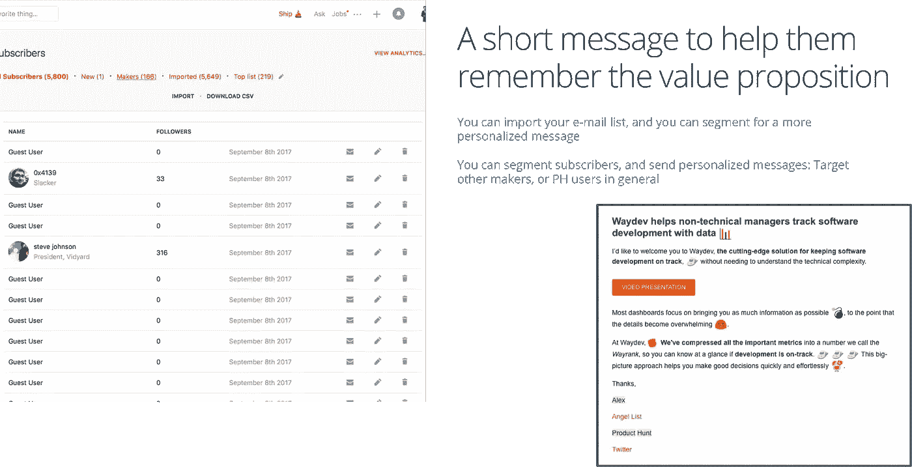

## **发布日保持在问题的顶端**

理想情况下，今天是星期二——潜在影响和竞争之间的权衡

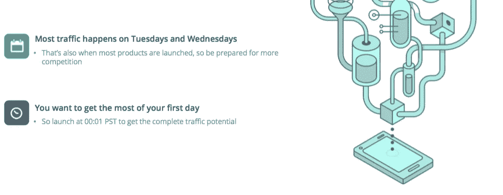

**准备好第一条评论** —准备回应

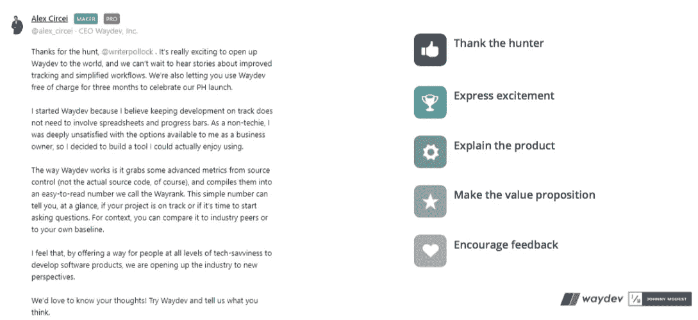

**在评论中保持活跃**——让你的用户了解信息并解决难题

**准备好解决问题**——保持您的应用程序运行

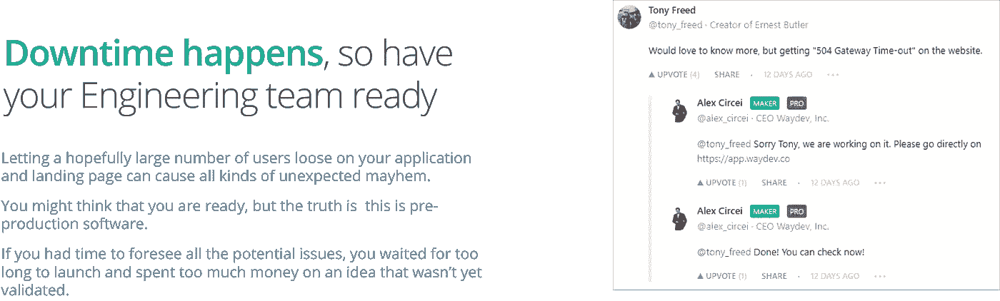

**提供技术支持** —随时准备回答问题并实时解决问题

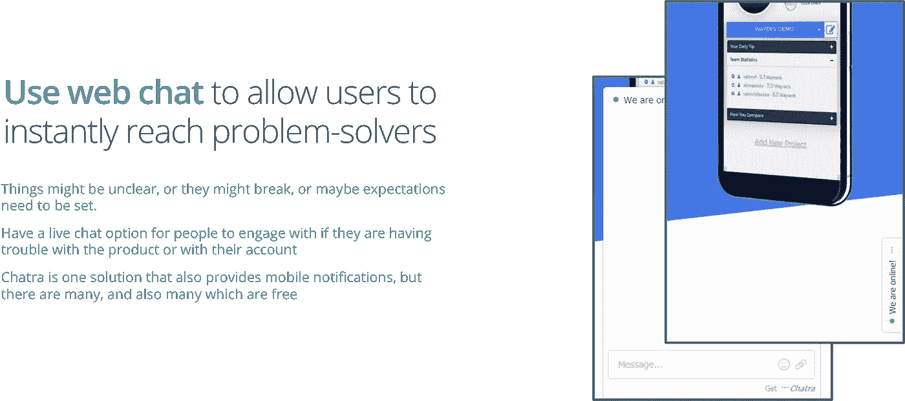

## **杂项——提示我们已经学过并发现有用的东西**

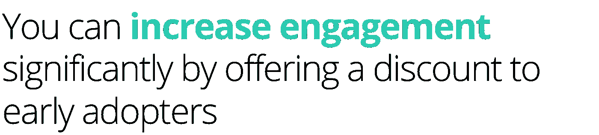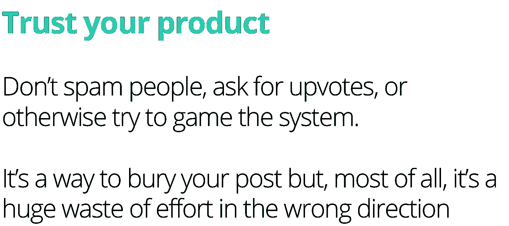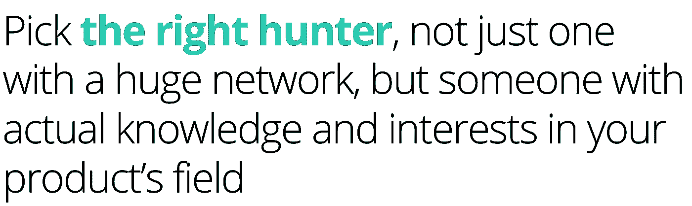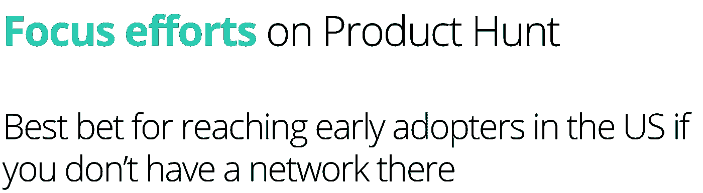

这个案例研究在[约翰尼·谦谦](http://johnnymodest.com)公司&T4【产品搜寻】的尼克·阿布泽德的支持下成为可能，他让我们提前接触到了[船](https://www.producthunt.com/ship)。

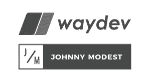