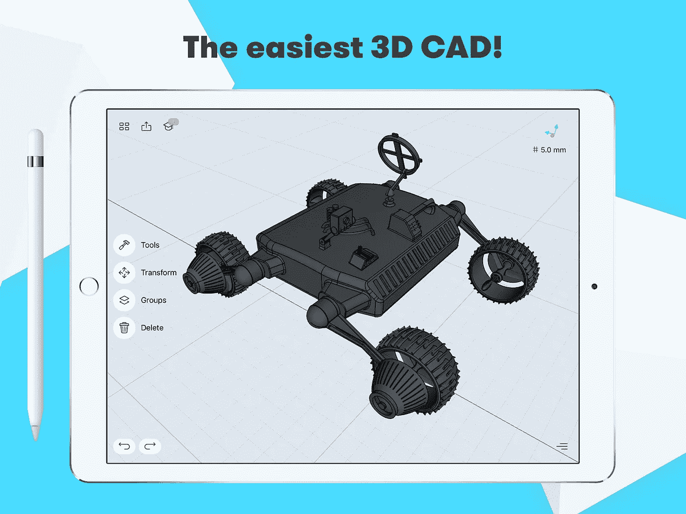
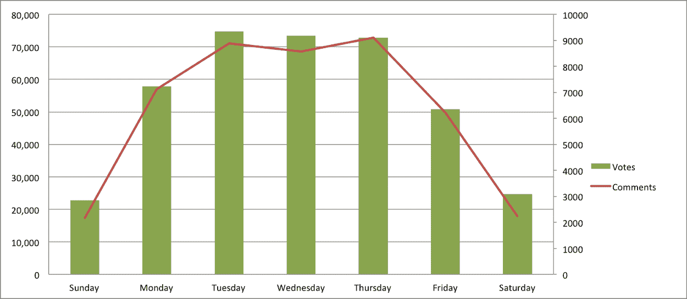
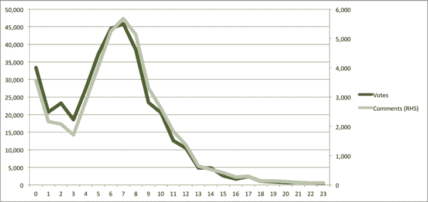
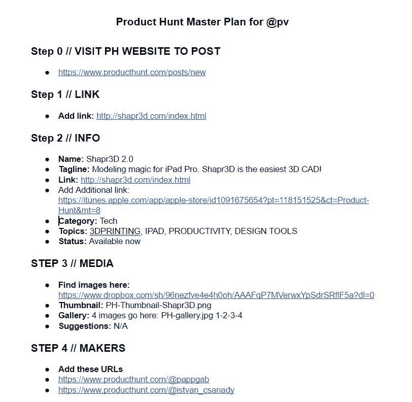
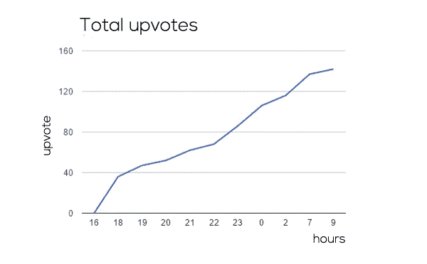
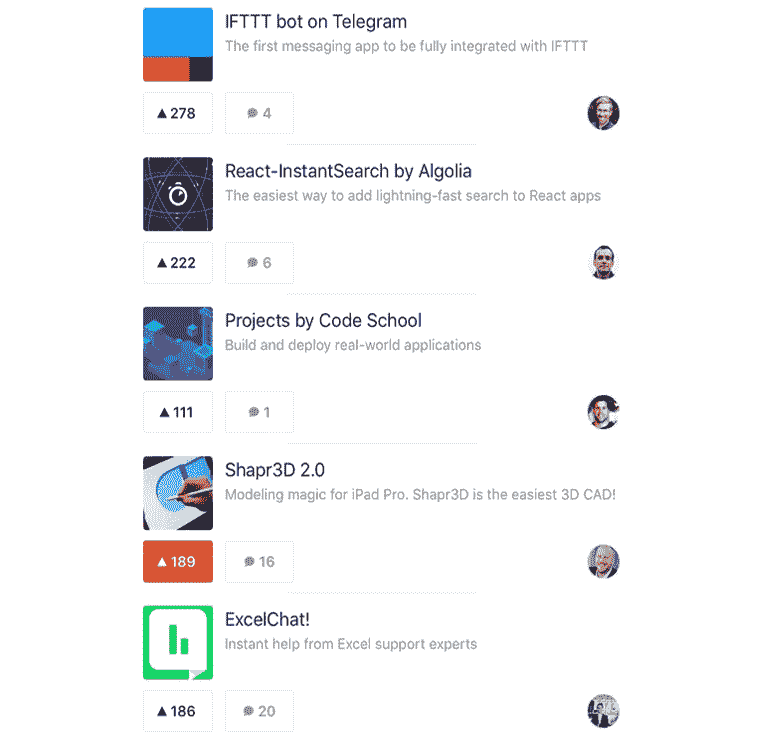
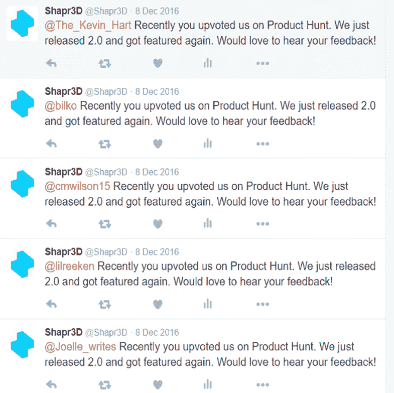
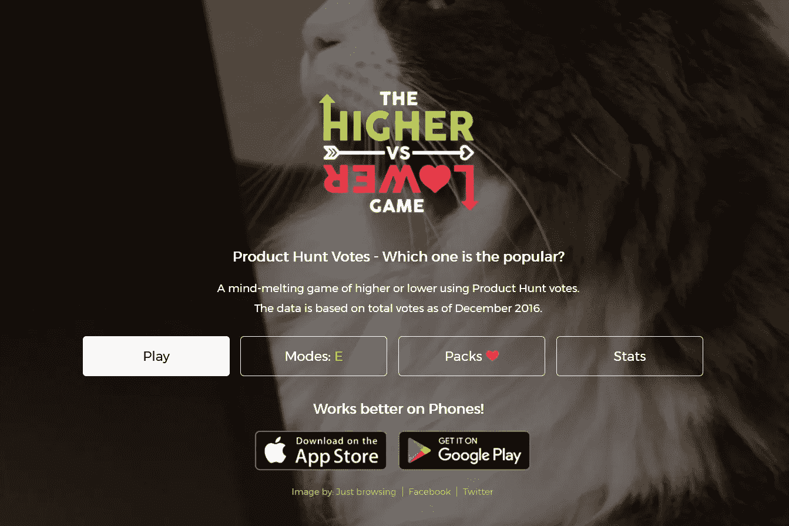

# 启动产品搜索:什么有效，什么无效[指南和案例研究]

> 原文：<https://medium.com/hackernoon/launching-on-product-hunt-what-works-and-what-doesnt-guide-case-study-776c77d56e26>

*Shapr3D 于 2016 年 12 月推出产品搜索。这是活动背后的确切工作流程和数字。*

Shapr3D 是专门为 iPad Pro 设计的 3D 建模应用。去年 12 月，我们发布了新的 2.0 版本，推出策略的一部分是在[产品搜索](https://www.producthunt.com/)上提交产品。

> **这篇文章将向你展示如何在产品搜索上推出你的产品，以及如何让它成功。我不仅分享经验，而且分享我们在发布期间的实际数字。**

# **寻找早期用户的新方法**

[分析了](https://medium.com/u/b8b4445269d0#.dl1ztae7s) 2014 年的 PH 数据，发现了值得注意的相关性。Product Hunt 也出了一个 TL；dr 分析，他们查看了迄今为止的数据，发现了显著的，但相关性较少的结果。这里看分析[。](https://data.world/producthunt/product-hunt-research)

Daily of activity of past Product Hunt launches by Kartik Mandeville

根据 2014 年的数据，我们可以说大多数的支持票将在本周中期到来。这也意味着最大的比赛也是在那几天。周末也没有时事通讯。当你根据天数来决定时间的时候，你应该考虑竞争的程度和向上投票的数量。并根据你的目标做出决定。但是不仅选择日子很重要，发布时间也很重要。

作为一个经验法则，我们可以说，在某一天你越早启动，你将获得最多的总票数。看看投票和评论的分布就知道了。

Every hour counts: upvote and comment distribution throughout the day on Product Hunt by Kartik Mandeville

**每一小时都很重要:**你每早发布一个小时，[你的总票数就会增加 8.7%](/@edmoyse/the-stats-behind-product-hunt-why-you-should-launch-exclusively-38663c369f18#.f588fc80a)。早点开始，如果你在美国，这意味着就在你睡觉之前。此外，请注意，早期投票在排名中可能更重要。你以后会明白为什么。

但是正如我为用户提到的:他们并不是生来平等的。你发帖的日子也不是。尤其是在外部环境下。

# **可以用**计算的东西

有一些实时聊天可以产生很多观众(例如 Snoop Dogg，Brian Chesky (Airbnb)，Mark Pincus (Zynga)。你可以在这里看到完整的列表。

这些可以给网站带来大量的流量，你也可以从中受益。

# 你无法计算的东西

有时，其他大公司会发布重大产品。这是我们发布前两天发生的事情。

Amazon Go 推出后，迅速成为空前热门。我怀疑那天很多浏览量都被那个单页偷走了。如果我们在那天发射，我们可能会得到较小的牵引力。因此，如果一个大玩家出现，他们可能会偷走关注你的眼球。

但是，即使有这些不确定性和猜测，也有一个清晰的蓝图，可以让你的产品发布获得最大的成功。

# **如何推出你的产品？—简短版本**

简而言之，这就是你在发布会上应该做的。简单地说。

1.  找一个猎人，最好是有影响力的人或顶级猎人
2.  为发布准备材料
3.  发动
4.  写第一篇，欢迎评论
5.  确保每个人都知道你在寻找产品
6.  回答评论，开始讨论
7.  等待

让我们来看看它的运行情况和更多细节。

# **Shapr3D 的产品狩猎故事【案例分析】**

首先，我们以对该主题的全面研究开始了整个过程。我们阅读每一个案例研究，免费和付费的关于如何做，失败和成功的故事。我们希望确保不会错过任何提示和技巧。由于 PH 希望你写一个案例研究(在 it 平台上分享，给产品第二次展示的机会)，网上有很多这样的案例。

但是这些研究的质量起伏不定。有些很好，有些很糟糕。我们从史上最佳创业公司的成功故事和经过深入研究的掘金案例中获得了大部分建议。

> 读完所有这些之后，我们过滤了有价值的信息，并创建了一个游戏计划，其中包括所有的待办事项和时间安排。

我们的产品搜寻游戏计划有三大部分:

**一、准备阶段**

**二世。发布当天要做的事情**

**三世。发布后待办事项**

# **一、准备阶段**

这是整个发射过程中最耗时的部分。**我们的目标是在发布当天将一切准备就绪。你必须知道你和谁联系，什么时候联系，怎么联系。这很可怕，但却是必要的一步。我必须承认，这需要大量的体力劳动。**

> 如果你需要一些工作动力:
> 
> Ryan Hoover 是 Product Hunt 的首席执行官，在他创办公司之前，管理着一份创业建议时事通讯。他在 Twitter 上有一个中等的追随者(1200 个追随者)，他开始使用一个非常小的，但相当私人的互动方式。他给每个人发了一条感谢的微博，大家分享了他的文章和想法。在强制性欢迎之后，他抓住机会，指导这些人注册他的电子邮件列表。这发生在 Product Hunt 推出的前一年。他在推特上发了一千多次感谢信。多亏了这个，他的追随者增长到 10，000+，他已经有了一个很好的活跃的追随者基础，他可以在实际推出产品搜索时加以利用。

准备工作可分为三大类

1.  猎人的装备。
2.  联系人列表
3.  创建副本

## 1.猎人工具包

猎人的工具包有所有必要的副本，设置和视觉效果，你的猎人需要提交。我们把这个工具包送给了一个朋友，Patrick Vlaskovits，这样他就可以“猎杀我们”了。所有的说明都在里面。他花了 2 分钟提交产品。看看我们的工具包。

## 2.创建联系人列表

你需要找到合适的人，因为排名取决于向上投票的质量。找到合适的人需要时间。我们编制了以下列表，牢记我们需要的人，谁有一个 Twitter 和/或产品搜索帐户。他们使用的 PH 值越多越好。我们编制了一个列表，列出了可能成为潜在支持者的群体和页面:

*   当地和全国创业和营销脸书集团
*   合作空间
*   产品页面上的产品亨特和他们的创始人来自同一国籍(匈牙利)
*   Shapr3D 1.0 发布会上 upvoters 的 Twitter 帐户
*   Shapr3D 竞争对手或与 CAD 行业有关联的公司以及投票支持他们的人
*   Shapr3D 历史 Twitter 提及和关联的 Twitter 帐户
*   在我们的电子邮件列表中拥有 Twitter 帐户的人
*   匈牙利产品猎人
*   顶级猎人(不断刷新名单这里:[500hunters.com](http://500hunters.com/)这里: [whohunt.io](http://www.whohunt.io/)
*   团队+投资人+顾问

## 3.创建内容

在发布当天，你必须在相对较短的时间内联系很多人，并且你必须在多个平台上发布你的 PH 特定内容。

> 事先创建所有这些内容更容易、更高效，到时候只需按下开始按钮。

这些是你可以提前为你的活动准备的物品。我们使用了这个列表，并根据我们的口味和需求定制了每个项目:

*   推特和脸书邮报
*   GIF，视频，图片
*   易于分享的内容(如果可以，创建一个病毒循环)
*   产品搜索 Twitter 和脸书临时描述更改
*   欢迎以 CEO 的名义发表评论
*   促进(也称为撰写和组织)产品搜寻讨论部分的前几条评论
*   新闻邮件:关于 2.0 和产品搜索功能
*   [脸书](https://hackernoon.com/tagged/facebook)小组+共同工作空间帖子(我们提出写一篇关于发布体验的详细博客帖子，我们所要求的交换是他们应该在产品搜索上查看我们的产品页面。)

## +1:产品搜寻独家发布

Product Hunt 希望您能在此基础上独家发布产品，并且/或者每个发现都有折扣。

> 用一个简单的覆盖或奖励代码你可以解决这个问题，和"？ref=Product Hunt”标签使产品搜寻人群在任何分析工具中都很容易区分。

如果你想把自己更多地绑在产品搜索上，独家发布是一个不错的选择。这是你可以注册的链接:[https://rrhoover.typeform.com/to/ysDOD2](https://rrhoover.typeform.com/to/ysDOD2)

> ***为了所有的准备工作(研究、建立列表、创建内容)，我们的两人团队总共牺牲了 4 天时间。***

你可以争论这是太多还是不够。我们觉得有必要在这上面花些时间(4 天)，但是很难证明花更多的时间在这上面是合理的。

# **二。发布当天要做的事情**

你只需要完成你的游戏计划。就是这样。

> 制定一个时间表，并坚持下去。
> 
> 注意:你也应该有一个备份计划。有些事情会成功，有些事情不会成功。

给你举个例子。我们列出了一些人的小名单，这些人在之前的竞选活动中在 Twitter 上与我们互动，或者在 Porduct Hunt 上为我们投票。我们收到了大约 60 条推文。根据教科书的定义，这些应该是有把握的赌注:**他们以前与我们的品牌合作过，他们也已经有了一些品牌认知度。**我们请他们在产品搜索上查看新版本的应用程序。**结果并不惊人。只有大约 10%的人最终投票支持我们。**有时，即使是确定的赌注也可能失败或表现不佳，因此你需要想出许多方法来吸引对你产品的关注。

你也必须为一大早/深夜做好准备，因为评论、询问会在一天中不断出现。在发布当天处理它们是很重要的，因为寻找产品的热潮只会持续几个小时/几天。所以你必须抓住机会。

投票和评论在一天中不断出现。但是生活并没有到此为止。

# **三世。PH 发布后待办事项**

因为你知道谁推荐了你的产品，你可以利用这个机会再次与他们接触。如果你进入了前 10 名，你可以把它贴在任何你想贴的地方，因为你仍然可以收集投票。这将增加人们找到你的机会，如果他们正在浏览一个类别，在那里他们将看到有史以来最高的。

还将有发布后活动。我们收到了几封电子邮件和额外的交通以及。产品搜索也在发布会后发了关于我们的推文。这些推文总会带来一点点推动(增加投票和流量)。如果你发布关于产品搜索的经历，你也可以进入一个 tweet/retweet 循环。他们通常分享它。对你和他们都好。

> 现在，让我们进入实际的活动，看看这些数字！

# **我们发布 Shapr3D 2.0 的经验**

我们为我们的 2.0 版本发布安排了产品搜索发布时间。由于 App Store 上缓慢的应用程序审查过程，2.0 版本的推出只能在下午 4 点(中欧时间)确定。当那天狩猎开始时，我们比太平洋标准时间 0 点晚了 6-7 个小时。但我们还是决定推出，因为我们认为周四是寻找产品的最佳日子。我们继续我们的游戏计划，尽管我们失去了宝贵的选票，同时我们等待应用程序商店审查我们的产品。

我们的目标是获得 300-400 张赞成票，这可能会让我们进入当天的前五名，我们也会成为产品搜索方面最成功的匈牙利创业公司之一。我们还想创建一个好的产品搜索如何指导，所以获得一些经验也是目标之一。

## **1。寻找猎人**

在发布之前，我们寻找一个人，他在产品搜索和 Twitter 上有很多追随者，所以当他向追随者发布一些东西时，这两个平台都可以用于通知。后一个特征会给你带来很多早期的、强有力的支持票。我们的选择是帕特里克·弗拉斯科维茨。他是一名匈牙利裔企业家，现居美国。我曾经和他合作过一项名为 [Superpowered，](http://superpowered.com)的项目，这就是联系。*注意:我之前也联系了许多顶级猎人，但他们都没有回复。没有。*

除此之外，我还试图在“内部”找到一个人。我的一个联系人曾经是产品搜索的开发人员。我在 2-3 年前布达佩斯的一次会议上见过他。在某些情况下，他帮助我们成为特色:**我们必须遵循寻找产品的规则和指导方针。**

成为特色是我们半成功的重要部分。如果没有他，我们就不太可能进入专题页面。因此，我们得到的有机投票会少得多，因为产品搜索主页上的产品具有“双重优势”。

# **上升票数和效果**

提交产品后，我们等待支持票和评论的到来。这是它看起来的样子(中欧时区；从下午 4 点到上午 9 点)。除了一些上升，我们的赞成票稳步上升，但只是线性增长。

在最初的 10 个小时里，我们收到了 160 张赞成票。今天我们有 281 张赞成票。这意味着在发布日之后，我们获得了大约 100+的投票，而且我们每周仍会收到 1-2 张。发布日之后的增长可以追溯到产品 Hunt GIF 推特账号@ProductHuntGIF，上面贴了一张我们产品的 GIF。

发布后 upvote 的增加使我们在我们选择的类别中成为空前的顶级产品。

如果我们看看我们的网站流量，我们有 600 多名来自产品搜索的访问者，这还不错。**只看这个指标可能意味着发布本身只不过是一个上升。仅仅看着这 600 名参观者，我不会认为这样的发布会是一个巨大的成功。**

我们还研究了自发布以来 Twitter 流量的变化。去年 12 月，我们的个人资料浏览量增长了 125%,我们的粉丝数量增长了 10%。对我们的产品感兴趣的人。

我们从这场运动中学到了不少东西。以下是最重要的几个。

# **学习**

## **1。向上投票的质量很重要**

随着我们的投票数越来越高，我们无法击败一些应用程序(如代码学校项目)，它们的投票数明显更少(111 比 189)。

原因可能是什么？该算法有利于那些拥有更多有机选票的人。这可能是因为我们拓展的范围太广，把那些在投票支持我们之前很少参与 PH 活动的人引向了产品搜索和我们的产品页面。这些投票不仅没有帮助我们提升排名，还可能把我们推下了一点。

> 根据传说，如果你想投赞成票，你需要在 PH 上有大约 5 个追随者。

我在 PH 的朋友不断提醒我，我们不应该分享我们产品页面的直接链接(【https://www.producthunt.com/posts/shapr3d-2-0】T2，因为这将损害我们的排名，所以我们使用了两个解决方法。

*   你只分享，你在寻找产品，但你不使用直接链接。只需提及事实，并要求人们检查你。这是一种非常合法的技术，大多数公司都这样做。

*   你还可以从黑暗面做些别的事情。在一些故事中，我们读到你实际上可以分享一个产品搜索的直接链接，其中的行动步骤很清楚，但它不应该是你的产品页面。解决这个问题的方法可以是一个搜索链接(【https://www.producthunt.com/search/posts?q=Shapr3D】)、一个分类页面或者一个标签，你可以不直接链接到自己，但是很明显用户应该点击哪里。**在一些案例研究中，有人指出这种方法不再有效。很难说这是不是真的。**

## **2。起步早，真的很值**

我们的赞成票稳步上升，但速度缓慢。当我们开始时，一些产品已经有 100-150 张赞成票。这是他们的优势，他们一整天都保持着这种优势。

因此，你在一天中发射得越早，能见度就越高。这增加了你成功的机会。

## **3。哪一天发布**很重要

我们想在周四出门，不管有没有更大的比赛。有了这个总票数(200+)，我们在周五一定会进入前十。但是我们想在更多人面前展示。这是一个你可以做出的选择:你可以追求短期的虚荣心，或者努力争取更大的潜在奖励。

## **4。你需要朋友**

我们都是。但这也适用于你想寻找产品的时候。虽然 PH 标榜自己是一个精英系统，但你需要这些网络软技能才能成功推出。它改变了我们的一切，我们知道有人与组织有关，它也有助于我们了解匈牙利创业生态系统中的人。没有这些关系和许多朋友，我们永远也不会有任何进展。

## **5。有典型的 PH 产品，我们不在其中**

Shapr3D 不是 Slack、 [Wix](http://satoristudio.net/website-builders/#wix) 或 Unsplash 这样的经典 PH 产品。3D 建模是一个利基，只有一小部分我们的目标市场可能是在网站上。尽管我们可以称 Shapr3D 为生产力应用，但它并没有像 StartupStash、Pixabay 或 Slack 这样以行业中立的方式帮助用户。

在生产力类别中，获得 200+的投票并不多。很一般。

但如果我们只将 Shapr3D 与“**iPad”**或“**3d printing”**主题中的任何一款产品进行比较，结果更有希望。

> 在所有贴有“iPad 标签”的产品中，我们排名第 19 位，如果只看“iPad 应用”，我们排名第 2。我们在 3D 打印领域排名第一。

从长远来看，这些排名可能对我们有利，但在竞选结束后很难衡量这种好处。如果目标受众中有人寻找 iPad Pro 应用程序或 3D 打印初创公司，他们会在顶部看到我们。这将在未来为我们带来相关的流量。

你所处的行业也定义了你是否很适合 PH。如果你只看 **CAD/3D 建模行业**的表现，你可以看到产品搜索并不适合这些应用。

1.  Shapr3D 2.0: 281 张赞成票
2.  昂沙佩:114 张赞成票
3.  63 张赞成票
4.  墨菲:15 票赞成

## **6。如果你在现有产品的基础上开发你的产品，你会有更多的曝光机会**

如果你的产品与另一个成功的产品(gmail、chrome、slack、trello 等)捆绑在一起，对于许多产品搜索用户来说，进入门槛会低得多。他们会立即理解你的产品，并被这个提议所吸引，因为他们已经在使用基本产品了。

## **7。如果他们不能尝试你的产品，你就完了**

Shapr3D 只能在配有 Apple Pencil 的 iPad Pro 上使用。因此，在产品搜索上看到它的人没有多少机会实际试用它。移动应用和桌面应用将取得更大的成功，因为用户可以在他们的设备上立即使用这些应用。如果他们不能尝试，他们就不会投票或评论。就这么简单。

那么问题来了:谁应该推出产品搜索，谁不应该？什么有用，什么没用？

# **产品搜寻为什么对谁有好处？**

发布会结束后，我们有两个问题要问自己。

*   我们在这上面花时间值得吗？
*   谁应该试一试？

## 1.对我们来说值得吗？

一般般。是也不是。

如果只看流量，我们可以说:肯定不是。

如果我们把这 4 天花在为 CAD 行业网站写客座博文上，就会产生更多的流量。

但另一方面，我们现在知道更多。我们知道哪些渠道行得通，哪些行不通。我们也成功地执行了我们的游戏计划。尽管结果低于我们的一些预期，但在我们的主要类别(iPad 应用程序、3D 打印和 CAD)中，我们仍处于历史前 20 名。我们的表现也远远超过了业内的同类公司。

## 2.谁应该试一试？

某人，谁

*   拥有产品搜寻兼容产品
*   目标市场是 PH
*   有时间准备
*   有 B 计划

一些产品可以从 PH 发布中获得巨大的收益，但这需要大量的工作。

> 如果你认为你提交了你的产品，奇迹就会发生，你应该三思而行。

在发布上花费至少一周的总工时。我们两个每人花了 2 天时间，总共花了 4 天。与结果相比，这听起来是一个公平的时间投资。

永远记住。你只有一次机会，最好把它做好。专注于寻找一个好的猎手，早期投票者，评论者。明智地使用你的网络、Slack、Twitter 和脸书团队。

为了帮助您做好准备，我们整理了资源，我们使用的案例研究:[http://www.scoop.it/t/product-hunt-1](http://www.scoop.it/t/product-hunt-1)

**保存它，使用它，分享它。**

# **奖金**

如果你已经走了这么远，你也应该得到一些乐趣。在这个游戏中，你可以猜猜哪个产品得到了更多的选票。

[http://www.highervslower.com/game/producthunt_votes](http://www.highervslower.com/game/producthunt_votes)

如果你用的时间足够长，你也会碰到 Shapr3D。:)

*这篇文章是由*[*Gabor Papp*](https://pappgab.com/papp-gabor-seo-szakember/)*，有一手的***撰写的。**

**喜欢这篇文章吗？请点击*让我知道💚*下图。它帮助其他人看到这个故事！**

********

> *[黑客中午](http://bit.ly/Hackernoon)是黑客如何开始他们的下午。我们是这个家庭的一员。我们现在[接受投稿](http://bit.ly/hackernoonsubmission)并乐意[讨论广告&赞助](mailto:partners@amipublications.com)机会。*
> 
> *如果你喜欢这个故事，我们推荐你阅读我们的[最新科技故事](http://bit.ly/hackernoonlatestt)和[趋势科技故事](https://hackernoon.com/trending)。直到下一次，不要把世界的现实想当然！*

**