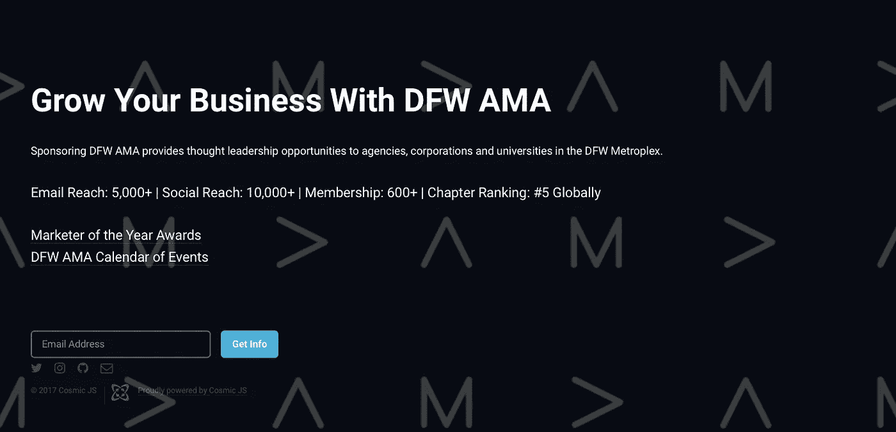
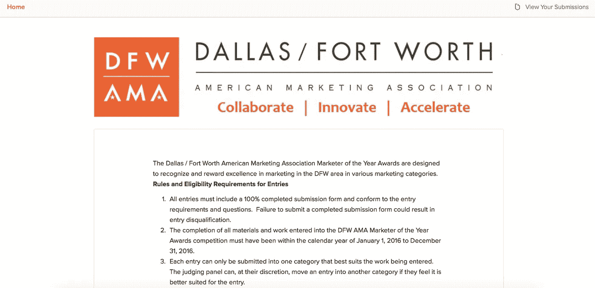
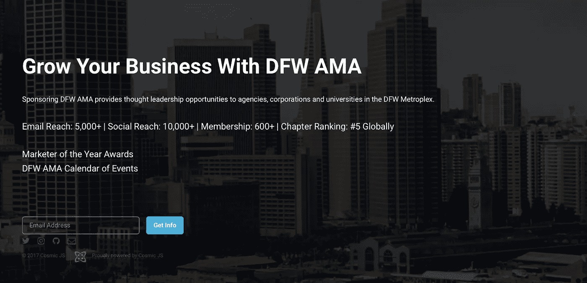

# 使用 CMS API 对微服务应用进行分层

> 原文：<https://medium.com/hackernoon/layer-microservice-apps-using-a-cms-api-f316bb229dab>

在过去的几年里，我一直在美国营销协会的达拉斯/沃斯堡分会的董事会任职。从成为会员开始，我尝到了大规模组织如何使用数字胶带技术栈来修补自己的滋味。我不会给你提供在非营利和全志愿者场景中可能出错的案例研究示例，但可以说列表细分、用户参与类和线索挖掘是三大难题之一。组织可以从这个关于如何使用 [CMS API 将微服务应用集成到现有堆栈的案例研究中受益。](https://cosmicjs.com/apps/email-capture/demo)

使用 [CMS API](https://cosmicjs.com) 是一个很好的分层解决方案，原因有很多:您的数据/内容可以通过 API 端点获得，这意味着您可以设置自己的自定义域来反映您的组织，或者您可以通过现有应用程序上的导航链接内容。将微服务应用程序视为通过 API endpoint 提供的弹出式商店，当您准备好开展业务时设置它，在它上面添加一个自定义域并兑现。完成后，将内容桶设置为“草稿”,或者简单地删除内容桶，并为新的“分层项目”创建一个新的内容桶。

今天，我将向大家展示我是如何构建一个简单的登录页面作为“季节性促销”的，它不仅可以作为其他数字资产的垫脚石，还可以捕捉电子邮件地址，以便联系感兴趣的潜在客户寻求赞助机会。我将使用的[电子邮件捕获登录页面](https://cosmicjs.com/apps/email-capture)是来自 [Cosmic JS](https://cosmicjs.com/) 的一个内容就绪的 web 应用程序。它具有漂亮的整页旋转背景图片，社交链接和电子邮件捕获字段。您可以在几分钟内设置您的登录页面并获取销售线索。

对于这个示例应用程序，我使用了 [Cosmic JS](https://cosmicjs.com/) 。Cosmic JS 是一个 [API 优先的 CMS](https://cosmicjs.com/) ，它使得管理和构建网站和应用程序更加快速和直观。通过将内容从代码中分离出来，Cosmic JS 增强了开发人员的灵活性，同时确保内容编辑人员能够以最适合他们的方式规划和部署内容。我们将使用 Cosmic JS 来安装我们的示例应用程序，部署和更新来自[基于云的内容管理平台](https://cosmicjs.com/)的内容。

如果你还没有，从[注册](https://cosmicjs.com/signup)参加[宇宙 JS](https://cosmicjs.com/) 开始吧。我只需从下面的应用程序页面安装应用程序，就可以构建我的销售线索生成登录页面。

> [邮件抓取 App 页面](https://cosmicjs.com/apps/email-capture)
> [邮件抓取 App 演示](https://cosmicjs.com/apps/email-capture/demo) [GitHub 上的邮件抓取 App 代码库](https://github.com/cosmicjs/email-capture)

按照以下四个简单的步骤来设置你的登陆页面。创建一个新的桶
2。安装电子邮件捕获登录页面应用程序
3。部署到 Web
4。编辑对象

典型地，在我的博客中，我向读者展示了如何在 4 个步骤或更少的时间内轻松构建某种类型的应用程序，但是这个博客的例子是不同的。本博客旨在展示，如果组织的主网站使用传统的已安装内容管理系统，该组织仍然可以在其主网站内部和周围部署微服务应用来执行某些任务。下面是三个网页的截图，都对应于 DFW·AMA。

第一个是主要网站，建立在 WordPress 上，深陷插件/安全更新/蹩脚的 WISYWIG 编辑器之类的泥潭。**第二个**是为我们的年度营销人员奖设立的提交微型网站。第三个是线索生成登陆页面(使用 [Cosmic JS](https://cosmicjs.com/apps/email-capture/demo) 构建)，我设置它不仅是为了获取电子邮件地址作为线索，也是作为一个吸引人的“桥梁”连接到 DFW·AMA 的社交渠道、年度营销人员提交微型网站以及 DFW·AMA 的活动日历。

# 已安装的内容管理系统

导航至 [DFW AMA 网站](http://dfwama.com/)。

# 颁奖晚会微型网站

导航到 [DFW AMA 提交的微型网站](https://dfwama.submittable.com/submit)。

# 销售线索生成登录页面

导航至 [DFW AMA 销售线索生成登录页面](http://ama.cosmicapp.co/)。

请原谅我上面的例子在品牌标准方面不够连贯，但自从 AMA 全球支持中心在 2016 年的峰会上推出新的品牌标准指南以来，DFW AMA 公司目前正在进行品牌重塑。重点是，上图中的三个 web 应用程序都有不同的 URL、不同的外观和不同的功能，同时都集成到同一个 MailChimp lead generation 帐户中。当后端都对应于用于数据挖掘、提取和跟进的主数据库时，微服务 web 应用中的分层更有意义。利用像 [Cosmic JS](https://cosmicjs.com/) 这样的 [CMS API](https://cosmicjs.com/apps/email-capture/demo) 是完全控制应用程序的一个很好的方式，同时仍然可以将它编织到一个组织的更大的技术堆栈中。

就像注册、创建新的 bucket、安装您的 web 应用程序、编辑对象和部署一样简单。我收到一封确认电子邮件，可以访问我的 web 应用程序，还可以看到我的[桶升级](https://cosmicjs.com/pricing)选项，如[自定义域名、一键式 SSL、webhooks 和本地化](https://cosmicjs.com/features)。

[Cosmic JS](https://cosmicjs.com/) 是一个 API 首创的基于云的内容管理平台，可以轻松管理应用和内容。如果你对 Cosmic JS API 有任何疑问，请通过 [Twitter](https://twitter.com/cosmic_js) 或 [Slack](https://cosmicjs.com/community) 联系创始人。

> 卡森·吉本斯是 [Cosmic JS](https://cosmicjs.com) 的联合创始人& CMO，这是一个 API 第一的基于云的[内容管理平台](https://cosmicjs.com)，它将内容与代码分离，允许开发人员用他们想要的任何编程语言构建流畅的应用程序和网站。

> [黑客中午](http://bit.ly/Hackernoon)是黑客如何开始他们的下午。我们是阿妹家庭的一员。我们现在[接受投稿](http://bit.ly/hackernoonsubmission)并乐意[讨论广告&赞助](mailto:partners@amipublications.com)机会。
> 
> 如果你喜欢这个故事，我们推荐你阅读我们的[最新科技故事](http://bit.ly/hackernoonlatestt)和[趋势科技故事](https://hackernoon.com/trending)。直到下一次，不要把世界的现实想当然！

