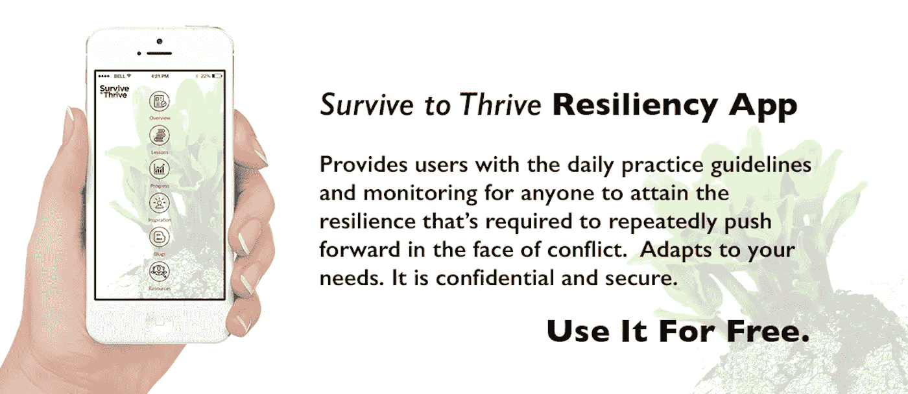

# 不确定时期的领导力

> 原文：<https://medium.com/hackernoon/leadership-in-uncertain-times-6c51786ba7cd>

[Image: Unsplash User *Nick Scheerbart]*

## 成功来自于将我们的情感自我和系统思考联系起来。

当世界地缘政治气候动荡、国家贸易协定转向、技术变革层出不穷时，对强有力的领导和良好决策的需求变得尤为关键。从新的美国总统政府到英国退出欧盟，再到民族主义观点的兴起，几乎所有我们正在消费的新闻都指向一个正在沸腾的 VUCA 锅。VUCA(或者说，一般条件和情况的波动性、不确定性、复杂性和模糊性)曾经是董事会和管理层的专利，现在正在影响所有行业的每个人。

劳动力越来越分散，要求自我表达，很可能会脱离工作。在这种颠倒的背景下，领导者必须激发创造力，推动创新，并确保可持续性。

有哪些补救措施？世界上最新的问题可以在最古老和永恒的实践中找到解决方案，比如正念、真实性和毅力――因为一切都是相互联系的。

> 这些动荡的时代可以为我们提供突破性的机会，改变我们如何看待世界，以及我们如何在其中运作。“—世界经济论坛

从我在[空中客车领导力大学](http://www.airbus.com/newsevents/news-events-single/detail/airbus-group-opens-leadership-university-in-toulouse/)的演讲中了解更多信息。

***版权所有 2017 费萨尔·霍克。保留所有权利。***

我是一名企业家和作家。 [SHADOKA](http://shadoka.com/) 等公司创始人。Shadoka 促进企业家精神、增长和社会影响。《万物互联——如何在创意、创新和可持续发展的时代进行变革和领导》(麦格劳·希尔著)和《生存与发展:富有弹性的企业家、创新者和领导者的 27 种实践》(励志出版社)。在推特上关注我。*免费使用* [*万物互联*](http://app.everythingconnectsthebook.com/login.php) *领导力 app 和* [*生存茁壮*](http://app.survivetothrive.pub/login.php) *弹性 app。*

> [黑客中午](http://bit.ly/Hackernoon)是黑客如何开始他们的下午。我们是 [@AMI](http://bit.ly/atAMIatAMI) 家庭的一员。我们现在[接受投稿](http://bit.ly/hackernoonsubmission)并乐意[讨论广告&赞助](mailto:partners@amipublications.com)机会。
> 
> 如果你喜欢这个故事，我们推荐你阅读我们的[最新科技故事](http://bit.ly/hackernoonlatestt)和[趋势科技故事](https://hackernoon.com/trending)。直到下一次，不要把世界的现实想当然！

