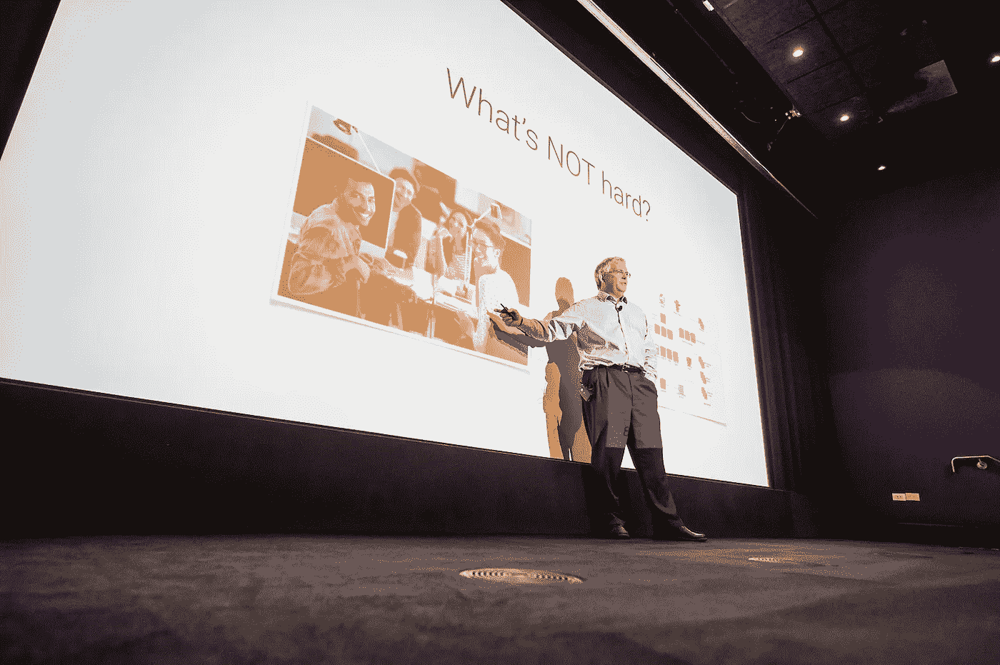
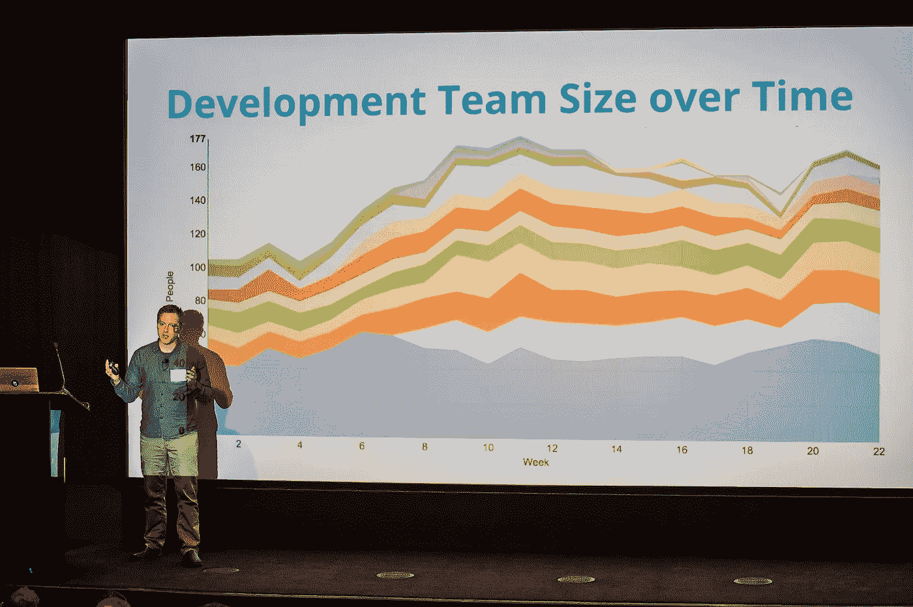
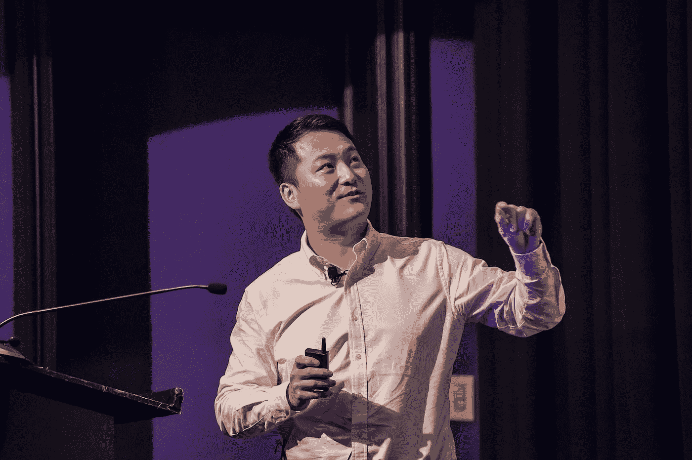

# 来自技术战壕的故事:首席技术官的领导技巧

> 原文：<https://medium.com/hackernoon/leadership-tips-for-ctos-46c3b565bd52>

Hootsuite，InVision，MailChimp 和 Peloton 有什么共同点？除了是独角兽(或者 soonicorn！)公司，他们都是今年 [FirstMark CTO 峰会](http://firstmarkcap.com/)的发言人，该峰会聚集了科技行业最聪明的头脑——来自世界上一些最成功的初创公司和企业——进行为期一天的学习和交流。今年的阵容包括来自 Gusto、Greenhouse、Splunk 等公司的首席技术官和工程副总裁。以下是 2017 年 CTO 峰会的一些最佳见解:

## 比约恩·弗里曼-本森

首席技术官，[视觉](https://www.invisionapp.com/)

## **关于化难为易**

作为一家完全分布式的创业公司，InVision 面临的挑战与大多数经历快速增长的公司没有什么不同；他们需要确保每个人都团结一致，朝着同一个方向努力，同事之间有效沟通，重要的项目细节不会因为匆忙发货而被遗忘或遗忘。比约恩对这些问题的解决方案？让一切变小。通过将一个更大的组织分解成不超过 6 人的团队，每个团队都能够像早期创业公司一样高效运作。这个策略可以随着团队的成长而扩展，允许一个 100 人的公司像 20 个五人团队一样自由灵活地运作。

## **将公司层级抛在身后**

比约恩采取自下而上的管理方法；认识到建设者——在他的团队中，是工程师——是做工作的人。经理的角色是让他们的建设者尽可能做好工作，这就是为什么 InVision 培训员工用 *why* 而不是 *what* 来领导他们的团队。解释*为什么*一个建造者正在做一个项目，而不是明确地告诉他们*做什么*给每个人在执行上做出自己决定的空间，同时仍然朝着团队和公司的目标努力。比约恩说，自下而上的方法孕育了创造力和积极的工作场所文化，同时缓解了典型企业组织结构中常见的一些问题，如微观管理和冷漠。该策略也可以扩展；虽然之前以工程 SVP 的身份领导新遗迹，但比约恩利用它将他的部门从 3 个增加到 300 个。

## 埃里克·蒙茨

工程副总裁， [MailChimp](https://mailchimp.com/)

## **什么要破？**

很有可能，在某个时候技术会让你失望。Eric 以不同的心态来看待这个理论，他说，大多数时候，真正的问题是你的技术失败了。为了避免潜在的灾难性事故，他建议作为一个团队聚集在一起，并问，“什么会打破？”。MailChimp 将这种心态应用到了从建立离线数据恢复系统到为客户规划的所有事情上:在展望 2015 年假日季节时，该公司能够计算出他们没有足够的带宽来应对即将到来的出站电子邮件高峰。通过简单的容量升级，轻松避免了一个痛苦且代价高昂的局面。

## **跟上变化……**

关于你是否应该重写你的产品的争论是一个热点，但是 Eric 不能推荐它。他说，2008 年改写 MailChimp 的产品以适应客户不断变化的需求，是该公司有史以来做出的最佳决定之一，也是“MailChimp 历史上最大的一个转折点”。如果没有一个新的、成熟的技术体系，该公司接下来 9 年的天文数字增长是不可能的。

## **…和拥抱无聊**

为了用户和最终产品的利益而改变你的技术体系是一回事，但是 Eric 警告不要仅仅为了工程而这样做。参考程序员丹·麦金利关于[拥抱无聊技术](http://mcfunley.com/choose-boring-technology)的博客文章，埃里克说重点不是选择无聊技术，而是考虑未知。MailChimp 的网络堆栈可能不是最令人兴奋的，但对于一家每天发送 10 亿封电子邮件的公司来说，可靠的技术比必将带来惊喜的闪亮新技术更安全。

## 乔迪·亨德森

工程副总裁， [Hootsuite](https://hootsuite.com/)

## **关于大声工作**

从第一天起，HootSuite 就遵循着众所周知的信条“做事，告诉别人”。几年后，乔迪说，让同事了解团队行动的简单行动对扩大公司规模至关重要。通过快速和经常地传达他的进展信息，Geordie 创建了一个持续改进工程部门流程的机制。

## **将可见性提升到下一个级别**

2013 年末，Hootsuite 面临一个挑战:该公司需要更新其软件系统以应对快速增长，但这样做需要开发团队 75%的精力和能力。为了安抚同事和领导对这种戏剧性的资源分配的焦虑，Geordie 需要想出一种方法来传达他的团队正在做什么，这项工作的客户价值是什么，以及花费了多少努力。他的团队将公司信条向前推进了一步，推出了一项战略，该战略提供了“对所有工作的工作分配的每周可见性——在宏观层面上，对整个公司的可见性”。定量(定义进行中的[史诗](https://www.atlassian.com/agile/delivery-vehicles)并为每个史诗分配一定比例的个人努力)和定性(以一种对非技术员工有意义的格式呈现报告)，Hootsuite 能够自动化这个过程，构建一个轻量级的 [web 应用](https://github.com/hootsuite/pop)来汇总每周数据并生成报告。

## 冯友兰

创始人兼首席技术官， [Peloton](https://www.pelotoncycle.com/)

## **构建还是购买？**

决定是构建定制软件还是购买现成的解决方案是许多公司面临的一个难题，而且总是很难。Yony 说，这也是一个会受到公司当前阶段影响的选择。早期公司应该优化团队中每个工程师的经验水平。例如，如果一个工程师对更具可扩展性的高级数据库(如 PostgreSQL)有丰富的经验，提交是有意义的。然而，随着公司的发展，对技术前景和团队核心能力的评估将是必要的，以告知你在新解决方案的教育方面需要预先投资多少。

## **起泡沫，冲洗，重复**

对其生态系统价值链的持续分析引导 Peloton 在早期决定投资该产品的排行榜技术:通过查看空间，他们能够确定这将是公司的核心优势。从那时起，Yony 完善了一个迭代循环，允许不断的技术改进— *评估*生态系统，*制定战略*哪些技术发展得最多，在 Peloton 的价值链上处于最高位置，*执行*相应地发展当前的基础设施，以及*收集反馈*重新开始整个过程。这种循环激励他的团队把精力花在对产品最重要的领域上。

我们感谢今年所有的演讲者。如果您有兴趣从整个科技行业的高层领导那里了解更多信息，请点击此处参加我们即将举办的活动并观看过去的演讲。