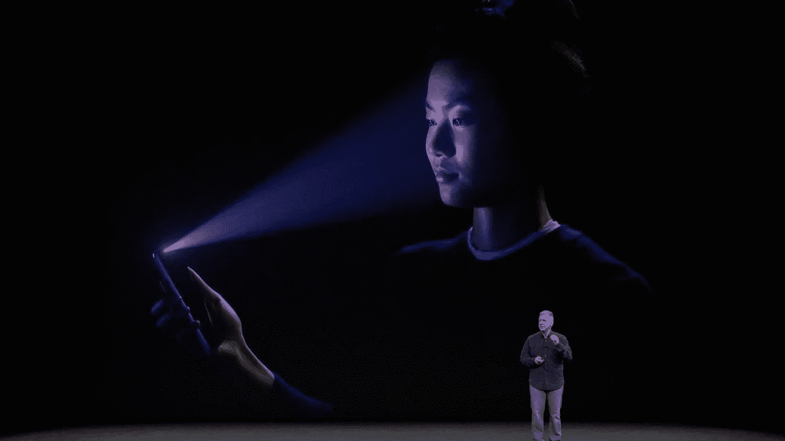
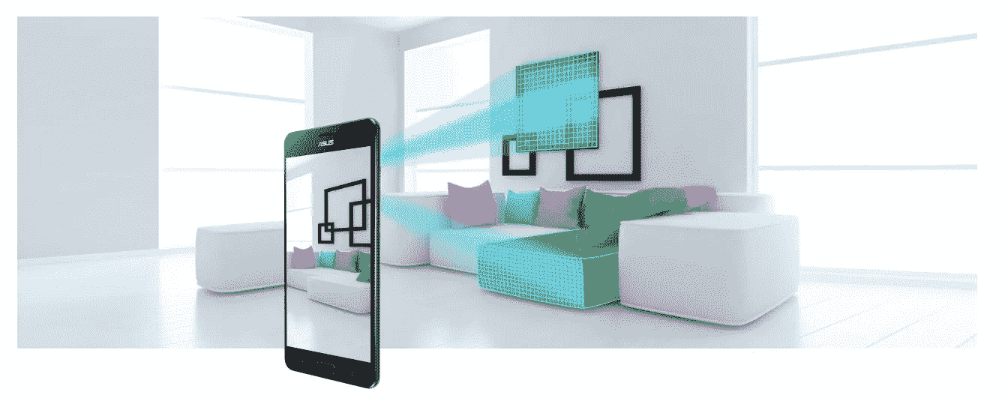

# 为什么科技公司要押注 VR/AR？

> 原文：<https://medium.com/hackernoon/leading-tech-companies-bet-on-virtual-and-augmented-reality-11213600658c>

## 2019 年，每两个移动设备中就有一个深度感应摄像头。这将是人类交流史上新的(令人兴奋的)一页。

*作者:保利乌斯·尤尔西斯和惠特尼·迪鲁卡*

彭博刚刚[报道](https://www.bloomberg.com/news/articles/2017-11-14/apple-is-said-to-target-rear-facing-3-d-sensor-for-2019-iphone)苹果正在研发一种新的深度感应[技术](https://hackernoon.com/tagged/technology)，最快将于 2019 年引入 iPhones。这一改进将导致在手机背面安装深度传感技术。因此，这种硬件将使手机用户拥有更加惊人的增强和虚拟现实体验。

特别是，深度感应传感器将使我们每个人都有可能对我们周围的空间进行三维捕捉，并打开虚拟现实空间中的通信可能性。想象一下:你将能够掏出口袋里的手机，自发地捕捉你周围的空间，并与之互动。

关于苹果计划实施这种新的深度传感技术的传言已经在行业专家中流传了一段时间。然而，还不知道这种硬件何时会真正出现在 iPhones 上。2017 年初，有人希望即将发布的 iPhones 将包含这种深度感应硬件。但随着时间的推移，蒂姆·库克和他的公司透露他们打算专注于增强现实，并在 2019 年之前停止引入深度传感硬件。

不过需要注意的是，新款 iPhone X 拥有真正令人惊叹的人脸识别技术。不幸的是，该硬件安装在手机的前面，只执行一个功能:解锁手机。这种使用结构光技术的 TrueDepth 传感器系统:激光器将 30，000 个激光点的图案投射到用户的脸上，并测量失真，以生成准确的三维人脸图像来进行身份验证。

Apple’s TrueDepth technology to unlock iPhone X

> “我们已经看到了改变您工作、娱乐、联系和学习方式的事物。”(蒂姆·库克)

iPhone X 中使用的 TrueDepth 系统包含四个组件:一个普通摄像头、红外摄像头、点投影仪；和泛光照明器。如果这项技术也在 iPhone X 的背面实现，我们将能够享受真正的虚拟现实体验。然而，苹果公司最近的报告显示，该公司一直在努力及时制造 iPhone X。这种延迟似乎是由于组装 TrueDepth 传感器所需的精度造成的。

这就是说，我们应该注意到(除了解锁设备之外)，TrueDepth 技术只能用于控制 emoji 面部表情等新颖的目的。因此，VR/AR 爱好者和在这一领域工作的公司必须耐心地武装自己，直到 2019 年类似的硬件将出现在移动设备的背面。

## **错综复杂的创新过程(太阳底下没有新东西)**

苹果并不是第一家考虑 3D 传感技术潜力的高科技公司。事实上，自 2014 年以来，[谷歌](https://hackernoon.com/tagged/google)凭借项目 [Tango](http://get.google.com/tango/) 在 3D 传感器竞赛中一直领先。在苹果宣布 ARkit 将一次性为数亿部 iPhones 带来 AR-lite 体验后，Tango 踩了刹车。谷歌随后也推出了 ARcore，试图利用庞大的安卓用户群。现在，苹果公司也紧随其后，在他们的设备上安装了后置传感器。

Tango 技术包含一套传感器和计算机视觉软件，使移动设备能够像人类一样理解空间和运动。Tango 技术有三种能力:运动跟踪、深度感知和区域学习。因此，Tango 驱动的设备可以理解用户在某个区域移动时的运动，检测物体离地板、墙壁和其他表面有多远，并记住三维空间中物理空间的关键视觉特征。

Tango 深度感应硬件目前在两款商用分布式手机中实现:联想 Phab 2 Pro(2016 年发布)和华硕 Zen fone AR(2017 年 7 月发布)。

There are endless possibilities with depth-sensing technology

随着时间的推移，这些深度传感器将会改进，能够捕捉更长的距离。目前，安装在 iPhone X 上的 TrueDepth 识别传感器可以捕捉 2-3 英尺的距离，而 Tango 驱动的华硕 Zenfone AR 硬件能够捕捉距离设备 12-15 英尺的物体。随着深度传感技术的提高，捕捉距离将会增加。

据彭博称，苹果已经开始与英飞凌公司(与谷歌合作开发 Tango 的同一家德国公司)以及索尼公司、意法半导体公司和松下公司进行讨论。考虑到测试所需的时间，苹果预计在 2019 年发布具有深度感应功能的移动设备似乎是合理的。

**弥合从现在到 2019 年的差距**

这条关于苹果计划在 2019 年为 iPhones 添加深度传感技术的消息对 VR/AR 行业来说是一个巨大的激励。当大多数软件开发人员正在制定一项战略，以填补现在和大规模采用支持 3D 传感器的移动设备之间的差距时，他们现在发现自己有足够的时间及时将产品推向市场，以迎接即将到来的大规模采用。

换句话说，从事 VR/AR 项目的初创公司现在在筹集资本和开发 VR/AR 应用程序方面有了更多的确定性。根据 Superdata 的估计，到 2020 年，虚拟现实的市场规模可能在 300 亿美元到 2150 亿美元之间。其他估计甚至更令人震惊:根据 [Statista](https://www.statista.com/statistics/591181/global-augmented-virtual-reality-market-size/) ，2021 年 AR 和 VR 市场将达到 2150 亿美元。

这些关于 VR/AR 市场规模的估计很难评估。一般来说，它们是基于规模经济的假设。到目前为止，联想 Phab 2 Pro 手机只卖出了…台，华硕 Zenfones 就更少了。目前，移动 VR 行业的公司正在等待苹果和三星等热门品牌将深度传感技术融入他们的移动设备，这还需要一两年的时间。

与此同时，苹果和谷歌都非常看好增强现实:就在几个月前，即 2017 年 9 月，两家公司分别宣布了 ARKit 和 ARCore 的发布。这些是增强现实应用程序开发人员的工具，这些应用程序基本上适用于大多数最新的移动设备(就苹果而言，从 iPhone 6 开始)。

当前的增强现实应用依赖于现有的移动设备。然而，现有的移动设备只能帮助识别平面(桌子、床或地板)，这限制了 AR 的应用。例如，我们可以放置各种数字对象(桌子上的垄断板)并移动这些数字块。AR 的问题是用户无法与那些数字对象进行交互(不可能拿起大富翁的零件玩)。在手机背面引入深度感应传感器将使这种互动成为可能。

## 一点点耐心

孩子们总是根据他们在 YouTube 上看到的广告向他们的父母询问最新的技术。一旦每两个孩子中就有一个拥有 Tango 智能手机，我们可以说虚拟现实实际上有数十亿美元的市场。特别是，预计将有 ca。2019 年市场上将有 45 亿台基于 Tango 的移动设备。根据一些 VR 极客的说法，这意味着如果我们将每部 ARKit 和 ARCore 手机堆叠在一条线上，我们可能能够捕捉到前往月球并返回的距离。

我们现在处于改变生活的技术的最前沿。这项技术已经存在很多年了，唯一缺少的是改进硬件和应用相关知识所需的时间。谁知道呢，也许 2020 年我们就能利用 VR/AR 进行瞬间移动了？

感谢您阅读这篇文章！如果你喜欢，点击并按住👏*在你的左边，或者留下评论。*

*我每周发表一个新故事。关注我，你不会错过我对创新、创造力以及硅谷和其他地方的最新趋势的见解。*