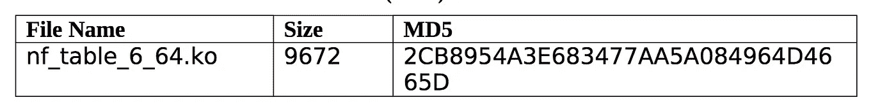
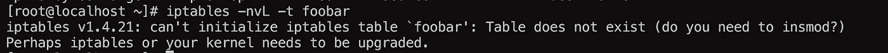
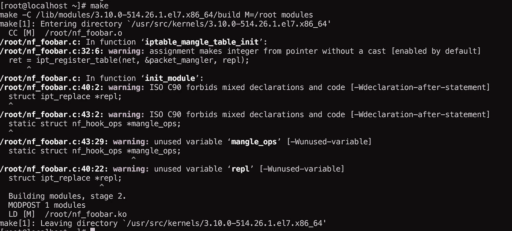
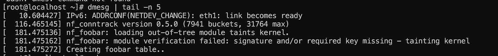
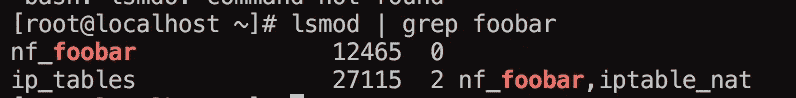
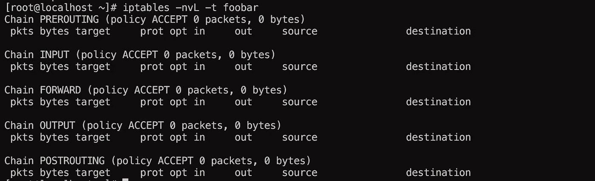

# 泄露的“恶意软件”超出国家审查范围

> 原文：<https://medium.com/hackernoon/leaked-malware-outlawcountry-review-db14caf3c79e>

本周，有一个来自某个安全机构的所谓“T1”泄漏报告，它被称为 OC(outlawccountry)，我不知道它是否应该被称为恶意软件，因为公平地说，它真的不需要利用任何东西。

OC，它应该将您的一些或所有流量路由到一个特定的端点，但是问题是这个“**恶意软件**”是预先打包在一个内核对象中的。 **ko** )，一个内核模块！！



oc kernel module

这有点令人难以置信，所以他们当然可以从内核模块、路由、iptables 规则等做任何你想做的事情……但是为什么是内核模块呢？

嗯，我觉得这是一个很好的预打包和丢弃它的方法，但我也觉得这可能会失败，这取决于内核版本和编译标志等。

**所以我决定“重新创建”这个“恶意软件”可能在做什么。**

## OC 详细信息:

正如我们已经提到的，这是一个内核模块，理论上它创建了一个新的 iptables“**表**”。现在这不是一个新的链或新的规则或任何类似的东西，这是一个新的"**表**"如过滤器、nat 或 mangle:


这就是表“ **dpxvke8h18** ”的名称，所以要查看这些规则，您需要执行以下操作:

```
iptables -nvL  -t dpxvke8h18 // iptables -S -t dpxvke8h18
```

所以我的一部分想法是把它放在一个不同的表中，对于一个管理员来说，知道这个表的存在，并且可能不会去查找这个表的附加规则，这有点困难。

## **表**:

内核 iptables 表是在编译时创建的，通常作为模块出现，例如，如果我们选择“mangle ”:

[](https://github.com/torvalds/linux/blob/master/net/ipv4/netfilter/iptable_mangle.c) [## torvalds/linux

### linux - Linux 内核源代码树

github.com](https://github.com/torvalds/linux/blob/master/net/ipv4/netfilter/iptable_mangle.c) 

文件 **iptable_mangle.c** ，它本身就是一个内核模块:

[](https://github.com/torvalds/linux/blob/master/net/ipv4/netfilter/iptable_mangle.c#L154) [## torvalds/linux

### linux - Linux 内核源代码树

github.com](https://github.com/torvalds/linux/blob/master/net/ipv4/netfilter/iptable_mangle.c#L154) 

```
module_init(iptable_mangle_init);
module_exit(iptable_mangle_fini);
```

模块化有一个 init 和一个 exit 函数，这两个函数在 exmaple 的 **insmod/modprobe** 和 rmmod 上被调用。

**iptable_mangle** 在大多数系统中都是加载的，所以如果您这样做了:


## **新建表格:**

所以我真的不知道是否有办法从 userland 做到这一点，但是为了复制 OC 正在做的事情，我从**中复制了大部分数据，并更改了几个名字:**

nf_foobar.c

因此，代码是不言自明的，即使您对内核开发一无所知，以下是最重要的函数:

```
repl = ipt_alloc_initial_table(&packet_mangler);                               ret = ipt_register_table(net, &packet_mangler, repl);
```

我们对表赋值，然后注册，记住 struct net 是"**网络**/命名空间 / **堆栈**"我们附加了这个规则(init_net)。

[](https://hackernoon.com/the-network-stack-153c92e35b26) [## 网络堆栈

### 如果您一直在阅读关于 Linux 命名空间的文章/书籍，您可能会遇到各种各样的问题……

hackernoon.com](https://hackernoon.com/the-network-stack-153c92e35b26) 

您可以继续扩展它，并向它添加规则等，但我不会在本文中这样做。

## 编译 nf_foobar:

我正在创建一个 makefile，它可以编译成. o 文件。当然，当他们把这个放到 powned 服务器上时，他们并没有在适当的地方编译它们，可能只是把。ko 并像加载 winmodem 的驱动程序一样加载它:)

## 加载并测试它:

这就是没有 mod 的情况:



很有道理，这也表明桌子是。ko，我们来编译和 insmod:



compiling my specific table

预计会出现一些警告:)

```
insmod nf_foobar.ko
```



好了，好了，现在我们需要看看 iptables 中的表是否存在:



foobar table

很好，现在我们有了一个新的 iptables“表”,您可以在其中添加规则，就像 nat、mangle 或 filter 一样。

现在，当您删除模块时，您可以避免取消注册表，这样在模块卸载后，表仍保留在那里；)

## 最后注释:

就这样，我想我卑微的 200 名粉丝的问题是，你认为他们为什么决定使用这种交通工具。 **ko** )而不是 nft，或者不要给 table mangle 添加规则之类的东西，我也会考虑的。

谢谢大家！

[](http://bit.ly/HackernoonFB)[](https://goo.gl/k7XYbx)[](https://goo.gl/4ofytp)

> [黑客中午](http://bit.ly/Hackernoon)是黑客如何开始他们的下午。我们是 [@AMI](http://bit.ly/atAMIatAMI) 家庭的一员。我们现在[接受投稿](http://bit.ly/hackernoonsubmission)并乐意[讨论广告&赞助](mailto:partners@amipublications.com)机会。
> 
> 如果你喜欢这个故事，我们推荐你阅读我们的[最新科技故事](http://bit.ly/hackernoonlatestt)和[趋势科技故事](https://hackernoon.com/trending)。直到下一次，不要把世界的现实想当然！

