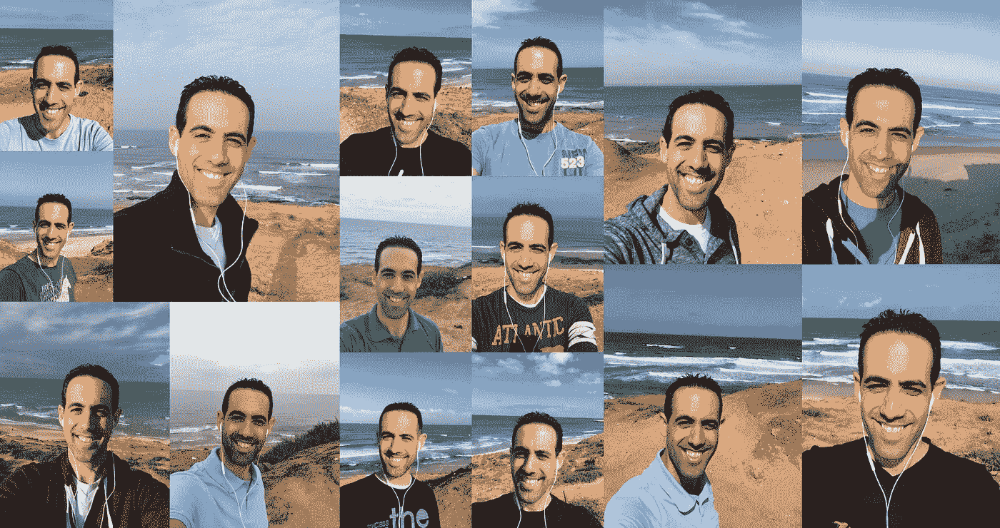

# 向后倾斜向前看

> 原文：<https://medium.com/hackernoon/lean-back-to-look-forward-589089e0ba75>

## 早上好，阳光！

*醒来。穿好衣服。准备* [*娃儿*](https://hackernoon.com/tagged/tools) *为* [*学校*](https://hackernoon.com/tagged/school) *。送孩子们去上学。
开车去办公室。遇到交通堵塞。工作。开车回家。(又)堵车了。到家。花些时间和家人在一起。让孩子们准备睡觉。让孩子们去睡觉。再次送孩子们去睡觉。洗个澡。花点时间陪陪我妻子。看电视/看书/玩游戏/锻炼/多工作一会儿。去睡觉吧。醒醒吧…*

嗯，我想你已经了解了…

这是我平常的一天，只是做了一些小调整(我很懒，所以我不怎么锻炼……)，而且或多或少对我来说效果不错。至少在我开始领导自己的团队之前是这样。

## 从*制造者*到“管理者”

领导者一生中最紧张的时刻之一是从*【决策者】到*【管理者】的过渡期。* 作为一个创客，你有自己的任务要操心，自己的任务，保质保量按时交付，仅此而已。现在，作为一名经理，你需要领导整个团队。作为该团队的领导者，你的主要职责之一就是花时间思考你的员工、产品和业务的未来，并围绕这些主题制定战略。*

*在这个过渡阶段，我不断尝试使用不同的方法和工具来管理噪音，跟上节奏，并确保我不会犯任何错误。这帮助我处理好了日常事务，但是我没有时间去考虑更大的事情。*

*“思考过程”通常在传统的工作时间对我不起作用，在办公室更是如此，在那里我是我亲爱的同事们不断打扰的目标。很快我就意识到，如果我不花时间去考虑大局，事情就会停滞不前，我就把我最大的责任之一丢了。*

*我需要安静的时间。*

## *沉默的捷径*

*幸运的是，我发现穿过海滩有一条去我办公室的捷径。我开始使用这条路线。几天后，我意识到这是我“安静时间”的绝佳地点，于是我决定开始一项实验。我会在沙滩上停下来，利用这段时间整理我的思绪，而不是开车穿过。*

*这正是我所做的。*

**

*There is nothing like the sea to clear your mind.*

*每天，我都会在海边开车，停下来的时间从 5 分钟到 30 分钟不等。
花的时间与我到达海滩的时间、那天困扰我的话题数量以及我想完成的任务直接相关。*

*我并不总是每天都做同样的事情，但我确实有三个基本习惯，它们帮助我以更好的起点开始新的一天:*

1.  *为了感受风和呼吸空气，我不顾温度走出了我的车。这自动清理了我的头脑，给了我一个伟大的开始我的一天。*
2.  *我通常在海上逗留期间听音乐，同时做我那天早上选择的任务。*
3.  *临行前，我拍了一张《T2》自拍照，寄给了我深爱的妻子，并附上了一句“T3:早上好”祝福。这是我们两天的开始。*

*在我逗留期间，我有许多我想完成的任务。
每一天都不一样，我在去那里的路上计划着我想完成的事情。*

*以下是我在此期间所做工作的一些例子:*

1.  ***计划我的一天-** 我为那天设定了目标，并决定了一天结束时我想完成的 3 件最重要的事情。*
2.  ***Read -** 我喜欢阅读，这是一个很好的机会来赶上我想读的不同的帖子和文章。*
3.  ***观看-** 比起阅读，我更喜欢看精彩的讲座。
    取决于那天的心情，我看了不同主题的不同讲座。(TED 应用程序有一些很棒的励志讲座)*
4.  ***展望未来-** 我花时间思考与我的职责和团队相关的全局。我总是总结我的想法。这些可能是我有过的最清晰的想法。*
5.  ***自我提升-** 我回想前几天或最近的情况，努力寻找自己可以改善的地方。*
6.  ***理清思路-** 什么都不做也很重要。我听了一些音乐。看着大海，我刚刚理清思绪，为忙碌的一天做好准备。*

## *向后倾斜向前看*

*实验的目的是看这种方法是否会改变我的工作习惯。
我想知道它是否能帮助我更好地控制日常生活，最重要的是，是否能帮助我改善“思维过程”。*

*是的。*

*我注意到我停下来哪怕是很短一段时间(最多 5 分钟)的日子与我直接开车去办公室的日子之间有很大的不同。
这种方法对我来说很管用，它帮助我组织我的思想和我的一天。*

*随着时间的推移，你会注意到你的自我管理技能的性质发生了变化。你将面临不同的挑战，需要不同的解决方案，但有一点是不会改变的，你将永远需要属于自己的时间，在这段时间里，你将远离日复一日，远离所有的噪音，远眺远方。*

*这就是我所说的你需要“向后仰，向前看”的意思。*

*对我来说，大海只是帮助我更好地管理我的“思考过程”的一个工具(也许是一个借口)。
你应该找到最适合你的工具。*

*现在，在我开始使用这个工具 1.5 年后，我不再觉得有任何义务在海里停下来(尽管这仍然是我最喜欢的方法)。
我的环境变了，我面临的挑战也变了，但有一点没有变——事实上，为了面对每天的挑战，向后仰是至关重要的。*

*对我来说，这个实验是成功的。
这让我明白了花时间理清思路、思考不同问题、用难题挑战自己的重要性，从而帮助我推动我的团队和我自己走向成功。*

*这才是****向后仰向前看*** *的真正重要性。你欠你的团队，更重要的是，你欠你自己。***