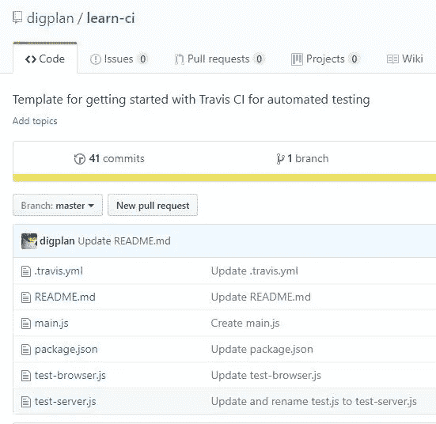
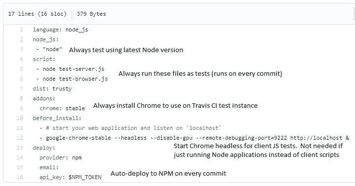
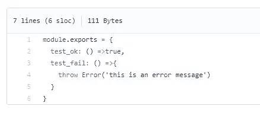
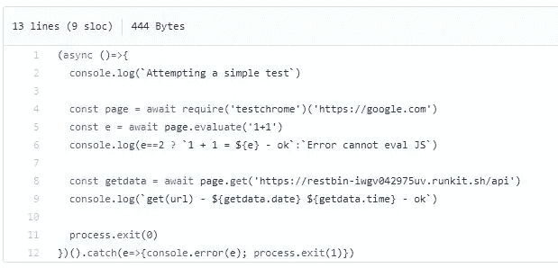
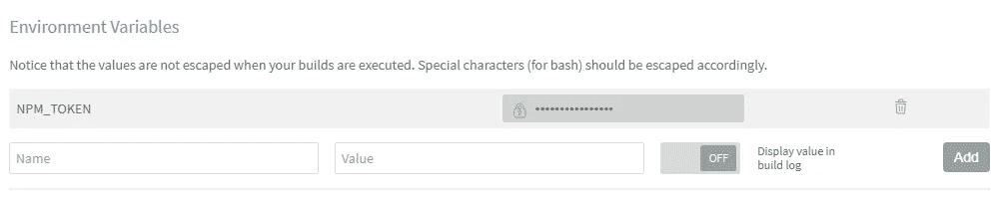
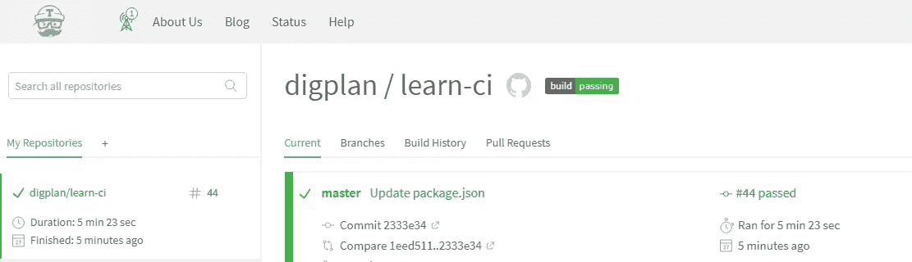
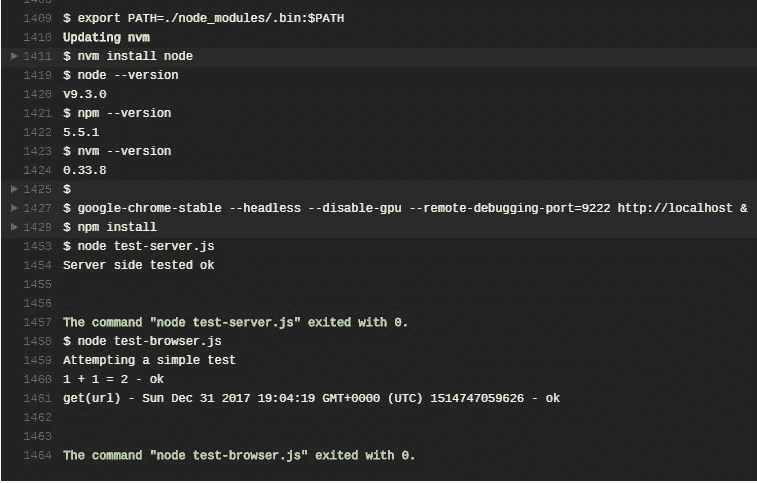
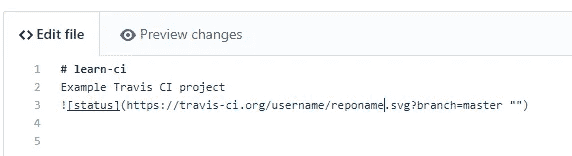
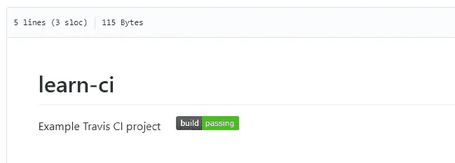

# 学习 CI:10 分钟内自动测试和发布

> 原文：<https://medium.com/hackernoon/learn-ci-automated-test-and-publish-in-10-min-3096717dc81e>


## 这里有一个模板，可以用来自动测试和发布 JS 客户机或服务器代码

外面有很多依赖。显然，这个世界需要更多的自动化测试。但是，我们需要快速启动并运行。

目标:
必须是免费的，因为在金钱
必须有微小的[学习](https://hackernoon.com/tagged/learning)曲线，几个神奇的单词学习！
必须是 UI 免费。使用 headless Chrome 测试客户端代码
使用 Travis CI 进行自动化测试，使用 github 中的“通过/失败”徽章
在每次提交时运行测试
轻松发布到 NPM，并使用易于记忆的 URL 在网页中包含脚本

*因此，每次提交 github repo 时*:

1.  Travis CI 将启动其测试实例
2.  安装最新的节点版本，和 Chrome 浏览器
3.  启动 Chrome 进行无头测试
    (仅客户端 JS 项目需要)
4.  运行两个示例测试脚本。一个用于测试服务器应用程序，一个用于浏览器 JS
    (根据您的应用程序是节点应用程序还是客户端脚本，可以删除其中一个)
5.  显示测试结果
6.  如果成功，发布到 NPM
7.  展示 NPM 和 [github](https://hackernoon.com/tagged/github) 项目的通过/失败徽章。

根据项目的需要，您可以根据需要对其进行添加/删除。

所有的文件都在这里:



对于将主持测试的 Travis CI，只需要一个 **.travis.yml** 文件。



如果项目是 Node app 而不是 client JS，就不需要 Chrome 部件。

它还将向国家预防机制发布。对于客户端脚本，我们可以使用一个简短的，易于记忆的 unpkg.com 链接

这里不需要学习复杂的测试框架。我们只需编写测试脚本，失败时抛出错误。

测试框架是*如下*，任何原生错误都构成失败的测试。

对于节点应用程序， **test-server.js**


**main.js** 是 app 中的主文件。正在测试什么。如果我们调用了 test_fail，测试就会失败，Travis 也会这么告诉我们。



用于客户端脚本的 **test-browser.js** 。既然我们真的想把事情自动化，就不能有 UI。没有人会在附近点击东西。所以，无头 chrome 是用来运行测试的。



testchrome ，只是 chrome 远程接口上的一个简单包装器，用于无头测试。

testchrome 恰好使用了简化的 API，就
。评估(浏览器中的 JS)
。get(来自 URL 的 JSON)

或者，您可以使用其他可用的无头 Chrome 测试模块，如 puppeteer。

在机器上进行本地设置可能会令人不愉快。Travis CI 真的在这里大放异彩！

前往 travisci.org(进行公开回购)，并按照说明设置您的回购。将您的 Travis CI 帐户连接到 github，并指定您的 repo 进行测试。

在 Travis(您的 NPM 令牌)上需要进行一项配置，让 Travis 在设置中发布应用程序:



然后只需提交回购，或使用控制台，开始测试。

在 Travis 控制台中监控您的测试:



并查看结果



最后一件事，徽章。在 repo 的 README.md 中:



它总是显示我们在 NPM 和 Github 通过/失败的徽章。



最后，我们需要一个容易记住的 URL(用于客户端脚本)。使用 unpkg.com，不需要额外的配置，因为它将从 NPM 拉最新的。

```
<script src=//unpkg.com/reponame ></script>
```

当然，对于服务器应用程序，简单地说

```
npm install reponame
```

这就是我们提供自动化测试和发布的框架。请评论任何想法或建议。示例回购发生在[https://github.com/digplan/learn-ci](https://github.com/digplan/learn-ci)

测试愉快！