# 从 Folly 源代码中学习 C++11 的新特性。

> 原文：<https://medium.com/hackernoon/learn-from-folly-source-code-the-new-c-11-features-121823fdd525>

五年前，脸书发布了他们名为[fully](https://github.com/facebook/folly)的 C++库，这是一个可重用的 C++库组件的大集合，在脸书内部被广泛使用。

但是很多成熟的 C++开源库都存在，为什么还要引入另一个呢？以下是他们网站的效用背后的动机:

> Folly(脸书开源库的缩写)是一个 C++11 组件库，设计时考虑了实用性和效率。它补充了 Boost 等产品，当然还有`std`。事实上，只有当我们需要的东西不可用，或者不满足所需的性能时，我们才开始定义我们自己的组件。

这里有一个[的例子，详细解释](https://github.com/facebook/folly/blob/master/folly/docs/FBVector.md)为什么 Folly 引入了另一个向量类 FBVector。正如愚蠢的开发者所声称的，这是一个 C++11 组件库，如果你看一下他们的源代码，这是完全可以确认的，C++11 的特性被广泛使用，而且几乎所有新的 C++11 特性都被使用。

当 c++0x 在几年前发布时，我认为它不会对 c++语言产生很大影响，但我错了，看看这段来自 Folly 的代码片段，它看起来像是用一种新语言开发的。

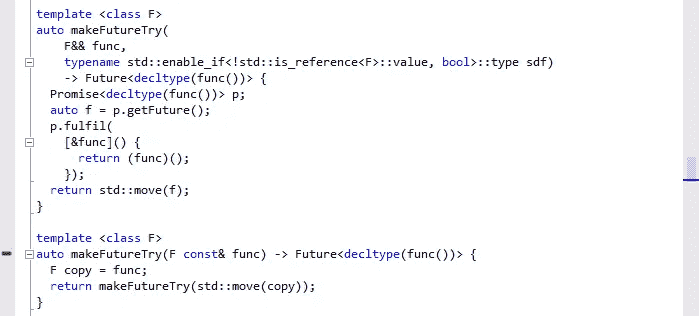

同样的评论涉及几乎所有的源代码，它的实现看起来不同于 c++03 源代码。

对于有兴趣掌握 C++11 新特性的开发人员来说，更好的方法是了解成熟的库是如何使用它们的。Folly 是探索新特性的一个非常好的候选对象。让我们从它的源代码中发现其中的一些。

**1-自动**

C++11 使用 auto 关键字引入了类型推断功能，这意味着编译器在声明时推断变量的类型。Folly 在几乎所有的变量声明中都使用了 auto，下面是一个来自其源代码的例子

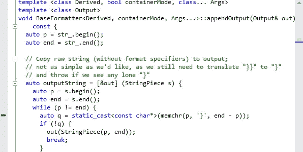

使用 auto 关键字允许花费更少的时间写出编译器已经知道的东西。

**2- nullptr**

常量 0 具有常量整数和空指针常量的双重作用。C++11 通过引入一个新的关键字作为可识别的空指针常量来纠正这个问题:nulptr

在完整的源代码中，所有的空指针都由新的关键字 nullptr 表示，没有使用常量 0 的地方。

**3-共享 _ptr**

智能指针不是一个新概念，许多库在许多年前就实现了它，流行的是 [boost::shared_ptr](http://www.boost.org/doc/libs/1_50_0/libs/smart_ptr/shared_ptr.htm) ，新的是它的标准化，不再需要使用外部库来处理智能指针。

Folly 广泛使用了标准化的共享指针，只有少数原始指针保留在它的源代码中。

**4-强类型枚举**

C++中的“传统”枚举在周围的作用域中导出它们的枚举器，这可能会导致名称冲突，如果同一个中的两个不同枚举具有相同名称的作用域定义枚举器，

C++11 引入了枚举类关键字。它们不再导出周围范围内的枚举数。此外，我们现在也可以从枚举继承。

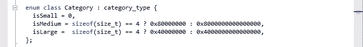

**5-静态断言**

C++11 引入了一种在编译时测试断言的新方法，使用了新的关键字 static_assert，这个特性对于向模板参数添加条件非常有用，如来自 Folly 源代码的这个模板类所示:

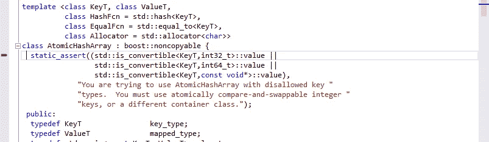

**6 变量模板**

可变模板是一个模板，它可以接受任意数量的任何类型的模板参数。类和函数都可以是可变的。full 定义了许多可变模板，下面是来自 full 源代码的两个可变模板函数:

**7-基于范围的 for 循环**

C++11 扩充了 for 语句，以支持迭代集合的“foreach”范式。它使代码更加简单和清晰。Folly 广泛使用了这个特性，下面是一个关于 Folly 的例子

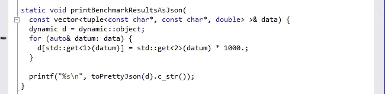

**8-初始化列表**

在 C++03 中，初始化列表只关注数组，在 C++11 中不再仅仅是数组了。接受 **{}** -list 的机制是一个接受**STD::initializer _ list<T>**类型参数的函数(通常是构造函数)。下面是一个函数接受 std::initializer_list 作为参数的例子

下面是它是如何被调用的

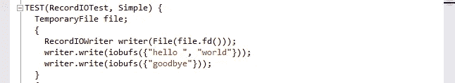

**9-无异常**

如果一个函数不能抛出异常，或者如果程序没有被编写来处理一个函数抛出的异常，那么这个函数可以被声明为 **noexcept。**

这是一个来自愚蠢源代码的例子

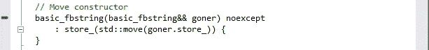

**10-移动**

C++11 引入了右值引用的概念(用&&)来区分对左值或右值的引用。左值是有名称的对象，而右值是没有名称的对象(临时对象)。移动语义允许修改右值。

为此，C++11 引入了两个新的特殊成员函数:*移动构造函数*和*移动赋值运算符*。

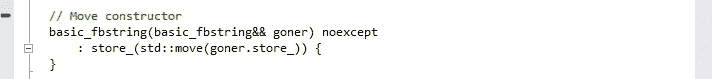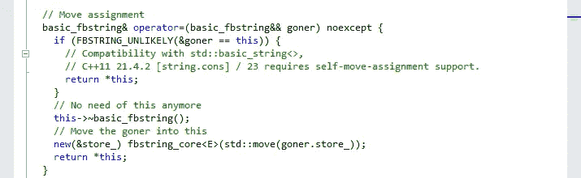

这里有一个[好文档](http://www.stroustrup.com/move.pdf)，它更好地解释了移动语义的好处。

**11-λ**

C++11 提供了创建匿名函数的能力，称为 lambda 函数，你可以参考[这里的](http://www.stroustrup.com/C++11FAQ.html#lambda)了解更多关于这个新特性的细节。

Folly 在许多函数中使用它，下面是一个来自其源代码的例子:

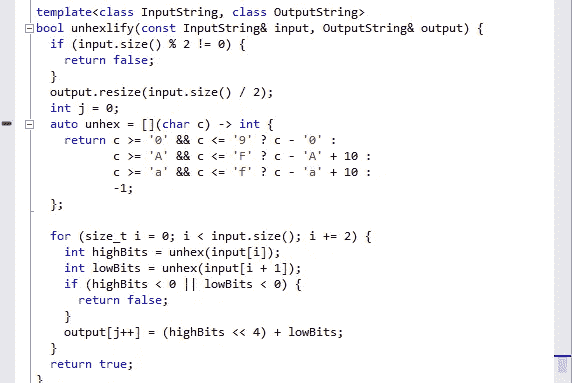

**12-明确默认并删除特殊成员函数**

在 C++03 中，编译器为自己没有提供的类提供了默认构造函数、复制构造函数、复制赋值运算符(`operator=`)和析构函数。程序员可以通过定义自定义版本来覆盖这些默认值。

但是，对这些默认值的创建几乎没有控制。例如，要使一个类本质上不可复制，需要声明一个私有的复制构造函数和复制赋值操作符，并且不定义它们。

在 C++11 中，某些特性可以被显式禁用。例如，下面的类型是不可复制的，这使得代码更加简单和干净。

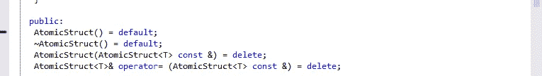

**13-覆盖标识符**

在 C++03 中，当一个人打算重写一个基类函数时，可能会意外地创建一个新的虚函数。

`override`特殊标识符意味着编译器将检查基类，看看是否有一个虚函数具有这个确切的签名。如果没有，编译器会指出一个错误。

Folly 广泛使用了这个新特性:

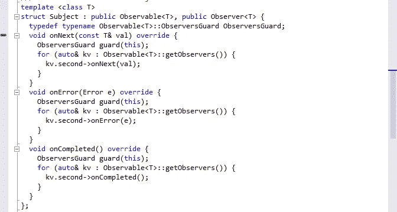

**14- std::thread**

提供了一个线程类(`std::thread`)，它接受一个函数对象——以及传递给它的一系列可选参数——在新线程中运行。

在 C++11 中，使用线程变得更加简单，下面是定义新线程的新标准方法:

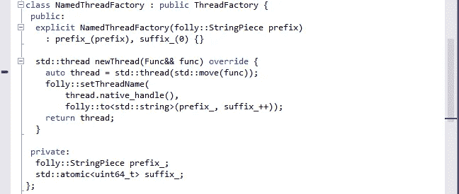

**15-未订购的集装箱**

无序容器是一种哈希表。C++11 提供了四个标准的:

*   无序地图
*   无序集合
*   无序 _ 多重映射
*   无序 _ 多重集

愚蠢在许多地方使用这些新的容器

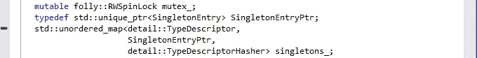

**结论**

Folly 使用了几乎所有 C++11 的新特性，探索它的源代码会让你更好地了解 C++的新功能，以及它们是如何实现的。

我鼓励任何对 C++11 感兴趣的 C++开发人员下载 Folly 源代码，发现这种新语言的强大之处。