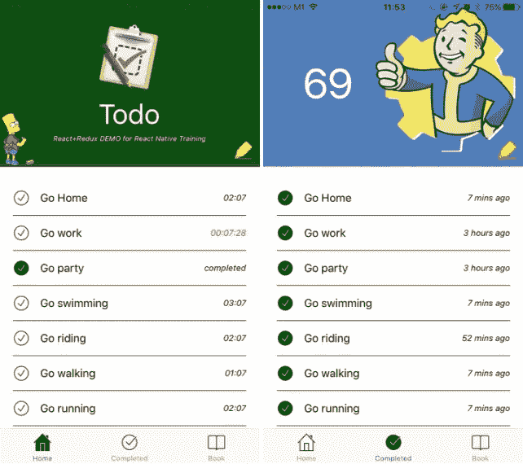

# 以正确的方式学习反应

> 原文：<https://medium.com/hackernoon/learn-react-native-in-the-right-way-7b7601dc750b>

 [## 分解/反应-原生-训练

### 我用这本书来培训我的团队，帮助他们知道如何以正确的方式构建 React-native 应用程序。请检查一下…

github.com](https://github.com/unbug/react-native-train/blob/master/README.md) 

# 目录

*   [1 先看看](https://github.com/unbug/react-native-train/blob/master/README.md#1-first-look)
*   [1.1 在 5 分钟内构建一个应用](https://github.com/unbug/react-native-train/blob/master/README.md#11-building-an-app-in-5-minutes)
*   [1.2 工作原理](https://github.com/unbug/react-native-train/blob/master/README.md#12-how-it-works)
*   [1.3 调试工具](https://github.com/unbug/react-native-train/blob/master/README.md#13-debug-tools)
*   [1.4 文档&API](https://github.com/unbug/react-native-train/blob/master/README.md#14-docs--apis)
*   [1.5 资源](https://github.com/unbug/react-native-train/blob/master/README.md#15-resources)
*   [2 个组件](https://github.com/unbug/react-native-train/blob/master/README.md#2-components)
*   [2.1 渲染& JSX](https://github.com/unbug/react-native-train/blob/master/README.md#21-render--jsx)
*   [2.2 视图、文本、图像等](https://github.com/unbug/react-native-train/blob/master/README.md#22-view-text-image-etc)
*   [2.3 生命周期](https://github.com/unbug/react-native-train/blob/master/README.md#23-lifecyle)
*   [2.4 道具&状态](https://github.com/unbug/react-native-train/blob/master/README.md#24-props--states)
*   [2.5 事件](https://github.com/unbug/react-native-train/blob/master/README.md#25-events)
*   [2.6 资源](https://github.com/unbug/react-native-train/blob/master/README.md#26-resources)
*   [3 种风格](https://github.com/unbug/react-native-train/blob/master/README.md#3-styles)
*   [3.1 柔性盒](https://github.com/unbug/react-native-train/blob/master/README.md#31-flexbox)
*   [3.2 绝对&相对](https://github.com/unbug/react-native-train/blob/master/README.md#32-absolute--relative)
*   [3.3 尺寸&尺寸&在线布局](https://github.com/unbug/react-native-train/blob/master/README.md#33-size--dimensions--onlayout)
*   [3.4 传承](https://github.com/unbug/react-native-train/blob/master/README.md#34-inheritance)
*   [3.5 资源](https://github.com/unbug/react-native-train/blob/master/README.md#35-resources)
*   [4 架构](https://github.com/unbug/react-native-train/blob/master/README.md#4-architecture)
*   [4.1 冗余](https://github.com/unbug/react-native-train/blob/master/README.md#41-redux)
*   [4.2 反应还原](https://github.com/unbug/react-native-train/blob/master/README.md#42-react-redux)
*   [4.3 容器&组件](https://github.com/unbug/react-native-train/blob/master/README.md#43-containers--components)
*   [4.4 Todo React 原生 App](https://github.com/unbug/react-native-train/blob/master/README.md#44-todo-react-native-app)
*   [4.5 命名约定](https://github.com/unbug/react-native-train/blob/master/README.md#45-naming-convention)
*   [4.6 资源](https://github.com/unbug/react-native-train/blob/master/README.md#46-resources)
*   [5 数据](https://github.com/unbug/react-native-train/blob/master/README.md#5-data)
*   [5.1 获取](https://github.com/unbug/react-native-train/blob/master/README.md#51-fetch)
*   [5.2 持久](https://github.com/unbug/react-native-train/blob/master/README.md#52-persistent)
*   [5.3 资源](https://github.com/unbug/react-native-train/blob/master/README.md#53-resources)
*   [6 路由器](https://github.com/unbug/react-native-train/blob/master/README.md#6-router)
*   [6.1 导航器](https://github.com/unbug/react-native-train/blob/master/README.md#61-navigator)
*   [6.2 资源](https://github.com/unbug/react-native-train/blob/master/README.md#62-resources)
*   [7 个原生模块(草案)](https://github.com/unbug/react-native-train/blob/master/README.md#7-native-modules)
*   7.1 iOS
*   7.1.1 JS 呼叫 OC
*   7.1.2 OC 呼叫 JS
*   本地视图组件
*   7.2 安卓系统
*   7.2.1 JS 调用 Java
*   7.2.2 Java 调用 JS
*   本地视图组件
*   7.3 资源
*   [8 整合(草案)](https://github.com/unbug/react-native-train/blob/master/README.md#8-integration)
*   [8.1 iOS](https://github.com/unbug/react-native-train/blob/master/README.md#81-ios)
*   [8.1.1 包装](https://github.com/unbug/react-native-train/blob/master/README.md#811-package)
*   图像
*   [8.2 安卓](https://github.com/unbug/react-native-train/blob/master/README.md#82-android)
*   [8.2.1 包](https://github.com/unbug/react-native-train/blob/master/README.md#821-package)
*   图像
*   [8.3 发布前](https://github.com/unbug/react-native-train/blob/master/README.md#83-before-publishing)
*   [8.4 资源](https://github.com/unbug/react-native-train/blob/master/README.md#83-resources)
*   [9 热更新(草稿)](https://github.com/unbug/react-native-train/blob/master/README.md#9-hot-update-draf)
*   9.1 iOS
*   9.2 安卓系统
*   9.3 资源
*   [10 性能(草案)](https://github.com/unbug/react-native-train/blob/master/README.md#10-performance)
*   [10.1 shouldcomponentwupdate](https://github.com/unbug/react-native-train/blob/master/README.md#101-shouldcomponentupdate)
*   [10.2 资源](https://github.com/unbug/react-native-train/blob/master/README.md#102-resources)
*   资源

> [黑客中午](http://bit.ly/Hackernoon)是黑客如何开始他们的下午。我们是这个家庭的一员。我们现在[接受投稿](http://bit.ly/hackernoonsubmission)并乐意[讨论广告&赞助](mailto:partners@amipublications.com)机会。
> 
> 如果你喜欢这个故事，我们推荐你阅读我们的[最新科技故事](http://bit.ly/hackernoonlatestt)和[趋势科技故事](https://hackernoon.com/trending)。直到下一次，不要把世界的现实想当然！

