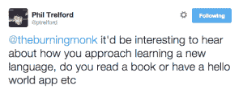
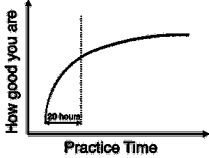
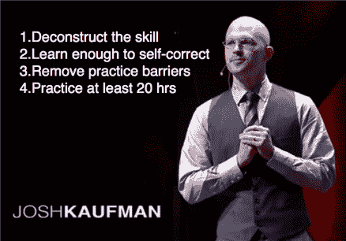
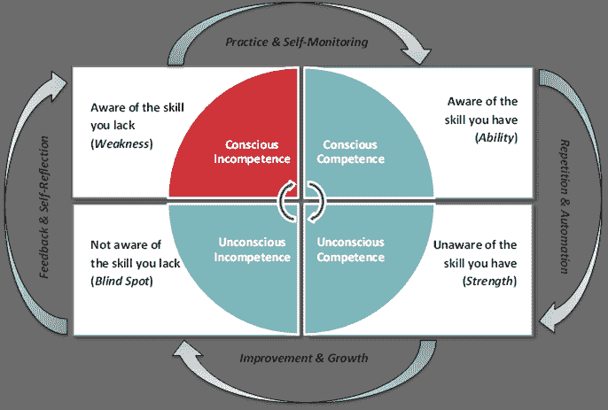
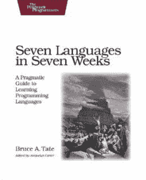
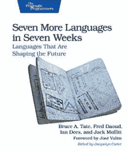

# 学会学习

> 原文：<https://medium.com/hackernoon/learn-to-learn-286558241fd6>

作为一个负责任的演讲者，我已经提前几个月就开始准备我的演讲了——语言景观之旅(T1)——为(T2)NDC·奥斯路(T3)准备的！当我第一次想到这个演讲的想法时，我在推特上问其他人是否认为这是个好主意。菲尔提出了一个很好的观点，那就是包括一些关于我如何学习一门新语言的信息。

不久前，我偶然看到了由 *Josh Kaufman* 做的这个 TEDx 演讲，发现它对我制定适合自己的学习策略很有帮助。

# 一万小时规则的真相

在演讲中，乔希揭穿了经常被错误引用的 10，000 小时规则。当这项研究首次发表时，发现需要 **10，000 小时的刻意练习才能达到竞争激烈的领域的顶峰**。但通过中国人的集体窃窃私语，这一信息被扭曲成“要擅长某件事，需要 1 万个小时的刻意练习”。

相反，乔希发现，研究表明，只要你让 20 个小时变得有价值，你就能相当好地做某件事。

这很重要，因为对于我们这些忙碌的程序员来说——顺便说一句，他们有长时间工作的倾向——考虑到我们行业发展的速度，学习新技能的时间是有限的，也是必要的。

# 学习的 4 个步骤

Josh 提出了学习任何东西的四个步骤。

## 解构技能

大多数我们认为是技能的东西实际上是一堆技能。我们越是能够将它们分解成更小的技能，我们就越能更好地决定它们中的哪一个能真正帮助我们从学习中获得我们想要的东西。然后，我们可以优先考虑对我们最有用的技能，并在尽可能短的时间内提高我们的能力。

为了学习编程语言，您可以将大多数语言分解成更小的块:

*   变量赋值
*   常见数据类型
*   控制流(if-else、循环、递归等。)
*   使用集合类型
*   使用字符串
*   错误处理
*   并发
*   …

大多数入门书籍和教程已经遵循了这种结构。

## 学会自我纠正

你应该首先专注于达到这样一个点，在你学习的时候，你可以自我修正和自我编辑。对于学习编程语言，我把这一点解释为:

*   知道如何编译和运行你的代码
*   能够把简单的程序放在一起，并调整它，开始得到一个“感觉”

同样，大多数入门书籍和教程已经遵循了这种模式，并且让你很早就构建了一个 *Hello World* 示例。

## 消除实践障碍

排除干扰——电视、网络、推特等等。—这样你就可以专注于学习。当分心的事物在我们周围，而且唾手可得时，这可能很难做到！

我曾经听说过一个关于约翰·卡马克的故事，在一个新项目开始之前，他会带着一堆好书住进酒店，与外界隔绝几天，这样他就可以在开始任何项目工作之前吸收想法和灵感。

我并不是说你应该做同样的事情，显然不同的方法适用于不同的人。就我个人而言，我在晚上 10 点到凌晨 2 点之间最有效率，因为我的妻子很早就上床睡觉了，而我正好可以放松一下。

我不是一个重度 *Twitter* 用户，也不是任何其他社交网络的用户，所以它们对我来说不是问题。

另一方面，漫画式的电视节目是我的毒药——*闪电侠*、*哥谭*、*箭头*、*神盾局特工*等等。为了减少这些带来的干扰，我会在一个晚上狂看它们，这样我就可以在那个星期剩下的晚上做更有建设性的事情。

## 至少练习 20 个小时

乔希提出了一个很好的观点，对于你学习的大多数东西来说，都有一个挫折障碍——当我们变得有意识地无能时，就会意识到我们知道的是多么少，我们需要学习的是多么多。

这不是一种很好的感觉，因为没有人喜欢感觉愚蠢，这通常是我们失去动力和破坏我们来之不易的进步的时候。

这就是为什么我们提前承诺至少 20 小时的时间是很重要的，这样当我们遇到挫折时，我们就有很好的理由继续前进，因为我们已经预算了 20 小时。

# 设定你的目标

在你开始投入至少 20 个小时学习一门新语言之前，如果你能决定你想从这个过程中得到什么会有所帮助。根据您的情况和需求，这可能会有很大不同，例如

*   你是否想换一种不同的语言，并努力让自己变得更有竞争力？
*   你是否在试图理解围绕一门新语言的炒作，看看它到底是怎么回事？
*   …

就我个人而言，我的大部分学习旨在扩展我的视野，让我看到我在日常工作中所掌握的堆栈的可能性和选项之外的东西。

其他时候，我可能会有具体的目标，想用这种新语言做些什么，例如:

*   我学习 Dart 是为了满足我的网络开发需求，作为 JavaScript 的替代品
*   我学习 Elm 是为了更好地熟悉功能反应式编程(FRP ),目的是让[能够使用 FRP 制作游戏](http://theburningmonk.com/fun-games/)

# 优先学习新范式

我看到许多人犯的一个错误是[选择学习一种新的语言而不是一种新的范式](/@theburningmonk/dont-learn-a-syntax-learn-to-change-the-way-you-think-18436807012d)。例如，从 C#跳到 Java 是一件相对容易的事情，但是最终你学会了一种新的语法，而没有必要自学一种解决问题的新方法。

另一方面，学习新的范例从根本上改变你看待编程的方式，让你看到解决问题的新方法。从个人经验来看，每次我冒险进入一个新的范式——[函数式编程](http://theburningmonk.com/tags/functional-programming/)、[面向方面编程](http://theburningmonk.com/tags/aspect-oriented-programming/)、[函数式反应式编程](http://bit.ly/1HPM3ul)等等。—让我以新的眼光看待编程。

如果你对探索一些人迹罕至的道路感兴趣，看看约翰·克罗伊桑推荐的三个范例。

布鲁斯·泰特的这两本书也是探索性学习的重要资源:

最后，我给你们留下一句著名的话，这句话出自艾伦·珀利斯之口。

> 一种不影响你思考编程方式的语言是不值得了解的。
> 
> *–艾伦·珀利斯*

快乐学习！

# 链接

*   [不要学语法，要学会改变你的思维方式](/@theburningmonk/dont-learn-a-syntax-learn-to-change-the-way-you-think-18436807012d)
*   [TEDx —前 20 个小时—如何学习|乔希·考夫曼](https://www.youtube.com/watch?v=5MgBikgcWnY)
*   《奇遇记》中的三个令人兴奋的范例
*   [Evan Czaplicki 在《奇异世界》第 14 集讲述不同种类的玻璃钢](http://bit.ly/1HPM3ul)
*   [4 个能力阶段](http://en.wikipedia.org/wiki/Four_stages_of_competence)

> [黑客中午](http://bit.ly/Hackernoon)是黑客们开始他们下午活动的方式。我们是 [@AMI](http://bit.ly/atAMIatAMI) 家庭的一员。我们现在[接受提交](http://bit.ly/hackernoonsubmission)并很高兴[讨论广告&赞助](mailto:partners@amipublications.com)机会。
> 
> 如果您喜欢这个故事，我们建议您阅读我们的[最新科技故事](http://bit.ly/hackernoonlatestt)和[趋势科技故事](https://hackernoon.com/trending)。直到下一次，不要把世界的现实视为理所当然！

