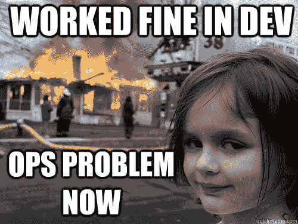

# 习得性无助和老年退休金计划死亡螺旋

> 原文：<https://medium.com/hackernoon/learned-helplessness-and-the-ops-death-spiral-b0fff7d916b1>

你在行动组吗？你和行动小组打交道吗？这听起来熟悉吗？

## 周期

*   业务增长。重点是增长驱动力:新产品、新功能和有光泽的物体。维护日益增加的复杂性的成本通常被低估。运营部丢了一些球…
*   鉴于上述失误，企业要求运营部“更快地做出响应”。这种响应能力是通过承担更多的工作(高利用率)和承担不同的工作流(多任务/上下文切换)来实现的。有取悦他人的意愿。但是裂缝形成了，更多的球掉了下来…
*   问题确定了！是管理问题！项目管理被引入作为人力负载平衡器。在定期的计划活动中，能力实质上是拍卖给组织的其余部分。关注点仍然是“新的”，维护现有基础设施/服务的成本继续增长(而且被低估了……)
*   这种渴望(以及新发现的责任和跟踪能力)在短期内是有回报的。然而，事情开始在幕后发生。交付周期增加(但更“可预测”)。质量慢慢下滑。工作感觉更受控制，更有条理，但整体能力不断下降。熵增加。英勇的努力得到了回报…
*   运营一线团队成员感受到了压力。他们感觉到质量下滑。他们现在已经被视为跛脚鸭有一段时间了——次要的开发人员/消防员——但是取悦的意愿仍然很强烈(几乎是感觉被边缘化的反应)。影子工作成为规范，这意味着维护工作是不可见的，因为暴露它会破坏控制的外表。复杂性进一步增加，增加了维护的复杂性和新项目的吸引力。
*   从外部来看，Ops 被认为是被动的，而不是战略性的。一种不可避免的斗争感油然而生——无论是内部运营，还是团队的“客户”。士气低落使得人们很容易将问题归结为缺乏参与、管理不善和纪律松懈(“为什么他们不能做出正确的评估”)。习得性无助开始出现。企业永远不会理解老年退休金计划，这是吃力不讨好的工作，他们所能做的就是让这艘即将沉没的船继续航行。
*   由于缺乏运营响应能力，功能开发团队不断“绕过”运营…使用新的绿地技术和托管服务，并规避控制。这就形成了一个技术大杂烩，使运营更加复杂，但也产生了暂时的推动力。当然，新的提供商“如此强大”并且“如此易于实施”，这对于运营部(他们一直承担着消除遗留决策的艰巨工作)来说是糟糕的公关。
*   而且生意越做越大…
*   没完没了。直到事情真的爆发，这时顾问们被请来，每个人都在饮水机旁说“我早告诉过你了”。那些说“我告诉过你”时间最长的队员最先离开。他们都是对的，但在正确方面却无能为力(这是一个很难做到的地方)。经理们能够将一些“我们已经警告过你了”融入到新结构的角色中。直到( [a la Larman 定律](http://www.craiglarman.com/wiki/index.php?title=Larman%27s_Laws_of_Organizational_Behavior))之前，“变革倡议将被简化为重新定义或重载新术语，以表示与现状基本相同”
*   业务也在增长…
*   重复，在不断增加的规模…

## 那么你对此能做些什么呢？

*   打破了运营对企业基本经济状况的影响记录。将运营与收入联系起来(并加速发现新的收入来源)。反对依赖代理指标，如项目完成情况
*   摆脱 DevOps 的宣传，理解[有许多可行(和不可行)的拓扑](http://web.devopstopologies.com/)。你不需要用一种模式来经营你的整个公司。关注为什么，重复，再重复
*   坚决增加员工数量，以适应增加的复杂性。建立资源配置模型，正确考虑管理复杂性增加的开销
*   想象矩阵化你的团队成员的真实成本。这通常包括让*所有*的工作可见，当团队吸收了大量不可见的工作时，这尤其困难。用数据证明矩阵的影响。在这里，交付时间和返工是非常重要的
*   说不！以客户为中心可能是你的致命弱点。你有责任提出那些本质上难以用现有资源支持的努力
*   多谈谈能力(相对于 IT“项目”)。你的工作是专注于成功所需的能力，而不是通过管道传递项目。鼓励您的团队以最小的复杂性构建功能
*   雇佣你的团队信任的技术产品经理(而不是项目经理)。一旦你将你的基础设施/工具视为一种产品，你将开始采取更长远的战略眼光
*   限制正在进行的工作和利用率。你的团队想要“大干一场”，但你必须放慢速度来加快速度。当然，如果你能够“致力于”并行项目，你会感觉反应更快，但是从长远来看，关注流程和能力会更好

暂时就这样了。感谢评论…

> [黑客中午](http://bit.ly/Hackernoon)是黑客如何开始他们的下午。我们是 [@AMI](http://bit.ly/atAMIatAMI) 家庭的一员。我们现在[接受投稿](http://bit.ly/hackernoonsubmission)，并乐意[讨论广告&赞助](mailto:partners@amipublications.com)机会。
> 
> 如果你喜欢这个故事，我们推荐你阅读我们的[最新科技故事](http://bit.ly/hackernoonlatestt)和[趋势科技故事](https://hackernoon.com/trending)。直到下一次，不要把世界的现实想当然！

