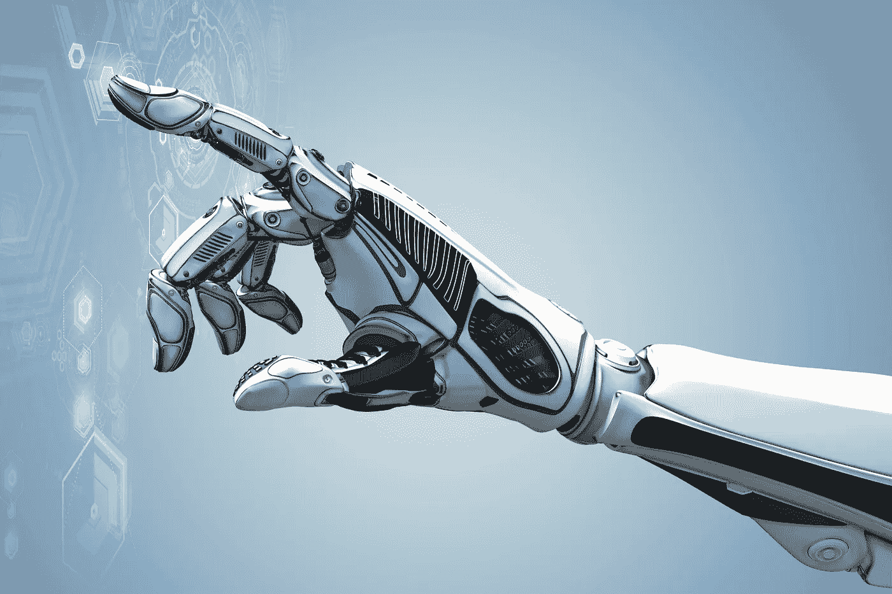
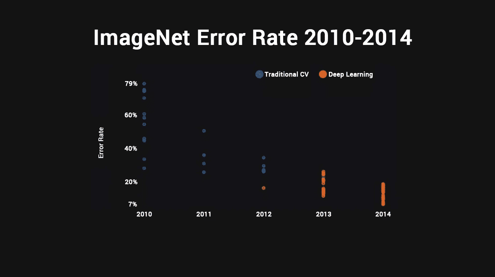
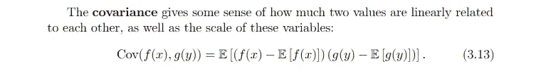
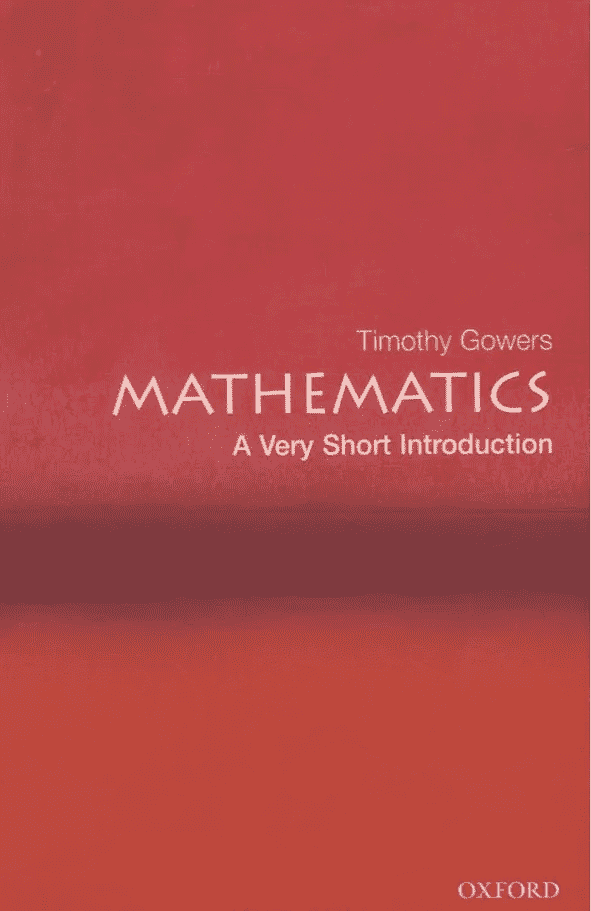
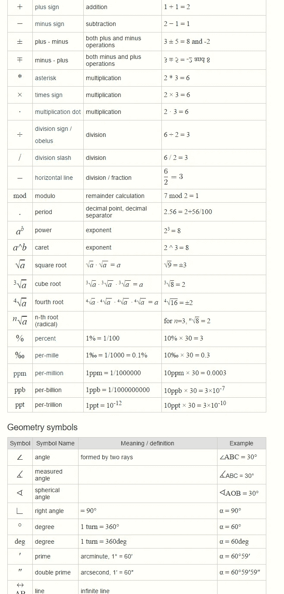
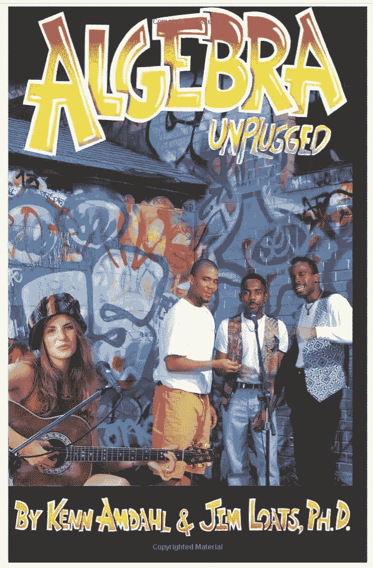
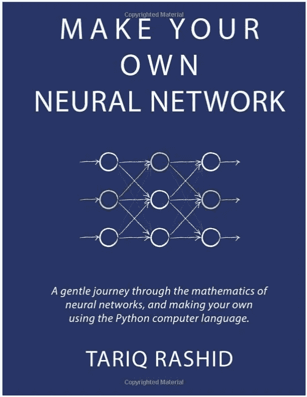

# 如果你数学很差，就去学人工智能

> 原文：<https://medium.com/hackernoon/learning-ai-if-you-suck-at-math-8bdfb4b79037>

如果你和我一样，对 AI 很着迷。

也许你想更深入地挖掘，让一个图像识别程序在 [TensorFlow](https://www.tensorflow.org/) 或[the no](http://deeplearning.net/software/theano/)中运行？也许你是一个出色的开发人员或系统架构师，你对计算机非常了解，但是有一个小问题:

你数学很烂。

没关系！我分享你的肮脏的小秘密，我有一些书和网站，将真正帮助你快速滚动。

像许多人一样，我对智能机器的热爱并不是来自微积分课。它起源于科幻小说。我记得在一个美丽的夏日夜晚阅读[《我，机器人》](http://amzn.to/2iVIATZ)，想象着如何去理解阿西莫夫的[机器人三大法则](https://en.wikipedia.org/wiki/Three_Laws_of_Robotics)。当我看着像《2001:太空漫游》和《蛋壳里的幽灵》这样的杰作时，似乎有一天格式塔意识会从闪闪发光的信息海洋中涌现出来，并宣称自己是有知觉的。当我长大并开始出版我自己的科幻小说时，我想象人工智能是一种无处不在的周围力量，就像电一样，触及生活的方方面面。

事实证明，在通用人工智能从原始数字粘状物中脱颖而出之前，我们有几件事情要弄清楚。在 80 年代和 90 年代，早期的人工智能承诺几乎没有任何结果。宣传从来没有成为现实，人工智能的冬天接踵而至。

过去几年，随着深度学习的突然成功，这一切都改变了。

也许你在《纽约时报》上看到过这样一个故事，它展示了谷歌如何几乎在一夜之间转变了其翻译服务(T2)，提供了可与专业翻译媲美的准确性。仅仅在九个月的时间里，他们就超过了这个平台在之前七年*的总和*。

也许你读过关于[一个孩子用开源工具在他怪异的车库](https://www.bloomberg.com/features/2015-george-hotz-self-driving-car/)里建造了一辆无人驾驶汽车的故事？你可能也看到了下面这张令人惊叹的幻灯片，它显示了 DL 如何在短短几年内通过 [Imagenet 图像识别比赛](http://image-net.org/challenges/LSVRC/2016/)，将错误率从 25%降至 2017 年比人类表现更好。

无论你如何切入，人工智能解决了困扰我们几十年的大而棘手的问题。我们知道如何驾驶汽车，但我们不能告诉机器如何操作。但是我们可以让机器自己解决这个问题。这一次，来自硅谷的技术不仅仅是炒作。是真的。人工智能炙手可热是有原因的。

顶级人工智能研究人员的收入比 NFL 首发四分卫的收入还要高，你想加入淘金热。再说一次，你可能看到过[人工智能将吃掉所有工作岗位的可怕故事](https://artplusmarketing.com/how-we-can-deliver-a-universal-basic-income-right-now-and-save-ourselves-from-the-robots-without-e1972e22e8eb#.8t3dzjhjb)，作为一名传统的软件工程师或系统管理员，你希望确保自己拥有在以人工智能为中心的世界中竞争的技能。没问题。外面有大量的教程。你只需要开始，对吗？

然后你看到伊恩·古德费勒的开创性深度学习书籍中的一段话，你根本不知道他在说什么。

啊哦。

问题是你必须理解一层嵌套的逻辑、术语、符号和思想，它们都是相互关联的，但你没有任何基础。所以基本上听起来像是外星语言。你可能理解了所有的文字，但剩下的只是胡言乱语。它会很快变得令人沮丧。

但是不要害怕！并非一切都没了。

我是来帮你涉水过沼泽的，带些书，让你像专家一样计算数字。好吧，也许你不会成为[丹尼尔·谭米特](http://amzn.to/2j94MZT)，但是你可以抛开那些记忆时间表的痛苦记忆，开始行动。成年后可以学数学。

我试着阅读了一些人工智能的文本和教程。我凭直觉理解这些概念。它们对我来说非常有意义。只是当我看到一串符号时，我的大脑会昏过去，我不知道我在读什么。作为一名系统架构师，我不需要太多的数学知识。有 IP 子网备忘单，只要我知道电可以沿着电缆的长度合理地传输多远，我就可以切割它们并适当地卷曲它们。在我人生的大部分时间里，我需要了解系统是如何设置的，它们是如何协同工作的，以及它们是如何保持运行的。系统管理是非常布尔的。要么成功，要么失败。但是人工智能和数学在大脑的另一边工作。

我需要的是一些为成年人写的初级读本，像对待成年人一样对待你。我还想要回答关于*为什么*数学行得通的问题的书。在学校，你学习的理由可能是“闭嘴，照做，否则后果自负。”但是作为一个成年人，你需要更多。你也想知道事情是如何运作的。

**你需要的第一本书是蒂莫西·高尔斯写的** [**数学:简短介绍**](http://amzn.to/2iJud5g) **。**

这本书漂亮地分解了数学的“为什么”。它将主题与现实世界联系起来，进入哲学，然后很快将哲学抛在脑后，因为你并不真的需要理解分数是否真的存在于自然界或柏拉图层面。相反，蒂莫西帮助我理解了数学是一个抽象层。它将问题分解成更简单、更清晰的步骤。建立一个精确模拟盒子中粒子相互作用的模型的复杂性需要考虑大量真实世界的物理属性，如磁干扰、重力、碰撞力、粒子的初始方向和速度等等。原来生活是一系列复杂的算法。但这里有个窍门。实际上，你不需要一个完美的模型。相反，数学试图将问题分解成基本的组成部分。关键因素是什么？数学给你一个问题的一般抽象，它也可以和其他问题集一起工作。本质上，数字本身并不那么重要。它们只是变量。数学归结为变量和规则。你可以学习那些变量和规则！

当你在阅读这本书的时候，你会想拥有这个网站上关于主要数学符号的便捷指南。你也可以拿起[这本超级简明的工程师指南，叫做**数学符号** **，作者是爱德华·r·沙伊纳曼**](http://amzn.to/2lFeWTI) 。如果你像我一样，你将不得不在这些符号粘上之前看到它们几百次。你可能会发现自己在翻页时忘记了各种符号！别担心。这张小抄太完美了。深呼吸，放慢速度，一个接一个地看符号，直到你开始理解那串看起来疯狂的符号。即使你必须一千次地查找每个符号，也要这么做！生活中学习没有捷径。你只需要做好工作。

现在有另外两个强有力的竞争者来为你的数学打下基础。**第一本是莫里斯·克莱恩的** [**非数学工作者的数学**](http://amzn.to/2iNt8fa) **。第二本是伊凡·萨沃夫的** [**【无废话数学物理指南】**](http://amzn.to/2iNsb6S) **。**每一种都迎合不同的心态。我更喜欢非常简短的介绍，因为它很快就切入正题，并且仍然能够保持很强的关联性。“非数学工作者的数学”这本书要长得多，并且更详细地讲述了数学史及其在世界上的运作方式。有些人会非常喜欢这种方法。《没有废话指南》很快就进入了方程式，没有解释任何事情为什么会这样。基本上是规则的入门。这将吸引那些对哲学不太感兴趣的人。

你想要的下一本书是吉姆·洛茨和肯·阿姆达尔的《代数不插电》。现在这本书里有几个错别字，但我并不觉得它们会让人分心。我很欣赏这本书对快速加速的温和学习的方法。有些人因为打字错误而焦虑不安，但是你有更大的挑战要担心。当你的大脑不再像年轻时那样灵活时，你还在努力学习数学！所以让错别字去，看看这里的大图。这本书将真正帮助你朝着正确的方向前进。

**在你算好之后，你会想要深入研究塔里克·拉希德的** [**制作你自己的神经网络**](http://amzn.to/2iNsTBa) **。它也有一些错别字，但是有一个很棒的 Github repo 更新修复了大部分错别字。这本书是令人难以置信的温柔和直观。你一有异议和恐惧，它似乎就能预料到！作者不可思议地发现了你的抵触情绪。这本书只介绍了神经网络所需的数学知识。然后它通过 Python 工作，假设你对编程一无所知。最后，它让你从头开始编写自己的神经网络。现在，虽然肯定有工具可以更好地用于专业程序，但首先尝试一下自己的工具会有所帮助，这样您就可以了解基本知识。**

看完这本书后，你会想开始浏览网页。每天都有很棒的新教程问世。**也许检查出** [**Tensorflow 为诗人**](https://petewarden.com/2016/02/28/tensorflow-for-poets/) **或** [**为艺术家**](http://blog.otoro.net/2017/01/01/recurrent-neural-network-artist/) **的递归神经网络。**

Medium 本身对于学习 AI 是很牛逼的。例如，看看这篇关于各种课程的综述文章，你可以通过 **比你自己更深入地学习。话说回来，也许你不是上课的类型，更喜欢自己解决问题？没问题。**取而代之，看看来自 AI 研究员 Arthur Juliani** **的这八部系列。还有一个叫做** [**的机器学习很有趣**](/@ageitgey/machine-learning-is-fun-80ea3ec3c471#.of0v64p5b) **，另一个很棒的系列就在你最喜欢的网站上。****

最后，你可能想继续看一本更高级的书，相信自己有能力理解更具挑战性的概念。那本书就是我前面已经提到的那本， [**伊恩·古德菲勒的深度学习书**](http://www.deeplearningbook.org/) **，你可以在网上看或者** [**在亚马逊上给自己抓个硬拷贝**](http://amzn.to/2iJFPVZ) **。**

目前就这些。欢迎在评论中添加你自己的书。每个人学到的东西都有所不同，肯定会有其他值得分享的书。

############################################

**一定要看看这个正在进行的系列的其余部分。请随时关注我，因为您想成为第一个在最新文章发布后第一时间阅读它们的人。**

[**学习人工智能如果你数学很差——第一部分**](https://hackernoon.com/learning-ai-if-you-suck-at-math-8bdfb4b79037#.ng7ggn5d9)**——如果你从未是数学迷，但你作为一个成年人正在学习它，这篇文章将指导你阅读必要的书籍。**

**[**学习人工智能如果你数学很差——第二部分**](https://hackernoon.com/learning-ai-if-you-suck-at-math-part-two-practical-projects-47d7a1e4e21f#.yo1o1ar5h)**——实际项目**——这篇文章指导你开始你的第一个项目。**

**[**学 AI 如果你数学很烂——第三部分**](https://hackernoon.com/learning-ai-if-you-suck-at-math-p3-building-an-ai-dream-machine-or-budget-friendly-special-d5a3023140ef#.6frka033t)**——打造一台 AI 梦想机器**——这篇文章指导你获得一个强大的深度学习机器设置，并安装了所有最新最棒的框架。**

**[**数学烂就学 AI——第四部分——张量图解(带猫！)**](https://hackernoon.com/learning-ai-if-you-suck-at-math-p4-tensors-illustrated-with-cats-27f0002c9b32#.2jpelkuhd) —这个回答了一个古老的谜团:张量到底是个什么东西？**

**[**“如果你数学很差，就学习人工智能”——第 5 部分——用简单的英语说，深度学习和卷积神经网络**](https://hackernoon.com/learning-ai-if-you-suck-at-math-p5-deep-learning-and-convolutional-neural-nets-in-plain-english-cda79679bbe3#.xjah79lsd)——在这里，我们创建了我们的第一个 Python 程序，并探索神经网络的内部工作原理！**

**[**学 AI 如果你数学很烂——第六部分——数学符号变得简单**](https://hackernoon.com/learning-ai-if-you-suck-at-math-p6-math-notation-made-easy-1277d76a1fe5)——还在努力理解那些有趣的小符号吗？让我们现在就改变这一切！**

**[**数学烂就学 AI——第七部分——自然语言处理的魔力**](https://hackernoon.com/learning-ai-if-you-suck-at-math-p7-the-magic-of-natural-language-processing-f3819a689386)——了解谷歌和 Siri 是如何理解你喃喃自语的。**

**############################################**

**如果你喜欢这个教程，我希望你能鼓掌推荐给其他人。之后，请随时将文章通过电子邮件发送给朋友！非常感谢。**

**############################################**

**如果你喜欢我的作品**，请** [**赏光访问我的作品页面**](https://www.patreon.com/danjeffries) **因为这是我们一起改变未来的方式。**帮我脱离母体**我会百倍地回报你的慷慨，把我所有的时间和精力集中在写作、研究和为你和世界提供令人惊叹的内容上。****

**###########################################**

****

**简单介绍一下我:我是一名作家、工程师和连续创业者。在过去的二十年中，我涉及了从 Linux 到虚拟化和容器的广泛技术。**

## **[***你可能会喜欢我的第一部小说《蝎子游戏》，***](http://meuploads.com/join-my-readers-group/) ***因为它是免费的。*** *读者们称之为***和******的“第一次神经癌的严重竞争”就像是喝了几个星期冲淡的啤酒后的双份上等威士忌。********

****你也可以 [**加入我的私人脸书小组，纳米朋克后人类刺客**](https://www.facebook.com/groups/1736763229929363/) **，在这里我们讨论所有的科技、科幻、幻想等等。******

****############################################****

****我偶尔会从我文章中的链接赚钱，但我只推荐我拥有、使用和喜欢的东西。点击这里查看我的[完整保单](http://meuploads.com/disclosure/)。****

****############################################****

****感谢阅读！****

************************

> ****[黑客中午](http://bit.ly/Hackernoon)是黑客如何开始他们的下午。我们是 [@AMI](http://bit.ly/atAMIatAMI) 家庭的一员。我们现在[接受投稿](http://bit.ly/hackernoonsubmission)并乐意[讨论广告&赞助](mailto:partners@amipublications.com)机会。****
> 
> ****如果你喜欢这个故事，我们推荐你阅读我们的[最新科技故事](http://bit.ly/hackernoonlatestt)和[趋势科技故事](https://hackernoon.com/trending)。直到下一次，不要把世界的现实想当然！****

********