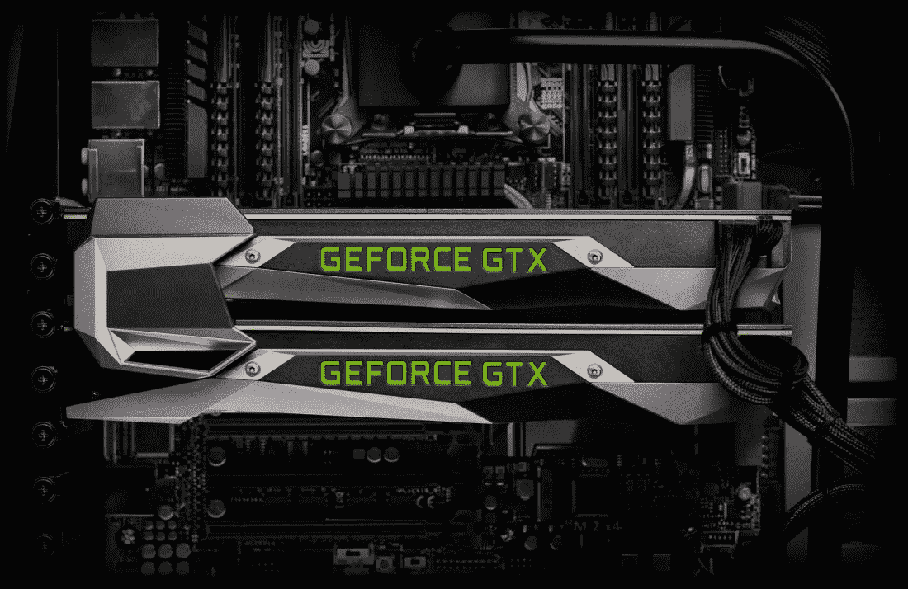
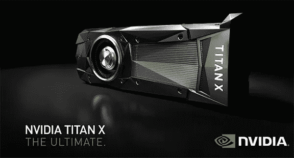
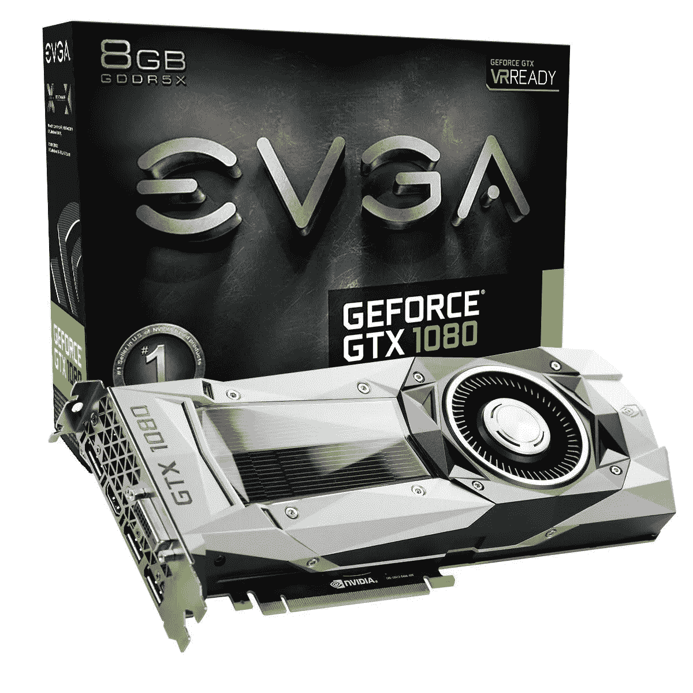
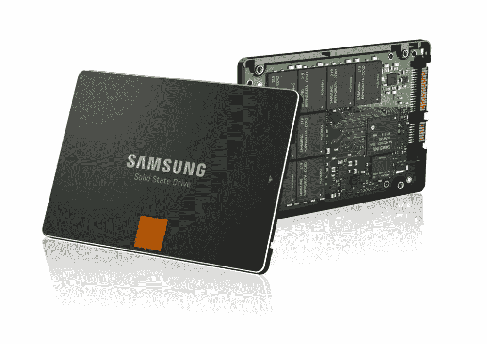
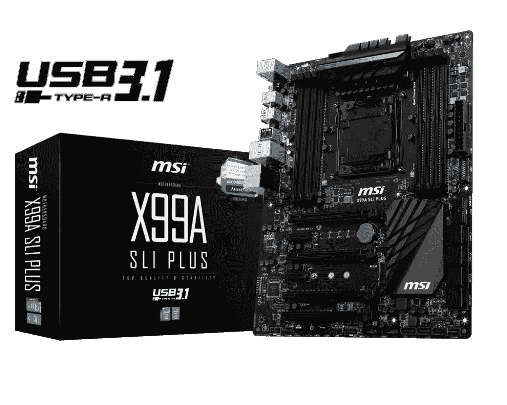
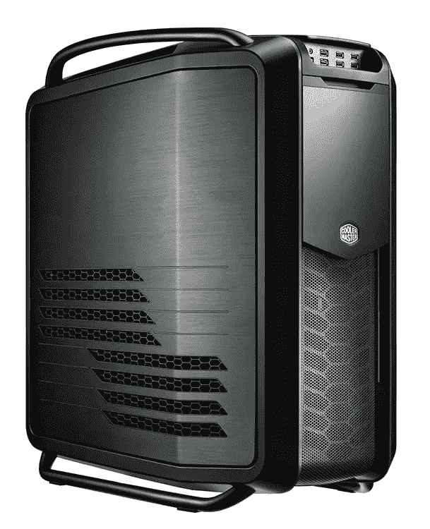
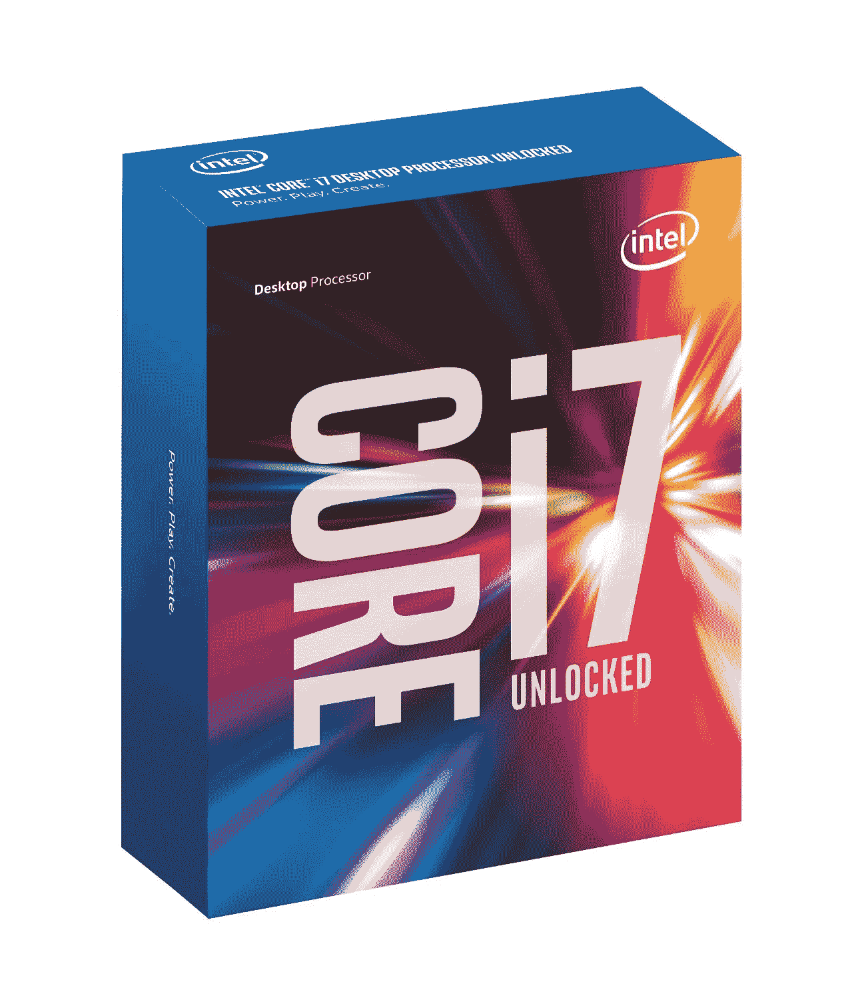

# 如果你数学很差，学习人工智能——P3——建造一台人工智能梦想机器或预算友好的特别节目

> 原文：<https://medium.com/hackernoon/learning-ai-if-you-suck-at-math-p3-building-an-ai-dream-machine-or-budget-friendly-special-d5a3023140ef>


如果你数学很差，欢迎来到第三期**学习人工智能。如果你错过了之前的文章，一定要看看[第一部分](https://hackernoon.com/learning-ai-if-you-suck-at-math-8bdfb4b79037#.n4c9ftf4n)、[第二部分](https://hackernoon.com/learning-ai-if-you-suck-at-math-part-two-practical-projects-47d7a1e4e21f#.yo1o1ar5h)、[第四部分](https://hackernoon.com/learning-ai-if-you-suck-at-math-p4-tensors-illustrated-with-cats-27f0002c9b32#.2jpelkuhd)、[第五部分](https://hackernoon.com/learning-ai-if-you-suck-at-math-p5-deep-learning-and-convolutional-neural-nets-in-plain-english-cda79679bbe3#.7tfyjjvdd)、[第六部分](https://hackernoon.com/learning-ai-if-you-suck-at-math-p6-math-notation-made-easy-1277d76a1fe5#.qa2f24xvq)和[第七部分](https://hackernoon.com/learning-ai-if-you-suck-at-math-p7-the-magic-of-natural-language-processing-f3819a689386)。**

今天我们要打造自己的**深度学习梦想机器**。

*   我们将寻找最好的部分，把它们组合成一个巨大的数字怪物。
*   我们还将一步一步地在 Ubuntu Linux 16.04 上安装所有最新的深度学习框架。

这台机器会像热激光切黄油一样切开神经网络。除了花费 129，000 美元购买 Nvidia 的 DGX-1(一台人工智能超级计算机)之外，你根本无法获得比我在这里向你展示的更好的性能。

*   最后，如果你的预算比较紧张，不要绝望，我还会列出一些对预算非常友好的选择。

# **先是一个 TL；DR，超廉价升级选项**

在我们深入研究建造一个 DL 野兽之前，我想给你一个最简单的升级路径。

如果你不想建造一台全新的机器，你还有一个非常棒的选择。



**只需升级您的 GPU(使用一个** [**泰坦 X**](http://amzn.to/2kucHoB) **或一个**[**GTX 1080**](http://amzn.to/2kXYpJZ)**)并获得** [**VMware 工作站**](https://my.vmware.com/en/web/vmware/info/slug/desktop_end_user_computing/vmware_workstation_pro/12_0) **或使用另一个支持** [**GPU 加速**](https://pubs.vmware.com/workstation-12/index.jsp?topic=%2Fcom.vmware.ws.using.doc%2FGUID-F5186526-2382-4F4A-8009-3D07773A1404.html) **！或者你可以简单地安装 Ubuntu 裸机，如果你需要一台 Windows 机器，在虚拟机上运行，这样你就可以最大限度地提高深度学习的性能。**

使用文章末尾的教程安装 Ubuntu 和 DL 框架，然后 bam！你刚刚给自己买了一个便宜的深度学习超级明星！

好吧，我们开始吧。

我会这样标记梦想机器零件和预算零件:

*   **美浓**(钱不成问题)= **梦机**
*   **ADAD** (一美元和一个梦想)= **预算备选方案**

# **梦想机器零件大汇演**

## **GPU 优先**

CPU 不再是宇宙的中心。 [AI](https://hackernoon.com/tagged/ai) 应用已经翻转脚本。如果你曾经为游戏定制过装备，你可能会用你能找到的最差的英特尔芯片给它打气。

但是时代变了。

[**Nvidia 是新的英特尔**](http://www.forbes.com/sites/aarontilley/2016/11/30/nvidia-deep-learning-ai-intel/) **。**

任何深度学习世界破坏者最重要的组件是 GPU。

虽然 AMD 在过去几年里在 cyptocoin 采矿方面取得了进展，但他们还没有在人工智能方面留下印记。这种情况将很快改变，因为他们竞相占领这个爆炸领域的一块，但目前 Nvidia 是国王。也不要睡在英特尔。他们购买了 [Nervana Systems，并计划在 2017 年推出自己的深度学习 ASIC](http://www.yaabot.com/26356/intels-deep-learning-based-chips-launching-2017/)。



The king of DL GPUs

**先说美浓。终极 GPU 是泰坦 x，它没有竞争对手。**

它配备了 3584 个 1531 MHz 的 CUDA 内核，12GB 的 G5X，内存速度为 10 Gbps。

在 DL 中，内核很重要，靠近这些内核的更多内存也很重要。

DL 其实就是一大堆线性代数。可以把它想象成一个巨大的 Excel 表格。处理所有这些数字将屠杀一个标准的 4 核或 8 核英特尔 CPU。

将数据移入和移出内存是一个巨大的瓶颈，因此卡上更多的内存就非常重要，这就是为什么 Titan X 是世界之王。

**你可以** [**以 1200 美元的 MSRP 直接从英伟达获得 Titan X。**](https://www.nvidia.com/en-us/geforce/products/10series/titan-x-pascal/) **可惜，你仅限于两个。但这是一台梦想中的机器，我们要买四台。这是正确的四 SLI！**

为此，你需要向第三方卖家支付一点额外费用。随便从英伟达拿两个，从亚马逊拿两个。这将为您带来 5300 美元，到目前为止，这个工作站的大部分费用。

现在，如果你只是计划运行《我的世界》，它看起来仍然是块状的，但如果你想训练一个战胜癌症的模型，这些是你的卡。:)

游戏硬件基准测试网站会告诉你[任何超过两张卡的东西都远远超过了收益递减点](https://us.hardware.info/reviews/6033/13/nvidia-geforce-gtx-titan-x-sli--3-way-sli--4-way-sli-review-insane-performance-conclusion) ***但这只是针对游戏而言！当谈到人工智能时，你会想尽可能多地扔出卡片。当然，人工智能也有其收益递减点，但它更接近于几十或几百张牌(取决于算法)，而不是四张。所以叠起来，我的朋友。***

请注意，你不需要 SLI 桥，除非你也打算用这台机器来玩游戏。这是严格的图形渲染，我们在这里做了很少的图形，除了在 matplotlib 中绘制一些图形。

# 预算友好的替代 GPU



你的 ADAD 卡是 GeForce GTX 1080 创始人版。1080 装有 2560 个 CUDA 内核，比 Titan X 少很多，但它的价格只有一半，建议零售价为 699 美元。

它还拥有更少的内存，8GB 对 12g。

EVGA 一直为我服务得很好，所以为你的机器抓四个吧。在 2796 美元对 5300 美元，这是一个几乎相同的性能节省了很多。

ADAD 的第二个最佳选择是 GeForce GTX 1070。它包含 1920 个 CUDA 内核，因此仍然是一个很好的选择。它的建议零售价约为 499 美元，但超级时钟 EVGA 1070s 的价格仅为 389 美元 ，因此价格更便宜，为 1556 美元。非常可行。

当然，如果你没有那么多钱花，你总是可以得到两三张卡。即使是一个也会让你朝着正确的方向前进。

让我们用两张或三张牌来计算一下最佳性价比:

*   3 个 Titan X = 10，752 个 CUDA 内核，36GB GPU RAM = 3800 美元
*   2 个 Titan X = 7，167 个 CUDA 内核，24gb GPU RAM = 2400 美元
*   **3 个 GTX 1080 = 7，680 个 CUDA 内核，24GB GPU RAM = 2097 美元**
*   2 个 GTX 1080 = 5，120 个 CUDA 内核，16GB GPU RAM = 1398 美元
*   3 个 GTX 1070 = 5，760 个 CUDA 内核，24GB GPU RAM = 1167 美元
*   2 个 GTX 1070 = 3，840 个 CUDA 内核，16GB GPU RAM = 778 美元

最佳地点是 3 GTX 1080。价格减半，您只需减少 3072 个内核。完全披露:这就是我如何建立我的工作站。

# **固态硬盘和旋转硬盘**



你会想要一个固态硬盘，特别是如果你正在建立卷积神经网络和处理大量的图像数据。 [**三星 850 EVO 1 TB**](http://amzn.to/2kY5gDf) **是目前最好中的最好。**更好的是，固态硬盘价格在去年暴跌，所以它不会破产。850 1 TB 目前的价格约为 319 美元。

**ADAD 版的** [**850 是 250GB 版的**](http://amzn.to/2kXKTpQ) **。它非常便宜，只要 98 美元。**

你还需要一个存储下载内容的磁盘驱动器。数据集在 DL 中可能是巨大的。一辆 4 TB 希捷梭鱼就够了。

# **主板**



因为我们想在这个盒子里塞进四个 GPU，所以您的主板选项变得非常少。**为了以全总线速度支持四张卡，我们需要**[**MSI Extreme Gaming X99A SLI 加**](http://amzn.to/2kUJGjY) **。**

也可以配[华硕 X99 Deluxe II](http://amzn.to/2kY2cHa) 。

如果你的牌少于四张，你会有更多的选择。说到主板，我倾向于稳定。我从建造加密硬币采矿设备的艰难过程中学到了这一点。如果你不停地运行你的 GPU，它们会立刻把你的机器烧成灰烬。技嘉制造了一系列非常耐用的主板。 [**X99 Ultra Gaming 绝对坚如磐石**](http://amzn.to/2jyhWnT) **售价 237 美元。**

# **案例**



**[**冷却器大师 Cosmos II**](http://amzn.to/2jFikMF) **是终极全塔案例。**光滑时尚的拉丝铝和钢赛车设计造就了一台漂亮的机器。**

**如果你想要一个中塔式机箱，那么使用 [Cooler Master Maker 5T](http://amzn.to/2ku9ZQ3) 绝对不会错。**

**我从来不喜欢给任何机器买一个便宜的箱子。一旦你不得不打开它来排除故障，你的错误就昭然若揭了。免工具盒是理想的选择。但是有很多不错的预算案例，所以做好你的功课吧。**

# ****CPU****

**你的深度学习机器不需要太多 CPU 能力。大多数应用程序都是单线程的，因为它们将数据加载到 GPU 中进行多核处理，所以不要在这里花费太多资金。**

****

**也就是说，你最好为你的处理器获得最快的时钟速度，在 i7–6700k 上是 4GHz。你可以在这里用风扇把它抽走。坦率地说，这是荒谬的过度杀戮，但价格大幅下降，我一直在寻找单线程性能。这是要打败的 CPU。**

**如果你想变得更安静，那么你可以使用水冷系统，但你不会让 CPU 运行得那么辛苦。大部分风扇噪音将来自 GPU。**

**这里没有伟大的 ADAD 替代品。带水冷器的 3.5GHz 的 i5 和 4GHz 的运行成本差不多，为什么要这么麻烦呢？**

# ****动力****

**[EVGA 模块化 1600W Supernova G2 电源](http://amzn.to/2kuhXsz)是四 SLI 设置的最佳选择。它将花费你大约 305 美元。**

**泰坦 X 的功率约为 250 瓦，轻松达到 1000 瓦。这不会给 CPU、内存和系统电源留下太多的开销，所以使用最大的电源来留出一些空间。**

**如果你的卡比 1300W 的少，价格会降到 184 美元，更容易控制。**

# ****软件设置****

**现在我们已经完成了硬件，让我们开始软件设置。**

**你有三个选择:**

*   ****码头集装箱****
*   ****虚拟机****
*   ****裸机安装****

## ****码头工人****

**如果你想使用 Docker 选项，你会想从官方的 Nvidia-Docker 项目开始。然而，要真正获得所有的框架、库和语言，你必须在这个映像上做大量的安装工作。**

****可以配一个一体化的深度学习容器，像 GitHub** **上的** [**这个。**](https://github.com/floydhub/dl-docker)**

**我想爱多合一的 Docker 图像，但它有一些问题，考虑到设置的复杂性，这并不奇怪。**

**我[找到了一个问题](https://github.com/floydhub/dl-docker/issues/36)的答案(libopenjpeg2 现在是 Ubuntu 16.04 LTS 版上的 libopenjpeg5)，但我厌倦了[为第二个问题](https://github.com/floydhub/dl-docker/issues/38)排除故障。我仍在等待修复。如果你是那种喜欢修复 likes 文件并在 GitHub 上提交修复的人，我鼓励你支持这个一体化项目。**

**第二个主要挑战是，这是一个非常非常大的图像，因此由于超时，它不适合 Dockerhub。这意味着您必须自己构建它，这可能需要几个小时的编译、拉层和调试，这与您裸机操作所需的时间差不多。**

**最后，它没有包括我想要的所有东西，包括 Anaconda Python。**

**最后我决定用[一体机裸机教程](https://github.com/floydhub/dl-setup)作为指导，同时更新它，加入我自己的专用酱。**

## **虚拟计算机**

**正如我在 TL 中提到的；DR 部分在文档的开头，您完全可以升级当前的游戏机，添加支持 GPU 直通的 VMware Workstation Pro，并且有一个很好的入门方式。这是一个强有力的预算友好型战略。它还有几个优点，因为你可以轻松地备份虚拟机，快照和回滚。它没有 Docker 容器启动得快，但是 VM 技术在这一点上已经非常成熟了，这给了你很多工具和最佳实践。**

## ****裸机****

**这是我最后在我的机器上使用的选项。这是一个有点老的学校，但作为一个长时间的系统管理员，它对我来说最有意义，因为它给了我最终的控制水平。**

**在我们开始之前，关于深度学习软件的一些注意事项。**

**你会发现绝大多数的 AI 研究都是用 Python 完成的。这是因为它是一种容易学习和设置的语言。我不确定一旦人工智能进入生产阶段，Python 是否会成为主要语言，但现在 Python 是一条出路。许多主要的框架都在它上面运行，它的科学库也是首屈一指的。**

**R 语言也很受欢迎，Scala 也是如此，所以我们将把它们添加到等式中。**

**以下是我们将在本教程中设置的主要包的列表:**

## ****语言****

*   ****Python 2.x****
*   **[**Anaconda**](https://www.continuum.io/downloads) (以及扩展的 Python 3.6)——Anaconda 是 Python 的一个高性能发行版，包括 100 多个最流行的 Python、R 和 Scala 包，用于数据科学。**
*   **[**R**](https://www.r-project.org/about.html) —一种统计计算和图形的语言和环境。**
*   **[**Scala**](https://www.scala-lang.org/)**—Scala 是“可扩展语言”的缩写它类似于 Java，但具有超高的性能和模块化。****

## ******驱动程序和 API******

*   ****[**Nvidia 驱动**](http://www.nvidia.com/Download/index.aspx?lang=en-us)****
*   ****[**CUDA**](https://developer.nvidia.com/cuda-downloads)—Nvidia 打造的专有并行计算平台和应用编程接口(API)模型。****
*   ****[**cuDNN**](https://developer.nvidia.com/cudnn) —面向 Nvidia GPUs 的深度神经网络加速图元库。****

## ******助手应用******

*   ****Jupyter —这是一个很棒的网络应用程序，让你在一个文件中分享文档和实时代码。****

## ******框架/库******

*   ****[**tensor flow**](https://www.tensorflow.org/)——谷歌的开源 DL 框架，为谷歌翻译之类的东西提供动力。****
*   ****[**Theano**](http://deeplearning.net/software/theano/) —一个健壮且流行的机器学习框架。****
*   ****[**Caffe**](http://caffe.berkeleyvision.org/) —出自伯克利的深度学习框架。****
*   ****[**Torch**](http://torch.ch/) —一个科学计算框架，广泛支持将 GPU 放在首位的机器学习算法。****
*   ****[**MXNET**](http://mxnet.io/) —高度可扩展的 DL 系统，由亚马逊和几所大学提供支持。****

## ******高级抽象库******

*   ****[**Keras**](https://keras.io/) —一个高级神经网络库，用 Python 编写，运行在 TensorFlow 或 Theano 之上。****
*   ****[**千层面**](https://github.com/Lasagne/Lasagne) —构建和训练神经网络的轻量库。****

## ******Python 库******

****几乎任何科学计算系统都需要大量的库来有效运行。因此，让我们安装最常见的蝙蝠。****

*   ******Pip**= Python 的安装和打包系统****
*   ******熊猫** =高性能数据分析****
*   ****Scikit-learn =一个流行且强大的机器学习库****
*   ******NumPy** =数字 Python****
*   ******Matplotlib** =可视化库****
*   ****数学和科学计算****
*   ******IPython** =交互式 Python****
*   ******Scrappy** =网络爬行框架****
*   ****自然语言工具包****
*   ******模式** =一个 web 挖掘库****
*   ****Seaborn =统计可视化****
*   ****OpenCV =一个计算机视觉库****
*   ******Rpy2** =一个 R 接口****
*   ****统计图表****
*   ******OpenBLAS** =线性代数****

# ******Linux 工作站设置******

****对于前沿的工作，你会希望[获得最新版本的 Ubuntu LTS](https://www.ubuntu.com/download/server) ，在撰写本文时是 16.04。我期待着有一天有更多的教程涵盖红帽和红帽衍生物，如 CentOS 和科学 Linux，但目前 Ubuntu 是深度学习的地方。我可能会跟进一个 RH 中心的建设。****

****通过 Rufus 将 Ubuntu [刻录到 u 盘。](https://rufus.akeo.ie/)****

****在 UEFI 模式下安装。****

# ******首次开机******

****你的第一次启动会变成黑屏。这是因为开源驱动程序没有跟上最新最好的芯片组。要解决这个问题，您需要执行以下操作:****

****随着机器启动，到达 TTY:****

```
**Ctrl + Alt + F1**
```

****获取最新的 Nvidia 驱动程序并重新启动:****

*   ****登录您在 TTY 的 root 帐户。****
*   ****运行`sudo apt-get purge nvidia-*`****
*   ****运行`sudo add-apt-repository ppa:graphics-drivers/ppa`然后运行`sudo apt-get update`****
*   ****运行`sudo apt-get install nvidia-375`****
*   ****重新启动，你的图形问题应该得到解决。****

# ******更新机器******

****打开终端并键入以下内容:****

```
**sudo apt-get update -ysudo apt-get upgrade -ysudo apt-get install -y build-essential cmake g++ gfortran git pkg-config python-dev software-properties-common wgetsudo apt-get autoremovesudo rm -rf /var/lib/apt/lists/***
```

# ******CUDA******

****从 [Nvidia](https://developer.nvidia.com/cuda-toolkit) 下载 CUDA 8。转到下载目录并安装 CUDA:****

```
**sudo dpkg -i cuda-repo-ubuntu1604-8-0-local.debsudo apt-get update -ysudo apt-get install -y cuda**
```

****将 CUDA 添加到环境变量:****

```
**echo ‘export PATH=/usr/local/cuda/bin:$PATH’ >> ~/.bashrcecho ‘export LD_LIBRARY_PATH=/usr/local/cuda/lib64:$LD_LIBRARY_PATH’ >> ~/.bashrcsource ~/.bashrc**
```

****检查以确保安装了正确版本的 CUDA:****

```
**nvcc -V**
```

****重新启动计算机:****

```
**sudo shutdown -r now**
```

******检查您的 CUDA 安装******

****首先安装 CUDA 示例:****

```
**/usr/local/cuda/bin/cuda-install-samples-*.sh ~/cuda-samplescd ~/cuda-samples/NVIDIA*Samplesmake -j $(($(nproc) + 1))**
```

****请注意，该命令的 make 部分使用+1 来表示您拥有的 GPU 数量，因此如果您有多个 GPU，您可以增加数量，安装/编译将会进行得更快。****

****运行 deviceQuery 并确保它检测到您的图形卡，并且测试通过:****

```
**bin/x86_64/linux/release/deviceQuery**
```

# ****cuDNN****

****cuDNN 是一个用于 DNNs 的 GPU 加速库。不幸的是，你不能只从回购中获得它。**你需要** [**向 Nvidia 注册才能访问它，你可以在这里**](https://developer.nvidia.com/cudnn) **完成。获得访问许可可能需要几个小时或几天。抢 4 版和 5 版。我在本教程中安装了 5。******

****您可能希望等到安装了它之后再继续，因为其他框架依赖于它，可能无法安装。****

****提取并复制文件:****

```
**cd ~/Downloads/tar xvf cudnn*.tgzcd cudasudo cp */*.h /usr/local/cuda/include/sudo cp */libcudnn* /usr/local/cuda/lib64/sudo chmod a+r /usr/local/cuda/lib64/libcudnn***
```

****键入以下命令进行检查:****

****`nvidia-smi`****

****这应该输出一些 GPU 的统计数据。****

# ******Python******

```
**sudo apt-get install -y python-pip python-devsudo apt-get update && apt-get install -y python-numpy python-scipy python-nose python-h5py python-skimage python-matplotlib python-pandas python-sklearn python-sympy libfreetype6-dev libpng12-dev libopenjpeg5sudo apt-get clean && sudo apt-get autoremoverm -rf /var/lib/apt/lists/***
```

****现在用 Pip 安装其余的库****

```
**pip install seaborn rpy2 opencv-python pygraphviz pattern nltk scrappy**
```

# ****[张量流 ](https://hackernoon.com/tagged/tensorflow)****

```
**pip install tensorflow-gpu**
```

****就是这样。厉害！****

******测试张量流******

****`$ python
...
>>> import tensorflow as tf
>>> hello = tf.constant('Hello, TensorFlow!')
>>> sess = tf.Session()
>>> print(sess.run(hello))
Hello, TensorFlow!
>>> a = tf.constant(10)
>>> b = tf.constant(32)
>>> print(sess.run(a + b))
42
>>>`****

# ******OpenBLAS******

```
**sudo apt-get install -y libblas-testlibopenblas-base libopenblas-dev**
```

# ****朱皮特****

****Juypter 是一个很棒的代码共享格式，让你可以轻松地共享代码和教程的“笔记本”。我将在下一篇文章中详细介绍它的使用。****

```
**pip install -U ipython[all] jupyter**
```

# ****Theano****

****安装先决条件并安装。****

```
**sudo apt-get install -y python-numpy python-scipy python-dev python-pip python-nose g++ python-pygments python-sphinx python-nosesudo pip install Theano**
```

****是的，那是首都。****

****测试您的 Theano 安装。执行导入命令时，不应出现警告/错误。****

```
**python
>>> import theano
>>> exit()nosetests theano**
```

# ****克拉斯****

****Keras 是一个非常受欢迎的高级抽象包装器，可以在 Theano 和 Tensorflow 之上冲浪。它的安装和使用非常简单，一点也不好笑。****

```
**sudo pip install keras**
```

# ****千层面****

****千层面是另一种广泛使用的高级包装，比 Keras 更灵活，因为你可以轻松地在线外着色。把 Keras 看作是你进化的下一步，在铁轨和千层面上的深度学习。千层面的安装说明来自这里的。****

```
**pip install -r [https://raw.githubusercontent.com/Lasagne/Lasagne/v0.1/requirements.txt](https://raw.githubusercontent.com/Lasagne/Lasagne/v0.1/requirements.txt)**
```

# ****MXNET****

****MXNET 是一个高度可扩展的框架[，由 Amazon](http://www.allthingsdistributed.com/2016/11/mxnet-default-framework-deep-learning-aws.html) 提供支持。[它的安装说明可以在这里找到](http://mxnet.io/get_started/setup.html)。MXNet for Python 的安装脚本可以在[这里](https://raw.githubusercontent.com/dmlc/mxnet/master/setup-utils/install-mxnet-ubuntu-python.sh)找到。****

## ****在 Ubuntu 上安装 MXNet****

****从网站:****

> ****MXNet 目前支持 Python、R、Julia 和 Scala。对于在 Ubuntu 操作系统上使用 Python 和 R 的用户，MXNet 提供了一组 Git Bash 脚本，用于安装所有必需的 MXNet 依赖项和 MXNet 库。****
> 
> ****简单的安装脚本在运行 Ubuntu 12 或更高版本的计算机上为 Python 和 R 设置 MXNet。脚本将 MXNet 安装在您的主文件夹`~/mxnet`中。****

## ****为 Python 安装 MXNet****

****克隆 MXNet 存储库。在终端中，运行不带“sudo”的命令:****

```
**git clone [https://github.com/dmlc/mxnet.git](https://github.com/dmlc/mxnet.git) ~/mxnet --recursive**
```

****我们使用 GPU 进行构建，因此将配置添加到 config.mk 文件中:****

```
**cd ~/mxnetcp make/config.mk .echo "USE_CUDA=1" >>config.mkecho "USE_CUDA_PATH=/usr/local/cuda" >>config.mkecho "USE_CUDNN=1" >>config.mk**
```

****安装包含所有依赖项的 MXNet for Python:****

```
**cd ~/mxnet/setup-utilsbash install-mxnet-ubuntu-python.sh**
```

****将其添加到您的路径中:****

```
**source ~/.bashrc**
```

## ****为 R 安装 MXNet****

****我们需要休息，所以现在就开始吧。安装 MXNet for R 的安装脚本可以在[这里](https://raw.githubusercontent.com/dmlc/mxnet/master/setup-utils/install-mxnet-ubuntu-r.sh)找到。下面的步骤在设置 R 语言后调用该脚本。****

****首先添加 R repo:****

```
**sudo echo “deb [http://cran.rstudio.com/bin/linux/ubuntu](http://cran.rstudio.com/bin/linux/ubuntu) xenial/” | sudo tee -a /etc/apt/sources.list**
```

****将 R 添加到 Ubuntu Keyring:****

```
**gpg — keyserver keyserver.ubuntu.com — recv-key E084DAB9gpg -a — export E084DAB9 | sudo apt-key add -**
```

****安装 R 型底座:****

```
**sudo apt-get install r-base r-base-dev**
```

****安装 R-Studio(修改命令以获得正确的版本号):****

```
**sudo apt-get install -y gdebi-corewget [https://download1.rstudio.org/rstudio-0.99.896-amd64.deb](https://download1.rstudio.org/rstudio-0.99.896-amd64.deb)sudo gdebi -n rstudio-0.99.896-amd64.debrm rstudio-0.99.896-amd64.deb**
```

****现在为 R 安装 MXNet:****

```
**cd ~/mxnet/setup-utilsbash install-mxnet-ubuntu-r.sh**
```

# ******咖啡馆******

****这些说明来自 Caffe 网站。我发现它们有点不稳定，这取决于那天的风向，但你的里程数可能会有所不同。坦白地说，我不怎么用 Caffe，而且很多初学者教程也不会关注它，所以如果这部分对你来说搞砸了，现在跳过它，回头再来。****

****安装必备组件:****

```
**sudo apt-get install -y libprotobuf-dev libleveldb-dev libsnappy-dev libopencv-dev libhdf5-serial-dev protobuf-compilersudo apt-get install -y --no-install-recommends libboost-all-devsudo apt-get install -y libgflags-dev libgoogle-glog-dev liblmdb-dev**
```

****克隆咖啡回购:****

```
**cd ~/gitgit clone [https://github.com/BVLC/caffe.git](https://github.com/BVLC/caffe.git)cd caffecp Makefile.config.example Makefile.config**
```

****要使用 cuDNN，请在 Makefile 中设置标志`USE_CUDNN := 1`:****

```
**sed -i ‘s/# USE_CUDNN := 1/USE_CUDNN := 1/‘ Makefile.config**
```

****修改 BLAS 参数值以打开:****

```
**sed -i 's/BLAS := atlas/BLAS := open/' Makefile.config**
```

****安装需求，然后构建 Caffe，构建测试，运行测试并确保所有测试都通过。请注意，所有这些都需要一些时间。再次注意,+1 表示构建 Caffe 所用的 GPU 数量，因此如果您有多个 GPU，请增加它的数量。****

```
**sudo pip install -r python/requirements.txtmake all -j $(($(nproc) + 1))make test -j $(($(nproc) + 1))make runtest -j $(($(nproc) + 1))**
```

****构建 PyCaffe，Caffe 的 Python 接口:****

```
**make pycaffe -j $(($(nproc) + 1))**
```

****将 Caffe 添加到环境变量中:****

```
**echo ‘export CAFFE_ROOT=$(pwd)’ >> ~/.bashrcecho ‘export PYTHONPATH=$CAFFE_ROOT/python:$PYTHONPATH’ >> ~/.bashrcsource ~/.bashrc**
```

****测试以确保您的 Caffe 安装是成功的。执行导入命令时，不应出现警告/错误。****

```
**ipython
>>> import caffe
>>> exit()**
```

# ****火炬****

****以下是来自[火炬网站](http://torch.ch/docs/getting-started.html)的火炬安装说明。我在安装这个框架时遇到了一些困难，但是这对大多数人来说都是有效的。****

```
**git clone [https://github.com/torch/distro.git](https://github.com/torch/distro.git) ~/git/torch — recursivecd torch; bash install-deps;./install.sh**
```

# ******Scala******

```
**sudo apt-get -y install scala**
```

# ******蟒蛇******

****在这里下载 Python 3.6 的 Anaconda。它也将有一个 2.7.x 版本。****

****安装它:****

```
**sudo bash Anaconda3–4.3.0-Linux-x86_64.sh**
```

****不要把它添加到你的 bashrc 中，否则当你重启的时候 Python 将默认为 Anaconda。在脚本中默认设置为“no ”,但是您可能会像我最初一样尝试这样做。不要。你需要保持默认指向 Ubuntu 的 Python，因为很多东西都依赖于它。****

****除了 Anaconda 之外，您还可以创建允许您在不同版本之间来回移动的环境。****

****让我们创建两个 Anaconda 环境:****

```
**conda create -n py2 python=2.7conda create -n py3 python=3.6**
```

****激活 3 个环境:****

```
**source activate py3**
```

****现在让我们安装 Anaconda 的所有包:****

```
**conda install pip pandas scikit-learn scipy numpy matplotlib ipython-notebook seaborn opencv scrappy nltk pattern**
```

****现在我们安装 pygraphviz 和带有 pip 的 R 桥，它们不在 Conda 中:****

```
**pip install pygraphviz rpy2**
```

****重新启动:****

```
**sudo shutdown -r now**
```

# ******为 Anaconda 安装 Tensorflow、Theano 和 Keras******

****您将为 Python 2 和 3 版本的 Anaconda 安装这些库。使用 Anaconda 支持的库可以获得更好的性能，因为它们包含性能优化。****

****我们先来看看 Python 3:****

```
**source activate py3pip install tensorflow Theano keras**
```

****现在停用环境并激活 py2 环境:****

```
**source deactivate**
```

****激活 Python 2 环境:****

```
**source activate py2**
```

****为 py2 安装:****

```
**pip install tensorflow Theano keras**
```

****停用环境:****

```
**source deactivate**
```

****现在你又回到了标准的 Ubuntu shell 中，内置了 Python 2.7.x，以及我们为 Ubuntu 附带的标准 Python 安装的所有框架。****

# ******结论******

****这就是了。您已经购买了一台顶级机器或一台经济实惠的替代产品。您还可以使用最新、最棒的深度学习软件进行设置。****

****现在准备做一些繁重的数字运算。翻出一个教程，开始工作！请关注我系列的下一篇文章，它将深入探讨我对 2017 年 [Kaggle 数据科学碗](https://www.kaggle.com/c/data-science-bowl-2017)的看法，该比赛旨在击败肺癌，有机会获得总额为 100 万美元的奖金。****

****同样，如果您错过了本系列中的其他文章，请务必查看它们:****

****[**学习人工智能如果你数学很差——第一部分**](https://hackernoon.com/learning-ai-if-you-suck-at-math-8bdfb4b79037#.ng7ggn5d9)**——这篇文章将指导你阅读一些必要的书籍，如果你从来都不是数学迷，但作为一个成年人你正在学习它。******

******[**学习人工智能如果你数学很差——第二部分**](https://hackernoon.com/learning-ai-if-you-suck-at-math-part-two-practical-projects-47d7a1e4e21f#.yo1o1ar5h)**——实际项目**——这篇文章指导你开始你的第一个项目。******

****[**学习人工智能如果你数学很差——第三部分**](https://hackernoon.com/learning-ai-if-you-suck-at-math-p3-building-an-ai-dream-machine-or-budget-friendly-special-d5a3023140ef#.6frka033t)**——构建人工智能梦想机器**——这篇文章指导你获得一个强大的深度学习机器设置，并安装了所有最新最棒的框架。****

****[**数学烂就学 AI——第四部分——张量图解(带猫！)**](https://hackernoon.com/learning-ai-if-you-suck-at-math-p4-tensors-illustrated-with-cats-27f0002c9b32#.2jpelkuhd) —这个回答了一个古老的谜团:张量到底是个什么鬼？****

****[**“如果你数学很差，就学习人工智能”——第 5 部分——用简单的英语说，深度学习和卷积神经网络**](https://hackernoon.com/learning-ai-if-you-suck-at-math-p5-deep-learning-and-convolutional-neural-nets-in-plain-english-cda79679bbe3#.xjah79lsd)——在这里，我们创建了我们的第一个 Python 程序，并探索神经网络的内部工作原理！****

****[**学 AI 如果你数学很烂——第六部分——数学符号变得简单**](https://hackernoon.com/learning-ai-if-you-suck-at-math-p6-math-notation-made-easy-1277d76a1fe5)——还在努力理解那些有趣的小符号吗？让我们现在就改变这一切！****

****[**数学烂就学 AI——第七部分——自然语言处理的魔力**](https://hackernoon.com/learning-ai-if-you-suck-at-math-p7-the-magic-of-natural-language-processing-f3819a689386)——了解谷歌和 Siri 是如何理解你喃喃自语的。****

****############################################****

****如果你喜欢我的作品**请** [**赏光访问我的作品页面**](https://www.patreon.com/danjeffries) **因为这是我们一起改变未来的方式。帮我脱离母体，我会百倍回报你的慷慨，把我所有的时间和精力集中在写作、研究和为你和世界提供令人惊奇的内容上**。****

****###########################################****

****如果你喜欢这个教程，我希望你能鼓掌推荐给其他人。之后，请随时将文章通过电子邮件发送给朋友！非常感谢。****

****###########################################****

********

****简单介绍一下我:我是一名作家、工程师和连续创业者。在过去的二十年中，我涉及了从 Linux 到虚拟化和容器的广泛技术。****

*****你可以看看我的最新小说，* [***一部史诗般的中国科幻内战传奇***](http://amzn.to/2gAg249) *在这部小说中，中国挣脱了共产主义的枷锁，成为世界上第一个直接民主国家，运行着一个高度先进、人工智能的去中心化 app 平台，没有领导人。*****

## ****[***加入我的读者群就可以免费获得我的第一部小说《蝎子游戏》、***](http://meuploads.com/join-my-readers-group/) ***。*** *读者们纷纷称之为* ***【第一次神经癌的严重竞争】*******黑色侦探遇上约翰尼助记术。********

## ******最后，你可以 [**加入我的私人脸书小组，Nanopunk Posthuman 刺客**](https://www.facebook.com/groups/1736763229929363/) **，在这里我们可以讨论所有的科技、科幻、幻想等等。********

******############################################******

******我偶尔会从我文章中的链接赚钱，但我只推荐我拥有、使用和喜欢的东西。在这里查看我的[完整保单](http://meuploads.com/disclosure/)。******

******############################################******

******感谢阅读！******

******[](http://bit.ly/HackernoonFB)************[](https://goo.gl/k7XYbx)************[](https://goo.gl/4ofytp)******

> ******[黑客中午](http://bit.ly/Hackernoon)是黑客如何开始他们的下午。我们是 [@AMI](http://bit.ly/atAMIatAMI) 家庭的一员。我们现在[接受投稿](http://bit.ly/hackernoonsubmission)并乐意[讨论广告&赞助](mailto:partners@amipublications.com)机会。******
> 
> ******如果你喜欢这个故事，我们推荐你阅读我们的[最新科技故事](http://bit.ly/hackernoonlatestt)和[趋势科技故事](https://hackernoon.com/trending)。直到下一次，不要把世界的现实想当然！******

************