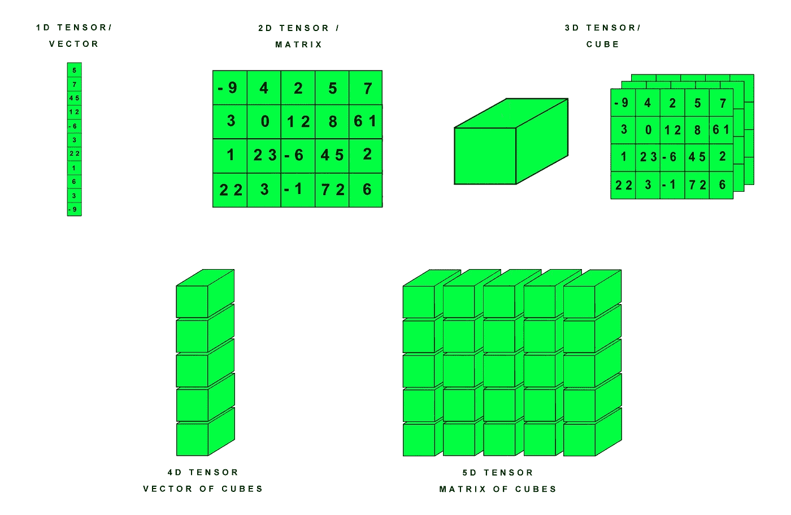
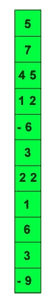
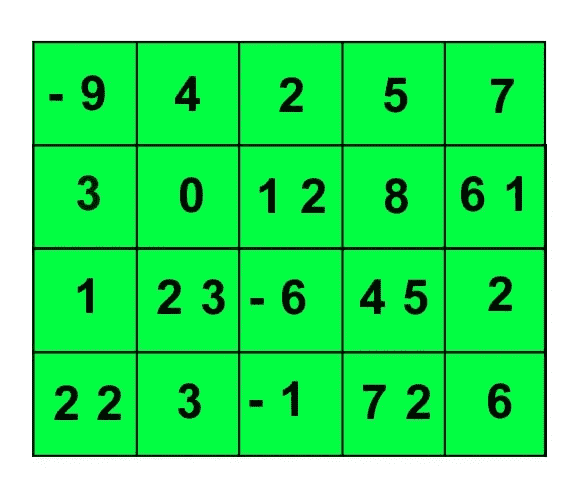
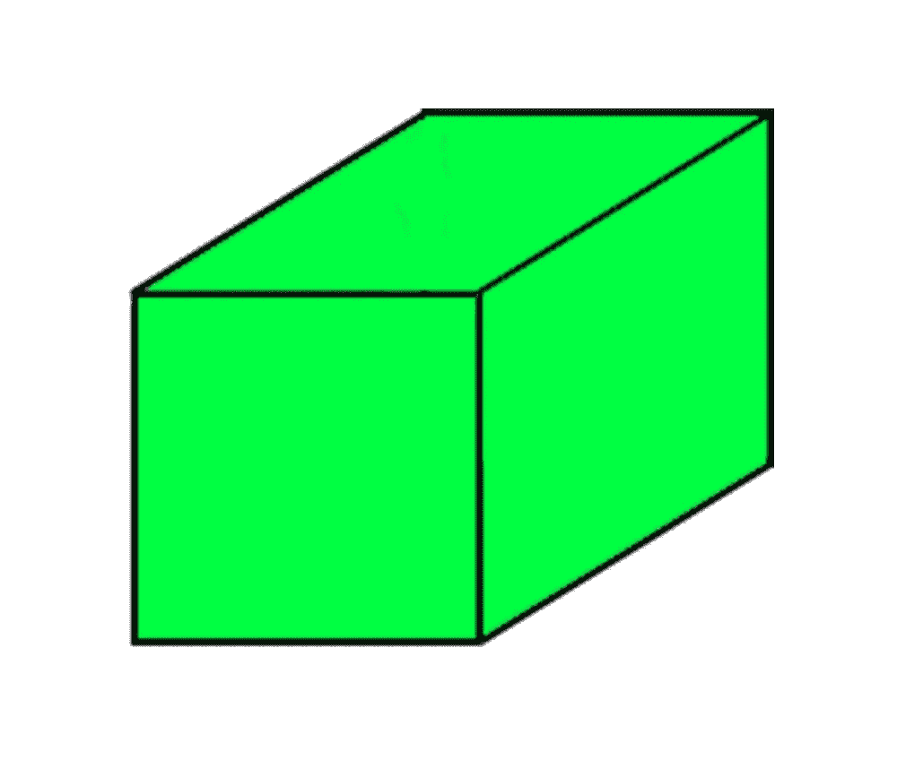
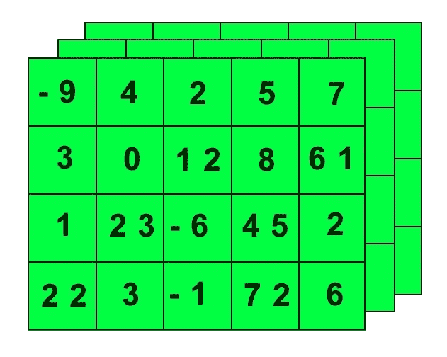
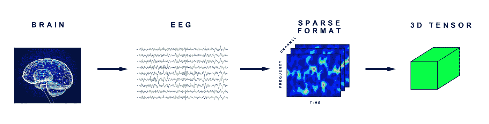
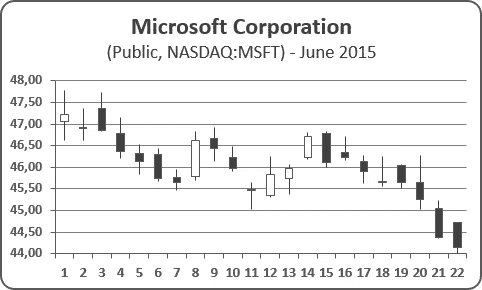
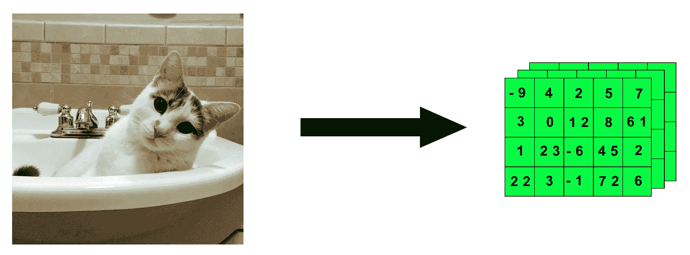
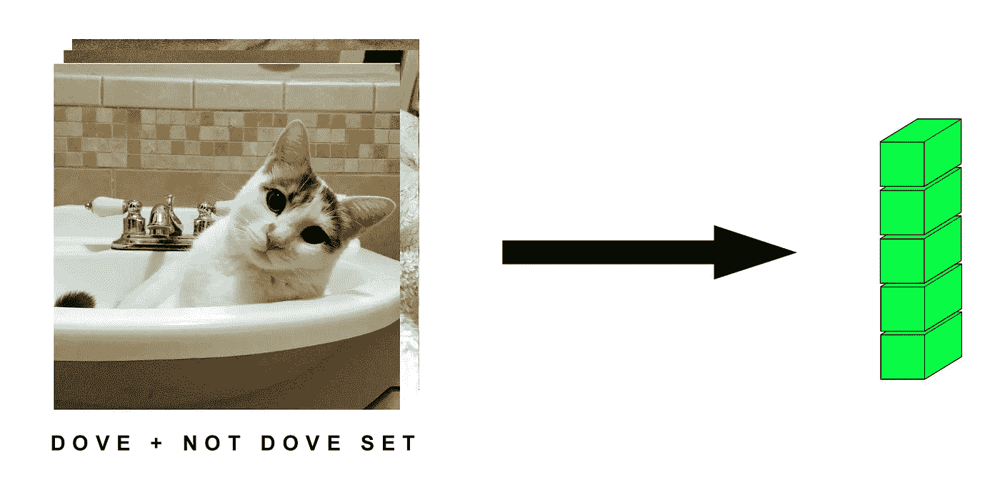
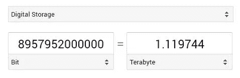

# 数学不好就学人工智能——P4——天象画报(有猫！)

> 原文：<https://medium.com/hackernoon/learning-ai-if-you-suck-at-math-p4-tensors-illustrated-with-cats-27f0002c9b32>


如果你数学很差，欢迎来到学习人工智能的第四部分。如果您遗漏了零件 [1](https://hackernoon.com/learning-ai-if-you-suck-at-math-8bdfb4b79037#.qv49ic2ok) 、 [2](https://hackernoon.com/learning-ai-if-you-suck-at-math-part-two-practical-projects-47d7a1e4e21f#.p1x8tjxyx) 、 [3](https://hackernoon.com/learning-ai-if-you-suck-at-math-p3-building-an-ai-dream-machine-or-budget-friendly-special-d5a3023140ef#.wktve8ouw) 、 [5](https://hackernoon.com/learning-ai-if-you-suck-at-math-p5-deep-learning-and-convolutional-neural-nets-in-plain-english-cda79679bbe3#.7tfyjjvdd) 、 [6](https://hackernoon.com/learning-ai-if-you-suck-at-math-p6-math-notation-made-easy-1277d76a1fe5#.fra2px108) 和 [7](https://hackernoon.com/learning-ai-if-you-suck-at-math-p7-the-magic-of-natural-language-processing-f3819a689386) ，请务必检查它们。

也许你已经下载了 [TensorFlow](https://www.tensorflow.org/tutorials/mnist/beginners/) 准备开始一些深度学习？

但是你会想:张量到底是什么？

也许你在维基百科上查了一下，现在你比以前更困惑了。也许你发现了这个 [NASA 教程](https://www.grc.nasa.gov/www/k-12/Numbers/Math/documents/Tensors_TM2002211716.pdf)仍然不知道它在说什么？

问题是大多数向导谈论张量*，好像你已经理解了他们用*来描述数学的所有术语。

不要害怕！

我小时候讨厌数学，所以如果我能算出来，你也能！我们只需要用更简单的术语解释一切。

那么什么是张量，为什么它会流动？

# 张量=容器

张量是现代机器学习的基本构件。

它的核心是一个数据容器。它主要包含数字。有时它甚至包含字符串，但那是罕见的。

**所以把它想象成一桶数字。**

张量有多种大小。让我们来看看你在深度学习中会遇到的最基本的维度，这些维度将在 0 到 5 个维度之间。

我们可以把各种类型的张量形象化成这样(猫后面来！):



# **0D 个张量/标量**

进入张量/容器桶的每个数字被称为“标量”

标量是一个单一的数字。

为什么他们不直接打电话给你要的号码？

我不知道。也许数学爱好者只是喜欢听起来很酷？标量听起来确实比数字酷。

事实上，你可以有一个单一的数字张量，我们称之为 0D 张量，也就是 0 维张量。它只不过是一个里面有一个数字的桶。想象一个只有一滴水的桶，你有一个 0D 张量。

**在本教程中，我们将使用 Python、Keras 和 TensorFlow，以及 Python 库 NumPy。我们在我的上一个教程** [**中设置了所有这些，如果你数学很差就学习 AI(LAIYSAM)——第 3 部分**](https://hackernoon.com/learning-ai-if-you-suck-at-math-p3-building-an-ai-dream-machine-or-budget-friendly-special-d5a3023140ef#.6frka033t) **，所以如果你想让你的深度学习工作站快速运行，请务必检查一下。**

在 Python 中，这些张量通常存储在 NumPy 数组中。NumPy 是一个处理数字的科学库，几乎被这个星球上的所有人工智能框架所使用。

```
import numpyx = np.array(5)print(x)
```

我们的输出是:

```
5
```

在 [Kaggle(数据科学竞赛网站)](https://www.kaggle.com/)上，你会经常看到 Jupyter 笔记本(也安装在 LAIYSAM -Part 3 中)谈论将数据转化为 NumPy 数组。Jupyter 笔记本本质上是一个嵌入了工作代码的标记文档。可以把它看作是一个解释和程序的结合。

**我们为什么要将数据转换成 NumPy 数组呢？**

**简单。因为我们需要将任何数据输入，无论是文本、图像、股票价格还是视频字符串，转换成我们可以轻松使用的通用标准。**

在这种情况下，我们将数据转换成一桶桶的数字，这样我们就可以用 TensorFlow 来处理它们。

它只不过是将数据组织成一种可用的格式。在 web 编程中，您可以通过 XML 来表示，这样您就可以定义它的特性并快速操作它。同样的事情。在深度学习中，我们使用张量桶作为我们的基本乐高积木。

# **1D 张量/向量**

如果你是一名程序员，你已经知道一些类似于 1D 张量的东西:**一个数组**。

每种编程语言都有数组，数组不过是一行或一列中的一串数据块。在深度学习中，这被称为 1D 张量。张量是由它们总共有多少轴来定义的。1D 张量只有一个轴。

1D 张量被称为“矢量”

我们可以把向量想象成一列或一行数字。



如果我们想在 NumPy 中看到这一点，我们可以这样做:

```
x = np.array([1,2,3,4])print(x)
```

我们的输出是:

```
array([1,2,3,4])
```

我们也可以使用 NumPy 的 ndim 函数来可视化一个张量有多少轴。让我们用 1D 张量试试。

```
x.ndim
```

我们的输出是:

```
1
```

# **2D 张量**

你可能已经知道另一种张量:**一种矩阵。**

**一个 2D 张量叫做矩阵。**



不，不是山谬·里维的电影。想象一个 Excel 表格。

我们可以把它想象成一个由行和列组成的数字网格。

这些列和行代表两个轴。矩阵是 2D 张量，意味着它是二维的，也就是有 2 个轴的张量。

在 NumPy 中，我们将其表示为:

```
x = np.array([[5,10,15,30,25], [20,30,65,70,90], [7,80,95,20,30]])
```

我们可以将人的特征存储在 2D 张量中。例如，一个典型的邮件列表可以放在这里。

假设我们有一万人。我们还对每个人有以下特征或特点:

*   西方人名的第一个字
*   姓
*   街道地址
*   城市
*   状态
*   国家
*   活力

这意味着我们一万人中的每个人都有七个特征。

张量有一个“形状”形状是一个桶，完美地符合我们的数据，并定义了我们张量的最大大小。我们可以将我们的人的所有数据放入一个 2D 张量(10000，7)中。

你可能会说它有 10，000 列和 7 行。

不要。

张量可以变换或操作，使列变成行，反之亦然。

# **三维张量**

这就是张量真正开始有用的地方。通常我们必须在它们自己的桶中存储许多 2D 张量的例子，这给了我们一个 3D 张量。

在 NumPy 中，我们可以表示如下:

```
x = np.array([[[5,10,15,30,25],
               [20,30,65,70,90],
               [7,80,95,20,30]]
               [[3,0,5,0,45],
               [12,-2,6,7,90],
               [18,-9,95,120,30]]
               [[17,13,25,30,15],
               [23,36,9,7,80],
               [1,-7,-5,22,3]]])
```

你猜对了，3D 张量有三个轴。我们可以这样看:

```
x.ndim
```

我们的输出是:

```
3
```

让我们看看上面的邮件列表。现在假设我们有 10 个邮件列表。我们将把 2D 张量存储在另一个桶中，创建一个 3D 张量。它的形状看起来像这样:

```
(number_of_mailing_lists, number_of_people, number_of_characteristics_per_person)(10,10000,7)
```



你可能已经猜到了，但是 3D 张量是一个数字的立方体！

我们可以不断地将立方体堆叠在一起，以创建越来越大的张量来编码不同类型的数据，如 4D 张量、5D 张量等等，直到 N。N 被数学爱好者用来定义一个集合中未知数量的附加单元，一直延续到未来。可能是 5 个，10 个或者无数个。

实际上，3D 张量可以更好地可视化为一层网格，如下图所示:



# 存储在张量中的常见数据

以下是我们存储在各种张量中的一些常见类型的数据集:

*   3D =时间序列
*   4D =图像
*   5D =视频

**在几乎所有这些张量中，共同的线索将是样本大小。**样本量是集合中事物的数量。这可能是图像的数量、视频的数量、文档的数量或推文的数量。

通常，实际数据会比 sample_size 小 1:

```
rest_of_dimensions - sample_size = actual_dimensions_of_data
```

将形状中的各种维度想象成字段。我们正在寻找描述数据的最少数量的字段。

所以尽管 4D 张量通常存储图像，那是因为样本大小占据了张量的第四个场。

例如，图像实际上由三个字段表示，如下所示:

```
(width, height, color_depth) = 3D
```

但在机器学习中，我们通常不会处理单个图像或文档。我们有一套。我们可能有 10，000 张郁金香的图片，这意味着我们有一个 4D 张量，像这样:

```
(sample_size, width, height, color_depth) = 4D
```

让我们看看各种张量作为存储桶的多个例子。

# **时间序列数据**

3D 张量对于时间序列数据非常有效。

## 医学扫描

我们可以将来自大脑的脑电图 EEG 信号编码为 3D 张量，因为它可以封装为 3 个参数:

```
(time, frequency, channel)
```

转换看起来像这样:



现在，如果我们对多个病人进行脑电图扫描，这将成为一个 4D 张量，就像这样:

```
(sample_size, time, frequency, channel)
```

## 股票价格

股票价格每分钟都有最高价、最低价和最终价。纽约证券交易所从上午 9:30 到下午 4:00 营业。那是六个半小时。一小时有 60 分钟，所以 6.5 x 60 = 390 分钟。这些通常用蜡烛棒图来表示。



我们将在(390，3)的 2D 张量中存储每分钟的最高、最低和最终股票价格。如果我们捕捉一个典型的交易周(五天)，我们将得到一个 3D 张量，其形状为:

```
(week_of_data, minutes, high_low_price)
```

看起来会像这样:

```
(5,390,3)
```

如果我们有 10 只不同的股票，每只股票都有一周的数据，我们将得到一个 4D 张量，其形状如下:

```
(10,5,390,3)
```

现在让我们假设我们有一个共同基金，它是股票的集合，用 4D 张量表示。也许我们也有 25 个共同基金代表我们的投资组合，所以现在我们有一个 4D 张量的集合，这意味着我们有一个 5D 形状张量:

```
(25,10,5,390,3)
```

## **文字数据**

我们也可以在 3D 张量中存储文本数据。我们来看看推文。

推文 140 个字符。Twitter 使用 UTF-8 标准，该标准允许数百万种类型的字符，但实际上我们只对前 128 个字符感兴趣，因为它们与基本 ASCII 相同。一条微博可以被封装成一个 2D 形状向量(140，128)。

如果我们下载了 100 万条唐纳德·特朗普的推文(我想他仅上周就发了这么多)，我们会将其存储为 3D 形状张量:

```
(number_of_tweets_captured, tweet, character)
```

这意味着我们的唐纳德·特朗普推文集合将如下所示:

```
(1000000,140,128)
```

# 形象

4D 张量非常擅长存储一系列图像，比如 Jpegs。正如我们前面提到的，图像存储有三个参数:

*   高度
*   宽度
*   颜色深度

该图像是一个三维张量，但图像集使其成为 4D。记住，第四个字段是 sample_size。

著名的 MNIST 数据集是一系列手写数字，几十年来一直是许多数据科学家的挑战，但现在被认为是一个解决的问题，机器能够达到 99%和更高的准确率。尽管如此，数据集仍然是测试新的机器学习应用程序的好方法，或者只是亲自尝试。


Keras 甚至允许我们使用以下命令自动导入 MNIST 数据集:

```
from keras.datasets import mnist
(train_images, train_labels), (test_images, test_labels) = mnist.load_data()
```

数据集分为两个桶:

*   训练集
*   测试装置

集合中的每个图像都有一个标签。该标签为图像提供了正确的标识，例如数字 3、7 或 9，这些数字是由人工添加的。

训练集用于训练神经网络，测试集包含网络在学习后试图分类的数据。

MNIST 图像是灰度级的，这意味着它们可以被编码为 2D 张量，然而传统上所有图像都被编码为 3D 张量，第三轴是颜色深度的表示。

MNIST 数据集中有 60，000 幅图像。它们宽 28 像素，高 28 像素。它们的色深为 1，代表灰度。

TensorFlow 像这样存储图像数据:

```
(sample_size, height, width, color_depth).
```

因此，我们可以说 MNIST 数据集的 4D 张量具有以下形状:

```
(60000,28,28,1)
```

# 彩色图像

彩色照片可以有不同的颜色深度，这取决于它们的分辨率和编码。典型的 JPG 图像将使用 RGB，因此它的色深为 3，红色、绿色和蓝色各一个。

这是我的超棒的猫鸽的照片。这是一张 750 像素 x 750 像素的图像。(其实是 751 x 750 因为我在 Photoshop 里剪错了，不过我们就当是 750 x 750)。这意味着我们有一个具有以下特征的 3D 张量:

```
(750,750,3)
```


My beautiful cat Dove (750 x 750 pixels)

因此，我的鸽子会被简化成一系列冷方程式，当它“转换”或“流动”时，看起来像这样。



然后，假设我们有一堆不同类型的猫的图像，(尽管没有一个像鸽子一样漂亮)。也许我们有 10 万只高 750 像素宽 750 像素的非鸽子猫。我们将 Keras 的数据集定义为形状的 4D 张量:

```
(10000,750,750,3)
```



# **5D 张量**

5D 张量可以存储视频数据。在 TensorFlow 中，视频数据编码为:

```
sample_size, frames, width, height, color_depth)
```

如果我们拍摄一个 5 分钟的视频(60 秒 x 5 = 300)，分辨率为 1080p HD，分辨率为 1920 像素 x 1080 像素，每秒采样 15 帧(这给了我们 300 秒 x 15 = 4500)，色深为 3，我们将存储一个 4D 张量，如下所示:

```
(4500,1920,1080,3)
```

当我们的视频集中有多个视频时，张量中的第五个域就起作用了。所以如果我们有 10 个像上面那个一样的视频，我们就会有一个 5D 形状张量:

```
(10,4500,1920,1080,3)
```

**实际上这个例子完全是疯狂的。**

**张量的大小绝对荒谬，超过一万亿字节。但是让我们坚持一会儿，因为这样做是有意义的。要知道，在现实世界中，我们会希望尽可能多地对视频进行降采样，以使其处理起来更加真实，否则我们会一直训练这个模型，直到时间结束。**

这个 5D 张量的值的数量是:

```
10 x 4500 x 1920 x 1080 x 3 = 279,936,000,000
```

Keras 允许我们使用数据值调用(dtype)将数据存储为 32 位或 64 位的浮点数:

```
float32
float64
```

这些值中的每一个都将存储为 32 位数，这意味着我们将值的总数乘以 32，将其转换为位，然后转换为兆兆字节。

```
279,936,000,000 x 32 = 8,957,952,000,000
```



我甚至不认为这些值适合一个 float32(我会让其他人来计算)，所以开始下采样吧，我的朋友！

实际上，我用最后这个疯狂的例子是有原因的。

**你刚刚上了第一堂课** [**预处理**](https://en.wikipedia.org/wiki/Data_pre-processing) **和** [**数据简化**](https://en.wikipedia.org/wiki/Data_reduction) **。**

你不能只是把数据扔给一个人工智能模型，而自己却不做任何工作。你必须调整和压缩数据，使之更容易有效地工作。

降低分辨率，丢弃不需要的数据(即重复数据删除)，限制使用的帧数，等等。这是数据科学家的工作。

如果你不能管理数据，你就不能用它做任何有用的事情。

# 结论

这就是了。现在，您对张量和适合它们的数据类型有了更好的理解。

在下一篇文章中，我们将学习如何对张量进行各种变换，也称为数学。

换句话说，我们会让张量“流动”

############################################

请务必查看该系列的其他内容。请随时关注我，因为您想成为第一个在最新文章发布后第一时间阅读它们的人。

[**学习人工智能如果你数学很差——第一部分**](https://hackernoon.com/learning-ai-if-you-suck-at-math-8bdfb4b79037#.ng7ggn5d9)**——这篇文章将指导你阅读一些必要的书籍，如果你从来都不是数学迷，但作为一个成年人你正在学习它。**

**[**学习人工智能如果你数学很差——第二部分**](https://hackernoon.com/learning-ai-if-you-suck-at-math-part-two-practical-projects-47d7a1e4e21f#.yo1o1ar5h)**——实际项目**——这篇文章指导你开始你的第一个项目。**

**[**学 AI 如果你数学很烂——第三部分**](https://hackernoon.com/learning-ai-if-you-suck-at-math-p3-building-an-ai-dream-machine-or-budget-friendly-special-d5a3023140ef#.6frka033t)**——打造一台 AI 梦想机器**——这篇文章指导你获得一个强大的深度学习机器设置，并安装了所有最新最棒的框架。**

**[**数学烂就学 AI——第四部分——张量图解(带猫！)**](https://hackernoon.com/learning-ai-if-you-suck-at-math-p4-tensors-illustrated-with-cats-27f0002c9b32#.2jpelkuhd) —这个回答了一个古老的谜团:张量到底是什么？**

**[**学习人工智能如果你数学很差——第 5 部分——深度学习和卷积神经网络用简单的英语说**](https://hackernoon.com/learning-ai-if-you-suck-at-math-p5-deep-learning-and-convolutional-neural-nets-in-plain-english-cda79679bbe3#.xjah79lsd)——在这里我们创建了我们的第一个 Python 程序，并探索神经网络的内部工作方式！**

**[**学 AI 如果你数学很烂——第六部分——数学符号变得简单**](https://hackernoon.com/learning-ai-if-you-suck-at-math-p6-math-notation-made-easy-1277d76a1fe5)——还在纠结要不要理解那些搞笑的小符号？让我们现在就改变这一切！**

**[**学 AI 如果你数学很烂——第七部分——自然语言处理的魔力**](https://hackernoon.com/learning-ai-if-you-suck-at-math-p7-the-magic-of-natural-language-processing-f3819a689386)——了解谷歌和 Siri 是如何理解你喃喃自语的。**

**############################################**

**如果你喜欢我的作品**，请** [**赏光参观我的作品第**](https://www.patreon.com/danjeffries) **页，因为这是我们一起改变未来的方式。帮助我脱离母体，我会百倍地回报你的慷慨，把我所有的时间和精力集中在写作、研究和为你和世界提供惊人的内容上。****

**###########################################**

**如果你喜欢这个教程，我希望你能鼓掌推荐给其他人。之后，请随时将文章通过电子邮件发送给朋友！非常感谢。**

**###########################################**

****

**简单介绍一下我:我是一名作家、工程师和连续创业者。在过去的二十年中，我涉及了从 Linux 到虚拟化和容器的广泛技术。**

**[**你可能会喜欢我的第一部小说《蝎子游戏》，**](http://meuploads.com/join-my-readers-group/) **因为它是免费的。读者称之为“神经癌的第一次严重竞争”和“像喝了几周掺水啤酒后的双份优质威士忌”****

**你也可以 [**加入我的私人脸书小组，纳米朋克后人类刺客**](https://www.facebook.com/groups/1736763229929363/) **，在这里我们讨论所有的科技、科幻、幻想等等。****

**############################################**

**我偶尔会从我文章中的链接赚钱，但我只推荐我拥有、使用和喜欢的东西。点击这里查看我的[完整保单](http://meuploads.com/disclosure/)。**

**############################################**

**感谢阅读！**

**[](http://bit.ly/HackernoonFB)****[](https://goo.gl/k7XYbx)****[](https://goo.gl/4ofytp)**

> **[黑客中午](http://bit.ly/Hackernoon)是黑客如何开始他们的下午。我们是 [@AMI](http://bit.ly/atAMIatAMI) 家庭的一员。我们现在[接受投稿](http://bit.ly/hackernoonsubmission)并乐意[讨论广告&赞助](mailto:partners@amipublications.com)机会。**
> 
> **如果你喜欢这个故事，我们推荐你阅读我们的[最新科技故事](http://bit.ly/hackernoonlatestt)和[趋势科技故事](https://hackernoon.com/trending)。直到下一次，不要把世界的现实想当然！**

****