# 如果你数学很差，就学习人工智能——P5——用简单的英语说，深度学习和卷积神经网络！

> 原文：<https://medium.com/hackernoon/learning-ai-if-you-suck-at-math-p5-deep-learning-and-convolutional-neural-nets-in-plain-english-cda79679bbe3>


如果你数学很差，欢迎来到学习人工智能的第五部分。如果您遗漏了零件 [1](https://hackernoon.com/learning-ai-if-you-suck-at-math-8bdfb4b79037#.qv49ic2ok) 、 [2](https://hackernoon.com/learning-ai-if-you-suck-at-math-part-two-practical-projects-47d7a1e4e21f#.p1x8tjxyx) 、 [3](https://hackernoon.com/learning-ai-if-you-suck-at-math-p3-building-an-ai-dream-machine-or-budget-friendly-special-d5a3023140ef#.wktve8ouw) 、 [4](https://hackernoon.com/learning-ai-if-you-suck-at-math-p4-tensors-illustrated-with-cats-27f0002c9b32#.kql2vj3yn) 、 [6](https://hackernoon.com/learning-ai-if-you-suck-at-math-p6-math-notation-made-easy-1277d76a1fe5#.fra2px108) 和 [7](https://hackernoon.com/learning-ai-if-you-suck-at-math-p7-the-magic-of-natural-language-processing-f3819a689386) ，请务必检查它们！

**今天，我们要编写自己的 Python 图像识别程序。**

**为此，我们将探索一种强大的深度学习架构，称为深度卷积神经网络(DCNN)。**

Convnets 是计算机视觉的主力。它们为从无人驾驶汽车到谷歌图像搜索的一切事物提供动力。在 2017 年 TensorFlow 峰会上，[一名研究人员展示了他们如何使用 convnet 检测皮肤癌](https://www.youtube.com/watch?v=toK1OSLep3s)以及一名皮肤科医生如何使用智能手机！

那么为什么神经网络如此强大呢？一个关键原因是:

**他们做*自动模式识别*。**

那么什么是模式识别，为什么我们关心它是否是自动的呢？

模式有多种形式，但让我们举两个重要的例子:

*   定义物理形态的特征
*   完成一项任务所需的步骤

# 计算机视觉

在图像处理中模式识别被称为[***特征提取***](https://en.wikipedia.org/wiki/Feature_extraction) **。**

当你看一张照片或现实世界中的一些东西时，你是在有选择地挑选出能让你理解它的关键特征。这是你无意识做的事情。

当你看到我的猫 Dove 的照片时，你会想到“猫”或“哇哦哇哦”,但你并不知道你是怎么做到的。你只管去做。

你不知道你是如何做到的，因为它是自动发生的*和不知不觉发生的*。**

****

**My beautiful cat Dove. Your built in neural network knows this is a cat.**

**这对你来说似乎很简单，因为你每天都在做，但那是因为复杂性对你来说是隐藏的。**

**你的大脑是一个黑匣子。你没有说明书。**

**然而，如果你真的停下来想一想，你刚才在几分之一秒内所做的事情包含了大量的步骤。表面上看起来很简单，但实际上非常复杂。**

*   **你移动了你的眼睛。**
*   **你吸收光线，然后将光线加工成组成部分，将信号发送到你的大脑。**
*   **然后你的大脑开始工作，施展它的魔法，将光转化为电化学信号。**
*   **这些信号通过你的内置神经网络发出，激活它的不同部分，包括记忆、联想和感觉。**
*   **在最“基本”的层次上，你的大脑突出了低层次的模式(耳朵、胡须、尾巴)，它们组合成更高层次的模式(动物)。**
*   **最后，你做了一个分类，这意味着你把它变成了一个单词，这是一个现实生活中事物的象征性表示，在这个例子中是一只“猫”**

**所有这一切都发生在眨眼之间。**

**如果你试着教一台计算机做那件事，你甚至会从哪里开始？**

*   **你能告诉它如何检测耳朵吗？**
*   **耳朵是什么？**
*   **你如何描述他们？**
*   **为什么猫耳和人耳或者蝙蝠耳(或者蝙蝠侠)不一样？**
*   **耳朵从各个角度看是什么样的？**
*   **所有的猫耳朵都一样吗(不，看看苏格兰的褶皱)？**

**问题不断出现。**

**如果你不能就如何用 C++或 Python 教会计算机所有这些步骤给出一个好的答案，不要难过，因为它难倒了计算机科学家 50 年！**

****你自然做的事情是深度学习神经网络的关键用途之一，它是一个“分类器”，在这种情况下是一个图像分类器。****

**一开始，人工智能研究人员试图做我们刚刚经历的练习。他们试图手动定义所有步骤。例如，当谈到自然语言处理或 NLP 时，他们召集了最好的语言学家，并说“写下所有语言的‘规则’。”他们称这些早期的人工智能为“专家系统”**

**语言学家坐下来，琢磨出一系列令人眼花缭乱的 if、then、unless、except 语句:**

*   **鸟会飞吗？**

**是**

**除非是:**

*   **死亡的**
*   **受伤的**
*   **像企鹅一样不会飞的鸟**
*   **少了一只翅膀**

**这些规则和例外是无止境的。不幸的是，它们也非常脆弱，容易出现各种错误。创建它们很费时间，容易引起争论和偏见，很难弄清楚，等等。**

****深度神经网络代表了一个真正的突破，因为你不必计算所有的步骤，你可以让机器*自动提取猫*的关键特征**。****

*“自动地”是必不可少的，因为我们绕过了试图找出我们做任何复杂动作所采取的成千上万个隐藏步骤这一不可能的问题。*

*我们可以让计算机自己解决这个问题！*

# *万物无尽的脚步*

*让我们看看第二个例子:找出完成一项任务的步骤。*

*今天，我们手动完成这项工作，并为计算机定义步骤。这叫编程。假设您想要找到硬盘上的所有图像文件，并将它们移动到一个新文件夹中。*

*对于大多数任务，程序员是神经网络。他是情报人员。他研究任务，将其分解成步骤，然后为计算机逐一定义每个步骤。他用一种被称为计算机编程语言的符号表示向计算机描述它。*

*这里有一个 Python 中的例子，来自栈交换上的[“快乐跳跃者】 :](http://stackoverflow.com/questions/11903037/copy-all-jpg-file-in-a-directory-to-another-directory-in-python)*

```
*import glob
import shutil
import ossrc_dir = “your/source/dir”
dst_dir = “your/destination/dir”for jpgfile in glob.iglob(os.path.join(src_dir, “*.jpg”)):
shutil.move(jpgfile, dst_dir)* 
```

*Jolly Jumper 想出了所有的步骤并翻译给电脑，比如:*

*   *我们需要知道源目录*
*   *此外，我们需要一个目的地*
*   *我们需要一种方法来分类我们想要的文件类型，在这个例子中是一个“jpg”文件*
*   *最后，我们进入目录，搜索任何 jpg，并将它们从源目录移动到目标目录*

*这对于简单甚至中等复杂的问题都很有效。操作系统是世界上最复杂的软件之一，由几百万行代码组成。每一行都是对计算机如何完成任务(如在屏幕上画图、存储和更新信息)以及人们如何完成任务(复制文件、输入文本、发送电子邮件、查看照片、与他人聊天等)的明确说明。).*

*但是当我们试图解决更具挑战性的问题时，我们会遇到手动定义问题步骤的能力极限。*

*比如你怎么定义开车？*

*我们采取数以亿计的微小步骤来完成这项令人麻木的复杂任务。我们必须:*

*   *待在队伍里*
*   *知道什么是线，并能够识别它*
*   *从一个地方航行到另一个地方*
*   *识别障碍物，如墙壁、人、碎片*
*   *将物体分类为有帮助的(街道标志)或有威胁的(行人闯绿灯)*
*   *评估我们周围的司机都在哪里*
*   *瞬间做出决定*

*在机器学习中，这被称为*决策*问题。复杂决策问题的例子有:*

*   *机器人导航和感知*
*   *语言翻译系统*
*   *自动驾驶汽车*
*   *股票交易系统*

# ***神经网络的秘密内部生活***

*让我们看看深度学习如何通过自动特征提取来帮助我们解决现实世界的疯狂复杂性！*

*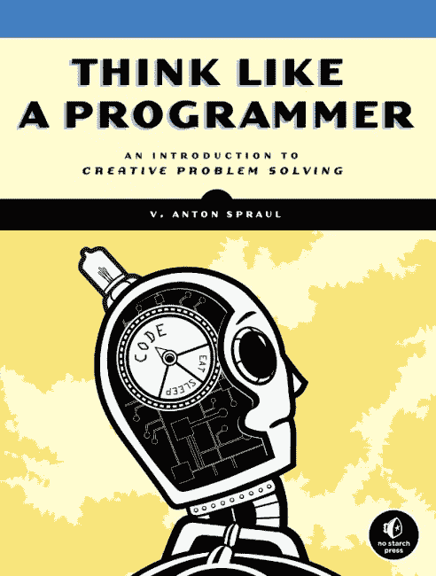*

*如果你读过 V. Anton Spraul 写的《像程序员一样思考》这本书，你应该知道**编程是关于解决问题的**。程序员**将一个问题分解成更小的问题，创建一个行动计划**来解决它**，然后编写代码**来实现它。*

*深度学习为我们解决了问题，但 AI 在这一点上仍然需要人类(感谢上帝)来设计和测试 AI 架构(至少目前是这样。)所以让我们把一个神经网络分解成它的各个部分，建立一个程序来识别我的鸽子的图片是一只猫。*

# ***深度学习中的深度***

*深度学习是机器学习的子领域。它的名字来源于我们将一堆不同的**层**堆叠在一起以学习越来越有意义的数据表示的想法。*

*每一层都是**神经网络，**由**人工神经元**之间的链接组成。*

*在我们拥有强大的 GPU 来为我们计算之前，我们只能构建非常小的“玩具”神经网络。他们做不了太多。今天我们可以**将许多层**堆叠在一起，因此有了**深度学习**中的**深度**。*

*神经网络的灵感来自于 20 世纪 50 年代对人脑的生物学研究。研究人员创建了一个神经元的数学表示，你可以在下面看到([来自斯坦福](http://cs231n.github.io/neural-networks-1/)和维基共享资源的关于卷积神经网络的令人敬畏的开放课件):*

**

*Biological neuron*

**

*Math model of a neuron.*

*暂时忘掉所有更复杂的数学符号，因为你不需要它们。*

*基础超级简单。由 **x0、**表示的数据通过神经元之间的连接传播。连接的强度由其权重表示( **w0x0，w1x1** 等)。如果信号足够强，它通过其**激活功能**激活神经元，使神经元**激活***

*以下是一个三层深度神经网络的示例:*

**

*通过激活一些神经元而不是其他神经元，并通过加强神经元之间的连接，系统可以了解世界上什么是重要的，什么是不重要的。*

*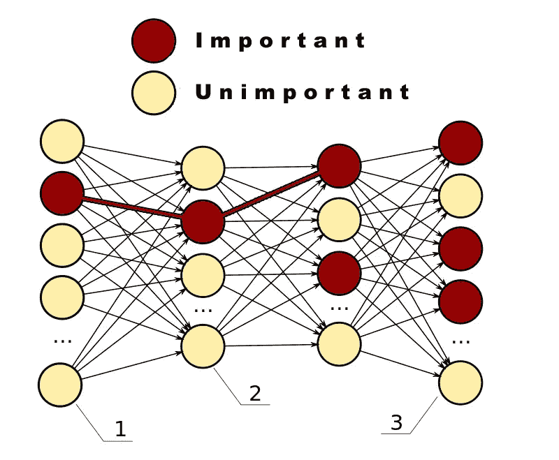*

# ***构建和训练神经网络***

*让我们更深入地了解深度学习，并在学习过程中编写一些代码。 [**所有的代码在我的 Github 这里都有**](https://github.com/the-laughing-monkey/learning-ai-if-you-suck-at-math/tree/master/Deep%20Learning%20Examples) 。*

*该系统的基本特征是:*

*   ***训练***
*   ***输入数据***
*   ***图层***
*   ***重量***
*   ***目标***
*   ***损失函数***
*   ***优化器功能***
*   ***预测***

# ***训练***

*训练是我们如何教会神经网络我们想要它学习的东西。它遵循一个简单的五步流程:*

1.  *创建一个**训练数据集**，我们将其命名为 **x** ，并加载其**标签作为目标 y***
2.  ***通过网络前馈 x 数据**，结果**为预测 y’***
3.  *算出网络的**“损耗”，即预测值 y’与正确目标值 y** 之间的**差值***
4.  *计算损失(l) 的**“梯度”,它告诉我们朝着或远离正确目标的速度有多快***
5.  ***在**与**梯度相反的方向调整网络的权重**并返回第二步再试一次*

*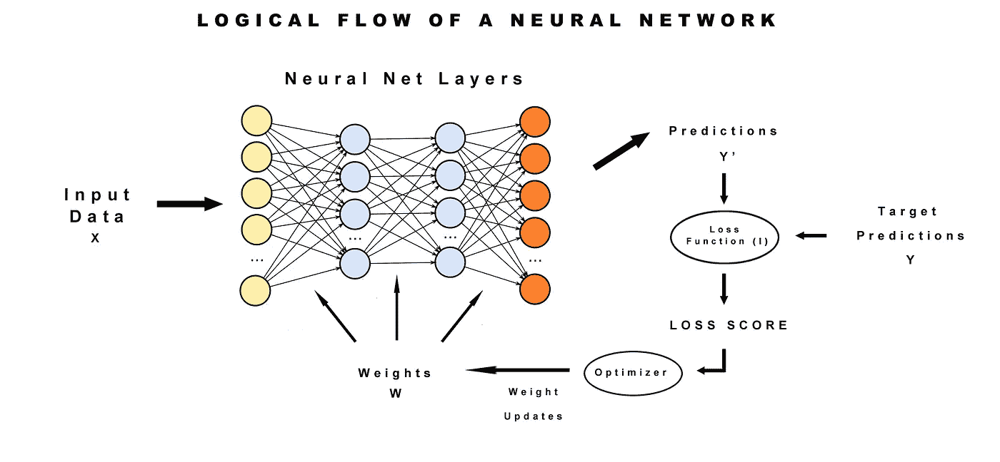*

# ***输入数据***

*在这种情况下，DCNN 的输入数据是一组图像。图像越多越好。与人不同，计算机需要大量的例子来学习如何分类。人工智能研究人员正在研究用更少的数据学习的方法，但这仍然是一个前沿问题。*

*一个著名的例子是 [**ImageNet**](http://www.image-net.org/) 数据集。它由许多手工标记的图像组成。换句话说，他们众包人类使用他们内置的神经网络来查看所有图像，并为数据提供意义。人们上传了他们的照片，并贴上标签，比如“狗”，或者特定类型的狗，比如“小猎犬”。*

*那些**标签代表网络的准确预测**。网络越接近**匹配手工标记的数据(y)** 和它们的**预测(y’)**，网络就越精确。*

***数据分为两部分，一个训练集和测试集**。训练集是我们提供给神经网络的输入。它学习各种对象的关键特征，然后我们测试它是否能在测试图像集中的随机数据上准确地找到这些对象。*

*在我们的程序中，我们将使用由加拿大高级研究所开发的著名的[**CIFAR-10 数据集**](http://www.cs.toronto.edu/~kriz/cifar.html) 。*

*CIFAR-10 有 10 类 60000 张 32x32 的彩色图像，每类 6000 张。我们得到 50000 幅训练图像和 10000 幅测试图像。*

*当我第一次开始使用 CIFAR 时，我错误地认为这将是一个比使用 ImageNet 挑战的更大图像更容易的挑战。事实证明，CIFAR10 更具挑战性，因为这些图像非常小，数量少得多，所以我们的神经网络很难锁定它们的可识别特征。*

*虽然一些最大和最差的 DCNN 架构，如 [ResNet](https://github.com/KaimingHe/deep-residual-networks) 在 ImageNet 上可以达到 97%的准确率，但根据我的经验，它在 CIFAR 10 上只能达到 87%左右。CIFAR 10 目前的技术水平是 [DenseNet](https://github.com/titu1994/DenseNet) ，它可以达到大约 95%的惊人的 250 层和 1500 万个参数！我在文章的底部链接了这些框架，以便进一步研究。但是在深入那些复杂的系统之前，最好从简单的开始。*

*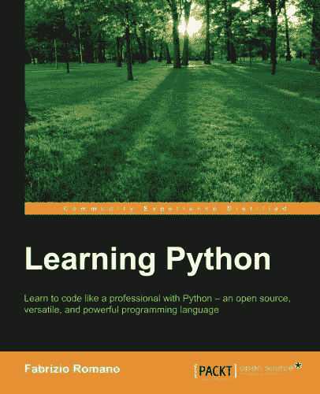*

*理论够了！让我们写代码。*

*如果你对 Python 不太熟悉，我非常、非常、非常推荐 Fabrizio Romano 的 [**学习 Python。这本书很好地解释了一切。我从来没有找到比这更好的 Python 书籍，我有一大堆没有教会我多少东西。**](http://amzn.to/2ldE3fs)*

***我们 DCNN 的代码基于**[**Github**](https://github.com/fchollet/keras/tree/master/examples)**上的 Keras 示例代码。***

***你可以在这里找到** [**我的修改**](https://github.com/the-laughing-monkey/learning-ai-if-you-suck-at-math/tree/master/Deep%20Learning%20Examples) **。***

*我已经调整了架构和参数，并添加了 TensorBoard 来帮助我们可视化网络。*

*让我们初始化 Python 程序，导入数据集和构建 DCNN 所需的各种类。幸运的是，Keras 已经知道如何自动获取这个数据集，所以我们没有太多的工作要做。*

```
*from __future__ import print_function
import numpy as npfrom keras.datasets import cifar10
from keras.callbacks import TensorBoard
from keras.models import Sequential
from keras.layers import Dense, Dropout, Activation, Flatten
from keras.layers import Convolution2D, MaxPooling2D
from keras.utils import np_utils
from keras import backend as K*
```

*我们的神经网络从随机配置开始。这是一个很好的起点，但是我们不应该期望它有一个非常聪明的开始。然而，也有可能一些随机的配置完全出于偶然给了我们惊人的结果，所以我们播种随机权重以确保我们不会因为纯粹的运气而得到最先进的结果！*

```
*np.random.seed(1337) # Very l33t*
```

# ***层***

*现在我们将添加一些层。*

*大多数神经网络使用**全连接层**。这意味着它们将每一个神经元与其他神经元连接起来。*

*完全连接的层非常适合解决各种问题。不幸的是，它们不能很好地适应图像识别。*

*所以我们将使用**卷积层**来构建我们的系统，这是独一无二的，因为**它们没有将所有的神经元连接在一起**。*

*让我们来看看斯坦福大学计算机视觉课程对 convnet 缩放的看法:*

> *在 CIFAR-10 中，图像仅为 32×32×3(32 宽，32 高，3 个颜色通道)，因此常规神经网络的第一隐藏层中的单个全连接神经元将具有 32*32*3 = 3072 个权重。这个数量看起来还是可以管理的，但是很明显这个全连接结构不能扩展到更大的图像。例如，更大尺寸的图像，例如 200×200×3，将导致神经元具有 200×200×3 = 120，000 个权重。此外，我们几乎肯定希望有几个这样的神经元，所以参数会很快增加！显然，这种完全连接是一种浪费，大量的参数会很快导致过度拟合。”*

***过度拟合**是指你对网络训练得如此之好，以至于它在训练数据上表现出色，但当你向它展示它从未见过的图像时却表现糟糕。换句话说，它在现实世界中没有多大用处。*

*这就好像你一遍又一遍地玩同一盘棋，直到你完全记住为止。然后有人在真实的游戏中做出不同的举动，你不知道该怎么办。稍后我们将更多地了解过度拟合。*

*以下是数据如何流经 DCNN。它只查看一小部分数据，寻找模式。然后，它将这些观察建立成更高层次的理解。*

**

*A visual representation of a convolutional neural net from the mNeuron plugin created for MIT’s computer vision courses/teams.*

*注意前几层是简单的图案，如边缘、颜色和基本形状。*

*随着信息在各层之间流动，系统会发现越来越复杂的图案，比如纹理，最终它会推断出各种对象类别。*

*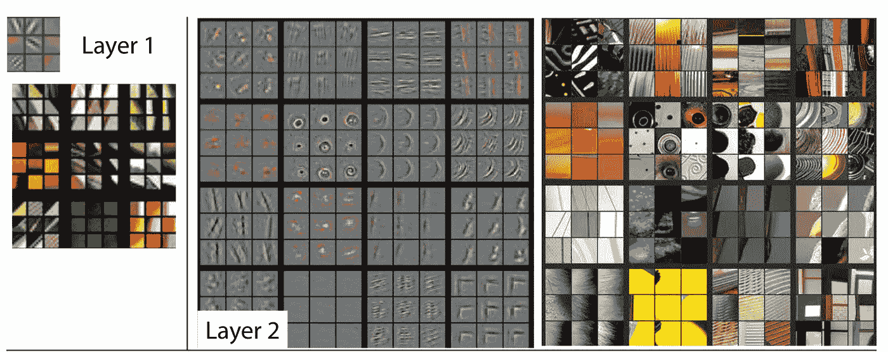*

*这些想法是基于对猫视觉的实验，该实验表明不同的细胞只对特定种类的刺激做出反应，如边缘或特定的颜色。*

*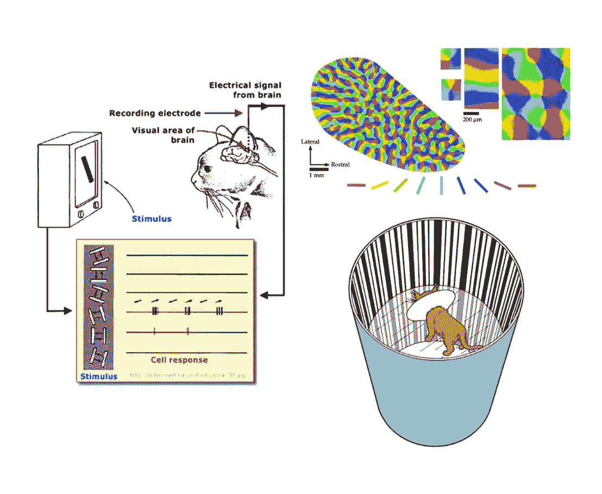*

*[Slides from the excellent Deep Learning open course at Oxford](https://www.youtube.com/watch?v=PlhFWT7vAEw).*

*人类也是如此。我们的视觉细胞只对非常特殊的特征做出反应。*

*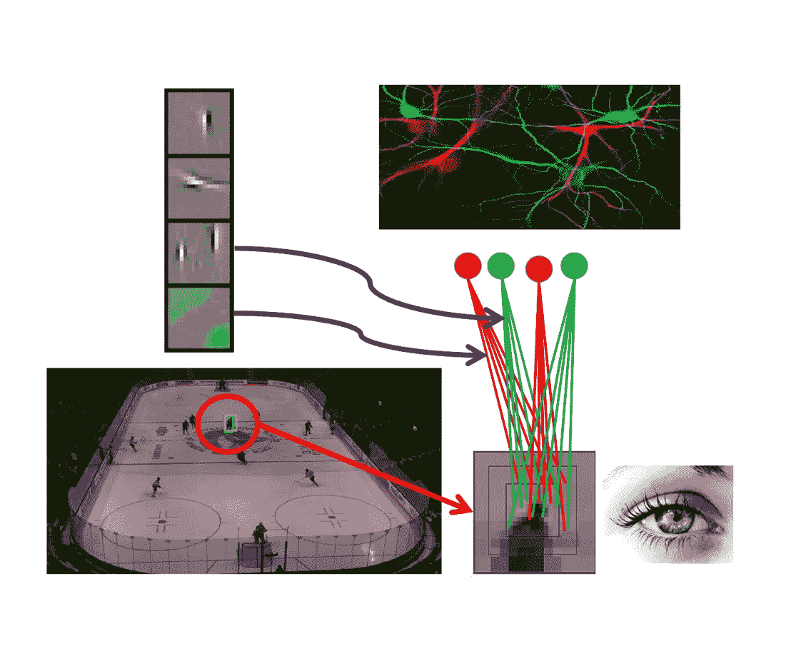*

*这是一个典型的 DCNN 架构图:*

**

*你会注意到那里有第三种层，一个**池层**。你可以在[牛津讲座](https://www.youtube.com/watch?v=bEUX_56Lojc)和[斯坦福讲座](http://cs231n.github.io/convolutional-networks/)中找到各种细节。然而，我将跳过许多细节，因为大多数人只是觉得它令人困惑。我知道当我第一次试着去理解它的时候我是这样做的。*

*以下是您需要了解的关于合并图层的信息。他们的目标很简单。他们做**子采样**。换句话说，它们**缩小了输入图像**，这减少了计算负荷和内存使用。由于需要处理的信息更少，我们可以更轻松地处理图像。*

*它们还有助于减少第二种过度拟合，即网络专注于训练集中的异常，这些异常与挑选狗、鸟或猫没有任何关系。例如，在一组图像上可能有一些混乱的像素或一些镜头眩光。该网络可能会决定镜头眩光和狗在一起，当他们像小行星和婴儿摇铃一样密切相关时。*

*最后，大多数 DCNNs 添加几个**密集连接的**，也称为**完全连接的层**，以处理掉在早期层中检测到的所有特征地图并进行预测。*

*因此，让我们给我们的 convnet 增加几层。*

*首先，我们添加一些变量，我们将拉进我们的层。*

```
*# Defines how many images we will process at once
batch_size = 128# Defines how many types of objects we can detect in this set.  Since CIFAR 10 only detects 10 kinds of objects, we set this to 10.
nb_classes = 10# The epoch defines how lone we train the system.  Longer is not always better.  After a period of time we reach the point of diminishing returns.  Adjust this as necessary.
nb_epoch = 45# Here we put in the image dimensions.  We know the images are 32 x 32\.  They are already preprocessed for us to be nicely uniform to work with at this point.
img_rows, img_cols = 32, 32# Here we set the number of convolutional filters to use
nb_filters = 32# size of pooling area for max pooling
pool_size = (2, 2)
# convolution kernel size
kernel_size = (3, 3)*
```

***内核**和**池大小**定义卷积网络如何通过图像寻找特征。最小的内核大小是 1x1，这意味着我们认为关键特征只有 1 像素宽。典型的内核大小一次检查 3 个像素以上的有用特征，然后将这些特征汇集到一个 2x2 的网格中。*

*2x2 网格从图像中提取特征，并像交易卡一样将它们堆叠起来。这将它们从图像上的特定点断开，并允许系统在任何地方寻找直线或漩涡，而不仅仅是在最初发现它们的点。*

*大多数教程将此描述为处理“[平移不变性](http://stats.stackexchange.com/questions/208936/what-is-translation-invariance-in-computer-vision-and-convolutional-netral-netwo)”*

*这到底是什么意思？好问题。*

*再看一下这张图片:*

**

*如果不像你在第 1 层或第 2 层看到的那样将这些特征拉出来，系统可能会决定猫鼻子的圆圈只在它找到它的图像的中心位置才是重要的。*

*让我们看看这是如何与我的鸽子工作。如果系统最初在她的眼睛里发现了一个圆圈，那么它可能会错误地认为圆圈在图像中的位置与检测猫有关。*

**

*相反，正如我们在下面看到的，系统应该在它们可能漫游的任何地方寻找圆圈。*

**

*在添加图层之前，我们需要加载和处理数据。*

```
*# This splits the data into training and test sets and loads the data.  Cifar10 is a standard test data set for Keras so it can download it automatically.  It's about 186MB expanded.(X_train, y_train), (X_test, y_test) = cifar10.load_data()# Unfortunately, TensorFlow and Theano want their tenor parameters in a different order, so we check for the backend from the json initialization file and set them accordingly.if K.image_dim_ordering() == 'th':
    X_train = X_train.reshape(X_train.shape[0], 3, img_rows, img_cols)
    X_test = X_test.reshape(X_test.shape[0], 3, img_rows, img_cols)
    input_shape = (1, img_rows, img_cols)
else:
    X_train = X_train.reshape(X_train.shape[0], img_rows, img_cols, 3)
    X_test = X_test.reshape(X_test.shape[0], img_rows, img_cols, 3)
    input_shape = (img_rows, img_cols, 3)X_train = X_train.astype('float32')
X_test = X_test.astype('float32')
X_train /= 255
X_test /= 255
print('X_train shape:', X_train.shape)
print(X_train.shape[0], 'train samples')
print(X_test.shape[0], 'test samples')# convert class vectors to binary class matricesY_train = np_utils.to_categorical(y_train, nb_classes)
Y_test = np_utils.to_categorical(y_test, nb_classes)*
```

*好了，现在我们终于可以为程序添加一些层了:*

```
*model = Sequential()model.add(Convolution2D(nb_filters, kernel_size[0], kernel_size[1],
                        border_mode='valid',
                        input_shape=input_shape))
model.add(Activation('relu'))
model.add(Convolution2D(nb_filters, kernel_size[0], kernel_size[1]))
model.add(Activation('relu'))
model.add(MaxPooling2D(pool_size=pool_size))
model.add(Dropout(0.25))*
```

*这些层的堆叠方式如下:*

*   *盘旋*
*   *激活*
*   *盘旋*
*   *激活*
*   *联营*
*   *拒绝传统社会的人*

*除了其中两种类型**脱落**和**激活**之外，我们已经讨论了大多数这些层类型。*

*辍学是最容易理解的。基本上，它是随机杀死多少模型的一个百分比。这与网飞使用[混沌猴](http://techblog.netflix.com/2012/07/chaos-monkey-released-into-wild.html)的方式相似。他们有脚本可以关闭网络中的随机服务器，以确保网络能够以其内置的弹性和冗余生存。这里也是如此。我们想确保网络不太依赖任何一种功能。*

*激活层是决定神经元是“激发”还是“被激活”的一种方式。此时有几十个激活功能。RELU 是最成功的，因为它的计算效率。这里是[Keras 中所有不同类型激活功能的列表](https://keras.io/activations/)。*

*我们还将添加第二个卷积层堆栈，以镜像第一个。如果我们为了效率重写这个程序，我们会创建一个模型生成器，并做一个 for 循环来创建我们想要的任何堆栈。但是在这种情况下，为了方便起见，我们将从上面剪切并粘贴图层，违反了 Python 的禅宗规则。*

```
*model.add(Convolution2D(nb_filters, kernel_size[0], kernel_size[1]))
model.add(Activation('relu'))
model.add(Convolution2D(nb_filters, kernel_size[0], kernel_size[1]))
model.add(Activation('relu'))
model.add(MaxPooling2D(pool_size=pool_size))
model.add(Dropout(0.25))*
```

*最后，我们添加了密集的层，一些更多的脱落层，我们展平了所有的要素地图。*

```
*model.add(Flatten())
model.add(Dense(256))
model.add(Activation('relu'))
model.add(Dropout(0.5))
model.add(Dense(nb_classes))
model.add(Activation('softmax'))*
```

*我们在最后一层使用一种叫做 softmax 的不同类型的激活，因为它定义了类的概率分布。*

# ***重量***

*我们之前简要讨论了重量，但现在我们将深入研究它们。*

***权重是各神经元之间连接的强度**。*

*我们自己也有类似的想法。在你的大脑中，有一系列**生物神经元**。它们通过电/化学信号与其他神经元相连。*

*但是这些联系不是一成不变的。随着时间的推移，一些联系变得更强，一些变得更弱。*

*两个生物神经元之间流动的电化学信号越多，这些联系就越强。本质上，当你有新的经历时，你的大脑会不断地自我重组。它通过加强一些神经元之间的连接，对你的记忆、感觉和关于这些经历的想法进行编码。*

*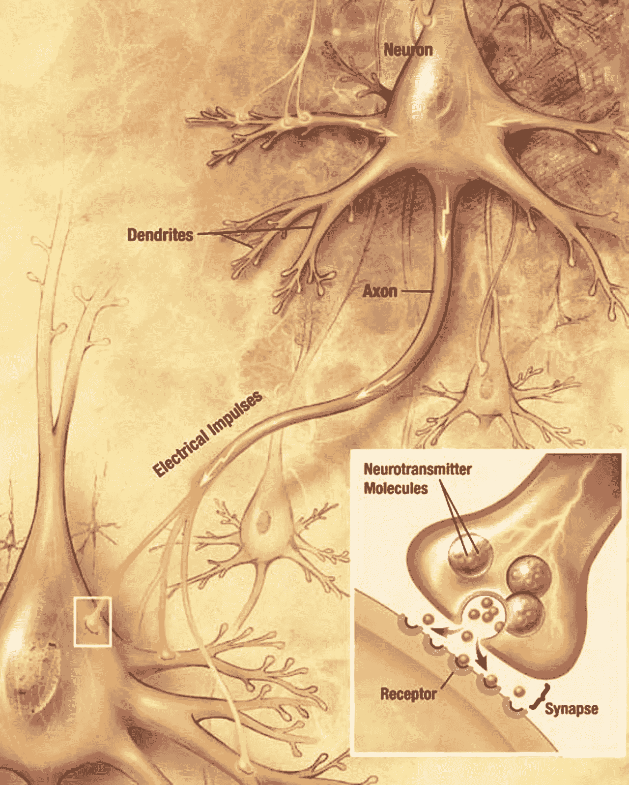*

*Source U.S. National Institute of Health — Wikimedia Commons.*

*基于计算机的神经网络受到生物网络的启发。我们简称它们为**人工神经网络**或**安** s。通常当我们说“神经网络”时，我们真正指的是 ANN。人工神经网络的功能与生物大脑并不完全相同，所以不要错误地认为人工神经网络是某种模拟大脑。不是的。例如，在一个生物神经网络(BNN)中，每个神经元都*而不是*连接到其他每个神经元，而在人工神经网络中，一层中的每个神经元通常都连接到下一层中的每个神经元。*

*下图是一个 BNN，显示了不同神经元之间的连接。请注意，它们是*而不是*链接在一起的。*

*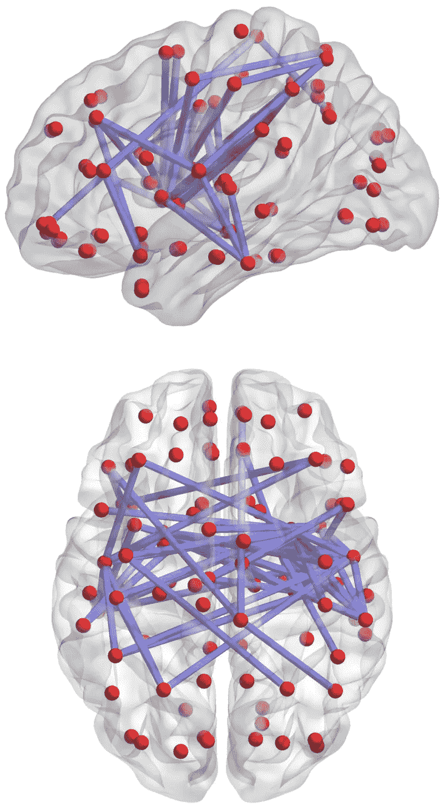*

*Source: [Wikimedia Commons](http://www.plosone.org/article/info%3Adoi%2F10.1371%2Fjournal.pone.0057831): Soon-Beom HongAndrew ZaleskyLuca CocchiAlex FornitoEun-Jung ChoiHo-Hyun KimJeong-Eun SuhChang-Dai KimJae-Won KimSoon-Hyung Yi*

*虽然有许多不同之处，但在 BNNs 和 ann 之间也有很强的相似之处。*

*就像你大脑中的神经元形成更强或更弱的连接一样，我们人工神经网络中的权重定义了神经元之间连接的强度。每个神经元对世界都有一点了解。将它们连接在一起可以让他们在一起时对世界有更全面的看法。那些联系更紧密的人被认为对我们试图解决的问题更重要。*

*让我们来看几个 [**神经网络游乐场的截图，TensorFlow**](http://playground.tensorflow.org/#activation=tanh&batchSize=10&dataset=circle&regDataset=reg-plane&learningRate=0.03&regularizationRate=0&noise=0&networkShape=4,2&seed=0.45414&showTestData=false&discretize=false&percTrainData=50&x=true&y=true&xTimesY=false&xSquared=false&ySquared=false&cosX=false&sinX=false&cosY=false&sinY=false&collectStats=false&problem=classification&initZero=false&hideText=false) 的可视化工具，帮助更好地理解这一点。*

*第一个网络显示了一个简单的六层系统。网络试图做的是**将最右边的图片中的蓝色圆点和橙色圆点清晰地分开**。它在寻找能以高精度区分它们的最佳模式。*

*我还没有开始训练这里的系统。因此，我们可以看到神经元之间的权重基本相等。细虚线表示弱连接，粗线表示强连接。网络以随机权重作为起点进行初始化。*

*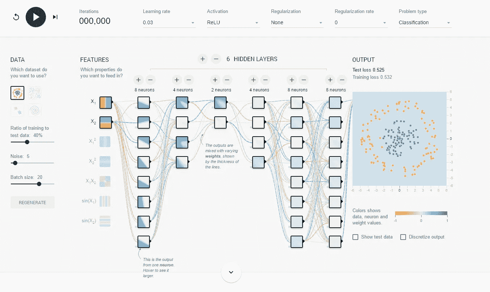*

*现在，让我们来看看训练后的网络。*

*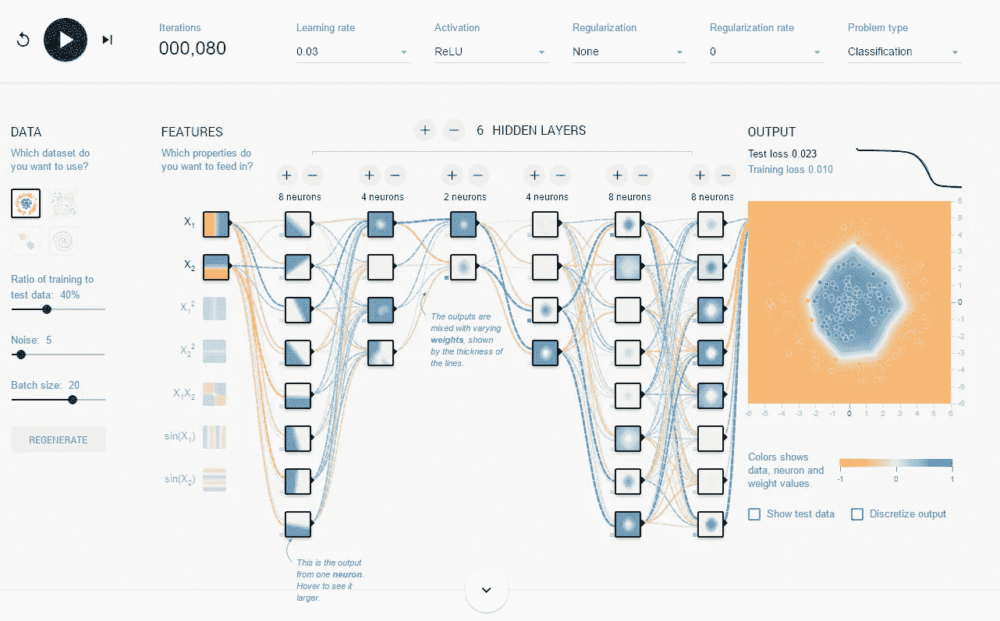*

*首先注意最右边的图片。现在，在蓝点周围的中间有一个漂亮的蓝点，图片的其余部分是橙色的。如你所见，它做得很好，精确度很高。这种情况发生了 80 多个“时代”或训练回合。*

***还要注意，许多权重在不同神经元之间有强烈的蓝色虚线**。重量增加了，现在这个系统已经训练好了，准备好面对世界了！*

# *训练我们的神经网络并优化它*

*现在让模型处理一些数字。为此，我们编译它并设置它的**优化器**函数。*

```
*model.compile(loss='categorical_crossentropy',
              optimizer='adam',
              metrics=['accuracy'])*
```

*我花了很长时间才理解优化器的功能，因为我发现大多数解释都忽略了“什么”背后的“为什么”*

*换句话说，我为什么需要一个优化器？*

*记住，一个网络有**目标预测 y** ，当它经过多次训练后，它会做出新的**预测 y’**。系统根据测试数据集中的随机样本测试这些预测，并确定系统的**验证准确性**。一个系统可以在训练数据上达到 99%的准确性，而在测试图像上只能达到 50%或 70%，因此游戏的真正名称是验证准确性，而不是准确性。*

***优化器计算误差函数相对于模型权重的梯度(在数学术语中也称为偏导数**)。*

*那是什么意思？想象一下分布在 3D 丘陵地形上的权重(如下图所示)，这被称为“误差地形”景观的“坐标”代表特定的权重配置(如地图上的坐标)，而景观的“高度”对应于不同权重配置的总误差/成本。*

**

*Error landscape*

***优化器**有一个重要的功能。它计算出**如何调整权重以尽量减小误差**。它是通过从微积分书上取一页来做到这一点的。*

*什么是微积分？如果你翻开任何一本数学教科书，你都会发现一些超级无用的解释，比如这都是关于计算导数或微分的。但是这到底是什么意思呢？*

*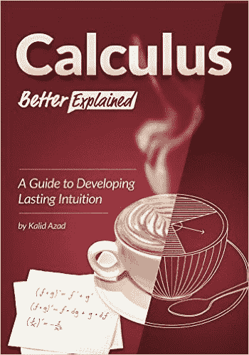*

*直到看了[**Calculus Better Explained，作者 Kalid Azad**](http://amzn.to/2lOCeJT) 才明白。*

*这是没人愿意解释的。*

***微积分做两件事:***

*   *将事物分解成更小的块，也就是将一个圆分解成环。*
*   *计算出变化率。*

*换句话说，如果我把一个圆切成环:*

*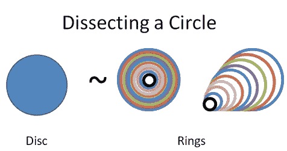*

*Courtesy of the awesome [Calculus Explained website](https://betterexplained.com/calculus/).*

*我可以展开这些环来做一些简单的数学计算:*

**

*嘭！*

*在我们的例子中，我们运行了一系列测试，调整了网络的权重，但是我们真的有更好的解决问题的方法吗？优化器告诉我们！*

*你可以在这里或者在[斯坦福课程](http://cs231n.github.io/optimization-1/)中读到**梯度下降**和[的大量细节，但是你可能会像我一样发现它们在细节上很长，而在为什么的关键问题上很轻。](http://sebastianruder.com/optimizing-gradient-descent/)*

*本质上，你要做的是尽量减少错误。这有点像在雾中开车。在这篇文章的早期版本中，我把梯度下降描述为一种寻找最优解的方法。但实际上，根本没有办法知道我们是否有一个“最优”的解决方案。如果我们知道那是什么，我们会直接去做。相反，我们试图找到一个“更好”的解决方案。这有点像进化。我们找到了足够适合生存的东西，但这并不意味着我们创造了爱因斯坦！*

*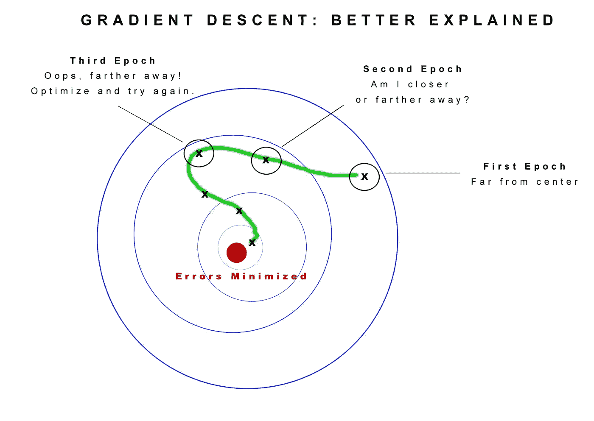*

***想象一下你小时候玩马可波罗时的梯度下降**。*

*你闭上眼睛，你所有的朋友都在泳池里散开。你喊出“马可”，所有的孩子都必须回答“波罗”你用你的耳朵来判断你是越来越近还是越来越远。如果你在更远的地方，你会调整并尝试一条不同的道路。如果你靠近一点，你会一直朝那个方向走。在这里，我们要弄清楚如何最好地调整网络的权重，以帮助他们更好地了解世界。*

*我们选择了本文中描述的“adam”优化器[。我发现通过强力改变我的程序，似乎能产生最好的结果。这就是数据科学的艺术。没有一种算法可以统治所有这些问题。如果我改变网络的架构，我可能会发现不同的优化器工作得更好。](https://arxiv.org/abs/1412.6980)*

*以下是 Keras 中各种优化器的列表。*

*接下来，我们设置 TensorBoard，这样我们就可以直观地了解网络的运行情况。*

```
*# Set up TensorBoard
tb = TensorBoard(log_dir='./logs')*
```

*我们所做的只是创建一个日志目录。现在，我们将训练模型，并将 TensorBoard 指向原木。*

```
*model.fit(X_train, Y_train, batch_size=batch_size, nb_epoch=nb_epoch, verbose=1, validation_data=(X_test, Y_test), callbacks=[tb])score = model.evaluate(X_test, Y_test, verbose=0)print('Test score:', score[0])
print("Accuracy: %.2f%%" % (score[1]*100))*
```

*好吧，让我们把这个坏小子点燃，看看效果如何！*

```
*50000/50000 [==============================] - 3s - loss: 0.4894 - acc: 0.8253 - val_loss: 0.6288 - val_acc: 0.7908
Epoch 89/100
50000/50000 [==============================] - 3s - loss: 0.4834 - acc: 0.8269 - val_loss: 0.6286 - val_acc: 0.7911
Epoch 90/100
50000/50000 [==============================] - 3s - loss: 0.4908 - acc: 0.8224 - val_loss: 0.6169 - val_acc: 0.7951
Epoch 91/100
50000/50000 [==============================] - 4s - loss: 0.4817 - acc: 0.8238 - val_loss: 0.6052 - val_acc: 0.7952
Epoch 92/100
50000/50000 [==============================] - 4s - loss: 0.4863 - acc: 0.8228 - val_loss: 0.6151 - val_acc: 0.7930
Epoch 93/100
50000/50000 [==============================] - 3s - loss: 0.4837 - acc: 0.8255 - val_loss: 0.6209 - val_acc: 0.7964
Epoch 94/100
50000/50000 [==============================] - 4s - loss: 0.4874 - acc: 0.8260 - val_loss: 0.6086 - val_acc: 0.7967
Epoch 95/100
50000/50000 [==============================] - 3s - loss: 0.4849 - acc: 0.8248 - val_loss: 0.6206 - val_acc: 0.7919
Epoch 96/100
50000/50000 [==============================] - 4s - loss: 0.4812 - acc: 0.8256 - val_loss: 0.6088 - val_acc: 0.7994
Epoch 97/100
50000/50000 [==============================] - 3s - loss: 0.4885 - acc: 0.8246 - val_loss: 0.6119 - val_acc: 0.7929
Epoch 98/100
50000/50000 [==============================] - 3s - loss: 0.4773 - acc: 0.8282 - val_loss: 0.6243 - val_acc: 0.7918
Epoch 99/100
50000/50000 [==============================] - 3s - loss: 0.4811 - acc: 0.8271 - val_loss: 0.6201 - val_acc: 0.7975
Epoch 100/100
50000/50000 [==============================] - 3s - loss: 0.4752 - acc: 0.8299 - val_loss: 0.6140 - val_acc: 0.7935
Test score: 0.613968349266
Accuracy: 79.35%*
```

*我们在 100 个纪元后达到了 79%的准确率。对于几行代码来说还不错。现在你可能认为 79%没那么好，但请记住，在 2011 年，这比 Imagenet 上的最先进水平要好，而且花了十年才达到这一水平！我们只用 Keras Github 的一些示例代码和一些调整就做到了这一点。*

**

*你会注意到 2012 年是新想法开始出现的时候。*

*人工智能研究人员 Alex Krizhevsky，Ilya Sutskever 和 Geoffrey Hinton 开发的 AlexNet 是第一个橙色点。它标志着当前深度学习复兴的开始。到第二年，每个人都在使用深度学习。到 2014 年，获奖的架构比人类水平的图像识别更好。*

*即便如此，这些架构通常与某些类型的问题紧密相关。当今最流行的几个架构，像[**【ResNet】**](https://github.com/raghakot/keras-resnet)和**谷歌的** [**盗梦空间 V3**](https://github.com/tensorflow/models/tree/master/inception)**do**[**在微小的 CIFAR10 镜像**](http://oduerr.github.io/blog/2016/04/06/Deep-Learning_for_lazybones) 上只有 88%。它们在更大的 CIFAR100 设备上表现得更差。*

*目前的艺术状态是 **DenseNet** ，它在 2016 年赢得了去年的 ImageNet 大赛。它啃过 CIFAR10，**达到了惊人的 94.81%的准确率**拥有令人疯狂的深度 250 层和 1530 万个连接！跑起来绝对是个怪物。在一台 Nvidia 1080GTX 上，如果你用 40 x 12 型号运行它，达到你在下面的图表中看到的 93%的准确率，它将需要一个月才能运行。哎哟！*

*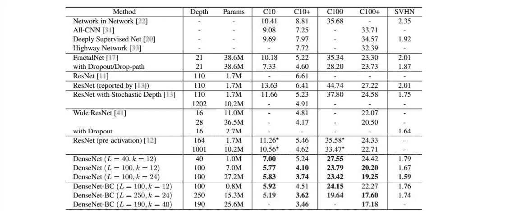*

*也就是说，我鼓励你深入研究这些模型，看看你能从中学到什么。*

*我做了一些实验，并通过蛮力实验成功地拼凑了一个奇怪的架构，仅使用 Keras 层中的构建，没有自定义层，就达到了 81.40%的准确率。 [**你可以在 Github 这里找到**](https://github.com/the-laughing-monkey/learning-ai-if-you-suck-at-math/blob/master/Deep%20Learning%20Examples/keras-example-simple-convnet-15c6.py) **。***

```
 *Epoch 70/75
 50000/50000 [==============================] - 10s - loss: 0.3503 - acc: 0.8761 - val_loss: 0.6229 - val_acc: 0.8070
 Epoch 71/75
 50000/50000 [==============================] - 10s - loss: 0.3602 - acc: 0.8740 - val_loss: 0.6039 - val_acc: 0.8085
 Epoch 72/75
 50000/50000 [==============================] - 10s - loss: 0.3543 - acc: 0.8753 - val_loss: 0.5986 - val_acc: 0.8094
 Epoch 73/75
 50000/50000 [==============================] - 10s - loss: 0.3461 - acc: 0.8780 - val_loss: 0.6052 - val_acc: 0.8147
 Epoch 74/75
 50000/50000 [==============================] - 10s - loss: 0.3418 - acc: 0.8775 - val_loss: 0.6457 - val_acc: 0.8019
 Epoch 75/75
 50000/50000 [==============================] - 10s - loss: 0.3440 - acc: 0.8776 - val_loss: 0.5992 - val_acc: 0.8140
 Test score: 0.599217191744
 Accuracy: 81.40%*
```

*我们可以加载 TensorBoard 来可视化我们的表现。*

```
*tensorboard --logdir=./logs*
```

*现在打开浏览器，转到以下 URL:*

```
*127.0.1.1:6006*
```

*这是一段时间以来的培训截图。*

*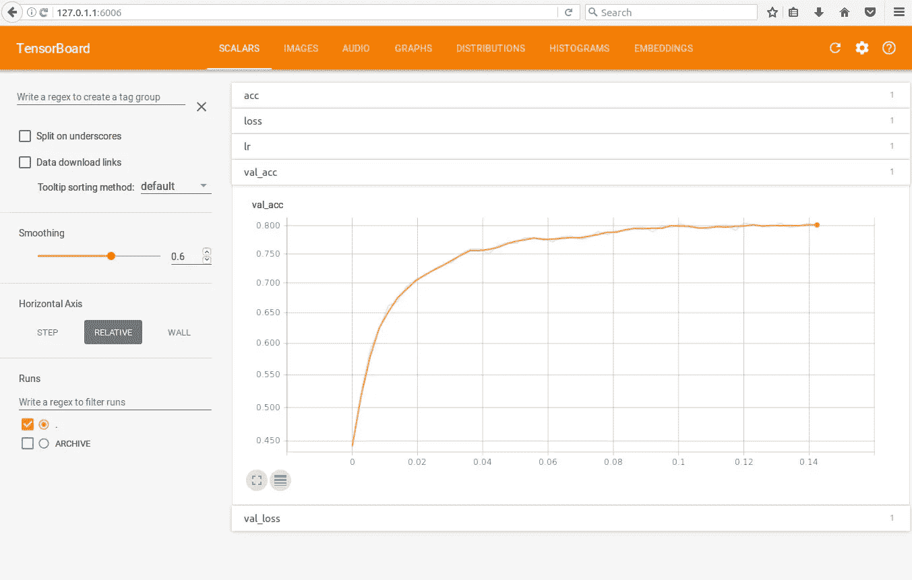*

*你可以看到我们很快开始超过收益递减点，大约在 35 个时期和 79%。剩下的时间花在将它提高到 81.40%上，并且可能在超过 75 个时期时过度拟合。*

*那么你会如何改进这个模型呢？*

*以下是一些策略:*

*   *实现您自己的自定义层*
*   *做图像增强，比如翻转图像，增强图像，扭曲图像，克隆图像等等*
*   *深入一点*
*   *更改图层上的设置*
*   *通读获奖的架构论文，并堆积出你自己的具有相似特征的模型*

*因此，你已经达到了真正的数据科学艺术，即使用你的大脑来理解数据，并手工制作一个模型来更好地理解它。也许你会深入研究 CIFAR10，并注意到提高这些图像的对比度真的会使图像突出。干吧！*

*不要害怕在 Photoshop 中加载东西，并开始摆弄过滤器，看看图像是否变得更清晰。弄清楚是否可以用 Keras 图像处理函数做同样的事情。*

*深度学习远非灵丹妙药。做正确的事需要耐心和奉献。*

*它可以做令人难以置信的事情，但你可能会发现自己粘在你的工作站上，看着数字滴答几个小时，直到凌晨 2 点，毫无进展。*

***但随后你有了突破！***

*这有点像神经网络经历的反复试验。尝试一些东西，更接近答案。试试别的，离远点。*

*我现在正在探索[如何使用遗传算法来自动进化神经网络](http://nn.cs.utexas.edu/?neat)。在这方面已经做了很多工作，但是还不够！*

*最终，我们将达到这样一个点，即通过引入一些库和一些预先训练的权重文件，许多架构都已成熟并易于实现，但这是企业 it 几年后的事情。*

*这个领域仍在快速发展，每天都有新的想法出现。好消息是，你正处于这波浪潮的早期。所以，放松一下，开始玩你自己的模型吧。*

*学习。实验。学习。*

*做那件事，你不会出错的。*

*[**学习人工智能如果你数学很差——第一部分**](https://hackernoon.com/learning-ai-if-you-suck-at-math-8bdfb4b79037#.ng7ggn5d9)**——这篇文章将指导你阅读一些必要的书籍，如果你从来都不是数学迷，但作为一个成年人你正在学习它。***

***[**学习人工智能如果你数学很差——第二部分**](https://hackernoon.com/learning-ai-if-you-suck-at-math-part-two-practical-projects-47d7a1e4e21f#.yo1o1ar5h)**——实际项目**——这篇文章指导你如何开始你的第一个项目。***

***[**数学不好就学人工智能——第三部分**](https://hackernoon.com/learning-ai-if-you-suck-at-math-p3-building-an-ai-dream-machine-or-budget-friendly-special-d5a3023140ef#.6frka033t)**——打造人工智能梦想机器**——本文指导你获得一个强大的深度学习机器设置，并安装了所有最新最棒的框架。***

***[**数学烂就学 AI——第四部分——张量图解(带猫！)**](https://hackernoon.com/learning-ai-if-you-suck-at-math-p4-tensors-illustrated-with-cats-27f0002c9b32#.2jpelkuhd) —这个回答了一个古老的谜团:张量到底是个什么鬼？***

***[**学 AI 如果你数学很烂——第 5 部分——深度学习和卷积神经网络用简单的英语说**](https://hackernoon.com/learning-ai-if-you-suck-at-math-p5-deep-learning-and-convolutional-neural-nets-in-plain-english-cda79679bbe3#.xjah79lsd)——在这里我们创建了我们的第一个 Python 程序，并探索神经网络的内部工作原理！***

***[**学人工智能如果你数学很烂——第六部分——数学符号变得简单**](https://hackernoon.com/learning-ai-if-you-suck-at-math-p6-math-notation-made-easy-1277d76a1fe5)——还在努力理解那些有趣的小符号吗？让我们现在就改变这一切！***

***[**学 AI 如果你数学很烂——第七部分——自然语言处理的魔力**](https://hackernoon.com/learning-ai-if-you-suck-at-math-p7-the-magic-of-natural-language-processing-f3819a689386)——了解谷歌和 Siri 如何理解你喃喃自语。***

***############################################***

***如果你喜欢我的作品，请让我有幸参观我的作品，因为这是我们一起改变未来的方式。帮我脱离母体，我会加倍回报你的慷慨，把我所有的时间和精力放在写作、研究和为你和世界提供令人惊奇的内容上。***

***###########################################***

***如果你喜欢这个教程，我希望你能鼓掌推荐给其他人。之后，请随时将文章通过电子邮件发送给朋友！非常感谢。***

***###########################################***

******

***简单介绍一下我:我是一名作家、工程师和连续创业者。在过去的二十年中，我涉及了从 Linux 到虚拟化和容器的广泛技术。***

***你可以看看我的最新小说， [***这是一部史诗般的中国科幻内战传奇***](http://amzn.to/2gAg249) *在这部小说中，中国摆脱了共产主义的枷锁，成为世界上第一个直接民主国家，运行着一个高度先进的、人工智能的去中心化应用平台，没有领导人。****

## ***[***加入我的读者群就可以免费获得我的第一部小说《蝎子游戏》***](http://meuploads.com/join-my-readers-group/) ***。*** *读者们称之为* ***【第一次神经癌的严重竞争】*******黑色侦探遇上约翰尼助记术。*******

## *****最后，你可以 [**加入我的私人脸书小组，纳米机器人后人类刺客**](https://www.facebook.com/groups/1736763229929363/) **，在这里我们讨论所有的科技、科幻、幻想等等。*******

*****############################################*****

*****我偶尔会从我文章中的链接赚钱，但我只推荐我拥有、使用和喜欢的东西。在这里查看我的[完整保单](http://meuploads.com/disclosure/)。*****

*****############################################*****

*****感谢阅读！*****

*****[](http://bit.ly/HackernoonFB)**********[](https://goo.gl/k7XYbx)**********[](https://goo.gl/4ofytp)*****

> *****[黑客中午](http://bit.ly/Hackernoon)是黑客如何开始他们的下午。我们是 [@AMI](http://bit.ly/atAMIatAMI) 家庭的一员。我们现在[接受投稿](http://bit.ly/hackernoonsubmission)并乐意[讨论广告&赞助](mailto:partners@amipublications.com)机会。*****
> 
> *****如果你喜欢这个故事，我们推荐你阅读我们的[最新科技故事](http://bit.ly/hackernoonlatestt)和[趋势科技故事](https://hackernoon.com/trending)。直到下一次，不要把世界的现实想当然！*****

**********