# 如果你数学很差，学习人工智能——P6——数学符号变得简单！

> 原文：<https://medium.com/hackernoon/learning-ai-if-you-suck-at-math-p6-math-notation-made-easy-1277d76a1fe5>


如果你已经看过这个系列的第 [1](https://hackernoon.com/learning-ai-if-you-suck-at-math-8bdfb4b79037#.wb9byq3o3) 、 [2](https://hackernoon.com/learning-ai-if-you-suck-at-math-part-two-practical-projects-47d7a1e4e21f#.x87xwbgx0) 、 [3](https://hackernoon.com/learning-ai-if-you-suck-at-math-p3-building-an-ai-dream-machine-or-budget-friendly-special-d5a3023140ef#.9xzlb0cee) 、 [4](https://hackernoon.com/learning-ai-if-you-suck-at-math-p4-tensors-illustrated-with-cats-27f0002c9b32#.g606budcf) 、 [5](https://hackernoon.com/learning-ai-if-you-suck-at-math-p5-deep-learning-and-convolutional-neural-nets-in-plain-english-cda79679bbe3#.xjah79lsd) 和 [7](https://hackernoon.com/learning-ai-if-you-suck-at-math-p7-the-magic-of-natural-language-processing-f3819a689386) 部分，你就知道你真的不需要太多的数学知识就能开始学习人工智能。你可以直接阅读关于这个主题的实用教程和书籍。

然而，学习数学符号有很多原因。

也许你只是想舒展一下自己，学一门新技能？在你的舒适区之外学习一些东西是保持思维敏捷的极好方法。

或者也许你想开始阅读一些关于 arXiv 的论文？你甚至可能想要实现一个令人兴奋的新的研究论文想法，而不是等着别人把它放到 Github 上。

要做到这一点，你需要知道如何阅读那些有趣的小符号。

也许学习数学符号的最大原因是它能让你以一种非常简洁的方式表达复杂的想法。

没有它，解释每一个方程式就要花费一页又一页的时间。

然而，即使有这么多的资源，面对一连串的外星字符仍然会令人生畏。

不要害怕。我是来帮忙的。

我会让你知道学习这些符号并没有你想象的那么难。但是有一些事情阻碍了你。

首先，如果你像我一样，你小时候讨厌数学。我发现关键的原因是我的老师从不费心回答最重要的问题:

*为什么？*

我为什么要这么做？这个*如何将*应用到我的生活中？

他们只是在黑板上拍了一堆方程式，让我记住它们。那对我没用，我打赌对你也没用。

好消息是，如果你对令人兴奋的人工智能领域感兴趣，这是对这个问题的一个很好的回答！

现在你有了一个*理由去学习*并且*把它应用到现实世界的问题*。这个“为什么”是因为你想写一个更好的图像识别程序或者一个理解自然语言的界面！也许有一天你甚至想写自己的算法？

阻碍你的第二件事是有太多可怕的解释。事实是大多数人不太擅长解释事情。大多数时候人们用更多的数学术语来定义数学术语。这就造成了一种误解的无限循环。这就像用“大象像大象”来定义“大象”这个词一样。太好了。现在我明白了。不是！

我将通过把它与现实世界联系起来，并用你已经知道的事物来类比，来帮助你获得更坚实的基础。

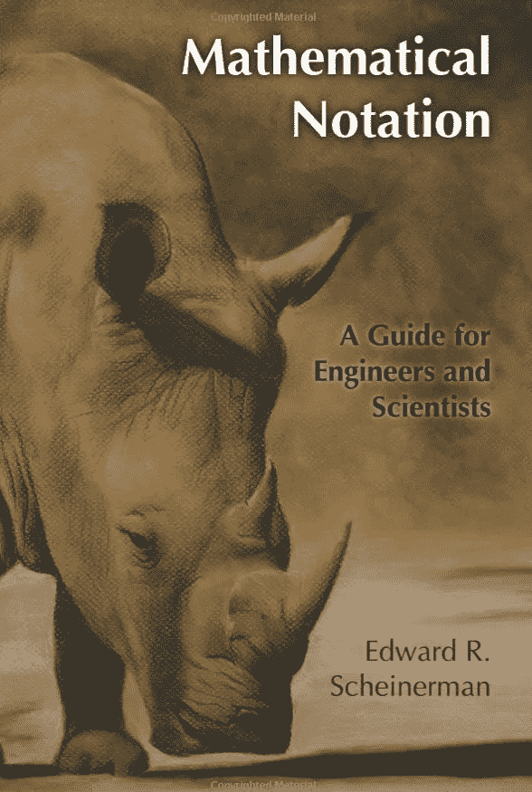

我无法在一篇文章中涵盖你需要的所有符号，所以你会想拿起这本超级紧凑的数学符号指南， [**数学符号:工程师和科学家指南**](http://amzn.to/2mVgWep) ，如果你还没有的话。(这是我第一篇[学习人工智能，如果你数学很差](https://hackernoon.com/learning-ai-if-you-suck-at-math-8bdfb4b79037#.wb9byq3o3)文章的后期补充，但它已经成为我最常用的书籍之一。它充满了亮点和折角页。随着我对各种数学学科知识的扩展，我发现自己一次又一次地回到那本书上。

让我们开始吧。

首先，**什么是算法**？

其实就是解决一个特定问题的一系列步骤而已。不管你知不知道，你总是在使用算法。

如果你需要为孩子们打包午餐，把他们送到学校，在上班前拿到干洗的衣服，你已经无意识地列出了一系列从厨房到办公室的步骤。那是一种算法。如果你的老板给了你六项占用你时间的任务，你必须找出在一天结束前完成它们的最佳方式，选择先做、后做、并行做等等。那是一种算法。

为什么这很重要？**因为方程也只是解决问题的一系列步骤。**

让我们从一些简单的符号开始，逐步建立一些等式。

**数学是关于转换事物的**。我们有一个**输入**和一个**输出**。我们将一些东西插入方程的变量中，迭代这些步骤，得到一个输出。电脑也是一样。现在，神经网络背后的大部分魔力来自数学的三个分支:

*   **线性代数**
*   **集合论**
*   **微积分**

什么是集合？是一个东西的集合，通常用花括号{}或者方括号括起来。(数学爱好者并不总是同意所有事物的最佳符号):

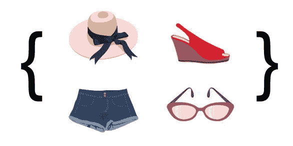

A Set

还记得我们在第四部分中看到的张量吗？那是一套。

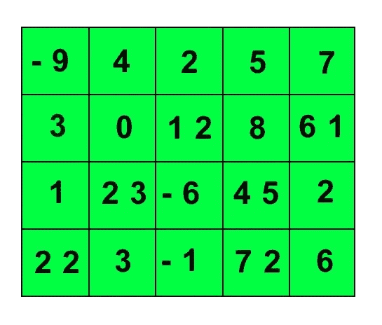

**集合通常由大写字母**变量表示，如 **A** 或 **B** 或 **V** 或 **W** 。只要你始终如一，这封信本身并不重要。

但是，某些大写字母和符号是为重要的、众所周知的数字集合保留的，例如:

**∅ =空集(还没有任何东西的集合)。顺便说一下，这个符号是一个希腊字母，叫做“phi”。希腊字母在数学中被频繁使用。[你可以在这里看到它们的大小写版本](https://en.wikipedia.org/wiki/Greek_letters_used_in_mathematics,_science,_and_engineering)。**

**R** = **所有实数**(实数几乎是存在的每一个数，包括整数、分数、像 Pi(π)(3.14159265……)这样的超越数，但不包括虚数(编出来解不可能方程的数)和无穷大。

Z =所有的整数(不带分数的整数，-1，-2，0，1，2，3 等)

你可以在[数学很有趣网站](http://www.mathsisfun.com/sets/number-types.html)上看到所有主要保留字母的列表。

所有这些都是集合，其中一些是子集，这意味着它们完全包含在更大的集合中，如下所示:

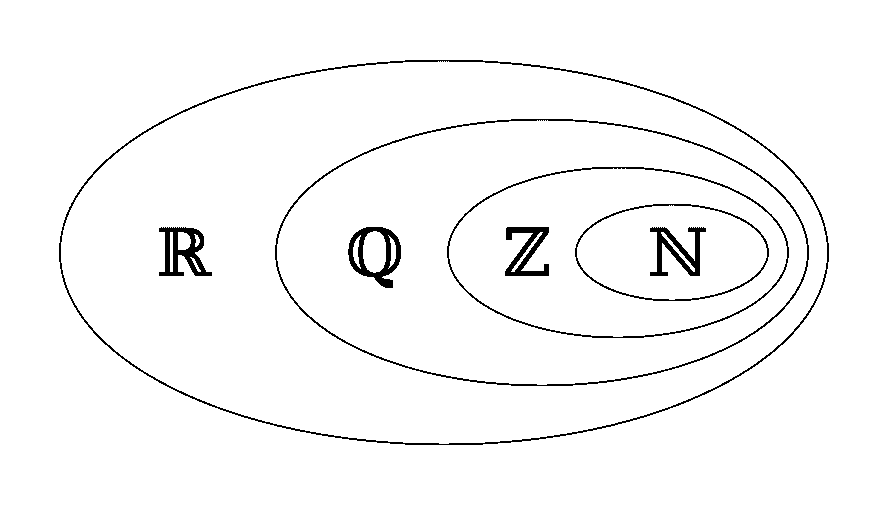

Go ahead and look up what Q and N mean!

在这种情况下，我们会说, **Z(整数)是 R(实数)的子集。)**

我们可以这样写:

*   *A* 是 *B:* 的**子集**

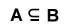

*   相反，A 是 *B:* 的**超集**


我为什么要关心集合 B 是否包含集合 A 的所有内容呢？好问题。

假设一个集合包含所有居住在美国的人，以及他们的年龄、地址等。现在想象一下，另一组包括心脏病发病率较高的人。两组数据的重叠可以告诉我这个国家的哪些地区有更多的心脏病问题。

每个集合内部都有元素。什么是元素？只是大背景的一部分。让我们再来看看我们的张量。

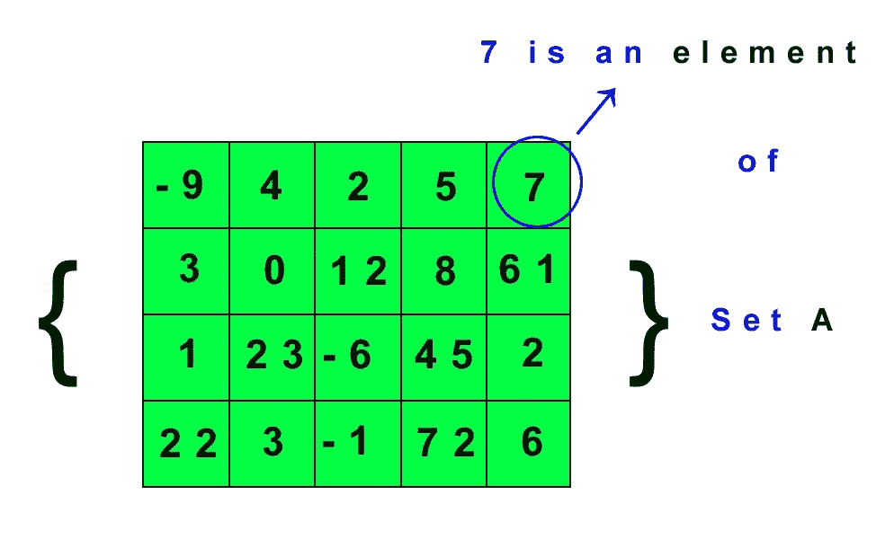

我们用一个小斜体变量来表示集合中的元素，比如 ***x*** 。我们使用看起来很奇怪的符号(虽然不是 E)来表示一个元素是集合的一部分。我们可以这样写:

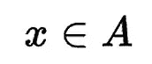

这意味着 x 是集合 A 的一个元素。

我们也可以说 *x* 不是 A:的元素。

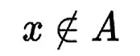

你阅读这些符号的能力越强，你就越能在头脑中智能地“通读”这串字符。当你看到上面的内容时，你可以说“ **x 不是集合 A** 的元素”。你越能清楚地表达你正在阅读的东西，你就越能理解它。

当然，写出一个集合中的所有元素是不切实际的，所以我们可以用一种特殊的方式写出一个序列中的所有元素。假设我们有一系列数字，每次增加 1。我们可以这样写:

**x = {1，2，3，4… *n* }**

**点只是表示系列一直持续到 n，**为止，其中 n 是系列结尾的一个替代变量因此，如果 n = 10，集合包含从 1 到 10 的数字范围。如果 n = 100，这是从 1 到 100 的数字范围。

# 方程式疯狂

当我们用线性代数变换集合时，它们是有趣的。你已经知道了大多数主要的代数符号，比如加法的 **+和减法的**。

让我们看两个新符号和一个等式。首先是符号:

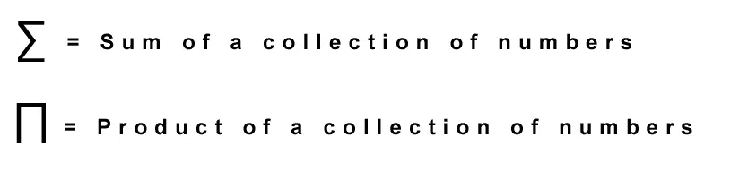

什么是总和？它是一个数列中所有数字的相加。假设我们有一个向量集 **A** (记住向量是一行或一列数字)，它包含: **{1，2，3，4，5}** 。

这一系列的总和将是:

**1 + 2 + 3 + 4 + 5 = 15**

乘积是所有数字的乘积。所以如果我们取同一个集合 A 我们得到:

**1 x 2 x 3 x 4 x 5 =120**

我们可以这样简洁地表示一系列数的和方程:

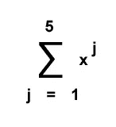

那么我们该如何解读呢？简单。看看这个:

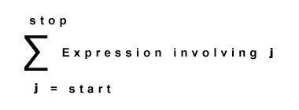

我们**从 j** 的底部 **开始，这是一个变量。我们将**移到右边，并将 j 插入表达式**。最后，我们知道**系列在顶部给出的数字**处停止。让我们看一个例子。**

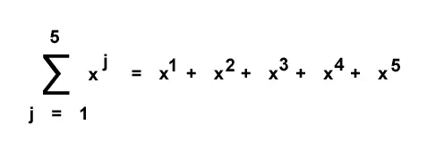

如果你是程序员，你可能会意识到这是一个 for 循环！

让我们用 Python 为这个等式创建一个小函数:

```
def sum_x_range(x):
 j = 1
 output = []   # creates an empty list
 for k in range(0,5):  # starts a for loop
  z = x**j      # raises x to the power of j
  j = j + 1     # raises j by 1 until it hits n which is 5
  output.append[z]   # append the output to a list
 return sum(output)  # sum all the numbers in the listprint (sum_x_range(2))   # call the function with input 2 for x
```

原谅我丑陋的 Python 伙伴，但我要的是清晰，而不是紧凑。

**符号表示 j 的幂。该函数采用变量 x，我将它作为 2 提供。然后，它从 0 到 5 循环，使 x 的幂为 1，2，3，4，5，并将这些数字追加到一个列表中。然后，它对该列表进行求和，得到答案:62

# 进入矩阵

记住，2D 张量叫做矩阵。它基本上是一个电子表格，有行和列。首先，你需要知道如何引用矩阵的不同部分。这张图片为您展示了一切:

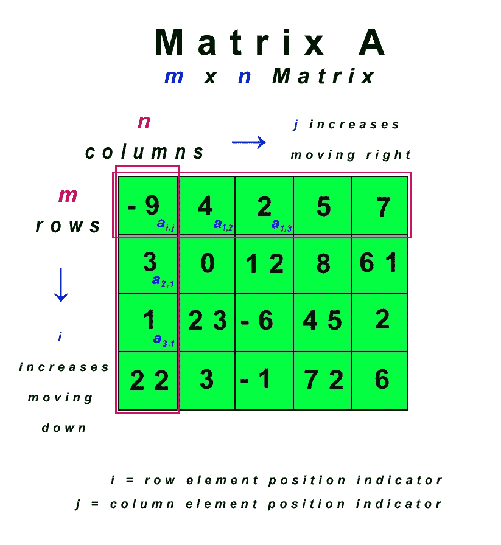

首先，我们有一个**矩阵 A，用大写字母**表示。

那个矩阵有 ***m 行*** 和 ***n 列*** ，所以我们说它是一个***m×n 矩阵，用小斜体字母*** 。

**行是水平的，也就是从左到右。(不要被箭头所迷惑，箭头指向的是 *i* 和 *j* 而不是该行的方向。同样，行是水平的！)**

**柱子是垂直的，又名上下。**

在这种情况下，我们有 4×5 矩阵(又名 2D 张量)，因为我们有 4 行和 5 列。

**每个盒子都是矩阵**的一个元素。这些元素的位置由一个**小斜体字*一个*一个**以及一个**行指示器*I*和一个**列指示器*j*来指示。****

所以顶行第二列的 4 用 ***a1 表示，2 用*** 表示。第二行第一列的 3 是 ***a2，1 是*** 。

我们没有时间在这里讨论所有类型的矩阵数学，但是让我们先来看看其中的一种类型。

点积是神经网络中非常常见的操作，所以让我们来看看它的实际操作。

# 点，点，点

**点积**就是我们如何用一个矩阵乘以另一个矩阵。

点积运算用一个点来表示，你猜对了。

**a . b**

这是两个标量(也就是单个数字)的点积，这两个标量是矩阵中的单个元素。

**我们将相同大小和形状的矩阵**和**之间的匹配元素相乘，然后求和**。

想看看一个向量乘以另一个向量的公式吗？

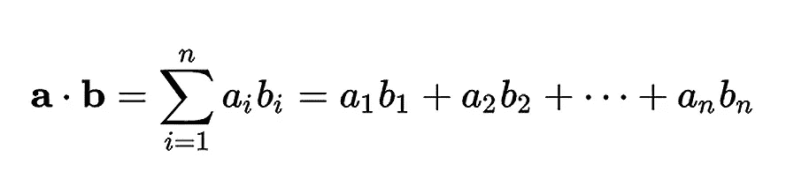

深呼吸。你能行的！

我们现在知道所有这些符号。

这是**乘以两个等长向量**的公式。请记住《学习人工智能的第四部分:如果你数学很差——用猫来说明张量》中的内容向量是一行或一列数字。**每一行或每一列都是我们矩阵中的一个单独的向量。**

基本上我们**从矩阵 A** 中的元素一开始，然后**乘以矩阵 B** 中的元素一。然后我们移动到元素 A2 乘以元素 B2。**我们对所有元素都这样做，直到到达末尾“n”，然后将它们相加(也就是将它们加在一起)**。

让我们来看一个可视化的演示。

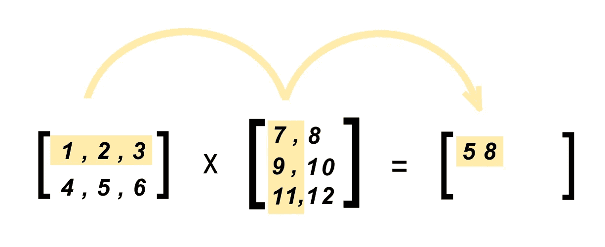

现在我们可以把这些数字代入我们的公式:

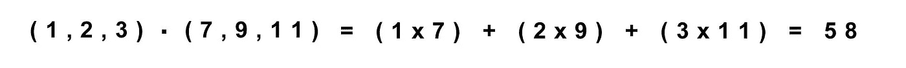

这是输出矩阵中下一个数字的另一个例子。

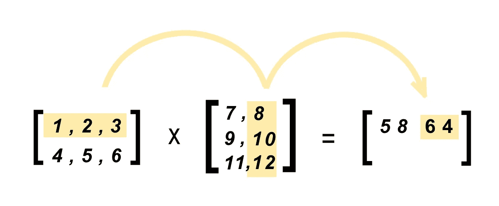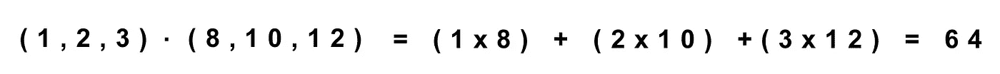

这是我们完成所有计算后的最终矩阵:

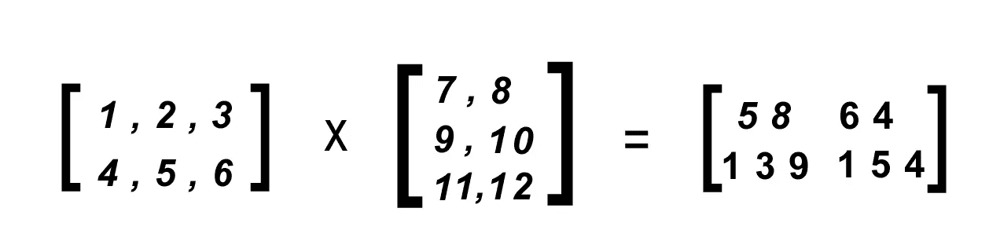

这些例子来自神奇的 [**数学很有趣网站**](http://www.mathsisfun.com/algebra/matrix-multiplying.html) 。那个网站有很多很好的例子。到目前为止，我还没有发现任何地方做得更好。

我加入公式是为了帮助你理解阅读公式，因为它们往往会跳过这些公式，以免让人混淆。但是你不用再迷茫了。

# 赢得学习策略

我想用一些策略来帮助你学得更快。

我是一个自学者，这意味着我喜欢自学。当我有时间慢下来，有时间自己探索时，我学得更好。我会犯错。我的上一篇文章就是一个很好的例子，因为我必须纠正一些地方。

但是关于错误，这是一件好事！

他们是过程的一部分。无法回避他们，所以拥抱他们吧。如果你犯了错误，你就在学习。如果你不是，你就不是！就这么简单。

工程界有个老笑话。

如果你想得到正确的答案，不要寻求帮助。相反，张贴错误的答案，看看有多少工程师跳出来纠正你！

工程师就是不能让错误的答案存在！

这是一个老把戏，但很管用。

同样重要的是要注意，如果你数学很差，或者如果你有微积分、代数和一些几何的背景，你可能无法阅读[数学符号书](http://amzn.to/2mVgWep)，除非你已经阅读了我在[学习人工智能中概述的其他一些书籍。你需要一个术语的背景来理解。*然而，* *我还是建议买这本书，因为当你阅读其他书籍时，你可以把它作为参考指南*。](https://hackernoon.com/learning-ai-if-you-suck-at-math-8bdfb4b79037#.wb9byq3o3)

我也建议慢慢来。这里没有种族！半被动是没有分数的。如果你跳过一个你不理解的术语，你最终只会不得不回到它。

所以停下来，花点时间去查每一个你不懂的符号。这是一种缓慢且有时令人沮丧的方法。但是随着你积累的知识越来越多，它开始变得更快。你会发现自己理解了一些你从未想象过自己能理解的术语。

此外，要知道你将不得不从多个地方查找资料。面对现实吧，大部分人都不是好老师。他们可能理解这些材料，但这并不意味着他们可以让其他人也能看到。教学是一门艺术。这就是为什么当你刚开始的时候，数学有趣网站比维基百科优越得多。维基百科是“正确的”,但往往枯燥无味，难以理解，有时令人困惑。随着你对此了解的越来越多，也许你甚至可以让维基百科变得更好。

记住所有这些事情，你就不会在你的人工智能学习冒险中出错！

############################################

**一定要看看这个正在进行的系列的其余部分。请随时关注我，因为您想成为第一个在最新文章发布后第一时间阅读它们的人。**

[**学习人工智能如果你数学很差——第一部分**](https://hackernoon.com/learning-ai-if-you-suck-at-math-8bdfb4b79037#.ng7ggn5d9)**——这篇文章将指导你阅读一些必要的书籍，如果你从来都不是数学迷，但作为一个成年人你正在学习它。**

**[**学习人工智能如果你数学很差——第二部分**](https://hackernoon.com/learning-ai-if-you-suck-at-math-part-two-practical-projects-47d7a1e4e21f#.yo1o1ar5h)**——实际项目**——这篇文章指导你开始你的第一个项目。**

**[**数学不好就学人工智能——第三部分**](https://hackernoon.com/learning-ai-if-you-suck-at-math-p3-building-an-ai-dream-machine-or-budget-friendly-special-d5a3023140ef#.6frka033t)**——打造人工智能梦想机器**——本文指导你获得一个强大的深度学习机器设置，并安装了所有最新最棒的框架。**

**[**数学烂就学 AI——第四部分——张量图解(带猫！)**](https://hackernoon.com/learning-ai-if-you-suck-at-math-p4-tensors-illustrated-with-cats-27f0002c9b32#.2jpelkuhd) —这个回答了一个古老的谜团:张量到底是个什么鬼？**

**[**学 AI 如果你数学很烂——第 5 部分——深度学习和卷积神经网络用简单的英语说**](https://hackernoon.com/learning-ai-if-you-suck-at-math-p5-deep-learning-and-convolutional-neural-nets-in-plain-english-cda79679bbe3#.xjah79lsd)——在这里我们创建了我们的第一个 Python 程序，并探索神经网络的内部工作原理！**

**[**学人工智能如果你数学很烂——第六部分——数学符号变得简单**](https://hackernoon.com/learning-ai-if-you-suck-at-math-p6-math-notation-made-easy-1277d76a1fe5)——还在努力理解那些有趣的小符号吗？让我们现在就改变这一切！**

**[**学 AI 如果你数学很烂——第七部分——自然语言处理的魔力**](https://hackernoon.com/learning-ai-if-you-suck-at-math-p7-the-magic-of-natural-language-processing-f3819a689386)——了解谷歌和 Siri 如何理解你喃喃自语。**

**############################################**

**如果你喜欢这个教程，我希望你能鼓掌推荐给其他人。之后，请随时将文章通过电子邮件发送给朋友！非常感谢。**

**############################################**

**如果你喜欢我的作品，请让我有幸参观我的作品，因为这是我们一起改变未来的方式。帮我脱离母体**我会百倍地回报你的慷慨，把我所有的时间和精力集中在写作、研究和为你和世界提供令人惊叹的内容上**。**

**###########################################**

****

**简单介绍一下我:我是一名作家、工程师和连续创业者。在过去的二十年中，我涉及了从 Linux 到虚拟化和容器的广泛技术。**

**[**你可能会喜欢我的第一部小说《蝎子游戏》，**](http://meuploads.com/join-my-readers-group/) **因为它是免费的。读者称之为“神经癌的第一次严重竞争”和“像喝了几周掺水啤酒后的双份优质威士忌”****

**你也可以 [**加入我的私人脸书小组，Nanopunk Posthuman 刺客**](https://www.facebook.com/groups/1736763229929363/) **，在这里我们讨论所有的科技、科幻、幻想等等。****

**############################################**

**我偶尔会从我文章中的链接赚钱，但我只推荐我拥有、使用和喜欢的东西。点击此处查看我的[完整保单](http://meuploads.com/disclosure/)。**

**############################################**

**感谢阅读！**

**[](http://bit.ly/HackernoonFB)****[](https://goo.gl/k7XYbx)****[](https://goo.gl/4ofytp)**

> **[黑客中午](http://bit.ly/Hackernoon)是黑客如何开始他们的下午。我们是阿妹家庭的一员。我们现在[接受投稿](http://bit.ly/hackernoonsubmission)并乐意[讨论广告&赞助](mailto:partners@amipublications.com)的机会。**
> 
> **如果你喜欢这个故事，我们推荐你阅读我们的[最新科技故事](http://bit.ly/hackernoonlatestt)和[趋势科技故事](https://hackernoon.com/trending)。直到下一次，不要把世界的现实想当然！**

****