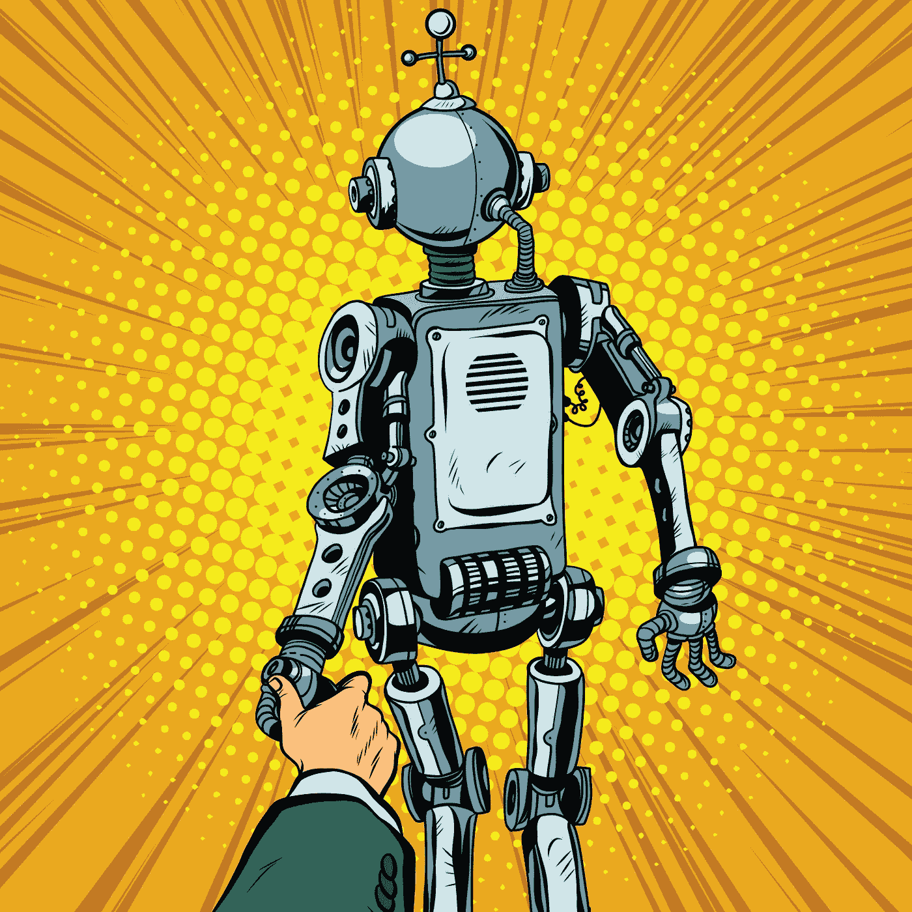
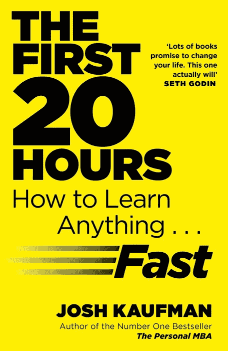
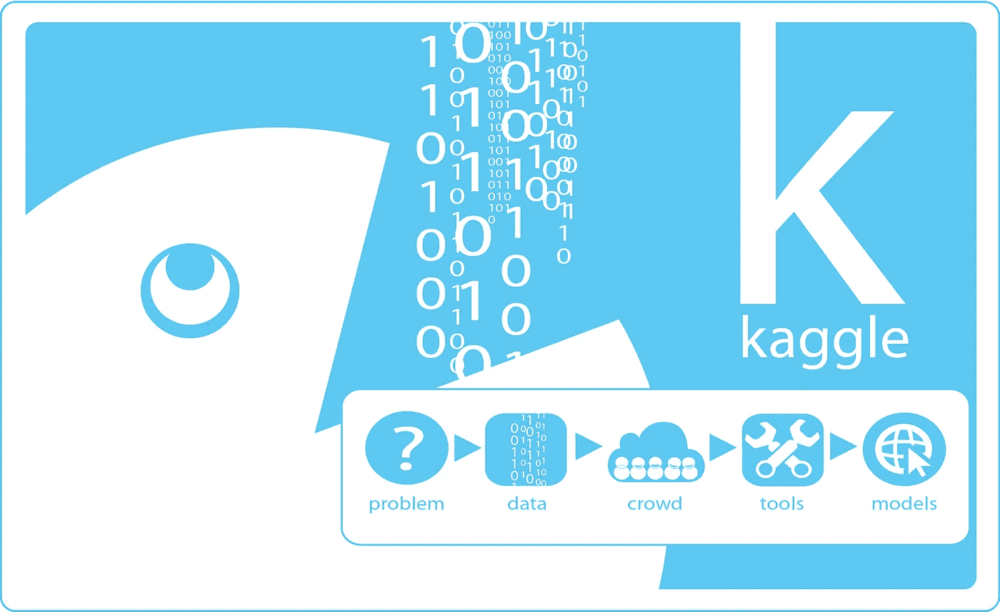
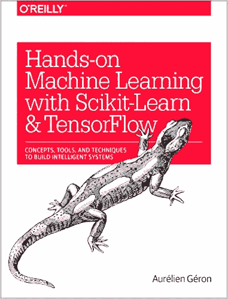
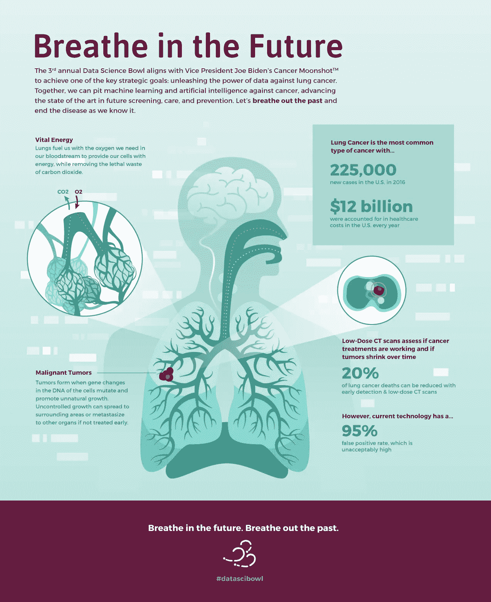
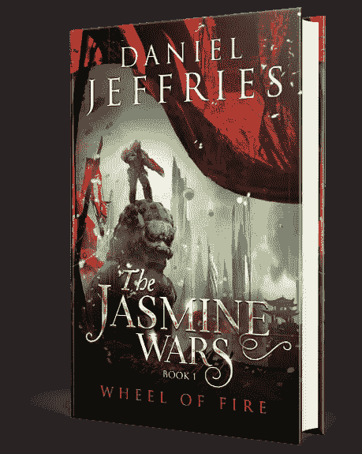

# 数学不好就学人工智能——第二部分——实践项目

> 原文：<https://medium.com/hackernoon/learning-ai-if-you-suck-at-math-part-two-practical-projects-47d7a1e4e21f>

如果你读了这个系列的第一篇文章，你已经在提升你的数学游戏了。也许那些有趣的小符号开始变得有意义了。

也一定要检查[零件 3](https://hackernoon.com/learning-ai-if-you-suck-at-math-p3-building-an-ai-dream-machine-or-budget-friendly-special-d5a3023140ef#.4ip1uwjda) 、 [4](https://hackernoon.com/learning-ai-if-you-suck-at-math-p4-tensors-illustrated-with-cats-27f0002c9b32#.2jpelkuhd) 、 [5](https://hackernoon.com/learning-ai-if-you-suck-at-math-p4-tensors-illustrated-with-cats-27f0002c9b32#.cizxwh1zx) 、 [6](https://hackernoon.com/learning-ai-if-you-suck-at-math-p6-math-notation-made-easy-1277d76a1fe5#.qa2f24xvq) 和 [7](https://hackernoon.com/learning-ai-if-you-suck-at-math-p7-the-magic-of-natural-language-processing-f3819a689386) 。

但这里还有一个没人告诉你的关于人工智能的肮脏小秘密:

> 你实际上并不需要那么多的数学知识来开始。

如果你是一名开发人员或系统管理员，你可能已经使用了很多你所知甚少的库和框架。使用 [curl](https://curl.haxx.se/) 你不必理解网络抓取的内部工作原理。AI 也是如此。有许多框架和项目可以让您无需数据科学博士学位就能快速上手。

不要误解我。数学帮助你对幕后发生的事情充满信心。它可以让你阅读研究论文和高级书籍，比如伊恩·古德菲勒的《深度学习》。所以继续研究我上一篇文章给你的书。但是如果你想使用 AI 启动*，你今天就可以这么做。*

让我们从一些实际项目开始。

**我的学习方法与** [**前二十个小时**](http://amzn.to/2k5iQVS) **中概述的优秀方法非常相似。我们都知道一万小时规则。要真正掌握一项技能，你需要投入大量时间。但我们还没到那一步。我们才刚刚开始。现在我们正试图从“这糟透了”变成“这太有趣了！”**

这种方法的基础很简单:

*   选择一个项目。
*   摆脱自我削弱的信念。
*   尝试很多东西，但很快就会失败。
*   练习。

很简单，对吧？所以我们走吧！

# 选择一个项目

首先，你需要一个能真正激励你走出舒适区的项目。

**[**一个奖金百万美元，有机会对肺癌研究产生影响的项目声音**](https://www.kaggle.com/c/data-science-bowl-2017) **？****

**Kaggle 是机器学习的地方。目前，他们正在举办一场奖金为 100 万美元的竞赛，以改进肺癌病变的分类。任何人都可以进入，包括你。**

**现在我知道你在想什么了。我不可能赢。这是重量级选手的比赛。很高兴你提到了这一点，因为这将我们带到第二步:**

# ****克服自我削弱的信念****

**学习新事物最重要的一步是尽快关闭你头脑中自我怀疑的声音。前 20 小时提倡排除干扰，在时钟上练习和一些其他的技巧。再加上沉思、肯定或酗酒。什么都行。尽一切努力让那个声音消失，这样你就能集中注意力了。**如果你需要一本帮助自己度过难关的书，试试** [**你是个坏蛋**](http://amzn.to/2jGyuY1) **，一本有趣、滑稽、讽刺的杰作！****

****

**事情是这样的:你现在确实很糟糕。不过没关系！你不会太久的。**

**感到困惑和沮丧永远是学习的第一阶段。因此，与其责备自己，不如把它看作是你走在正确道路上的标志。你学到了很棒的东西！**

**你可能赢不了这场比赛，但那又怎样？集中精力在截止日期前提交一份*合格的*参赛作品。不是每个人都能赢得马拉松比赛，但是完成一场比赛本身就是一项巨大的成就，对吗？**

**你知道吗？你可能会赢。说真的。**

**作为一个业余爱好者，你不会被多年的理论和想法所拖累，这些理论和想法会让专业人士不堪重负。还记得那个关于[一个学生在黑板上发现了两个无法解决的数学问题并误认为是家庭作业](http://www.snopes.com/college/homework/unsolvable.asp)后解决了它们的故事吗？事实是数据科学更像是艺术而不是科学。这个领域吸引了各种各样背景的学者。所以进去试试吧。**

**谁知道会发生什么？**

**也许你会看到一些专家们错过的东西，对癌症检测产生真正的影响，并带回家一些大笔的钱！**

# **尝试很多东西，很快就会失败**

**如果你是一个开发人员，你应该知道这句话。这也适用于学习。我所做的是抓起一堆书的样本，开始快速浏览，看看哪些对我来说最有意义。每个人都有不同的风格，所以有些书只适合一个人，而不适合另一个人。选择一个最适合你的。**

****

**有几本关于机器学习的书，像 [**真实世界机器学习**](http://amzn.to/2j2oAhl) **。不幸的是，因为这个领域太新了，大部分书今年才刚刚出版。**可以预先订购** [**深度学习:一个从业者用 Scikit-Learn 和 Tensorflow**](https://www.amazon.com/Deep-Learning-Practitioners-Josh-Patterson/dp/1491914254/ref=sr_1_2?ie=UTF8&qid=1485122533&sr=8-2&keywords=deep+learning) **接近** **或** [**动手机器学习。**](http://amzn.to/2j2k9mD)****

**但是你不用等了。**我给你介绍一下我的朋友**[**Safari Books Online**](https://www.safaribooksonline.com/home/)**。每月 40 美元，你可以想看多少本书就看多少本，你还可以在新书发布前看到它们，包括上面列出的两本。****

**不过，我会为你节省一些时间。现在完全没有必要学习如何用 Python、R 或 Java 从头开始编写深度学习系统。**你需要工具来让你快速进行深度学习，这样你就可以开始准备你的参赛作品了。****

****你想要的**[**Keras**](https://keras.io/)**跟**[**tensor flow**](https://www.tensorflow.org/)**或者**[**the ano**](http://deeplearning.net/software/theano/)**。****

****

**你甚至不需要自己设置。**抢** [**这个甜的多合一深度学习 Docker 形象**](https://github.com/saiprashanths/dl-docker) **。****

**坦白说，用 TensorFlow 还是 Theano 都无所谓。它们基本上是运行机器学习的引擎。在你受教育的这个阶段，两者都是平等的，所以选一个吧。**

**Keras 是一个由顶尖谷歌人工智能研究人员创建的机器学习框架库。这个周末我有幸见到了 Keras 的创造者， [Francois Chollet](https://twitter.com/fchollet?ref_src=twsrc%5Egoogle%7Ctwcamp%5Eserp%7Ctwgr%5Eauthor) 。他将 Keras 描述为“民主化人工智能”的关键。他说，“深度学习已经成熟，但尚未广泛传播……你不必成为人工智能研究人员才能使用 Keras。”相反，你可以马上开始尝试各种先进的算法。**

**如果你已经有了一台 Mac 或 Linux 设备，并配有一个好的 Nvidia 显卡，你就可以开始了。如果你没有，考虑拿起一个外星人。我推荐中档[极光](http://www.dell.com/en-us/shop/productdetails/alienware-aurora-r6-desktop)系列。你不需要一个超级处理器。您需要一个固态硬盘、一个用于转储数据的辅助旋转磁盘、16–64GB 内存和您能负担得起的最好的 Nvidia 卡。把你所有的钱都集中在纸牌上，因为它们真的能加速深度学习。你需要用 Linux 重新格式化它，并获得最新的二进制驱动程序。不幸的是，开源的那些不适合最新的芯片组。他们很可能会启动到黑屏。像这样固定。**

**如果你是一个自己动手的人，也有一些教程可以让你建立自己的装备。还有，我刚刚在第三部加了[我自己的教程！](https://hackernoon.com/learning-ai-if-you-suck-at-math-p3-building-an-ai-dream-machine-or-budget-friendly-special-d5a3023140ef#.wktve8ouw)**

**最后，你可以使用 [AWS](https://aws.amazon.com/hpc/) 、 [Google](https://cloud.google.com/gpu/) 或 [Azure](https://azure.microsoft.com/en-us/resources/videos/build-2016-introduction-to-nvidia-gpus-in-azure/) cloud，但是云中的 GPU 计算会很快变得昂贵。在你知道自己在做什么之前，买比租好。**

# ****练习****

**现在您已经准备好开始了。这里是[一个超级简单的 Keras](http://machinelearningmastery.com/tutorial-first-neural-network-python-keras/) 入门例子。**

****你需要一种竞争的方法。我要再一次为你节省一些时间。****

****目前最有效的标记和研究图像的方法被称为** [**卷积神经网络**](https://adeshpande3.github.io/adeshpande3.github.io/A-Beginner's-Guide-To-Understanding-Convolutional-Neural-Networks/) **(CNN)。**谷歌、脸书、Pinterest 和亚马逊都使用它们进行图像处理和标记。你也可以从最佳实践开始，对吗？**

****

**事实上，如果你浏览比赛本身，[获取数据集](https://www.kaggle.com/c/data-science-bowl-2017/data)，并且[查看教程](https://www.kaggle.com/c/data-science-bowl-2017/details/tutorial)，你会看到它带你浏览切片和切块图像，以及使用带有 Keras 和 TensorFlow 后端的 CNN。瞧啊。**

**坦率地说，你可以做得更糟，而不仅仅是实现本教程，用几个星期的时间修改参数来看看你会得到什么。**

**之后变得疯狂。向它抛出不同的参数和算法。尝试并享受乐趣。也许你会偶然发现专家们漏掉的东西！**

**如果你准备在那之后尝试更高级的东西，在[ka ggle 数据科学碗 2017 董事会](https://www.kaggle.com/c/data-science-bowl-2017/kernels)上有一些很棒的帖子。事实证明，数据科学家不会放弃分享他们的一些秘方。看看这个，它帮助你开始探索数据，这是一系列匿名的 CT 扫描。**

**[这是更高级的](https://www.kaggle.com/gzuidhof/data-science-bowl-2017/full-preprocessing-tutorial)，也是目前论坛上最受欢迎的帖子，理由很充分。它帮助你做“预处理”，这基本上是擦洗和按摩数据，使神经网络更容易更流畅地处理。它实际上把 2D 图像变成了 3D 图像！超级爽！**

**坦率地说，如果你自己打出所有这些代码并让它运行，你已经很了不起了。这种编程方法被称为“硬方法”，也就是说，只要输入代码，不要想它，直到你理解它。甚至有一系列关于 Python 和其他语言的书籍也采用了这种学习方法，它可能对你有用。**

**一个警告:有人已经在比赛中贴了满分。他用一种聪明的方式做到了这一点，[通过研究排行榜，有效地将他的训练集规模扩大了一倍](https://www.kaggle.com/olegtrott/data-science-bowl-2017/the-perfect-score-script)。这是完全合法的，但它不会真正帮助你的目标，即学习如何针对一个良好的目标运行神经网络。我现在跳过这种方法，专注于运行 Keras 与 CT 扫描。**

**就是这样！如果幸运的话，你将帮助重新定义癌症研究，并带回家一些现金。今天的工作还不错。**

**但是，即使你没有赢，你也会在学习如何在现实世界中使用人工智能的道路上走得很好。**

**无论发生什么，记得要开心！**

**同样，如果您错过了本系列中的其他文章，请务必查看它们:**

**[**学习人工智能如果你数学很差——第一部分**](https://hackernoon.com/learning-ai-if-you-suck-at-math-8bdfb4b79037#.ng7ggn5d9)**——这篇文章将指导你阅读一些必要的书籍，如果你从来都不是数学迷，但作为一个成年人你正在学习它。****

****[**学习人工智能如果你数学很差——第二部分**](https://hackernoon.com/learning-ai-if-you-suck-at-math-part-two-practical-projects-47d7a1e4e21f#.yo1o1ar5h)**——实际项目**——这篇文章指导你开始你的第一个项目。****

****[**学习人工智能如果你数学很差——第三部分**](https://hackernoon.com/learning-ai-if-you-suck-at-math-p3-building-an-ai-dream-machine-or-budget-friendly-special-d5a3023140ef#.6frka033t)**——构建人工智能梦想机器**——这篇文章指导你获得一个强大的深度学习机器设置，并安装了所有最新最棒的框架。****

****[**数学烂就学 AI——第四部分——张量图解(带猫！)**](https://hackernoon.com/learning-ai-if-you-suck-at-math-p4-tensors-illustrated-with-cats-27f0002c9b32#.2jpelkuhd) —这个回答了一个古老的谜团:张量到底是个什么鬼？****

****[**“如果你数学很差，就学习人工智能”——第 5 部分——用简单的英语说，深度学习和卷积神经网络**](https://hackernoon.com/learning-ai-if-you-suck-at-math-p5-deep-learning-and-convolutional-neural-nets-in-plain-english-cda79679bbe3#.xjah79lsd)——在这里，我们创建了我们的第一个 Python 程序，并探索神经网络的内部工作原理！****

****[**学 AI 如果你数学很烂——第六部分——数学符号变得简单**](https://hackernoon.com/learning-ai-if-you-suck-at-math-p6-math-notation-made-easy-1277d76a1fe5)——还在努力理解那些有趣的小符号吗？让我们现在就改变这一切！****

****[**数学烂就学 AI——第七部分——自然语言处理的魔力**](https://hackernoon.com/learning-ai-if-you-suck-at-math-p7-the-magic-of-natural-language-processing-f3819a689386)——了解谷歌和 Siri 是如何理解你喃喃自语的。****

****############################################****

****如果你喜欢这个教程，我希望你能鼓掌推荐给其他人。之后，请随时将文章通过电子邮件发送给朋友！非常感谢。****

****############################################****

****如果你喜欢我的作品**，请** [**赏光访问我的作品页面**](https://www.patreon.com/danjeffries) **因为这是我们一起改变未来的方式。**帮我脱离母体**我会百倍地回报你的慷慨，把我所有的时间和精力集中在写作、研究和为你和世界提供令人惊叹的内容上。******

****###########################################****

********

****简单介绍一下我:我是一名作家、工程师和连续创业者。在过去的二十年中，我涉及了从 Linux 到虚拟化和容器的广泛技术。****

*****你可以看看我的最新小说，* [***一部史诗般的中国科幻内战传奇***](http://amzn.to/2gAg249) *在这部小说中，中国挣脱了共产主义的枷锁，成为世界上第一个直接民主国家，运行着一个高度先进、人工智能的去中心化 app 平台，没有领导人。*****

****[***加入我的读者群就可以免费获得我的第一部小说《蝎子游戏》、***](http://meuploads.com/join-my-readers-group/) ***。*** *读者们纷纷称之为********黑色侦探遇上约翰尼助记术。***********

*******最后，你可以 [**加入我的私人脸书小组，纳米机器人后人类刺客**](https://www.facebook.com/groups/1736763229929363/) **，在这里我们讨论所有的科技、科幻、幻想等等。*********

*******############################################*******

*******我偶尔会从我文章中的链接赚钱，但我只推荐我拥有、使用和喜欢的东西。在这里查看我的[完整保单](http://meuploads.com/disclosure/)。*******

*******############################################*******

*******感谢阅读！*******

******************************************

> *******[黑客中午](http://bit.ly/Hackernoon)是黑客如何开始他们的下午。我们是 [@AMI](http://bit.ly/atAMIatAMI) 家庭的一员。我们现在[正在接受投稿](http://bit.ly/hackernoonsubmission)并乐意[讨论广告&赞助](mailto:partners@amipublications.com)机会。*******
> 
> *******如果你喜欢这个故事，我们推荐你阅读我们的[最新科技故事](http://bit.ly/hackernoonlatestt)和[趋势科技故事](https://hackernoon.com/trending)。直到下一次，不要把世界的现实想当然！*******

**************