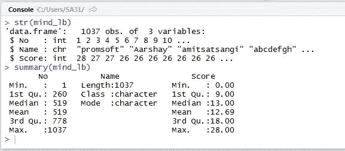
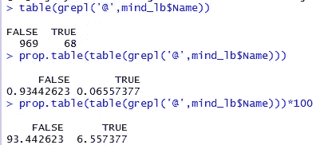
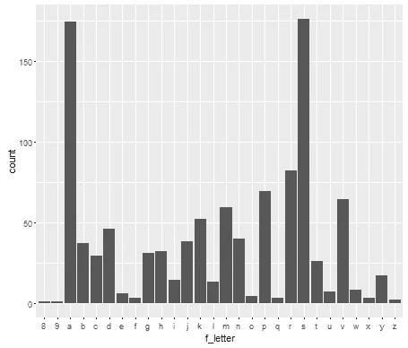
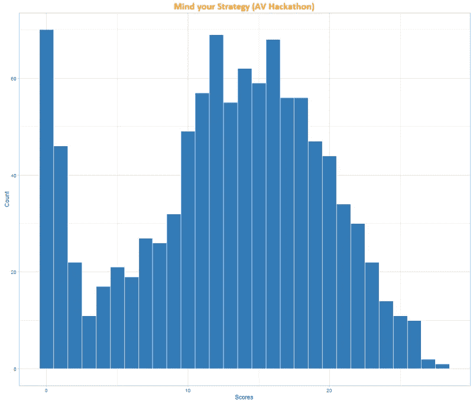

# 学习数据分析并不困难，开始才困难！

> 原文：<https://medium.com/hackernoon/learning-data-analytics-is-not-tough-starting-is-tough-c1e718fc858a>

Image Courtesy: [https://unsplash.com/search/code?photo=b18TRXc8UPQ](https://unsplash.com/search/code?photo=b18TRXc8UPQ)

经常有人问我“ ***怎么才能学会数据分析？*** “而我也经常在 Quora 上偶然发现这个问题' ***如何成为一名数据分析师*** ”。答案在互联网上随处可见。实际问题不是如何成为一名数据分析师，而是我们是否准备好成为一名数据分析师？

这篇文章旨在用一个简单免费的公共数据和 R(数据科学的开源冠军)带领一个新手进入数据分析的世界。

**数据收集:**

这里使用的数据是最近[Analytics Vidya Hackathon](http://datahack.analyticsvidhya.com/contest/all)的[公共排行榜](http://datahack.analyticsvidhya.com/contest/mind-your-strategy/lb)。只需将表格数据复制粘贴到 MS Excel 中，保存为' *av-hackathon.csv* '，你的分析数据就准备好了。

**读取输入数据:**

让我们使用 [read.csv](http://stackoverflow.com/questions/13265153/how-do-i-import-a-csv-file-in-r/13265177) 将 csv 读入 R Studio。

*mind _ lb<-read . CSV(' av-hackathon . CSV '，header = T，stringsAsFactors = F)*

**基本概要:**

理解数据集是任何分析师都应该执行的主要操作。我们可以使用 *str()* 或 *summary()* 来探索数据集的基本摘要，并查看样本值。

我们可以清楚地看到有 1037 个*观察值* ( *行* / *条目*)和 3 个*变量* /c *列*和它们的 [*数据类型*](http://www.statmethods.net/input/datatypes.html)—*数字*中的两个(其中一个只是序号，另一个是分数)和名称为*字符*类型。

**数据分析:**

当我们滚动数据集(读取的输入文件)时，我们可以看到一些用户明确地将他们的电子邮件 id 作为用户名。我们可以试着看看有多少这样的用户在他们的用户名中有' @ '吗？

让我们用[*grepl*](https://stat.ethz.ch/R-manual/R-devel/library/base/html/grep.html)***(正则表达式)*** 来匹配包含@符号的名字。

使用 *grepl('@ '，mind_lb$Name)* 将返回每个观察值的真/假，但我们实际需要的是计数。所以我们用 R 中的 table()函数来找出来。

***table(grepl('@ '，mind_lb$Name))*** 返回包含@和不包含@的用户名的实际数量(绝对数字)。但是用百分比来表示不是更好吗？

prop.table()和 table()一起从 *grepl('@ '，mind_lb$Name)* 中取值，给出十进制值，再乘以 100，给出带@和不带@的用户名的实际百分比。

现在我们知道几乎有 6.5%的用户名带有@字样，很明显 *gmail* 肯定贡献了其中的大部分，但是我们能不能试着找出除了 *gmail* 之外是否还有别的原因？

让我们执行一些 [*逻辑运算*](http://www.statmethods.net/management/operators.html) *。我们希望所有用户名* ***带@*** 但 ***不是 gmail*** 将它们改写为理解逻辑:
***@*******和*** ***不是 gmail*** *瞧！下面是它的代码:**

****mind _ lb $ Name【grepl(' @ '，mind_lb$Name) &！grepl('gmail '，mind_lb$Name)]****

*这导致用以下字符标识美国用户名*

*   *@hpe.com*
*   *@iitbhu*
*   *@iimahd.ernet.in*

*一些好的见解不是吗？惠普企业、IIT-BHU 公司和 IIM-A 公司的人*

*让我们尝试更多的字符串操作。用户名将是唯一的，所以我们不能真正找到重复的名字。但是我们能找到哪个字母表形成了最开始的字母吗？*

*为此，让我们创建一个新变量‘f _ letter’。只是一个[子串](https://stat.ethz.ch/R-manual/R-devel/library/base/html/substr.html)操作。*

****mind _ lb $ f _ letter<-to lower(substr(mind _ lb $ Name，0，1))****

***数据可视化:***

*让我们做一个简单的图表，看看哪个字母赢了。*

*[***库(gg plot 2)***](http://docs.ggplot2.org/current/)
[*qplot*](http://docs.ggplot2.org/current/qplot.html)***(data = mind _ lb，f_letter)****

**

*看来 s 是赢家，a 是亚军。那是为了好玩。但是我们能做一些更好看的可视化吗？让我们画出黑客马拉松的分数分布。*

**

*完整的代码可以在我的 github 上找到。*

***期末备注:***

*在数据集中找出一些有价值的见解不是更容易吗？数据分析实际上更容易。你所需要的是一个开放的心态去看透数据，一旦开始，你选择的工具和语法就会派上用场。*

*这不是一个教程帖子，只是为了展示 R 和数据分析的简单性。*

*你准备好进入数据分析的世界了吗？如果有，[下载 R](https://cran.r-project.org/bin/windows/base/) 和 [R 工作室](https://www.rstudio.com/products/rstudio/download/)今天开始。也创建一个 github 账户，分享你的代码和可视化，并在这里评论链接。*

******

> *[黑客中午](http://bit.ly/Hackernoon)是黑客如何开始他们的下午。我们是 [@AMI](http://bit.ly/atAMIatAMI) 家庭的一员。我们现在[接受投稿](http://bit.ly/hackernoonsubmission)并乐意[讨论广告&赞助](mailto:partners@amipublications.com)机会。*
> 
> *如果你喜欢这个故事，我们推荐你阅读我们的[最新科技故事](http://bit.ly/hackernoonlatestt)和[趋势科技故事](https://hackernoon.com/trending)。直到下一次，不要把世界的现实想当然！*

**