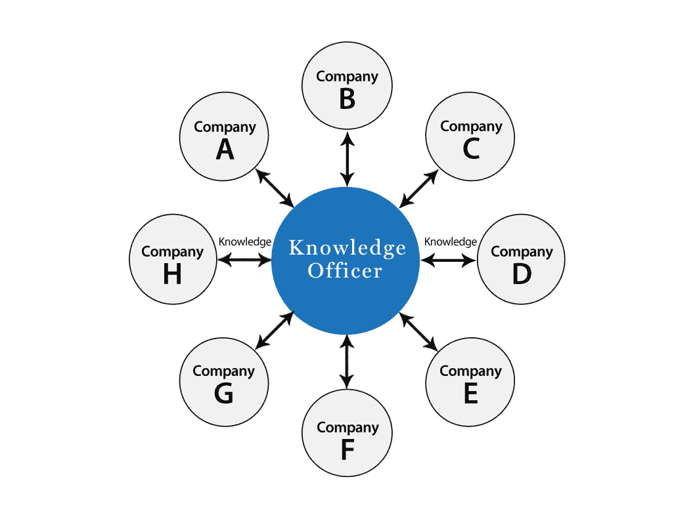

# 现代的学习和内容发现

> 原文：<https://medium.com/hackernoon/learning-in-the-modern-age-e2a6df65e63a>

L *一个组织内的收入、职业发展和知识共享被打破了！最近有一项由* [*德勤*](https://www2.deloitte.com/content/dam/Deloitte/global/Documents/About-Deloitte/central-europe/ce-global-human-capital-trends.pdf) *所做的关于工作未来的研究，这里有一个惊人的事实:*

> *事实上，所有首席执行官(90%)都认为他们的公司正面临着由数字技术驱动的颠覆性变革，70%的人表示他们的组织没有适应这种变革的技能。这种怀疑反映了一个事实，即技能正在加速过时。软件工程师现在必须每 12-18 个月重新开发一次技能。市场营销、销售、制造、法律、会计和金融领域的专业人士报告了类似的需求。*

*而且好像以上还不够:*

> 84%的商业领袖将“改善组织学习的需要”列为首要任务，44%的人认为这很紧迫。

# ***让我们退一步看***

已经有一段时间没有人问这些问题了，但是现在我相信，是时候了！让我们问这些 **5 个为什么**:

*为什么我们不浪费时间在 clickbait 上就不能寻求* [*知识*](https://hackernoon.com/tagged/knowledge) *？*

为什么我们不能有针对性地选择“相关”内容来增加我们知识的广度和深度呢？不一定是病毒式的、广告驱动的或新鲜的内容！

为什么我们不能与我们感兴趣的领域的专家取得联系，并且在一个真正的知识寻求者的专属网络中？

为什么我们不能与那些真正需要成功的人分享我们来之不易的知识？

*为什么我们不能“享受”* [*学习*](https://hackernoon.com/tagged/learning) *而不把它当作一种负担或者一个无聊的过程来处理呢？*

创业公司发展如此之快，打破东西也如此之快。学习的时间有限，根本没有时间浪费在阅读无关内容或[点击诱饵](https://www.farnamstreetblog.com/2017/01/schopenhauer-dangers-clickbate/)上。还有巨大的信息过载，除了高质量和相关的内容，没有任何产品能够提供与网飞和亚马逊相同质量的推荐。

这些问题让我们在漆黑的夜晚保持清醒，鼓励我们前进，并且我们相信可以改变生活！

> *我们相信，你今天学到的一些东西可能会帮助你在不久的将来改变你的职业生涯，这些东西会改变人类，这些信息非常宝贵，不能不分享。*

我们相信这是一个适合初创公司和规模化企业的内容推荐平台存在的恰当时机。一个使用起来有趣、引人入胜且具有协作性的平台。为这些公司提供服务和支持的平台。一个平台，通过将他们连接在一个展示和生成最佳内容的网络中，使他们保持知识和领先地位。我们相信有一天，初创公司将会像使用 *Trello* 进行项目合作或 *Slack* 进行消息传递和交流一样，使用 KO 进行知识发现！

我们在 3 个月前推出了我们的 [MVP](https://hackernoon.com/the-knowledge-officer-is-now-live-908422a4175f#.3pye7kia6) ，以确认人们是否对高质量的内容感兴趣，以及他们是否像保持消息灵通一样热衷于保持知识渊博。我们现在正在为一些早期签约和付费用户的[公司](/@Ahmed_Sharkasy/starting-a-startup-within-a-scaleup-56d1ec8d1398)进行官方发布。

帮助我们传播关于[知识官](http://knowledgeofficer.com)、*的信息，这是一个为在初创公司和规模化企业工作的人提供的游戏化学习平台。*

*如果你想支持我们，请在* [***上献出你的爱，在***](http://producthunt.com/posts/knowledge-officer/) *上搜索产品，并在*[***Facebook***](https://www.facebook.com/knowledgeofficer/)*&*[***Twitter***](https://twitter.com/ko_platform)*上关注我们的更新。*

> [黑客中午](http://bit.ly/Hackernoon)是黑客如何开始他们的下午。我们是 [@AMI](http://bit.ly/atAMIatAMI) 家庭的一员。我们现在[接受投稿](http://bit.ly/hackernoonsubmission)，并乐意[讨论广告&赞助](mailto:partners@amipublications.com)机会。
> 
> 如果你喜欢这个故事，我们推荐你阅读我们的[最新科技故事](http://bit.ly/hackernoonlatestt)和[趋势科技故事](https://hackernoon.com/trending)。直到下一次，不要把世界的现实想当然！

