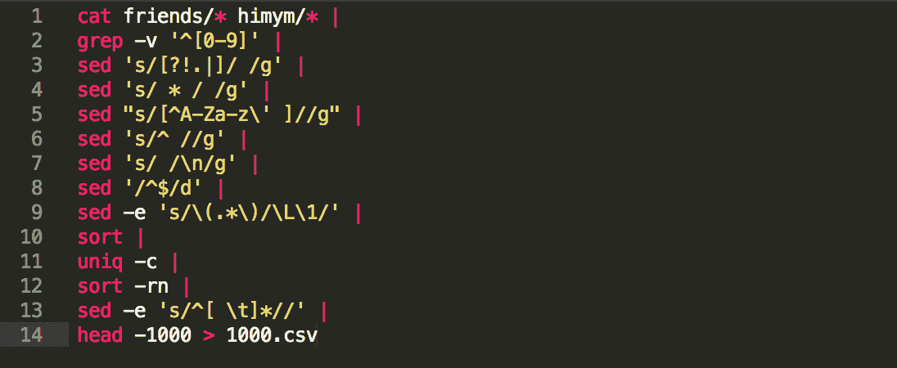
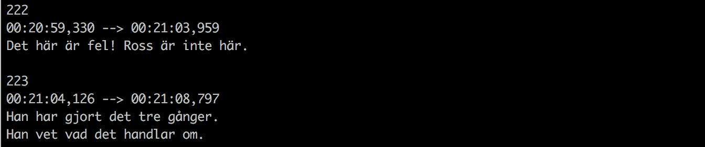
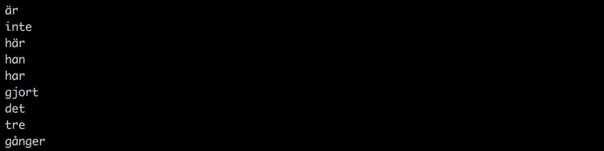
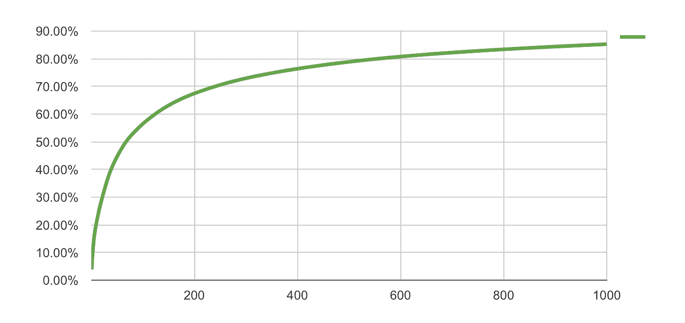

# 借助一些非常基础的数据科学，快速学习语言

> 原文：<https://medium.com/hackernoon/learning-languages-very-quickly-with-the-help-of-some-very-basic-data-science-cdbf95288333>

6 个月前我和我的女朋友搬到了瑞典。对于像我们这样的外国人来说，这是一个伟大的国家，因为这里几乎每个人都能说一口流利的英语。尽管如此，我们还是想学习一些瑞典语，只是为了在日常对话中多了解一点瑞典文化。

对我来说，这将是一门业余语言，所以我不想花太多精力。比方说，我想花最多 10-20 个小时，我的目标是理解 80%的日常聊天。可行吗？我们会看到的！这是我的方法——有一些初级数据科学的支持。

# **概念**

我想，我在这里要展示的是一种非常非正统的方法。但是如果你想让事情变得更简单，有时你需要有创造力，对吗？

我做了什么:

1.  我拍了两部很受欢迎的电视剧《老友记》和《我是怎么遇见你妈妈的》。
2.  我拿到了这些电视节目的瑞典语字幕——一年四季，每集都有。
3.  我分析了最常见的单词，并按照出现的次数进行了排序。
4.  我在最上面的 1000 字做了删减。

问题是，如果我只学习一门语言的前 1000 个单词，我能走多远。或者更实际一点:瑞典语的前 1000 个单词涵盖了多少百分比的瑞典语对话？我建立了一个简短的数据脚本来寻找答案——在本文结束时，我也会与您分享它！但首先，我会告诉你我是如何得到这个问题的答案的。(注意:我的方法适用于每一种欧洲语言。)

*(更新:自从我发表了这篇文章，我在* [*Twitter*](https://twitter.com/data36_com) *上收到了一些不错的推文，来自在我之前使用过这种方法的人们！所以终究不是那么非正统！:-))*

# **代码**

第一步是获取字幕。你想看多少部电影都可以。我选择了《老友记》和《HIMYM 》,因为我之前已经看过这两部电视剧的英文版，而且我喜欢其中的词汇。但是如果你想说得更像洛基，那就去找洛基电影的字幕吧。*(关于字幕的重要说明！据我所知，像这样的非营利研究项目使用字幕并不违法。但是为了安全起见，我邀请你做和我一样的事情:请一位母语为英语的朋友听并为你键入整个脚本，而不是下载。；-))*

不管怎样，一旦你有了字幕，你就需要一个工具来完成文本分析部分。我在这篇文章中描述了如何获得、安装和开始使用数据编码工具，比如 Python、R、SQL 和 bash。你可以在这个项目中使用其中任何一个。

我选了最简单的一个: [bash](https://data36.com/data-coding-101-introduction-bash/) 。它非常简单，整个分析实际上只需要一行代码。在下面的截图中，我把它分成了 14 行，只是为了让它更易读。

这是我的 bash 代码:

Github link for copy-pasting: [here](https://github.com/adatlaborhu/learnlanguages/blob/master/english.sh).

# **逐行**

代码是做什么的？一般来说，前 9 行是关于数据清理的，剩下的 5 行将进行实际的分析。这是一行一行的:

*   第 1 行:读入我之前放在数据服务器上的“朋友”和“himym”文件夹中的所有字幕文件。从现在起，你可以把所有的字幕想象成一个大的临时文本文件。每一个进一步的修改都将在这个“一个大的临时文本文件”上执行。这里有一个小例子:

*   第 2 行:删除所有以数字开头的行。(例如时间戳)
*   第 3 行:用空格替换所有的问号、感叹号、圆点和竖线。
*   第 4 行:用单个空格替换所有的多个空格。
*   第 5 行:除了字母字符、撇号和空格之外，删除所有内容。
*   第 6 行:删除行首所有不必要的空格。
*   第 7 行:将每个空格都换成换行符(意味着我们的文件中每行有一个单词)。
*   第 8 行:删除所有的空行。
*   第 9 行:把每个大写字符变成小写字符。

现在我们有了一个干净的列表，里面有所有在电视节目中使用过的单词。每个单词出现的次数和它被使用的次数一样多。这里有一个例子:

*   第 10 行:按字母顺序排列单词。
*   第 11 行:列出每一个独特的单词，并在它们旁边打印出出现的次数。
*   第 12 行:按照出现的次数给这个单词列表排序。(列表顶部出现次数最多。)
*   第 13 行:删除行首的空格。
*   第 14 行:将前 1000 行(前 1000 个使用的单词)打印到一个名为 1000.csv 的文件中。

搞定了。如果你不能马上得到整个剧本，也不要担心。即使这是一个非常初级的数据脚本，您仍然需要一些关于 bash 的初步知识来完全理解它。我已经在我的博客上发表了 4 篇关于 bash 数据编码基础的文章。如果您想了解更多信息，可以在这里阅读:

[*在 Bash 中学习数据分析——从零开始*](https://data36.com/learn-data-analytics-bash-scratch/) *(而这里是:*[*EP # 1*](https://data36.com/data-coding-101-introduction-bash/)*)*

# **结果**

我们已经有了我们一直在寻找的[前 1000 个独特的单词](https://github.com/adatlaborhu/learnlanguages/blob/master/swedish.tsv)。不错！剩下的唯一问题是:如果我只学这 1000 个单词，我能理解多少？要回答这个问题，我需要两个数字:

1.  我需要统计总字数(多个用过的字统计多次)。
2.  我需要计算前 1000 个独特的单词在字幕中出现了多少次。

对比这两个数字，就能反馈出前 1000 个词的使用比例。

回到我的代码！要回答 1)我必须将第 14 行改为以下代码:

> **awk“{ sum+= $ 1 } END { print sum }”**

它会给你总字数:1 131 360

然后我将对我新创建的 1000.csv 文件做同样的事情…

> **awk ' { sum+= $ 1 } END { print sum } ' 1000 . CSV**

我将得到前 1000 个单词的总出现次数:964 682

这真是太棒了！964682/1131360= **85.26%**

**是的，意思是如果我从《老友记》和《我是如何遇见你妈妈的》中学习前 1000 个单词，我就能理解剧本中 85%的单词！**

现实检查！我周末在宜家拍了这张照片。只学了前 200 个字，头条的所有字都可以理解。

另一个有趣的数据！下面的图表显示了你学习前 X 个单词的百分比。

结果是:一个美丽的对数函数在折线图上。(这不是趋势或平滑线，这是实际结果！)毕竟这意味着，即使你投入和第二个 1000 个单词同样多的时间来学习第一个 1000 个单词，第一个 1000 个单词也只能帮助你理解 85%，第二个 1000 个单词只能帮助你理解 5%。诸如此类。

# **接下来的步骤**

好吧，我不得不承认，词汇不是一切。所以我的下一步是:

1.  学习前 1000 个瑞典语单词。
2.  同时做瑞典语[多林戈](https://www.duolingo.com)课程来获取一些语法知识。(注意，瑞典语看起来与德语和英语非常相似，所以我想我在学习语法部分不会有太大的困难。)
3.  看一些有瑞典语配音+字幕的电影，我已经用英语或者匈牙利语(这是我的母语)看过了。这对于将发音与书写格式相匹配很重要。当然还要学习一些特殊的表达方式。

然后…我们会看到的！

别忘了:我的目标是理解，而不是流利地说这门语言。

# **免责声明**

坦率地说，我甚至不会称这个项目为“数据科学”项目——因为其中没有什么非常科学的东西。只是常识和一些基本数据编码的文本挖掘。在 NLP(自然语言处理)专业人士开始向我扔石头之前，我必须提到两个已知的问题:

1.  我的这个小小的语言学习实验是基于一个公平但未经证实的假设。我认为这些电视节目的词汇和日常讨论的词汇非常相似。也许这不是真的。也许吧。但是这看起来很合理，所以我决定冒这个最小的风险。
2.  我上面展示的 bash 脚本并不是 100%完美的。例如，我没有实现任何词干算法来将单词“cooking”、“cooked”或“cooks”简化为根格式:“cook”我估计这类问题会导致我的结果出现 5%的误差。然后我问自己:这里的投资回报率是多少？那 5%的准确度真的值得付出额外的努力吗？答案是:肯定不会。
    我一直在寻找一种快速而简单的学习语言的方法，所以不言而喻，我为此写的脚本也应该快速而简单。如果我花了几天时间(而不是几分钟)来优化我的数据脚本到 99.9%(而不是 95%)，整个项目将会忽略主要目标:时间高效。

还有一点。我还没有测试过这个方法，在我测试之前，它仍然是一个假设。但是学习实验现在开始了，我保证我会让你知道它是如何工作的！*(更新:我已经学会了前 200 个单词——而且我已经对瑞典语更有信心了！:-)*另外，我邀请你成为其中的一员，分享你的经验，不管这个方法对你是否有效。

*下面是瑞典语* *和英语***中的* [前 1000 个单词。如果你想对其他语言做同样的事情，请随意使用我的代码](https://github.com/adatlaborhu/learnlanguages/blob/master/swedish.tsv)*[*。*](https://github.com/adatlaborhu/learnlanguages)**

# **免费视频课程**

****想学数据科学，跑类似项目吗？然后看看我新的(免费)在线视频课程。从这里开始:** [**如何成为一名数据科学家**](https://data36.com/how-to-become-a-data-scientist/) **。****

****

**REGISTER HERE (FOR FREE): [https://data36.com/how-to-become-a-data-scientist/](https://data36.com/how-to-become-a-data-scientist/)**

# ****结论****

**你可以将数据应用到生活的几乎每一个方面，让事情变得更聪明。发挥创造力，利用我们周围有如此多可用数据的事实——分析这些数据并将其转化为有意义的发现是如此容易！永远保持批判，考虑投资回报，不要害怕做快速和肮脏的事情！**

**如果你想了解更多关于数据科学的知识，请查看我的博客(【data36.com)和/或订阅我的[时事通讯](http://data36.com/newsletter-subscription/)！还有也查一下我新出的数据编码教程系列:[数据分析的 SQL](https://data36.com/sql-for-data-analysis-tutorial-beginners/)。**

**感谢阅读！喜欢这篇文章吗？请点击让我知道💚下面。这也有助于其他人看到这个故事！**

*****孙铁麟·梅斯特*** *作者*[*data36.com*](https://data36.com) *推特:*[*@ data 36 _ com*](https://twitter.com/data36_com)**

************

> **[黑客中午](http://bit.ly/Hackernoon)是黑客如何开始他们的下午。我们是这个家庭的一员。我们现在[接受投稿](http://bit.ly/hackernoonsubmission)并乐意[讨论广告&赞助](mailto:partners@amipublications.com)机会。**
> 
> **如果你喜欢这个故事，我们推荐你阅读我们的[最新科技故事](http://bit.ly/hackernoonlatestt)和[趋势科技故事](https://hackernoon.com/trending)。直到下一次，不要把世界的现实想当然！**

****