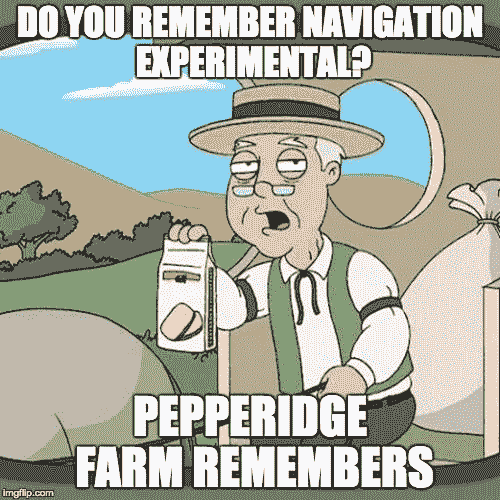

# 学习母语反应:从哪里开始

> 原文：<https://medium.com/hackernoon/learning-react-native-where-to-start-49df64cf14a2>

## 简短的任务列表

I couldn’t resist

如果你正在读这几行，很可能你会属于两种类型中的一种:

1.  您是一名反应迅速的本地开发人员，正在寻找一份快速的资源列表，以便发送给必须向其介绍框架的新同事
2.  你是收到链接的人，你需要尽快自学

*在这两种情况下，**欢迎**！我写这篇文章正是因为这个原因— *而且主要是因为我今天早上需要它，而我没能找到一个让我满意的*。*

***React Native** 是一个很棒的**开源**框架，它使用 Javascript 让你无需太多努力就能同时创建 Android 和 iOS 应用。在我看来，它现在已经达到了(v0.51)足够成熟的水平，可以被认为已经可以生产了(一些例子？[特斯拉](https://twitter.com/timdorr/status/830425379642945537)、 [Airbnb](https://speakerdeck.com/felipecsl/react-native-at-airbnb) 和 [Skype](https://mspoweruser.com/skype-is-testing-a-new-android-app-with-a-new-design-reaction-feature-and-bing-integration/) 。*

*那么，你应该怎么做才能正确地学习它呢？*

## *步骤 0:安装它*

*非常简单，你必须面对的第一个任务是正确安装它:这听起来可能很简单，但相信我这是一个漫长的过程:前往官方文档了解如何安装。*

*顺便说一句，如果你在 Windows 上，你不能找到一种方法让它工作，检查无限红的家伙的这个[博客帖子](https://shift.infinite.red/getting-started-with-react-native-development-on-windows-90d85a72ae65#.cvgog7klp)——他们已经创建了最好的反应本地初学者工具包之一， [Ignite](https://github.com/infinitered/ignite) 。*

## *第一步:获得合适的设备*

*自然，下一步是安装一个 IDE(集成开发环境),它将允许您完美地编写 React 本机代码，并提供一组额外的工具来帮助您。*

*如果你计划只为 React Native 编写代码，你应该考虑 [DECO](https://www.decosoftware.com/) ，它是为 RN devs 设计的。*

*对于我们其他 99%的人来说，选择将是在(列出最著名的)Sublime Text 3、Atom 和 Visual Studio 代码之间。我可能会建议使用 VSCode，它(除了其他很酷的特性之外)有[这个](https://marketplace.visualstudio.com/items?itemName=vsmobile.vscode-react-native)专用插件——此外，它是我当前的 IDE，我在这里写了我如何为 React Native [设置它。](/@Kelset/vscode-for-react-native-526ec4a368ce#.oh2kr4dl2)*

**

*独立于 IDE，你应该马上做的一件事是安装一个名为 ESLint 的奇妙插件——它将帮助你编写正确的代码。我建议你按照 franzejr 写的[指南](/@franzejr/how-to-use-eslint-in-react-native-ed9c53dde0d0#.arx374lsm) [去做。](https://medium.com/u/31c26ed418b5?source=post_page-----49df64cf14a2--------------------------------)*

## *步骤 2:阅读 React Native Express*

*简单明了， [React Native Express](http://www.reactnativeexpress.com/) 是目前学习 Javascript 编写 React Native 的最佳(IMHO)指南。*

*它非常完整，从普通的 Javascript 到复杂的主题，比如通过 Redux 和动画进行状态管理。而且是完全**开源**。*

## *第三步:学习导航*

*在本文的第一个版本中，当在屏幕之间移动似乎最终达成了一个可靠的解决方案( [react-navigation](https://reactnavigation.org/) )时，我正生活在一个快乐的世界中。*

**

*你看，在很长一段时间里，React Native 中的导航很难处理:有许多不同的导航器(第一个，实验性的，ExNav)，很难正确地学习如何使用它们，更不用说将它们与 Redux 或 MobX 集成了。*

*但是现在...嗯，还是有点乱。我强烈建议你去 [React Native docs](https://facebook.github.io/react-native/docs/navigation.html) 看看你应该从哪个库开始。*

## *步骤 4:深入框架*

*一旦你很好地掌握了 React Native(及其架构)，是时候让你跟上速度了:正如你可能已经听说的，我们还没有到 1.x 版本。*

*这意味着框架会定期更新，准确地说是一个月一次:为了跟上进度，最好的方法是留意 GitHub 项目的[发布页面](https://github.com/facebook/react-native/releases/tag/v0.42.0)，以及[重大变更](https://github.com/facebook/react-native/wiki/Breaking-Changes)文档，以了解如何保持代码更新。*

> *那么，现在怎么办？*

*你学到了基础知识；是时候从悬崖上跳下来潜水了:正如我提到的，React Native 是一个**开源项目**，这意味着越多的人参与进来，帮助、编码、修复、测试和评论周围的东西，它就会变得越好。不管你知道的有多少，请记住，即使是在自述文件中纠正错别字也是一种开始和帮助他人的方式。*

*所以，在你离开之前，带上[这把](https://opensource.guide/how-to-contribute/):它不是一把木剑，但它一定会帮你走出困境。*

## *编码快乐！🤖*

*你喜欢这篇文章吗？你觉得我错过了什么大事吗？在评论里让我知道，或者伸手上 [*推特*](https://twitter.com/Kelset) *。**

******

> *[黑客中午](http://bit.ly/Hackernoon)是黑客如何开始他们的下午。我们是 AMI 家庭的一员。我们现在[接受投稿](http://bit.ly/hackernoonsubmission)并乐意[讨论广告&赞助](mailto:partners@amipublications.com)机会。*
> 
> *如果你喜欢这个故事，我们推荐你阅读我们的[最新科技故事](http://bit.ly/hackernoonlatestt)和[趋势科技故事](https://hackernoon.com/trending)。直到下一次，不要把世界的现实想当然！*

**