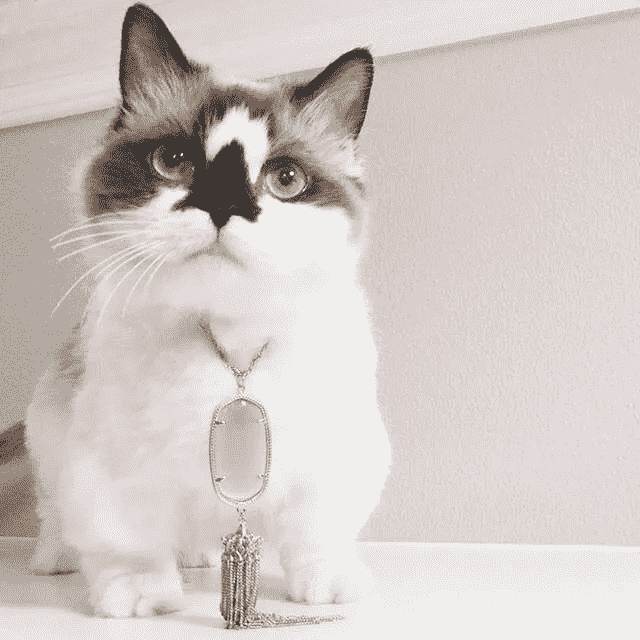
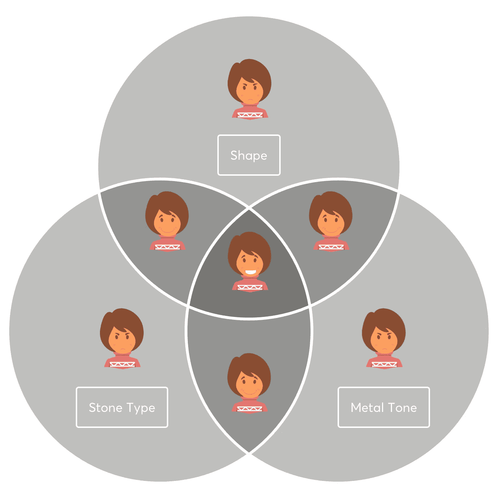
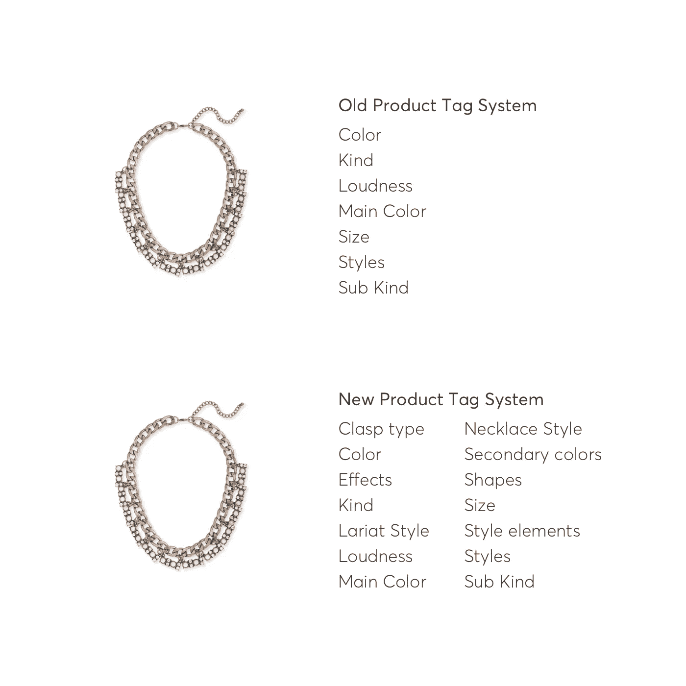
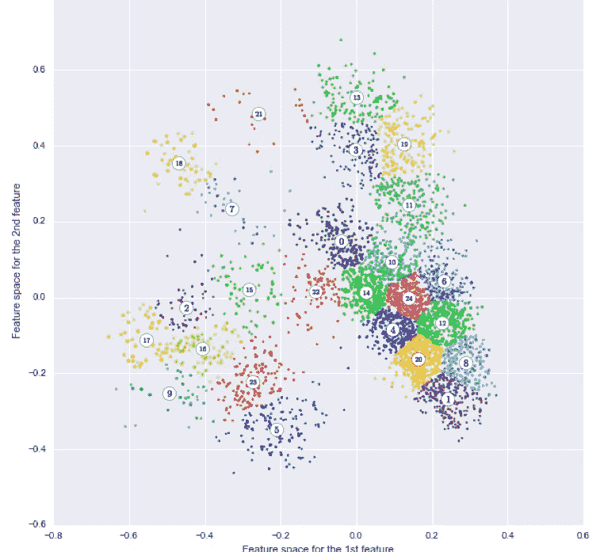
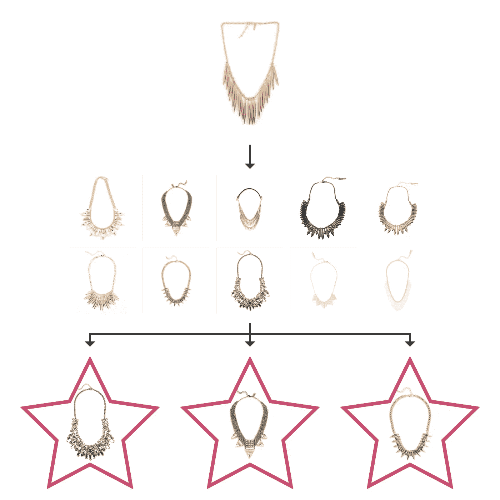
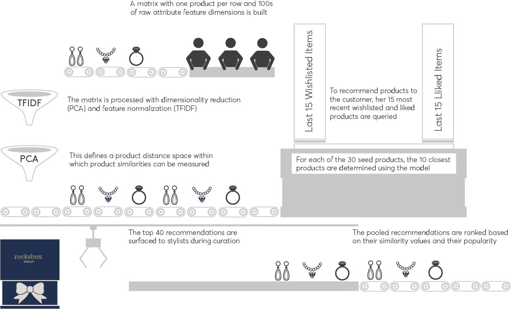

# 人性化的学习风格空间

> 原文：<https://medium.com/hackernoon/learning-style-space-with-a-human-touch-a48808ebf975>

# **动机:**

Rocksbox 建立在一个简单的原则上:现代女性希望接触最新潮流，探索自己的时尚感，而不要把钱花在她们不想要的东西上。我们提供每月订阅，会员可以收到专为她定制的一套三件珠宝。我们通过了解每位会员的风格偏好，与她建立了独特的关系，目标是让她喜欢每个盒子里的物品。如果她真的喜欢一件作品，在现实生活中体验过之后，她可以在家里*直接购买。我们了解她的偏好的方法之一是通过愿望清单。我们的会员可以通过将物品放在愿望清单上来表达他们对盒子里想要的物品的兴趣。连同对她在箱子里体验过的物品的反馈，我们了解了她的个人风格。*

个性化和风格空间的自动化学习对于[数据科学](https://hackernoon.com/tagged/data-science)来说已经成熟。珠宝的属性(例如金属、宝石类型、颜色、形状……)以及这些属性的组合是决定一件珠宝风格的关键因素。同样，客户也有一系列维度和偏好，这些维度和偏好在每个人身上都有独特的组合。每月订阅为产品和客户的重复数据收集提供了一个平台，因此我们可以快速了解等式的两个部分(产品和客户)。总之，这些因素使 Rocksbox 能够为每一个策划的盒子提供高质量的建议，从而增强我们设计师的领域知识。

会员体验的个性化是我们的基本价值主张，我们相信这有助于建立持久而有价值的会员关系。与最初的网飞体验类似，我们的会员可以对他们收到的物品进行评级，并告诉我们这些物品是否符合他们的个人风格。我们的造型师负责管理发给我们会员的每一个盒子，他们有大量的反馈数据，并面临着一个难题，即如何将她给我们的各种反馈与我们的库存进行匹配，以创造出她会喜欢的套装。我们如何更有效地了解我们的成员的个人风格，并帮助我们的造型师在每个盒子里创造令人惊叹的体验？具体来说，我们如何学习我们的产品之间的相似性，以便将它们放在学习的风格空间中，并使用该风格空间来推动个性化推荐？

**Inferring Her Style Space:** By knowing where in style space the products that she has previously liked and bought reside, we can recommend similar things that are both close enough to her known style preferences to be safe bets but controllably dissimilar to historical likes such as to provide a zone of serendipitous discovery.

# **通过内部“众包”收集数据:**

许多类别的[机器学习](https://hackernoon.com/tagged/machine-learning)的一个重要但经常被忽视的方面是需要标记数据。公共数据集通常已经被标注。然而，企业捕获的许多真实数据集要么缺乏标签，要么缺乏正确类型的标签来促进机器学习。为了学习和建模珠宝产品属性空间，我们首先需要我们的产品具有高质量的属性。最初，我们产品上的属性很少，没有深刻的意义。它们主要由金属色调(即金色或银色)和高级主观风格标签组成，如“波西米亚风”和“前卫风”。这些标签对我们的设计师和会员来说可能意味着不同的东西，并且在产品属性方面具有松散的语义。为了解决这一问题，我们在 Rocksbox 内部开展了一项多功能工作，利用我们的采购、工程和数据科学团队的优势。尽管很复杂，我们还是进行了这项工作，因为我们相信造型风格空间是我们根据会员喜好个性化每套服装的基础。

Data Science 与我们的销售团队合作，定义了 100 多种新属性，包括物理属性，如搭扣类型、形状、二级颜色，以及风格元素，如铆钉、流苏和穿孔。这些属性被选择为最有可能在期望的风格空间中根据风格偏好来区分作品。属性的增长对数据科学来说是必要的，但也带来了规模问题。我们有数以千计的活动产品需要用这些新属性来填充。我们考虑过一般的众包，但很快就不考虑了，因为我们认为准确标记我们的产品需要珠宝特定领域的知识。相反，我们在 Rocksbox 内部“众包”,由几名员工在几周内为产品贴标签。这本身就是一个学习过程。我们了解了哪些属性我们已经清楚地定义了，哪些没有。我们还了解了我们遗漏的属性，这些属性出现的频率足够高，以至于我们可以将它们包含在我们用来标记产品的集合中。例如，我们意识到我们已经忽略了属性 crystal clusters 和 chevron，而需要更好地定义 ear huggie 和 ear jacket 之间的区别。

**Product Tagging:** Products were previously tagged using a limited set of tag categories. To facilitate style space learning, the number of tag categories was increased over twofold to include more discriminating physical attributes of the jewelry.

# **降维和归一化:**

有了新产品属性，我们试图开发一个向量空间模型，其中每个产品都由一个从其属性中学习到的向量来表示。我们试图使用这个向量空间模型来评估库存中产品之间的相似性，从而形成基于内容的推荐引擎的主干。用新标签填充我们的库存并不是产品属性数量增长带来的唯一挑战。当涉及到机器学习时，特征维度在训练数据的负担方面提出了问题，以学习任何一个特征的重要性。此外，具有大量稀疏支持的特征(203 个特征，平均特征由 136 个示例支持，而中值仅由 36 个示例支持。)，最常见的功能将占主导地位，不太常见的功能将失去重要性。在许多应用程序中，正是这些罕见的特征最能区分您试图建模的单个实体。为了说明产品属性数据的增加的维度和稀疏性，以及抵消常见属性的优势，我们对我们的数据应用了主成分分析( [PCA](http://http://www.innoarchitech.com/machine-learning-an-in-depth-non-technical-guide-part-5/) 和 [TFIDF](https://lizrush.gitbooks.io/algorithms-for-webdevs-ebook/content/chapters/tf-idf.html) 归一化。

PCA 是一种经过验证的真正的降维技术，它通过将原始数据投影到一组减少的轴上，对数据进行线性变换，这些轴说明了原始数据中观察到的大部分变化。然而，PCA 不是免费的。投影数据集中的每个新轴都由原始要素的部分组成。这种线性投影使得可解释性更具挑战性。生成的组件与原始特征没有直接的关系。此外，没有单一的最佳方法来选择要使用的组件(轴)的数量。根据您的应用，您可能希望选择能够捕获数据中观察到的最大差异的组件数量，或者您可能只是希望将 1000 维减少到 100 维，以促进可能会受到非常广泛的数据影响的机器学习。我们选择结果风格向量空间中产品的可聚类性作为度量，以选择 PCA 中适当数量的组件。这是基于我们在降维向量空间中有效区分产品的目标。通过在降维空间中驱动一致的聚类，我们可以确信我们已经定义了产品映射到的产品属性空间的区域。

**Product Feature Space:** Visualization of product clusters in learned attribute space. The space was reduced to 2 dimensions for display. Sampling of products from these clusters reveals distinct regions of product attribute space.

在成功学习产品属性的向量空间表示的过程中，我们首先遇到了挑战，这使我们怀疑这种方法是否行得通。有了数据转换，成功的方法中既有科学，也有艺术。最初，我们假设产品中的高级标签，如“boho”、“glam”、“classic”和“chic”具有较低的语义，会使风格相似性的学习偏离从产品属性中学习的内容。此外，考虑到数据的稀疏性，我们预计数据集中支持度非常低的特征会妨碍我们推断产品相似性的能力。相比之下，包含高级别样式级别有助于支持 PCA，因为这些样式标签中有许多与稀疏的粒度属性相关。

# **学习风格空间中的产品相似度:**

为了进一步评估我们所学的风格向量空间的质量，我们利用产生的产品风格向量之间的[余弦距离](http://blog.christianperone.com/2013/09/machine-learning-cosine-similarity-for-vector-space-models-part-iii/)来获取相似的产品。对于库存中的每种产品，我们根据种子产品和库存其余产品之间的余弦距离提取了 10 种最相似的产品。相似产品之间的视觉相似性是惊人的，给了我们信心，我们已经学习了一个强大的产品属性向量空间。

**Similar Products:** The 10 most similar products for a given seed product can be queried using the vector space model. While images were not used to assess similarity, the similar products share visually similar styles. This suggests that the product attributes effectively capture the visual styles of the products. From the set of 10 most similar products, an algorithm could choose a subset of these products based on other attributes that are relevant such as popularity or price.

一旦我们有了一个珠宝属性风格空间，我们可以合理地评估产品之间的相似性，我们试图建立一个基于内容的推荐引擎。通过知道她以前喜欢和购买的产品在风格空间中的位置，我们可以推荐与她已知的风格偏好足够接近的相似的东西作为安全赌注，但是可控地与历史喜欢不同，以便提供偶然发现的区域。我们发现，利用用户项目偏好和项目属性的传统的基于内容的推荐器倾向于过度重视历史风格偏好(即，基于先前的交互来提供作品，但是没有为发现提供足够的多样性)。我们需要保持平衡，既要满足她的口味，又要避免因提供与她之前购买的产品过于相似的产品而感到疲劳。为了解决这些限制，我们开发了一种基于味道图的方法来推荐类似的项目。具有正面反馈(喜欢或喜爱)、已被愿望列表或已被购买的 15 个最近的项目成为我们的查询中的开始节点。从这些起始节点中，我们获取 N 个最相似的项目。通过这种方式，我们可以控制我们希望获取的项目有多相似或不相似。这里有很大的灵活性。例如，我们可以在假设她不想购买或体验更多与她已经购买的作品非常相似的作品的情况下，购买与已经购买的作品不太相似的作品。在返回推荐集之前，我们对结果集进行评分。该评分结合了与起始产品节点的相似性以及该项目在反馈和购买方面的加权流行度。具体来说，我们计算每个产品的受欢迎程度得分，这是该产品的反馈与该产品的购买频率的归一化加权和。然后，通过种子作品的反馈(即，它是否被喜欢、喜爱或购买)对该受欢迎度分数进行加权。每个产品都会得到一个分数，即它与种子产品的距离加上加权的流行度分数。以这种方式，我们不是简单地依赖原始的相似性，而是根据项目对会员产生积极体验和业务影响的可能性来对项目进行排序。

**Recommendation pipeline**: With the goal of surfacing pieces that she’ll love, we applied unsupervised machine learning to learn a product attribute based similarity space. Using the products that she has previously rated or expressed interest in (wish list) we can query the learned jewelry feature space to find the pieces that are stylistically similar to her expressed preferences. This set of pieces is ranked based on similarity to the seed products and popularity The top 40 ranked pieces are surfaced as recommendations.

为了确定这种方法给我们的成员带来负面体验的可能性，我们研究了推荐她以前不喜欢的项目的发生率。对于我们服务的新顾客和反馈数据较少的顾客，我们发现，我们退回她不喜欢的商品的几率约为 1%。一旦我们从反馈或愿望清单中获得超过 10 个数据点，这一比例就会下降到 0.5%以下。在跟踪该推荐器在生产中的成功时，我们可以比较推荐项目与非推荐项目的总体性能，以及相同项目被推荐和未被推荐时的性能。

自从将产品相似性推荐器部署到我们的愿望清单后，愿望清单 CTR 增加了一倍多(从每次 3 个愿望清单增加到每次 7 个愿望清单)。这表明推荐者正在展示与我们会员的个人风格有共鸣的相关项目。

**回顾:**

我们从头开始构建了一个基于图形的产品推荐器，利用人类对库存的标记和无监督学习来学习基于产品属性的风格空间。我们很高兴推出这款推荐产品来充实我们的愿望清单，会员可以在这里表达对产品的兴趣，并帮助设计师打造会员喜欢的盒子。我们了解到，即使只有少量数据，也有可能通过探索已知风格空间以及允许意外发现来构建高质量的推荐器，这超越了典型的基于内容的推荐器所能做到的。我们欢迎你在评论中提出你的想法和问题。 [Rocksbox](http://www.rocksbox.com) 正在招聘员工，做一些了不起的事情，用数据改变珠宝和时装租赁领域。如果你对我们正在做的事情感兴趣，我们很乐意和你谈谈！

> [黑客中午](http://bit.ly/Hackernoon)是黑客如何开始他们的下午。我们是 [@AMI](http://bit.ly/atAMIatAMI) 家庭的一员。我们现在[接受投稿](http://bit.ly/hackernoonsubmission)并乐意[讨论广告&赞助](mailto:partners@amipublications.com)机会。
> 
> 如果你喜欢这个故事，我们推荐你阅读我们的[最新科技故事](http://bit.ly/hackernoonlatestt)和[趋势科技故事](https://hackernoon.com/trending)。直到下一次，不要把世界的现实想当然！

