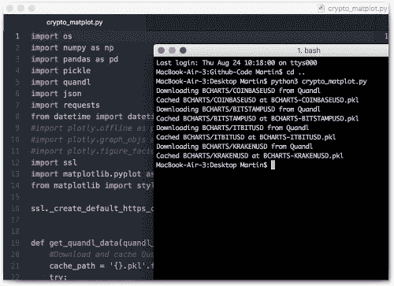

# 学习编码，420 小时后:如何自学 Python，免费

> 原文：<https://medium.com/hackernoon/learning-to-code-420-hours-later-how-to-teach-yourself-python-for-free-e8c61f2de528>

大约一年半以前，我开始自学用 Python 编程。今天，我有信心正式完成我的项目。

老实说，我有点自豪能够在我认为的中级初学者水平上编码。经过过去几个月持续和急剧的改进，我现在已经过了“[编码拐点](https://stories.buffer.com/learning-to-code-is-non-linear-bf12dd6e1f4ct)”。这意味着我已经掌握了 Python 编程的大部分基本方法和模式，并且现在在某些情况下可以实际上依靠已有的例程来编写代码。

如果你把[比作学习](https://hackernoon.com/tagged/learning)一门口语，那就是你能够用新学到的语言进行基本对话的时刻。然而，无论你表达什么，都是原始的，错误百出，词汇贫乏。你必须不断地查找单词或语法。有时候，当谈论更复杂的东西时，你不得不放弃(但你会用这种洞察力来进行未来的改进)。尽管如此，你还是对自己的新技能感到兴奋。

在这篇文章中，我想简单总结一下我是如何自学 Python 编程的。这将是我的非正式系列文章的最后一篇，从现在起，这将是唯一重要的一篇。让我们开始吧:

*=======*
[*报名参加每周邮件*](http://weekly.meshedsociety.com/) *满载关于数字世界的精彩阅读。* [*例*](http://us9.campaign-archive2.com/?u=56faa90a501c65cf2fe0b7f20&id=f6ab9df664&e=3e41a1986e) *。还有别忘了试试*[*meshedsocety weekly bot on Messenger*](http://m.me/meshedsociety)*。
=======*

## 我花了多长时间学习编码？

2016 年，我每周花大约 2 个小时，所以假设总共 100 个小时。今年，我试着每周投资 8 到 10 个小时。那就是 40 x 8 小时，这将使我在这个项目上花费的总时间达到 420 小时。因此，我们正在寻找一个类似于 2 个半月的密集编码训练营的时间投资，但分散在 20 个月内。训练营通常要花很多钱。我一分钱都没付。

## 有哪些障碍？

如果你真的想学习编程，除了需要找到和优先安排时间之外，我能看到的唯一障碍是缺乏自律和毅力。对我来说，决定一个我想要完成的目标通常足以让我保持专注，因为如果我失败了，我会对自己感到巨大的失望。尽管人和思想是不同的。有些人可能更喜欢依靠外部压力来度过难关，例如让合作伙伴/朋友承担责任，例如承诺在失败时支付一大笔钱。事实上，在我关于进步的博客文章中，我多少也加入了感知到的外部压力。有些人确实非常喜欢有老师、作业和考试的正式班级。如果是那样的话，我自己的经历就没什么价值了。知道自己属于哪种学习类型很重要。

## 我是如何着手的，我使用了哪些资源？

我将按照确切的顺序列出网站和资源。

1.我从 [Codecademy 的 Python](https://www.codecademy.com/learn/learn-python) 课程开始，这是一个[开始](http://meshedsociety.com/what-happened-after-i-started-my-first-programming-course-on-codecademy/)的奇妙方式。

2.完成 Codecademy 课程后，我继续学习来自[的教程《艰难地学习 Python》](https://learnpythonthehardway.org/book/)。

3.接下来是谷歌的 Python 类。

4.在做 Google 的 Python 类的时候，我开始构建自己的小程序，比如在本地运行的简单聊天机器人。我发现不仅学习新的东西和解决 Python 课程中的任务很重要，而且不断实践我已经听到的知识也很重要。一旦你内化了 Python 中循环、列表、字典和函数的工作方式，一旦你习惯了创建它们，进步就会大大加快

5.一旦我完成了谷歌的 Python 类，当我自己创建小程序时，我继续通读并解决来自[的任务，用 Python](https://automatetheboringstuff.com/) 自动化枯燥的东西，接着是[用 Python](http://inventwithpython.com/chapters/) 发明。后一个网站教授如何用 Python 构建基本游戏，这非常有趣。到目前为止，一些任务实际上开始变得太容易了，而另一些仍然有点难以理解。所以我挑选了我觉得符合我知识水平的。

6.我继续解决从[练习 Python](http://www.practicepython.org/) 开始的所有任务。到现在为止，我已经开始厌倦编程会话的重复特性。

7.我和[一起工作，这个教程](https://tutorial.djangogirls.org/en/django/)使用 Python 和 Django 框架在一个网站上发布了一个非常简单的博客。这仍然有点挑战性，但让我第一次看到了 Python 代码是如何与 web 编程集成在一起的。我还在 Github 注册了一个账户[，几乎所有的开发者都在那里存储和分享代码。](https://github.com/martinweigert)

8.在这里阅读关于使用 Python 进行数据分析和可视化的[激发了我对这个主题的关注，因为它也为我的编辑和写作工作提供了有趣的前景。我可能不需要提及数据在当今世界中日益增长的作用。](https://pythonprogramming.net/data-analysis-tutorials/)

9.从这里开始，我用简单的数据可视化来玩[。](http://meshedsociety.com/how-hacker-news-benefited-when-i-stopped-tweeting/)[我攻克了我的第一个 API](http://meshedsociety.com/analyzing-the-hacker-news-front-page-as-a-python-beginner/) (黑客新闻)，接着是 [Reddit 的 API](https://github.com/martinweigert/reddit_analysis) 。能够将我新获得的技能与其他领域的兴趣和工作结合起来，这让我非常有成就感和动力。

10.我自学(和其他大量使用[stackoverflow.com](http://stackoverflow.com/)的案例一样，每个与编码相关的问题都很可能已经得到了答案)连接到[谷歌的 QPX Express API](https://developers.google.com/qpx-express/) 来访问机票价格。利用它，我构建了一个小型的本地运行的航班搜索引擎。遗憾的是，该 API 每天只限于 50 次免费查询(这当然已经很不错了，因为谷歌可能需要为每次 API 调用付费来获取数据)。否则我可能会在接下来的几个月里忙于为自己创建最先进的机票工具，并最终把它放到网上。

11.目前，在完成了这个可视化加密货币市场的教程之后，我继续在数据可视化领域尝试一些东西，使用 Python 模块 Matplot 和 Pandas。虽然我大多数时候仍然只是重新发明轮子(通常比原来的更差)，但我的志向是总是将我的编码与实际的感兴趣的领域结合起来。这让它变得有趣多了。

## 下一步是什么？

虽然我称那个时刻为我的 Python 项目的正式完成，但这绝不意味着我现在就要停止。只需要几个星期，我仍然不牢固的 Python 技能基础就会完全退化。所以我会继续编码，我会努力找到适合我的主题的用例。数据分析和可视化很吸引我，但也很有挑战性。过去，我读过一篇博文(可惜我再也找不到了)，描述了一个学习编程的人如何经历一个非常不规则的学习曲线，伴随着快速感知改善的交替循环，随后是停滞、下降和沮丧的时期。目前看来，我似乎处于一个平台期，似乎没有提高我的技能，偶尔甚至在简单的事情上挣扎。但只要我不停止练习和学习，下一个快速成长期肯定会到来。

我从我自己的角度写了这篇文章，但是我希望很明显每个人都可以这样做。最后一个建议:从你的社交媒体时间预算中拿出学习编码所需的时间。你将会惊讶于你将会走多远:)

如果你有任何问题，欢迎在评论中提问。

*=======*
[*报名参加每周电子邮件*](http://weekly.meshedsociety.com/) *满载关于数字世界的精彩内容阅读。* [*例*](http://us9.campaign-archive2.com/?u=56faa90a501c65cf2fe0b7f20&id=f6ab9df664&e=3e41a1986e) *。还有别忘了在 Messenger* *上试试*[*meshedsociety weekly bot。*](http://m.me/meshedsociety)

*原载于 2017 年 8 月 24 日*[*meshedsociety.com*](http://meshedsociety.com/learning-to-code-420-hours-later-how-to-teach-yourself-python-for-free/)*。*