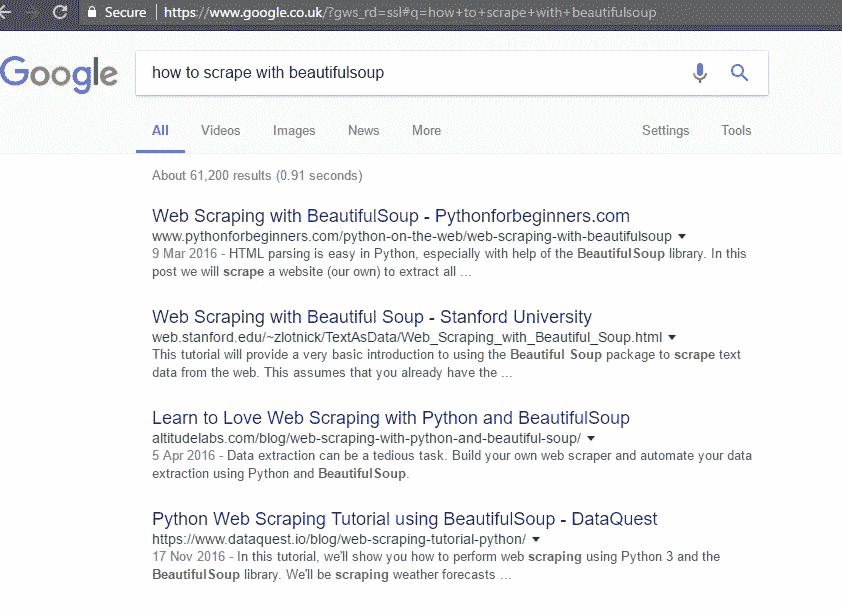

# 学习编码:关注“何时”而不是“如何”！

> 原文：<https://medium.com/hackernoon/learning-to-code-focus-on-when-rather-than-how-264bd45d1b77>

Image Courtesy: [https://pixabay.com/en/glasses-read-learn-book-text-272399/](https://pixabay.com/en/glasses-read-learn-book-text-272399/)

具有讽刺意味的是，我是一个自学成才的程序员，尽管我有计算机科学学位。原因是我在大学期间从来没有学过编程，不是因为我不想学，而是课程非常无聊和无用。因为没人教我编程，只教了语法。我被迫学习如何初始化一个变量，如何对两个变量求和，如何创建一个数组。我学到的主要是“如何”,而不是何时使用数组，何时处理异常。

后来我意识到，他们实际上是在训练我成为一名“编译器”，而不是“程序员”。因为当你只是学习编程中的“如何”,而不是学习“何时”使用这些语法或基本元素时，你就会变成这样。

这就是为什么对于一个想学习编码的新手来说，参加鼓励“基于案例的学习”(如 Freecodecamp，Code Academy)而不是“基于语法的学习”(Tutorialspoint)的课程/平台非常重要。我们生活在一个谷歌和 Stackoverflow 唾手可得的时代，这让我想知道，当那些可以在瞬间找到的时候，记忆(如何记忆)语法还有什么意义。

考虑这种情况，初学者想做一个 Web 抓取项目:

需要知道的事情:

*   什么是网页抓取？
*   选择什么语言？
*   哪种特定语言的模块/包有助于解决这个问题？

经过一个小练习，新手可以想出两个关键词，比如“python”和“beautifulsoup ”,然后只需简单的谷歌搜索:

当有人坐在新手的头上，命令他/她创建一个网络抓取项目时，这种方法非常有效，但这不是一个人在专业环境中想要做的。通过这种方式，新手可以学习“何时”使用网络搜集来解决问题(同时也学习如何进行网络搜集)。

这种学习也有助于新手剔除无聊的部分，做一些令人兴奋的事情，向大脑发送积极的反馈，这反过来又会增加决心，激励进一步的深度学习。

> [黑客中午](http://bit.ly/Hackernoon)是黑客如何开始他们的下午。我们是 [@AMI](http://bit.ly/atAMIatAMI) 家庭的一员。我们现在[接受投稿](http://bit.ly/hackernoonsubmission)，并乐意[讨论广告&赞助](mailto:partners@amipublications.com)机会。
> 
> 如果你喜欢这个故事，我们推荐你阅读我们的[最新科技故事](http://bit.ly/hackernoonlatestt)和[趋势科技故事](https://hackernoon.com/trending)。直到下一次，不要把世界的现实想当然！

