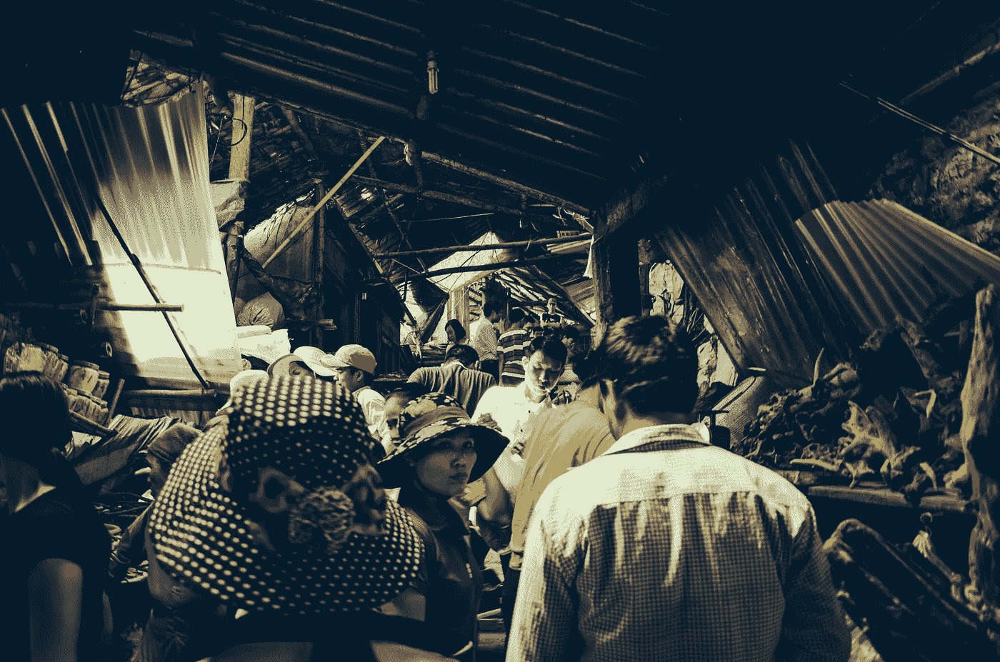
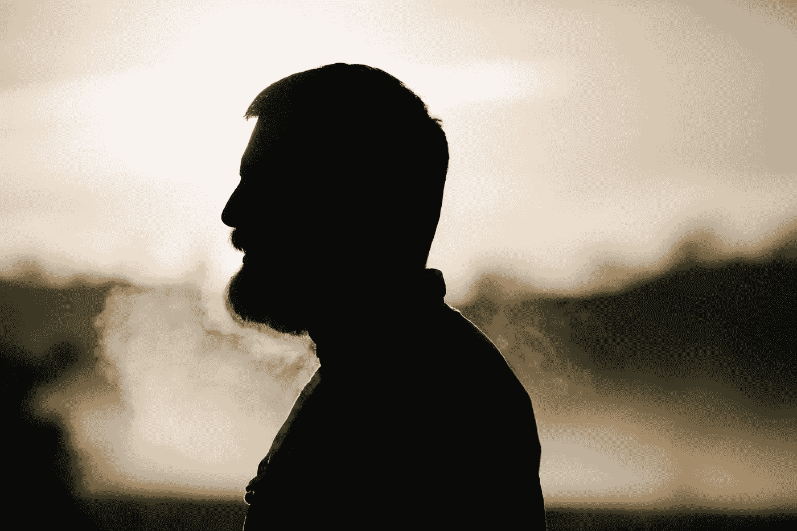
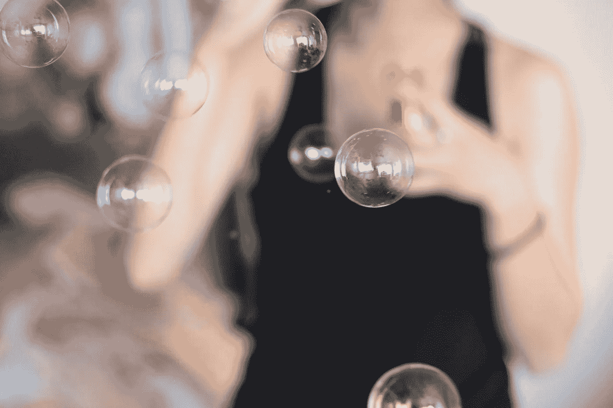

# 学会换位思考

> 原文：<https://medium.com/hackernoon/learning-to-empathize-e7f7cb48c577>

我关于“职业发展”的大部分理念都是围绕着建立关系和结识他人。无论从个人角度还是职业角度，人们都是我成长的最大推动力。你可以采取一些策略来自动化和破解社交网络过程，但最终还是要靠你能够与其他人建立真正透明的联系。

**移情**是这个过程的核心。如果不了解人们是如何思考的，你就无法理解如何与他们交流。

总的来说，我相信大多数人都遵循这些基本的和本能的人性原则:

*   **人们希望感觉自己很重要**

不管是好是坏，自我是决策最强大的驱动力之一。在没有意识到这一点的情况下，我们经常在外部验证者的指导下做出选择，而不是直觉和逻辑。

*   **人们想要赢(并且觉得自己赢了)**

人们喜欢胜利。不仅如此，人们讨厌失败。没有人想成为交易的输家。

*   **人很懒**

虽然不总是正确的，但为了便于讨论，我们可以认为，在宏观层面上，人类会做出最大化价值和最小化努力的决策。我们都是懒惰的人，想要的最多，但我们常常没有准备好为他们做最多的事。说白了，我们就是自私的存在！

理解人类很难。尽管我们很有逻辑，但我们是非理性的。

## 然而，理解我们为什么做我们所做的事情是非常强大的。有很多问题需要回答:

> 我们为什么用脸书？为什么我们认为篮球很酷？我们为什么工作？

为了[与他人建立关系](/startup-grind/how-i-went-from-being-a-stranger-to-having-a-network-in-silicon-valley-8cf7ac5fed)，我试图回答的问题是:为什么人们会说是？具体来说，为什么别人接我电话？为什么我在网上找到的完全陌生的人要花 30 分钟聊生活？为什么人们会回复我冰冷的邮件？是什么让一个拥有上亿美元和数百万追随者的人，在我身上冒了一个非理性的风险，帮我脱困？

**答案在于换位思考。**

最好的创始人是最好的移情者。他们了解他们的社区是如何运作的，是什么给了他们能量。

一个很好的例子: [Ryan Hoover](https://medium.com/u/c2146664c8e4?source=post_page-----e7f7cb48c577--------------------------------) 与 [Product Hunt](https://www.producthunt.com/) 。他和他的团队在一个非常精细的层次上理解如何让他们的社区充满动力和激情。

最优秀的作家往往是伟大的移情者。他们确切地知道哪些词会唤起读者的哪些情感。

T2 最好的餐馆老板知道做什么样的食物。

**这样的例子不胜枚举。要与世界分享一些东西，你必须了解这个世界。忽视它是愚蠢的。**

很难站在一个陌生人的角度考虑问题，但是我向你保证，即使是尝试 的 ***过程也会揭示一些令人难以置信的知识。***

## 那么，如何打破你的幻想，做到这一点呢？

## [和不喜欢你的人在一起](/@jordangonen/surround-yourself-with-people-not-like-you-efcbd6f076d7)

我有目的地努力与我根本不同意的人谈论一些事情(职业方面)。例如，在学校，我的朋友没有一个和我有共同的职业兴趣。大多数人想进入投资银行或其他金融相关领域。事实上，很难逆潮流而动，持有相反的观点。尤其是当学校里的许多验证者将你指向多数人的意见时。

面对这种情况，您可以做两件事:

*   忽视对立的观点
*   听他们说

太多的人选择忽视，继续自己的生活。打个比喻，我们这样做是在建一堵墙，把新的意识形态拒之门外。

我选择后者。我觉得你也应该这样。原因如下:

想象一下，你听了一个与你自己的信念相冲突的观点……会有两种结果。

首先是你强烈反对对方所说的话。在这种情况下，你仍然坚持你的想法，很可能会转向一个更极端的观点。在这种情况下，你能做的最好的事情就是试着理解为什么其他人会持有这种观点。另外，你能做的就是学会如何更好地传达你的立场。如果有什么不同的话，这是非常有价值的，因为它证实了你对自己的*为什么、*以及为什么你会放弃这个选择的信念。

第二种情况是你实际上改变了一点想法。信不信由你，其他人经常有与你自己截然不同的好想法。改变想法没有错。

## 消费不同的东西

同样，阅读与你当前观点相反的东西可以开阔你的视野，帮助你以不同于以往的方式思考。

试着考虑桌子的另一边。

尝试在 Twitter 上关注不同类型的人群。尝试打开新的出版物阅读。观看不同类型的节目。

## 旅行

19 岁的时候，我已经足够幸运去环游世界了。我去过欧洲，以色列，美国。

这个世界是一个充满多样性的迷人地方。

你旅行时会遇到各种各样的人。你吃不同种类的食物。你看到不同的运动。不同的东西。

亲自看世界是打破你的幻想的最好方式之一。

我相信，作为人类，我们最有价值的资产是我们的移情能力。

> 坚持你的观点。但要弱弱地抱着他们。接受改变。但是要对自己的信念有信心。

## 我很想听听你是如何学会换位思考的？

## 评论👇或者发微博给我 [@jrdngonen](https://twitter.com/jrdngonen)

> 总是在这里帮忙-> jordangonen1@gmail.com
> 
> 与我的[每周简讯](http://tinyletter.com/jordangonen)保持同步

> [黑客中午](http://bit.ly/Hackernoon)是黑客如何开始他们的下午。我们是 [@AMI](http://bit.ly/atAMIatAMI) 家庭的一员。我们现在[接受投稿](http://bit.ly/hackernoonsubmission)并乐意[讨论广告&赞助](mailto:partners@amipublications.com)机会。
> 
> 如果你喜欢这个故事，我们推荐你阅读我们的[最新科技故事](http://bit.ly/hackernoonlatestt)和[趋势科技故事](https://hackernoon.com/trending)。直到下一次，不要把世界的现实想当然！

