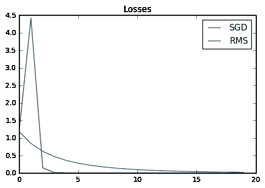
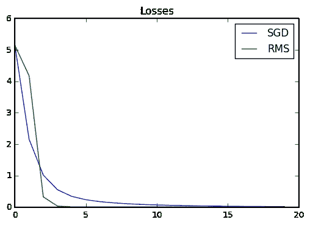
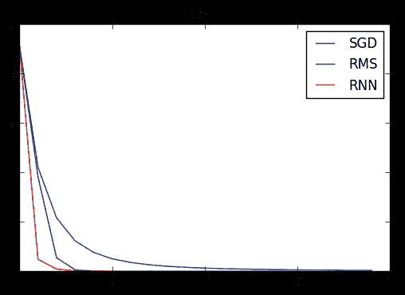
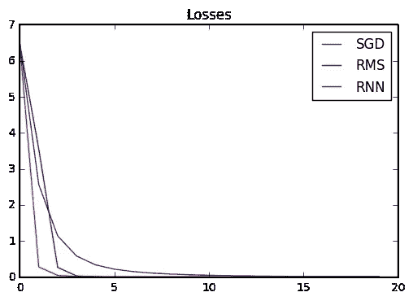
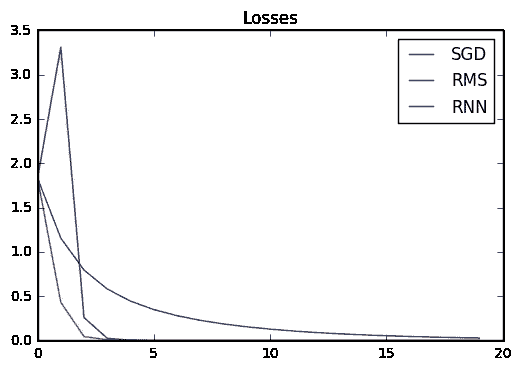
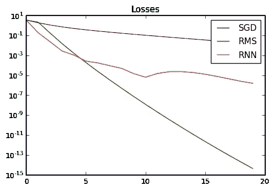
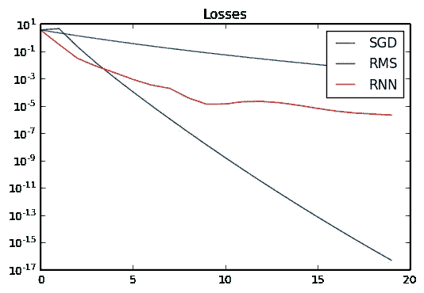

# 通过梯度下降来学习

> 原文：<https://medium.com/hackernoon/learning-to-learn-by-gradient-descent-by-gradient-descent-4da2273d64f2>

## TensorFlow 中尽可能简单

当我第一次看到 DeepMind 的论文“[通过梯度下降学习通过梯度下降学习](https://arxiv.org/abs/1606.04474)”时，我的反应是“哇，这到底是怎么回事？”。不幸的是，我第一次通读这篇论文并不那么有启发性，而且看着[代码](https://github.com/deepmind/learning-to-learn)令人望而生畏。

谢天谢地，我被激起了足够的好奇心，强迫自己重新深入阅读这篇论文，它实际上最终被证明是惊人的简单。就我个人而言，当我试图理解某事时，真正帮助我的是创建问题的最简单的非平凡版本，然后从那里扩大规模。这是我能创造的最简单的想法，也是*没有数学方程式！*我希望你会觉得它很有启发性。

我建议先略读这篇论文，但这应该是可以理解的。

本文带有语法高亮的 [IPython](https://hackernoon.com/tagged/ipython) [笔记本](https://hackernoon.com/tagged/notebook)版本可以在[这里](https://github.com/LlionJ/blog/blob/master/blog/Meta-Learning.ipynb)找到。代码在 TF v1.0.0-rc1 上运行。

所以让我们开始吧。是时候通过阅读我的文章来学习如何通过梯度下降来学习了！

```
import tensorflow as tf
```

首先，我们需要元学习优化器解决一个问题。让我们从论文中取一个最简单的实验；求多维二次函数的最小值。我们将随机缩放抛物线，从随机位置开始，解总是在(0，0)。

```
DIMS = 10  # Dimensions of the parabolascale = tf.random_uniform([DIMS], 0.5, 1.5)# This represents the network/function we are trying to optimize,
# the `optimizee' as it's called in the paper.
# Actually, it's more accurate to think of this as the error
# landscape.
def f(x):
    x = scale*x
    return tf.reduce_sum(x*x)
```

我们在这里不能轻易使用 TensorFlow 的内置优化器，因为该技术要求我们*在计算图*中展开训练循环，稍后我们会看到。因此，让我们定义几个简单的手工优化器来测试我们学习的优化器。正如本文所讨论的，优化器是一个函数 *g* ,它在给定的步长获取参数的梯度，并返回您应该在参数空间中为该参数采取的步长。这里是普通梯度下降:(一些优化器需要跟踪状态，这里我只是传递参数)

```
def g_sgd(gradients, state, learning_rate=0.1):
    return -learning_rate*gradients, state
```

为了获得更强的基线，让我们使用 RMSProp:

```
def g_rms(gradients, state, learning_rate=0.1, decay_rate=0.99):
    if state is None:
        state = tf.zeros(DIMS)
    state = decay_rate*state + (1-decay_rate)*tf.pow(gradients, 2)
    update = -learning_rate*gradients / (tf.sqrt(state)+1e-5)
    return update, state
```

很好，现在让我们展开所有的训练步骤，这里的 *learn* 是一个函数，它采用这些优化器中的一个，并将其应用于若干步骤的循环中，并收集函数 *f* 在每一点的值，我们可以认为这是我们的损失。

```
TRAINING_STEPS = 20  # This is 100 in the paperinitial_pos = tf.random_uniform([DIMS], -1., 1.)def learn(optimizer):
    losses = []
    x = initial_pos
    state = None
    for _ in range(TRAINING_STEPS):
        loss = f(x)
        losses.append(loss)
        grads, = tf.gradients(loss, x)

        update, state = optimizer(grads, state)
        x += update
    return losses
```

好了，现在我们来测试一下。

```
sgd_losses = learn(g_sgd)
rms_losses = learn(g_rms)
```

看看损失是什么样的。

```
sess = tf.InteractiveSession()
sess.run(tf.global_variables_initializer())import matplotlib
import matplotlib.pyplot as plt
%matplotlib inline
import numpy as npx = np.arange(TRAINING_STEPS)
for _ in range(3): 
    sgd_l, rms_l = sess.run([sgd_losses, rms_losses])
    p1, = plt.plot(x, sgd_l, label='SGD')
    p2, = plt.plot(x, rms_l, label='RMS')
    plt.legend(handles=[p1, p2])
    plt.title('Losses')
    plt.show()
```



RMS Prop 在这里的表现优于普通梯度下降。请注意，到目前为止还没有发生什么不寻常的事情，我只是手工滚动了我自己的优化器，并将整个训练展开到一个单独的计算图中，这通常是不推荐的，因为你会很快耗尽内存！

## 元学习

是时候整合我们的元学习优化器了，我们将使用与论文中相同的架构:一个有 2 层和 20 个隐藏单元的 LSTM。

```
LAYERS = 2
STATE_SIZE = 20cell = tf.contrib.rnn.MultiRNNCell(
    [tf.contrib.rnn.LSTMCell(STATE_SIZE) for _ in range(LAYERS)])
cell = tf.contrib.rnn.InputProjectionWrapper(cell, STATE_SIZE)
cell = tf.contrib.rnn.OutputProjectionWrapper(cell, 1)
cell = tf.make_template('cell', cell)def g_rnn(gradients, state):
    # Make a `batch' of single gradients to create a 
    # "coordinate-wise" RNN as the paper describes. 
    gradients = tf.expand_dims(gradients, axis=1)

    if state is None:
        state = [[tf.zeros([DIMS, STATE_SIZE])] * 2] * LAYERS
    update, state = cell(gradients, state)
    # Squeeze to make it a single batch again.
    return tf.squeeze(update, axis=[1]), state
```

这就是，这就是我们的元学习者。我们可以以完全相同的方式使用它:

```
rnn_losses = learn(g_rnn)
sum_losses = tf.reduce_sum(rnn_losses)
```

> 神奇的是，我们希望*的 sum_losses* 越低，因为损失越低，优化器就越好，对吗？因为整个训练循环都在图中，所以我们可以使用时间反向传播(BPTT)和元优化器来最小化这个值！

这是要点:*sum _ loss 是可微的*，梯度流过我们定义的图形很好！TensorFlow 能够计算出 LSTM 中参数相对于损失总和的梯度。让我们优化一下:

```
def optimize(loss):
    optimizer = tf.train.AdamOptimizer(0.0001)
    gradients, v = zip(*optimizer.compute_gradients(loss))
    gradients, _ = tf.clip_by_global_norm(gradients, 1.)
    return optimizer.apply_gradients(zip(gradients, v))apply_update = optimize(sum_losses)
```

我发现梯度裁剪在这里非常关键，因为在训练开始时，进入元学习者的值可能非常大。

```
sess.run(tf.global_variables_initializer())ave = 0
for i in range(3000):
    err, _ = sess.run([sum_losses, apply_update])
    ave += err
    if i % 1000 == 0:
        print(ave / 1000 if i!=0 else ave)
        ave = 0
print(ave / 1000)> 223.577606201
> 15.9170453466
> 4.06150362206
> 3.94412120444
```

看看它是如何做到的:

```
for _ in range(3): 
    sgd_l, rms_l, rnn_l = sess.run(
        [sgd_losses, rms_losses, rnn_losses])
    p1, = plt.plot(x, sgd_l, label='SGD')
    p2, = plt.plot(x, rms_l, label='RMS')
    p3, = plt.plot(x, rnn_l, label='RNN')
    plt.legend(handles=[p1, p2, p3])
    plt.title('Losses')
    plt.show()
```



成功！看起来在这个问题上它甚至比 RMS 做得更好。实际上，这些图表稍有误导，对数标度显示的东西略有不同:

```
for _ in range(3): 
    sgd_l, rms_l, rnn_l = sess.run(
        [sgd_losses, rms_losses, rnn_losses])
    p1, = plt.semilogy(x, sgd_l, label='SGD')
    p2, = plt.semilogy(x, rms_l, label='RMS')
    p3, = plt.semilogy(x, rnn_l, label='RNN')
    plt.legend(handles=[p1, p2, p3])
    plt.title('Losses')
    plt.show()
```



我认为，正如论文中所讨论的那样，这是因为输入 LSTM 的值的大小可能会有很大的变化，当这种情况发生时，神经网络通常不会很好地执行。这里的梯度变得如此之小，以至于它无法计算出合理的更新。对于更大的实验，论文使用了一个解决方案；改为输入对数梯度和方向。详见论文。

希望，现在你明白了如何通过梯度下降来学习，你可以看到它的局限性。好像扩展性不是很好。我认为论文中的实验规模很小就很能说明问题。即使是我们的玩具问题也需要 4000 步才能收敛，我们必须完全训练一个网络，只是为了元学习者的一步优化。我们将不得不多次优化一个大问题，这将花费很长时间。此外，在图中展开整个训练循环对于更大的问题是不可行的，尽管在论文中他们仅将 BPTT 展开到 20 步。论文中还有证据表明，RNN 优化器可以从较小的问题推广到较大的问题。

为了简单起见，我省略了许多细节，所以阅读这篇文章肯定是值得的。我希望元学习变得越来越重要，为了获得更多的灵感，我建议观看这些 NIPS 演示。

[](http://bit.ly/HackernoonFB)[](https://goo.gl/k7XYbx)[](https://goo.gl/4ofytp)

> [黑客中午](http://bit.ly/Hackernoon)是黑客如何开始他们的下午。我们是 [@AMI](http://bit.ly/atAMIatAMI) 家庭的一员。我们现在[接受投稿](http://bit.ly/hackernoonsubmission)并乐意[讨论广告&赞助](mailto:partners@amipublications.com)机会。
> 
> 如果你喜欢这个故事，我们推荐你阅读我们的[最新科技故事](http://bit.ly/hackernoonlatestt)和[趋势科技故事](https://hackernoon.com/trending)。直到下一次，不要把世界的现实想当然！

