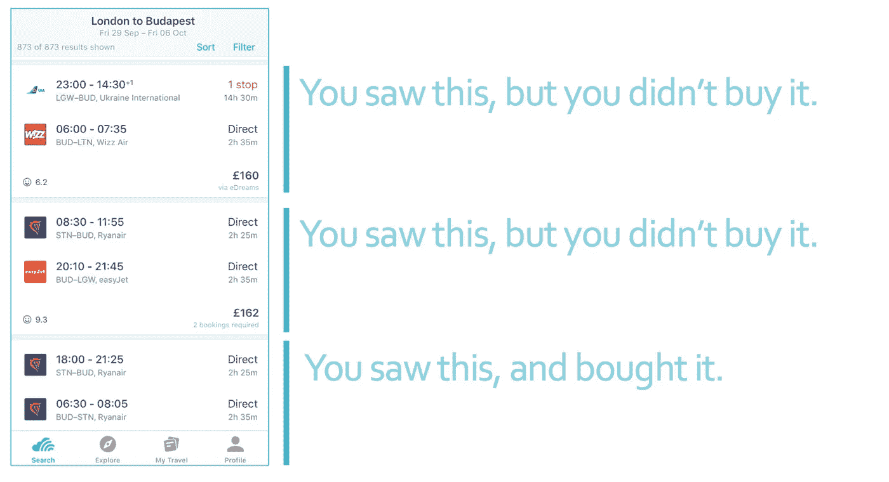
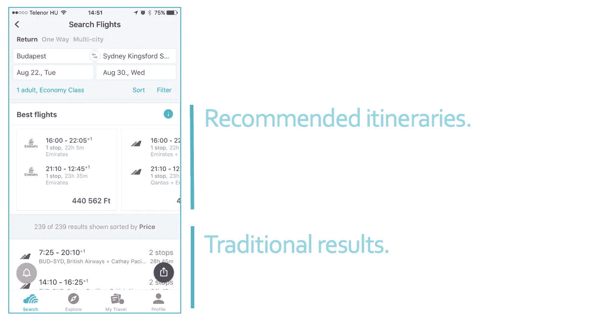

# 学习为航班路线搜索排序

> 原文：<https://medium.com/hackernoon/learning-to-rank-for-flight-itinerary-search-8594761eb867>

*由* [成对排序的方法](https://medium.com/u/9766caca50be#Pairwise_approach)，我在这里不做介绍)。

在任何背景下定义相关性都是棘手的。许多系统依赖于通过查看用户点击了哪些项目来进行隐性测量。然而，在 Skyscanner 应用程序中，点击搜索结果并不是一个非常强烈的信号，表明用户已经找到了他们想要的东西——你可能只是点击旅程以了解更多信息。相关性的一个更强的信号是点击进入航空公司/旅行社网站购买它的承诺，这需要用户的多个动作。

Relevance in flight search: an search result is relevant if you bought it.

从用机器学习对航班搜索结果进行排序的想法到实验，经历了几个阶段。我们通过两种工作流程来解决这些问题——离线和在线实验。

## 这行得通吗？离线实验

我们首先改进了收集每个用户搜索体验数据的方式；然后，这些数据通过一个管道进行连接、转换和整形，成为一组*特征*和一个*二元相关性分数*。

有了这样的历史数据，我们就可以提出*假设*之类的问题。如果我们以不同的方式对航班进行排序，你选择的航班会出现在搜索结果列表的顶部吗？

形式上，这意味着进行大量的离线评估。我们开发了一个工具包来支持这项工作——很像[类似的开源工具](http://rival.recommenders.net/)，这个工具包负责进行机器学习实验的基础:将数据分成训练/测试，并在每次测试期间收集各种指标(例如，[平均精度](https://en.wikipedia.org/wiki/Information_retrieval#Mean_average_precision)和[平均倒数排名](https://en.wikipedia.org/wiki/Mean_reciprocal_rank))。我们开发了自己的工具，以便我们可以将任何机器学习方法与一个简单的基线进行比较:价格排序。

不出所料，我们最初的许多实验都没有成功。我们的基线被证明难以置信地难以超越——也许是因为我们所有的数据都来源于查看这样排名的搜索结果的用户。我们在这里不断迭代，直到我们发现一组似乎比价格排序做得更好的功能，使用一个非常简单的模型开始:[逻辑回归](https://en.wikipedia.org/wiki/Logistic_regression)。

## 行得通吗？在线实验

离线机器学习实验的一个公开挑战是理解[离线指标如何与在线性能](https://www.slideshare.net/xamat/10-lessons-learned-from-building-machine-learning-systems)相关联。换句话说，仅仅因为一个算法在历史数据上看起来比基线*做得更好，并不意味着它会为用户做得更好。为了验证这一点，我们求助于一个在线实验。*

为此，我们制造了运行生产实验所需的所有剩余部件。在 Skyscanner，这意味着构建与我们的数据平台和微服务交互的组件。

在 A/B 测试中评估这种方法的一种方法是用一个新的相关性排序列表完全替换价格排序列表。虽然这种方法正在积极探索中，但我们最初测试的 UI 是一个小部件，它在价格排序列表的上方推荐航班。

最后，我们进行了一项实验，比较了使用机器学习获得推荐*的用户，使用仅考虑价格和持续时间的启发式方法获得推荐的用户，以及没有获得任何推荐的用户。*

Online experiment: recommending flights above the traditional, price-sorted list.

## 我们的第一个结果:搜索努力和转化

如上所述，我们没有通过查看点击量来评估这一点——我们对用户点击小部件不感兴趣。相反，我们首先量化了*的搜索努力*，通过观察用户在单次会话中过滤/重新选择/重新搜索路线的频率，包括他们收到航班推荐和没有收到的情况。在这种情况下，我们没有发现任何显著的差异。

不过，更广泛地说，我们感兴趣的是衡量*转化率*——在“传统”结果列表中，用户购买小工具推荐的航班与购买低于它的航班的频率。我们发现了巨大前景的证据——令我们惊讶的是，这个排名第一的模型比基于规则的模型驱动了更多的购买。

## 对未来工作的一瞥

这个实验是许多实验中的一个；这个过程的很大一部分是为了奠定基础，以便我们可以探索使用机器学习进行航班排名提供的数以千计的假设——无论是在线还是离线。

在 [Skyscanner](https://www.skyscanner.net/) 上，这个领域还会有更多的东西:专注于 UI 的实验，跨平台的实验，测试新的机器学习模型的实验，以及可以使用这种方法构建的各种小部件的实验。

# 与我们合作

我们在 Skyscanner 以不同的方式做事，我们正在全球办事处寻找更多的工程团队成员。看看我们的 [Skyscanner 职位](https://www.skyscanner.net/jobs/)寻找更多空缺。

[We’re hiring!](http://9nl.es/nealrank_engjobs)

## 关于作者

你好，我是尼尔。我目前是 Skyscanner 伦敦办公室的高级数据科学家。我与一个团队合作，这个团队主要在我们布达佩斯的办公室进行上述实验，所以为旅行者构建这些功能背后的真实故事还包括旅行几次(去一个我以前没有去过的美丽城市)。你可以在 [Medium](/@neal_lathia) 和 [Twitter](https://twitter.com/neal_lathia) 上找到我，或者在我的网站上了解我以前的学术生活[。](http://nlathia.github.io/)

 [## 尼尔·拉西亚-中等

### 阅读 Neal Lathia 在媒体上的文章。数据科学等。每天，尼尔·拉西亚和成千上万的其他声音都在读…

medium.com](/@neal_lathia)