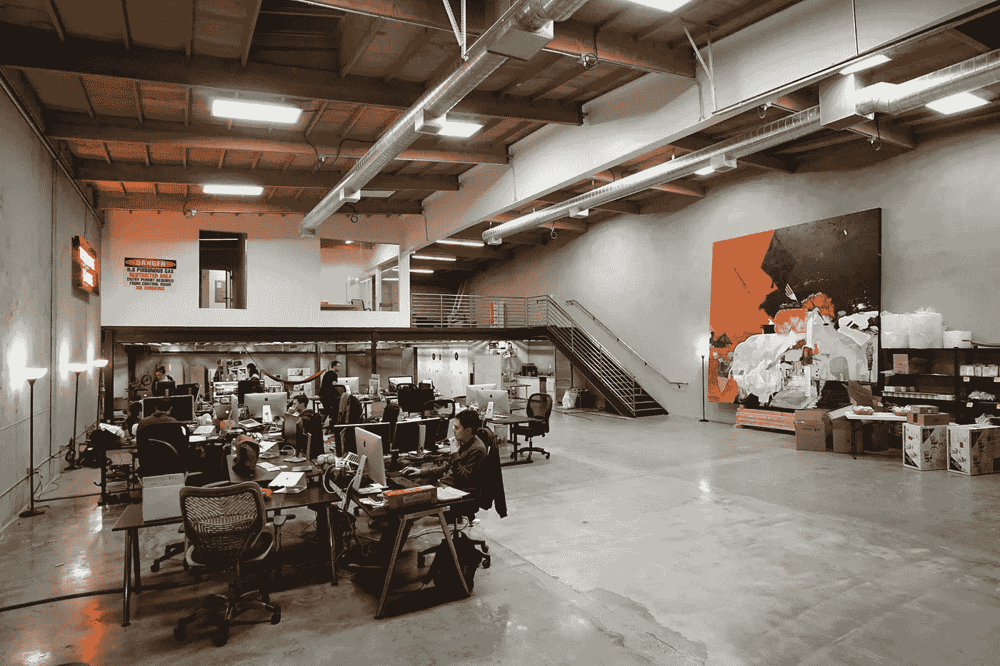
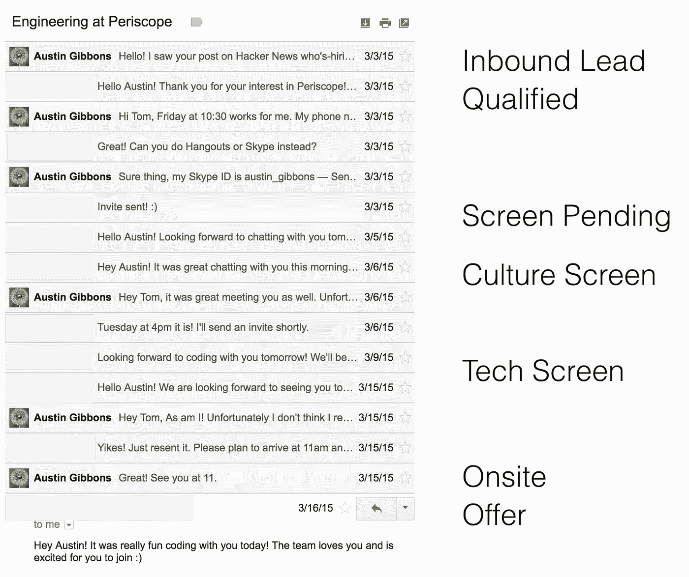
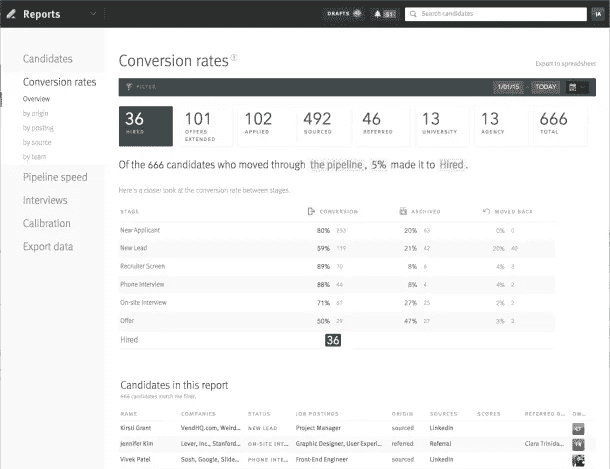
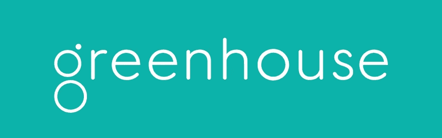
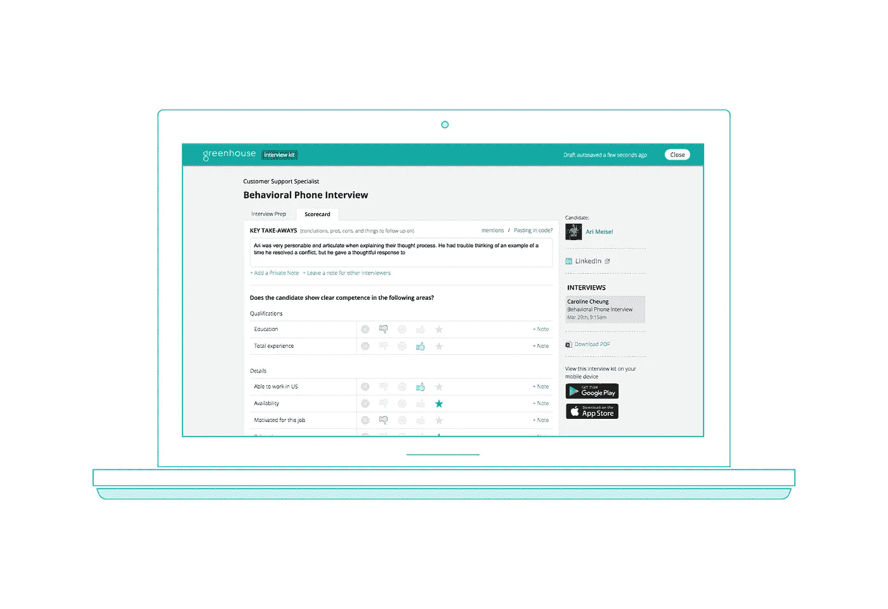

# 学习招聘软件工程师

> 原文：<https://medium.com/hackernoon/learning-to-recruit-as-a-software-engineer-25a36df527d1>

Snowy and Tin-Tin on the hunt for talented Software Engineers

当你在湾区的小型创业公司工作时，你无疑会发现自己身兼数职。我自己曾担任过一个技术博客的主编，是办公室美化和假日派对计划委员会的成员，并领导了一系列关于数据收集重要性的午餐学习活动。迄今为止，在这些各式各样的帽子中，最难的是招聘。

在我在 [Quantifind](https://quantifind.com) 的第一份全职工作中，我参与了软件[工程](https://hackernoon.com/tagged/engineering)和机器[学习](https://hackernoon.com/tagged/learning) /数据科学角色的面试。在过去的两年里，我在 [Periscope Data](https://www.periscopedata.com) 拓展了我的招聘经历，从仅仅是软件工程面试扩展到了整个招聘领域。在不同时期，我是招聘协调员、候选人来源、招聘经理和品牌大使。我帮助设计面试管道，重新想象现场体验，并与第三方工具和合作伙伴合作，扩大我们的招聘能力。

我列出这些经历，并不是希望让你对我的招聘技能感到惊讶——让我第一个告诉你，我还远远没有完成学习——而是希望我能给任何和我一样的人提供一些建议，我最初的任务是帮助他们成长为 20 多岁的初创公司。

# 招聘审查清单

好吧，所以你只是自愿[帮忙招募](http://42hire.com)。当你把一周两次会议的日历变成这个半小时的怪物时，深呼吸一下:

在你们每个人都能实现这种背靠背的美好之前，你需要建立一个稳定的候选人流。让我们来谈谈如何做到这一点。

# 词汇

在你开始你的招聘冒险之前，你应该学习行话。当我们第一次开始寻求内部招聘时，我们认为我们可以只雇佣“招聘人员”,他们将接管一切。这被证明是半真半假的。实际上，招聘分为几个角色和职责，了解谁扮演什么角色很重要:

*   起草一份**工作描述**是这一切的开始。在你能雇用某人之前，你需要建立候选人的角色和要求。这样做将有助于候选人将他们的经历与你的职位相匹配，并有助于关于候选人的内部交流和构建面试。
*   **寻源**是寻找候选人来填补你的招聘渠道的过程。术语“寻找资源”可能意味着直接接触，也可能意味着更广泛的领域，包括冷接触、推荐、管理你的在线形象，以及参与像聚会和会议这样的现实活动。最终，任何适合向合格的候选人介绍你的公司的领域都适合这里。
*   **协调** & **调度**是同一个日历管理硬币的两面。协调是指与候选人一起寻找最适合他们的日期和时间，安排旅行和酒店预订或报销，并与安排者(可能是同一个人)一起工作，以确保当候选人在现场时，他们需要会见的人是可用的。日程安排是在面试团队的日程表上安排时间的过程，并确保所选择的面试者在整个面试中有意义，这是我们下一个主题的一部分:
*   **渠道设计**是引导求职者从最初的兴趣一直到获得工作机会的行为。面试有多种形式:符合文化的电话交谈、咖啡聊天、技术电话筛选、带回家的问题、以前的工作样本，或者任何有助于你关注候选人工作能力的东西。当你在设计一条渠道时，你不仅需要了解它如何让合适的候选人在你的面试中取得成功，还需要了解你的公司文化在候选人身上的反映。
*   **结束**是一种艺术形式，它本身就是招聘领域的一种艺术形式，可以将优秀者与杰出者区分开来。在你向候选人发出邀请后，你如何说服他们接受邀请并加入你的公司？从第一次谈话开始，招聘团队就应该首先考虑如何结束一个候选人。
*   **候选经验**从管道设计的其余部分中获得了自己的位置，部分原因是它通常受管道设计者控制之外的其他因素支配。如果候选人与精力充沛、热情、快乐的面试官交谈，你会轻易相信他们更有可能加入贵公司吗？对我个人来说，一旦我决定面试一家公司，这是最大的决定因素。

候选人体验是对你的候选人在面试和日程安排过程中与团队成员的每一次互动的仔细研究，也是在他们面试的环境中。你的办公室明亮而充满活力吗？它是否位于一个容易到达的、正在发生的城镇的一部分，或者安排往返于你的总部的汽车服务是否有意义？我们很幸运，我们有机会围绕现有员工的工作环境和候选人的现场体验来设计和装饰我们相对空旷的办公室。从固定预算开始，我们决定专注于进入公司的方式，不仅考虑工作环境，而且(非常)希望在向我们的候选人介绍空间时传递一个众所周知的令人惊叹的因素，而不仅仅是仓库中的桌子。

Our previous warehouse office space in the Dogpatch, shortly after moving in. Photo courtesy Chris Meier.

Panorama from our original lounge, featuring our indoor patio and painted logo in the background.

# 将词汇与人匹配

回想招聘的所有步骤，我们可以看到每个领域都有相关的角色。*招聘来源*来源。*招聘协调员*负责协调和安排。很简单。招聘角色时需要标记的重要个人是 ***招聘经理*** 。这是最终负责批准雇用候选人的个人，他们与协调员、计划员、信息提供者、人力资源主管和办公室体验团队合作完成这项工作。

我强烈建议招聘经理或他们选择的代理人高度参与整个过程:设计渠道，决定谁参与面试的哪些部分，确保面试官知道他们的面试涵盖哪些内容:他们应该(和不应该)在候选人中评估哪些标准，以及最重要的*为什么*他们会根据自己的标准评估候选人。我不止一次看到的一个错误是招聘经理没有充分参与这个过程，选择将太多的责任推给其他角色。这导致了许多事故:

*   一位求职者在进入办公室时没有受到适当的欢迎，导致他们在开始一天的工作时不知道该找谁。
*   事后认为面试问题不适合该职位。
*   面试官在面试前几分钟问他们应该问什么问题。
*   最重要的是，由于不完美的现场/成交体验，未能成交多个候选人。

我对任何在小公司招聘职位的人的主要建议是，让一个人集体审查整个过程，以确保从候选人的角度来看一切顺利。

# 管道设计

在我任职期间，我们迭代了几种不同的招聘渠道。让我先回顾一下我自己被招聘的经历，然后再强调我们尝试的一些变化。

潜望镜一般更喜欢“动作快”，这一点肯定延伸到招兵买马上。总的来说，从第一次联系到接受工作邀请一共是 16 天——我们可以从我们的电子邮件交流中追踪最初的工程招聘渠道:

1.  一个星期二，我伸手去拿潜望镜。
2.  32 分钟后，CTO 回复了，我们为那个星期五安排了一次聊天。
3.  周四晚上，一封提醒邮件，显然来自人类，而不是机器人系统。
4.  30 分钟 Google Hangout 见面会。大部分是文化契合，有一小部分是技术讨论。接下来的步骤概述为代码筛选。
5.  我们通过电子邮件为下周二的聚会安排一次代码筛选。
6.  周二下午我们做编码练习，接下来是现场面试。
7.  我们在下周一那天晚上安排了一个现场会议。
8.  星期一到了！这是一个小团队，所以面试包括会见所有技术团队成员。在四次一小时的访谈中，我们完成了一项编码任务，实现了他们产品中的一个独立特性。中途我们和整个团队一起吃午饭。
9.  面试结束后，首席执行官带我走出办公室，向我发出了邀请。我说我对这家公司很感兴趣，并希望线下跟进，所以之后他们给我发了一份电子邮件。
10.  从那以后，在我最终接受之前，我们来回发了几封邮件/打了几个电话。

这是他们在我接受 Periscope 采访时使用了很长时间的格式。请注意，这种采访形式针对软件工程的个人贡献者，它不会深入到其他主题，如基础设施和架构设计、前端/设计经验或工程领导背景。围绕这些话题，与这些方向的候选人进行了非正式的交谈，但主要是向候选人推销他们如何融入团队，而不是将候选人视为潜在的工程师。让我们更深入地探讨一下我们所探讨的对管道的不同修改。

## 电话屏幕、挑战问题和咖啡聊天

漏斗顶部是我们最灵活的地方。你可以尝试不同的形式——即名义电话屏幕、挑战问题和/或咖啡聊天——以及寻找展示不同类型优势的候选人:无论是更好的文化契合度、在特定工程领域的更深经验，还是与来自许多不同背景的候选人合作。

我们收到的大部分内向兴趣来自候选人，鉴于他们的简历，我们不会主动联系他们。在我参与招聘的时候，除了拒绝候选人的其他原因，我们通常不会考虑任何新的大学或训练营毕业生。招聘显示了与友谊悖论相似的特性，如果工程师很难找到工作，他们更有可能主动联系。这并不是说他们不是优秀的工程师！有些人纠结于规范的面试形式，缺乏经验但有前途，或者只是没有在合适的场合展示他们的技能。最初，我们会给不太合格的候选人回复一条信息，大意是“我们很想以后再聊，但现在没有好的职位。”毕竟，这是事实！但是作为一个提高回忆的实验，我们发布了一个编程挑战问题，要求用户实现代码，让机器人在网格中移动并收集物品。虽然*确实*展示了足够的编码能力，足以保证与我们本来会忽略的候选人进行进一步的交谈，但它最终并没有导致一个人被录用。数据量太低，无法得出有意义的结论，但考虑到考生和我们在编写作业和消化作业方面投入的时间，我不会再做这样的事情了。围绕第三方工具，这一想法中还有一些更令人兴奋的方向，如果我打算第二次追求这一想法，我会更热衷于尝试，我们将在谈论采购候选人时再次触及这一想法。

Laszlo Podor Photography/Moment/Getty Images

咖啡聊天，或者更准确地说，在我的情况下，柴茶拿铁聊天，是一种几乎成功的方式来提高漏斗中的外向成功率。我从我的咖啡聊天请求邮件副本中遇到了几个候选人，虽然没有提供太多证据，但我有趣地感觉到，如果主动提出见面，我的成功率会更高。这种形式最终只导致了一个不幸没有成交的出价，所以我不能称之为成功。我最终停止了这个见面喝咖啡的提议，因为它相当耗费时间，坦率地说，也耗费了我的茶拿铁预算。

## 符合文化的面试和销售

你的第一次谈话是一次事实上的文化采访。不幸的是，不管出于什么原因，一些求职者以如此糟糕的态度进入谈话，以至于无论你有多少专业能力都不会让你想和他们一起工作，这个过程就在那时和那里停止了。另一方面，有些候选人会非常合拍，以至于你开始祈祷他们能通过你的技术面试。对于绝大多数面试来说，这种面试是你向他们推销你的文化，而不是相反。一旦很明显某人是“友好的人”，这次谈话就不再是一次资格面试，而是一次让候选人相信你的创业确实是他们一直在寻找的机会。

我的会见和问候电话流程是

1.  问候和介绍
2.  产品演示。这很有效，因为它很短，整个过程只需要 2-3 分钟。很自然，这是一次肤浅的产品之旅，但它让我展示了该产品的开箱即用的神奇之处，即以我打字的速度从 sql 查询创建图表。
3.  后续。很多人对我的“看！图表！”表面上是演示，但是许多其他人，尤其是处理过类似问题的人，会立即追问刚刚发生了什么。这可以是一个简单的问题，也可以是 15 分钟谈话中的一个燕尾，目的都是为了让候选人相信我们是一家建立酷技术的严肃的技术商店。
4.  技术堆栈缩减。最终，无论我们是否进行了后续的产品/技术对话，我都会对我们使用的编程语言和技术进行一次预演，以询问他们在寻找什么样的角色。特别是考虑到我们没有采访很多应届毕业生，人们对他们想要的日常工作体验中的技术和环境有自己的看法和兴趣。
5.  当与几个专业招聘人员谈论关闭候选人时，他们一致强调，大多数，甚至可能是所有的候选人在到达现场之前就已经决定了他们是否会接受这份工作。一旦谈话转移到候选人在潜在雇主身上寻找什么，我们就会谈论对他们来说很重要的其他标准。我最喜欢的方法是这样的:“如果我们认为彼此很合适，你为什么不加入公司呢？”这个问题让我们进行了一次非常开放和坦诚的对话，所有人的回答都是“老实说，这里离我在红杉城的住处有点远”到“老实说，我真的很想使用像 Clojure 这样的函数式语言”。这有助于减轻恐惧(我们就在 caltrain 旁边，并且有 lyft 信用！)或者老实说，我们的 ruby-on-rails + golang 技术堆栈可能并不合适。
6.  最终，我也开始询问目标薪资数字。这是销售候选人的另一个对冲，因为我们的货币补偿(至少在当时)是固定的软件工程水平(SWE-1，SWE-2 等。)这是由薪酬范围之外的面试表现决定的。在我参加的数百次面试中，我只遇到过一个应聘者报出的数字如此之高，以至于有理由停止面试，因为几乎每个人都给出了一个涵盖我们目标薪酬的范围。

在面试结束的时候，如果没有什么危险信号，我们会在下一个工作日安排第二次面试。其他面试官在第 4 步和第 5 步之间加入了简短的技术对话，以提高这一步的准确性。我最初在面试中也提到了这一点，但当时我在优化回忆，很少取消候选人的谈话资格，所以我最终放弃了它，给候选人留下了更积极的第一印象。

## 技术问题设计

在我面试之前，我们就一直在用同样的电话筛选问题。与其在这里揭示他们的实际问题，我将提示一个具有类似属性的问题:

一位同事向您提供了一份 t 恤订单的 CSV 文件，其中包含日期、尺寸、颜色、品牌等等。你能…吗

1.  打印周末哪些颜色最受欢迎？
2.  编写一个方法，该方法接收 t 恤颜色并返回用户应该订购的尺码分布。
3.  用户提供他们卖出了多少件什么颜色和尺寸的 t 恤。他们应该增加哪两种颜色来最大限度地增加销量？

这个问题的想法是慢慢开始，然后逐步构建更复杂的解决方案，这是我在许多结构化编码练习中观察到的一种模式。第一个目标是让一些代码运行，打印一个汇总统计数据，然后增加该统计数据的复杂性，最后是一个更复杂的计算，并留有一个自然的解决方案，足以为算法讨论提供一个机会。

这个问题有望让候选人展示对编码的熟悉程度，这将突出他们在专业环境中编程的能力:数据组织、适当的重构、干净且分解良好的代码，等等。我们总体上对使用这个问题的准确性感到满意，我们有很好的直觉，从他们在这次评估中的表现来看，他们在现场会做得如何。我们的召回成本太高，无法衡量，因为由于一些显而易见的原因，我们无法邀请我们本来会去现场面试的候选人。也就是说，我们经常发现“边缘”候选人最终没有通过我们的现场面试，因为这两个技术挑战非常相似。

甚至在我写这一段的时候，我能感觉到直接的反馈，这是一种无效的面试方式，四小时带回家的问题是一种真正的面试形式，或者诸如此类。我承认这种风格是不完美的，但我仍然觉得它是有效的。在参加了半打左右这样的面试后，清晰的行为模式突然出现，感觉有可能与现场面试表现呈正相关。最终，我们不得不在有限的时间内尽我们所能做到最好，这就是我们坚持的形式。

经过几次面试后，面试官通常在面试进行到一半时就知道面试的结果了。对于表现出色的候选人，我们会在他们还在一起的时候安排一次现场面试。这种舒适的程度允许我在问题中追求一些灵活性，例如，如果总体上进展顺利，我可以删除实际的算法编码，支持算法对话。借用另一位面试管道设计师的话:“与其说是确定问题的实际解决方案，不如说是探查信号”。

## 现场体验

我们现场访谈的技术内容在解决方案和精神上都与之前的访谈相似，但是被放在为产品构建实际工作特性的背景下。我们在六个类别中明确地评估候选人:编码速度、代码质量、算法理解、沟通能力、热情和兴奋，以及“shipathe 和 initiative”，内部行话体现了候选人是否专注于编写工作代码(shipathe)和/或投资于代码的设计和架构(initiative)，特别是在人们经常沿着“我可能会将它重构为一种方法”这样的即兴评论的背景下。在其他类别中，分数越高越好，勤奋和主动性体现了工程领域中相互竞争(但不是对立)的维度。因此，它们最有用的地方在于，我们为什么认为候选人很棒，而不是需要一个具体的分数。

在过去做过其他类型(例如白板风格)的访谈后，我强烈支持我们动手操作键盘、解决真实产品问题的方法。它让我们更容易了解与候选人一起工作会是什么样子，并且不太像是“寻找信号”,而更像是对工作产品的真实分析:如果有人提出了这个变更的拉动式请求，那么需要多少反馈才能让它准备好投入生产呢？当提供这种反馈时，他们会接受并做出适当的改变吗？他们能识别反馈中的模式并适当地调整路线吗？这些是我们作为采访者所做的不太明确的、内在化的评分。

我想特别指出的是，我无意中观察到了一个同样的结论，那就是著名的谷歌研究的结果:几乎没有人擅长从面试分数中预测工作表现。

> 几年前，我们做了一项研究，以确定 T2 谷歌 T3 是否有人特别擅长招聘。我们查看了成千上万次面试，每个参加过面试的人，他们对候选人的评分，以及这个人最终在工作中的表现。我们发现零关系。这是一个完全随机的混乱，除了一个高度预测的家伙，因为他只采访了一个非常专业领域的人，而他恰好是世界领先的专家。

与我们确实聘用的工程师一起工作，我得出的不科学的结论是，面试表现和在职表现之间没有显著的相关性。在某种程度上，这是因为我非常喜欢与我的前队友一起工作，但即使考虑到我自己缺乏数据点，我也很容易相信谷歌的结论。

## 结束了

我只有机会向我参与招聘的一个人发出邀请，幸运的是，由于是内部推荐，他们已经非常兴奋地加入了这家公司。也就是说，我看到了几种不同的策略:

*   面试成功后立即发出邀请(递交合同)。
*   明确告知候选人，我们将提供一个机会，但会跟进细节。
*   表示我们对合作感到兴奋，并将“在对他们合适的时候”讨论细节。
*   没有明确或暗示“是”的结束性咖啡聊天，随后提出一个提议。

这些都是权衡权宜之计和消除候选人压力的不同尝试，更不用说工资、股权、福利、头衔等因素，以及许多其他可以在个人基础上成功聘用的杠杆。

我们招聘的几个(但不是全部)职位都有空缺；如果有一个候选人让我们感到兴奋，我们就可以继续前进，而不用考虑其他人已经提出了什么邀请，或者还有谁在考虑之中。这有助于实验结束技巧，因为它更清楚地确定了尽快结束候选人的目标。所采取的许多步骤都是为了缩短提供服务的时间，这里的目标是使候选人能够按照自己的速度前进，并在“爆炸式提供服务”的时间压力之外做出对他们来说最好的决定。虽然这个想法是出于好意，但它强调了为什么存在限时优惠。我有一种感觉，人们对他们最近面试过的公司比对他们几天或几周前访问过的公司更感兴趣。最终，我没有看到足够可靠的结果来建议做任何超出常规的事情:在一个“直到”日期的面试后很快提供离线服务。

## 该接受了！

最后一个部分也是最令人兴奋的。发出邀请后，谈话回到向候选人推销你的公司，强调所有陈述的优点，减少第一次面试中列出的个人权衡。当候选人这样做时(令人兴奋！接受一个提议，你想要回报他们对你同样的兴奋和热情。我们在这里尝试了几种变体:

*   让整个团队发送简短的祝贺邮件。在不同的时间点，我们在候选人接受聘用之前和之后都尝试过这样做。我自己设置了一些电子邮件，这些邮件是长篇散文，表达了我见到他们的兴奋之情，还有一些短信，附带跳舞的 gif。

The first gif I sent to a candidate. Needless to say, they accepted.

*   在某个时候，我们的团队变得足够大，以至于候选人不一定会在面试过程中遇到所有人。在不同的时间点，我们让整个团队发送信息，只有采访团队，有时是一个单独的选择个人。

我真的不能说一个比另一个工作得更好，我怀疑正确的选择将通过你的团队的现有文化来体现。此外，招聘经理将与新员工保持联系，提供状态更新、签到以及介绍参与入职的团队成员。

# 填充管道

好吧，我们已经想了很多应该是什么样的体验，但我们可能操之过急了——我们需要面试候选人！我们换个话题，谈谈如何向求职者介绍我们公司。我们将如何找到他们(或让他们找到我们)，我们展示什么样的信息，以及我们如何跟踪这一切。

## 在线状态

当你第一次对了解一家公司感兴趣时，你会怎么做？你也许会……用谷歌搜索它们吗？恭喜你，你和其他人一样，你的候选人也会对你的公司做同样的事情。我们应该确保那里的信息反映了在你的创业公司工作的令人兴奋的、充满激情的和有趣的一群人！

I estimate 100% of candidates will visit your glassdoor page.

*   你有没有申请你的 Glassdoor 账户，上传你的 logo，礼貌地询问你的同事是否对他们的工作和/或面试经历留下了任何积极的评价？
*   LinkedIn:你的公司页面，带有徽标、背景照片、关于我们、空缺职位、联系等。同样重要的是，你需要确保你的工程师同事有令人兴奋的个人简介，恰好提到在你的公司工作有多棒。如果让我大胆猜测的话，我会说你被招募是因为你是同龄人中最活跃、最有魅力或者可能是最响亮的。在考察你的公司时，潜在的候选人几乎肯定会浏览在 LinkedIn 上工作的人，并想象他们是否是他们想与之共事的人。他们的简介必须推销你的公司，突出为什么你的文化令人惊叹，你的产品如何爆炸，为什么你的客户爱你。像任何其他形式的营销一样，你必须和你的观众说话，让他们明白你的产品(就业)不仅解决了他们的问题(失业)，还提供了最大的价值:文化能量、热情的同事、突出你的最佳福利都是好主意。我真正想强调的一点是鼓励人们用最少的编辑来起草他们自己的文稿。这不仅能为你的读者提供更多的选择，还能帮助候选人了解这份工作是否真的适合他们。毕竟，没有什么比真相更响亮。
*   既然你已经是建立公司简介页面的专家，并温和地说服你的同事更新他们自己的状态，冲洗并在所有经典的专业社交媒体网站上重复这个想法。Twitter、AngelList、Crunchbase 和脸书都值得一去。当你为这些页面上传图片和起草内容时，避免复制照片，而是在不同的网站上分发不同的内容和副本，以传递更多的“令人兴奋、充满活力、充满活力”的公司氛围，而不是“有人到处上传相同的股票照片”的氛围。根据你在公司生命周期中所处的位置，这可能具有挑战性。如果你还没有一个员工拿着 DSLR 相机，记录了大量公司活动，这些照片是从哪里来的？一些招聘平台，如 [The Muse](https://www.themuse.com/) 会带一名摄影师或摄像师到现场，帮助建立你的视觉组合。否则，一部有针对性照明的高质量现代智能手机就能做到这一点。
*   不同的候选人会发现你在不同的网站上发布的内容，但他们都有一个共同点:你的网站！如果你想把一个团队发展到你正在阅读这篇博客的程度，你可能已经采取措施在你的主页上进行 A/B 测试，并且对在你的登陆页上销售的想法感到满意。你可能没有想过在招聘方向扩展这些想法。你的*关于*和*工作*页面有行动号召吗？你博客上的内容是对候选人说的，还是仅仅是产品公告？我不一定建议你把设计团队的宝贵时间花在多页的“关于”页面上，并进行真正的 A/B 测试，但在招聘中，关注你的受众与销售和营销一样重要。

起草一份**工作描述**比它自己的要点或段落更有价值，它本身就是一篇博客文章。然而，我们经验的简略版本遵循以下步骤:

1.  通读其他现有的职位描述，为共同的风格和语言建立一种风格和感觉。
2.  起草一个帖子，描述(1)候选人在第一天、第一周、第一个月和第一年会做什么(2)候选人的工作历史可能会是什么样子(3)关于现有团队和公司的注释，以及(4)我们作为一个团队参与的最近项目。稍后，我们会添加一个额外的部分来描述面试过程本身，突出我们的手敲键盘的方法。
3.  通过文本分析工具运行职位描述，如[http://gender-decoder.katmatfield.com/](http://gender-decoder.katmatfield.com/)和[https://textio.com/](https://textio.com/)，这有助于突出在用词选择上存在的偏见。
4.  与招聘团队的其他成员分享，进行温和的编辑。
5.  向全世界发布！

# 贸易工具

在你通过招聘的视角审视了你的品牌在网上的表现之后，你需要建立你的机器和机制来驱动你的招聘引擎。开始时，你可能会做一些简单的事情，比如把所有事情都保存在电子表格中，但你会很快发现，每天发送 10 多封电子邮件或与同事一起进行招聘的规模，需要一个申请人跟踪系统，或 ATS。有一个[巨大的选项列表](http://www.capterra.com/applicant-tracking-software/)，今天我们将谈论我实际使用的两个:杠杆和温室。

## 申请人跟踪系统(ATS)

Lever 的联合创始人兼首席执行官有设计背景，这一点显而易见。杠杆是一个美丽的产品。它的灰度界面起初有点多，但我很快就开始欣赏它的时尚和扁平的设计，以及它的界面的简单性和可用性。我喜欢杠杆是因为它的管道分析概述。

[http://www.forentrepreneurs.com/recruiting/](http://www.forentrepreneurs.com/recruiting/)

该结构有一个非常自然的导航，这在我们评估的其他 ATS 中是没有的。很容易进入渠道的特定部分，并通过我们的招聘渠道了解单个候选人的动向。我们在数百个候选卷中工作，因此浏览每个候选卷以了解整个系统中发生了什么是可行的，Lever 在促进这种类型的探索方面做了大量工作。

当我与旧金山一家初创公司的招聘人员交谈，询问他们有关 ATS 的问题时，我希望他们会说温室。虽然杠杆和其他竞争对手如 Jobvite 和 Workable 在湾区都有相当大的粉丝群，但温室经常是第一个出现的名字。这是一个完全开发的产品，具有广泛的许可和候选人管理功能。不幸的是，我第一次接触到 Greenhouse 时，他们正从按月定价转向按年定价，我不得不暂时放弃使用他们。最终，当招聘从“身兼多职”的招聘经理转变为真正的人力资源团队时，我们采用了 Greenhouse。如果你是一家资金雄厚的初创公司，并且正在为可预见的未来寻找 ATS，那么你使用 Greenhouse 并没有犯错误，但它将与工作职责包括管理该工具的人合作得最好。我接触的大部分时间是填写温室报告卡和仔细阅读候选人名单，以跟踪我们的管道。

The official Greenhouse candidate scorecard stock photo

温室是我们用来填写记分卡的第一个 ATS，我们以前的模型是一个共享的 excel 文档，我们可以在其中复制粘贴模板。为此，温室大放异彩。它允许可选和必填字段，结构化笔记，并只在您填写自己的答案时显示其他面试官的回答。这里的奇怪之处在于对五场尺度的要求。在转换到温室之前，我们碰巧使用了四分制，所以在进入五分制方案之前，我们不得不接受一个轻微的调整阶段。

使用温室分析通常很容易，但我确实遇到了一些怪癖。从候选人管道中找出我想要的确切数字并不总是简单明了的，我有时不得不手动点击每个类别，例如，我们内部在发出聘用通知后不继续聘用候选人的七个不同原因中的每一个，以了解我们的招聘渠道中发生了什么。虽然它很好地从活动管道的角度展示了数据，但我经常觉得我想深入到不容易访问的数据片段，并对候选人进行一些纸笔跟踪，以确保我了解全貌。

## 内容资源管理(CRM)

除了 ATS 之外，您还需要一些东西来帮助您管理电子邮件。如果你从事过销售或营销工作，我不会鼓吹什么新东西——管理销售渠道的工具同样适用于招聘。内容资源管理工具(CRMs)在整个业务组织中用于组织信息，您的电子邮件也不例外。像 Gmail 这样的电子邮件客户端内置了很多组织功能，包括自动标记、过滤和嵌套文件夹，但你可以使用像 [Yesware](http://www.yesware.com/) 这样的电子邮件跟踪工具，或者像 [Streak](https://www.streak.com/) 这样专注于管道的工具，以及 Workday 的这篇[博客](https://resources.workable.com/tutorial/best-email-tools)中提到的其他几十种工具，将你的电子邮件提升到一个新的水平。

我最常用的工具是 Yesware 和 [Hunter](https://hunter.io/) ，它们可以帮助你找到某人的电子邮件地址，并提供了一个方便的 chrome 插件，可以帮助你在浏览 LinkedIn 时猜测地址。Yesware 和 Hunter 是拥挤的电子邮件发现和管理领域的众多选择之一——如果你有销售和营销团队，你应该检查你是否已经拥有其他工具的许可证，如 Hubspot、Radius，当然还有 LinkedIn。

# 寻找候选人

你已经做了跑腿的工作，你已经为战斗做好了准备。在这一点上，你甚至可能认为招聘很有趣！现在是时候接受我们任务中最具挑战性的部分了:寻找候选人。你会有很多追求的途径，但没有一条会是灵丹妙药。招聘是等式两边的数字游戏:候选人应该同时寻求许多机会，公司希望看到大量候选人适合最适合其环境的人。

## 直接外联

欢迎来到寻找你自己的候选人。这将涉及混合爬行 LinkedIn、Github、StackOverflow 和 AngelList。有可能(也许甚至很有可能)我只是不擅长这个，但是“在一边”做直接接触是有挑战性的，同时还要做招聘渠道的其他工作，偶尔还要做写代码的实际工作。我甚至不会试图恢复我可怕的转换数字，但获得一个真正可行的管道做自己的采购需要大量的时间，我现在强烈认为这是不值得的。如果你没有与大量个人建立多年的关系，没有候选人电子邮件数据库，并且只在一家公司推销一个角色，那么你已经落后于专业招聘人员一步，不太可能觉得值得花时间和精力。

## 入站候选人

我们花时间思考我们的在线业务，希望这将有助于增加对贵公司的兴趣。我们可以通过在传统广告网络上发布广告角色来进一步提高集客兴趣，此外还有重要的非广告渠道，即 Hacker News who's hiring thread。黑客新闻是 Y-Combinator 的新闻聚合器，在技术社区中很受欢迎，尤其是在旧金山。每个月的第一天，他们为非 YC 公司提供发布招聘广告的机会(否则他们是不允许这样做的)。《华盛顿邮报》经常收到数百家公司提供的职位描述，以我的经验来看，这是吸引大量入站兴趣的原因。最重要的是，我们雇佣的几个人是黑客新闻的候选人，包括我自己，当候选人和公司询问软件工程就业市场时，我立即向他们推荐。通过以适当的格式发布到这个帖子，你应该会自动被添加到那些聚集了来自这些帖子的网站，例如来自 Gaganpreet 的【https://whoishiring.io/】T2 和[招聘地图](http://gaganpreet.github.io/hn-hiring-mapped/src/web/)。

黑客新闻当然不是唯一的策略；除了经常针对相同受众的产品广告之外，我们还针对软件工程师投放了一些脸书广告。虽然我不确定我们雇佣的软件工程师是否来自脸书的广告，但我知道我们雇佣的数据分析师是通过产品广告找到我们的。其他来源也对集客兴趣有所贡献——我们公司的博客以技术为重点，并在不同的地方包括“来和我们一起工作”的行动号召。尽管直接外展非常耗时，但这些努力在时间、精力或财务上并不特别昂贵，因此即使没有大规模的努力来跟踪成功，也觉得继续下去是合适的。

## 外部招聘人员

全职的第三方招聘人员是一种耻辱。经常和我交谈的软件工程师哀叹他们不断收到的电子邮件和电话。然而，招聘人员提供了有价值的服务，他们中的许多人都有进取心。他们当然值得考虑，但与外部招聘人员合作是很昂贵的，要收取他们介绍给你的员工第一年工资的 10-20%以上的意外费用。糟糕的招聘关系也可能是时间密集型的，因为围绕候选人调整你的期望可能具有挑战性:除了管理与候选人的关系，你还必须与顾问反复沟通，并解释你的招聘决定。最终，你的动机并不完全一致。感觉就像他们在努力优化召回，而你在努力校准最佳招聘精度，这样你就可以有一个可管理的工作量。特别是当考虑到相对较低的初始时间投资时，如果你准备支付应急费用，我建议尝试一下。

## 内部推荐

我在 Periscope 发起了一个简短的活动，以获得一个付费的推荐项目，作为这一努力的一部分，我向在湾区工作的朋友征求了他们内部工程推荐奖金的大小。我采访过的大多数公司都有一个，最低 1000 美元，最高 20000 美元。我们最终得到了 5，000 美元，因为这是我的短期调查的中位数和众数，我们为整个组织的大多数角色提供了 5，000 美元的奖金。

我看到了一些不同的策略被用来推动推荐。最常见的是与负责采购的个人坐下来，浏览 LinkedIn 的朋友列表，建立一个联系人员的电子表格，在联系时是否应该提到推荐人的名字，以及这是一种专业的、私人的、远距离的还是仅 LinkedIn 的熟人关系。如果你的账户不止一个，那就值得探索一下像[https://teamable.com/](https://teamable.com/)这样的工具，它可以帮助你组织和搜索你的社交网络。

我听说过的其他方法，如推荐披萨聚会或仅仅因为提交简历而获得现金奖励，也似乎是可行的策略。当我们后来采用 Greenhouse 作为我们的 ATS 时，它提供了自己的推荐工作流，我觉得它的易用性有助于鼓励提交推荐。

## 聚焦招聘平台

当我开始写这部小说的时候，这是一次大脑倾销内容的练习，我这样做是出于最纯粹的意图。从那时到现在，我加入了 Triplebyte 的远程面试官项目，这是我最喜欢的平台，我将在下面谈到。所以，当你读到我对招聘平台的看法时，请接受这份盐粒，尽管我真的希望你会相信我是真诚的。

digest with a grain of salt, courtesy pxleyes.com

这是我最激动的地方。它也是发展最快的地方。从一年多前我开始搜索招聘平台到这篇文章发表，我已经发现了至少两倍多的此类产品。可能我所有的招聘谷歌搜索都考虑到了更好的脸书广告定位，但我确实相信这些公司中的许多还不到一年。

在最初的电话中，主要是关于推销候选人的电话，我有时会问他们还面试了哪些公司，人们一般都很乐意。尤其是当我对一位候选人感到兴奋时，更是如此——尤其是当我对一位候选人感到兴奋，但认为我们公司不适合他们时，我希望我可以直接去其他公司推荐这位候选人。事实证明，我远不是唯一一个有这种想法的人，有太多的公司进入了提供技术资格测验和面试的领域，作为他们寻找候选人的一部分。

其核心是一个简单的想法——在管道中向上看，将技术鉴定部分合并到第三方来源中。这些平台的冠军描绘了一幅美丽的画面，描绘了“招聘是如何被打破的”，他们正在“重新发明技术面试”，但从宏观层面上看，他们仍然是向公司介绍候选人的招聘人员。主要创新是技术资格预审，例如，方便 Triplebyte 客户将候选人直接带到现场，大大缩短了内部流程。这些平台还为受访者和招聘公司提供了其他一些优势。在参与了如此多的工程面试后，他们能够大大超越我粗糙的直觉驱动的经验教训，而是从早期阶段模拟候选人在现场面试中的表现，有足够的数据得出真实、有意义的结论。证据显示:他们所做的 50%以上的介绍(即现场面试)导致了要约，这远远高于我自己经历的以及从与其他招聘经理的聊天中收集到的数字。

还有其他一些平台更像传统的求职板，但目标是软件工程师。雇佣是我最喜欢的例子，尽管我承认这有点噱头。特别之处在于，它们消除了简历处理过程中很大一部分无意识的偏见，因为它们最初只显示候选人的首字母——没有名字、没有简历、没有照片。无意识的(和有意识的)偏见不是我们这篇文章的主题，但我认识到这对任何参与招聘的人来说都是一个挑战，并感谢那些帮助减少招聘渠道偏见影响的组织。另一个角度是，公司在接触候选人时会立即传达目标薪资数字——尽管我不认为如果他们真的发出了邀请，他们就没有义务遵守这个数字。其结果是创造了一种无声的、盲目的拍卖，比标准拍卖和随之而来的博弈论有更大的细微差别，但在我们的经验中，这不是一件大事，可能有助于让下游的薪酬对话变得更容易一些。

我只是刚刚接触到招聘平台的冰山一角。不完全公平地说，如果你想加快招聘速度，这里有一份值得调查的招聘公司名单:

*   [Triplebyte](https://triplebyte.com/) 处理候选人的来源和技术评估，将他们直接转移到招聘渠道的现场部分。其他公司也参与了技术预筛选领域，如 [Yodas](https://www.yodas.com/) 、 [CodeFights](https://codefights.com/talent) 和 [HackerRank](https://www.hackerrank.com/) 。
*   [雇佣](https://hired.com/)、[审核](https://www.vettery.com/)和 [Woo](https://woo.io/) 是专注于软件工程的招聘平台，强调盲目的简历筛选，一个现代的公司寻找候选人的反向工作板。
*   [缪斯](https://www.themuse.com/)采用了 AirBnB 的模式，带一个摄影师现场拍摄你的空间，建立一个漂亮的侧面。他们与你的招聘团队密切合作，制作照片、视频和文字材料来推销你的公司。然后，他们通过自己的网站展示你的空间，并在他们的招聘文章中提到你，比如标题为 [20 个值得为之工作的惊人科技公司](https://www.themuse.com/advice/20-amazing-tech-companies-to-work-for?ref=whos-hiring-0)，他们在针对求职者的大量文章中提到你。
*   Pramp 免费为应聘者提供模拟面试，让每个人轮流扮演面试官和被面试者。Zenterview 是模拟面试领域的一个有趣的入口，因为它似乎有一个“想付多少就付多少”的模式。

似乎每个月都有新的人进入招聘领域的不同部分。在我们的列表中，我们甚至还没有接触到更传统的求职平台——AngelList、ZipRecruiter、Glassdoor、LinkedIn 以及其他许多网站都在帮助软件工程师找工作。这个空间是巨大的，并且还在增长。

# 去招募新人吧

如果你已经和我一起写了这么久的博文，那么我希望你已经准备好启动你的招聘引擎，加大招聘力度。你在招聘方面有什么经验？如果你发现软件工程师招聘中缺少了什么，请留言。我们今天讨论了渠道和采购——我们可以进一步深入构建职位描述，作为招聘经理管理渠道，甚至寻找候选人，并进一步探索更广阔的领域——让员工参与招聘，建立一致的渠道而不是基于需求的招聘，招聘的多样性，等等。

