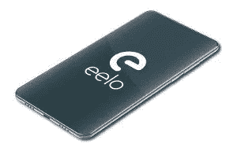
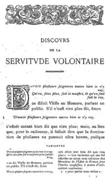
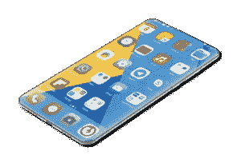

# 离开苹果和谷歌:我的 eelo 奥德赛:现在在 Kickstarter 上！

> 原文：<https://medium.com/hackernoon/leaving-apple-and-google-my-eelo-odyssey-bootstrap-3ad0d763226f>

今天，我和 Kickstarter 众筹活动一起启动 eelo 项目。在过去的三周里，我已经发布了[三篇文章](https://www.indidea.org/gael/blog/leaving-apple-google-eelo-odyssey-introduction/)来描述这个项目，已经完成的工作，以及愿景是什么。我们希望建立一个激动人心的替代方案，取代谷歌、苹果和所有窃取我们个人数据、将我们变成自愿奴隶的专有服务。

# 论自愿奴役

“自愿奴役”的概念并不新鲜:1576 年，Etienne de La Boé tie 写了一篇文章:在“关于自愿奴役的论述”中，他解释了人们如何在没有被强迫的情况下进入奴役状态。

这正是 21 世纪的数字巨头正在发生的事情:没有人被迫使用他们的产品，没有人被迫接受他们的使用条款。但数十亿人知道。被动，部分是懒惰，因为使用是舒适的。用户的数据被巨头用来跟踪我们，销售广告，销售软件产品，有时甚至有助于大规模监控。

# 自由与行动

我喜欢自由，如果这是个人选择，我不想强迫任何人离开这种奴役状态。这是一种极权主义的态度。但我认为，我们需要告知人们，我们必须向不接受这种情况的人提供可信和有吸引力的替代方案。

自愿奴役不是一种命运:开源软件无处不在，而且经常是这个数字巨头“免费”提供的专有产品的核心。

无论如何，不要把 eelo 看做间谍的工具:我们会通知人们，我们会提供所有必要的工具和默认的 app。但是人们可以自由安装他们选择的任何应用程序，这是一个明智的选择。我们相信教育和软转型，而不是极端激进。

我已经开始列举、探索和破解这个难题的几个部分。eelo 将把所有这些开源软件整合成一个一致的、令人满意的产品。

随着时间的推移，存储数据的成本和互联网交易的成本趋于零，我很有信心我们可以免费提供所有的数字内容。

# eelo 是非营利的，为了公众利益

eelo 作为一个非盈利的公益项目，可以成为我们数字时代深刻变革的开端。

**成为第一批加入项目的参与者之一，表示支持，说说 eelo，让一些人进入项目，** [**在 Kickstarter 上支持 eelo**](https://www.kickstarter.com/projects/290746744/eelo-a-mobile-os-and-web-services-in-the-public-in)**！**

–gal(在 Twitter 上关注我[，在乳齿象上关注我](https://twitter.com/gael_duval) / [)](https://mastodon.social/web/accounts/25068)

PS 本文原图[发布到我的个人网站](https://www.indidea.org/gael/blog/leaving-apple-an…dyssey-bootstrap/)