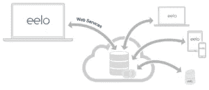
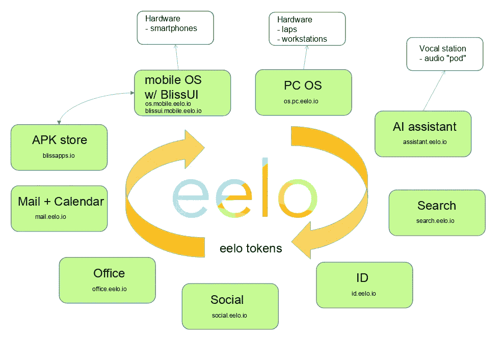
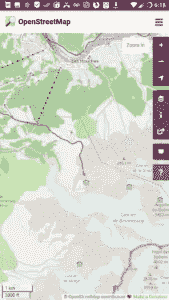
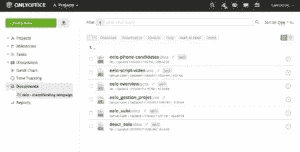
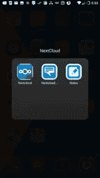
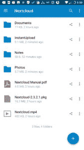
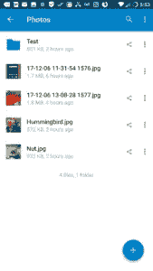
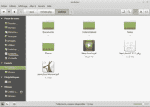

# 离开苹果和谷歌:我的“eelo odyssey”第 2 部分:Web 服务

> 原文：<https://medium.com/hackernoon/leaving-apple-and-google-my-eelo-odyssey-part2-web-services-4c01bb838279>

因为这些原因，我离开了苹果和谷歌，我将努力投入到一个新的项目中:“T2”eelo。对于这个项目，一个很大的部分是操作系统，特别是智能手机操作系统。我开始和其他人一起做这方面的工作，[已经有了第一批成果](https://www.indidea.org/gael/blog/leaving-apple-google-eelo-odyssey-part1-mobile-os/)，这让我觉得我向更好的数字隐私的转移可能会比预期的更容易🙂

但今天，没有互联网服务的智能手机就像没有汽油的汽车。我们需要电子邮件，我们需要在线存储，我们需要先进的在线应用程序…而且人们喜欢从几个地方和设备访问我们的数据。操作系统[已经全球化](https://www.indidea.org/gael/blog/sovereign-operating-systems-sovereign-digital-chain/)。

因此，eelo 需要提供可以从其他地方访问的工具，例如网络浏览器，但也可能从其他计算机和操作系统访问:笔记、消息、日历…当然，我们希望所有这些都充分尊重用户的隐私，并且没有广告。

# 许多服务需要解决

我们需要解决大量的互联网服务，并找到好的替代方案，将它们整合成一致、直观、安全、可持续的全球 eelo 服务。

这是我心目中的 eelo 全球系统的一个方案:

# 网络服务评论

# –电子邮件

电子邮件意味着服务器上的一些后缀配置，带有 POP3 和 IMAP，所有的访问都通过 TLS 进行保护。加上网络邮件访问(我正在考虑使用邮件堆)。

通过 DKIM 和 SPF 正确配置，iRedMail 可以轻松设置所有这些，甚至可以为 eelo 电子邮件服务提供自定义域。

但是，如果我们想要一个私人服务，我们将需要安全的服务器，电子邮件存储在那里。这是一个关键方面，我们需要应用最佳实践来建立一个坚如磐石的安全服务器来存储电子邮件。

# –搜索/地图

我在之前的文章中已经谈了一些关于搜索的内容。DuckDuckGo 和 Qwant 已经成为 Google/Bing/etc 的两个优秀替代品。

但我认为我们需要为搜索建立一个通用的包装，比如 search.eelo.io，我们会把我们认为好的放在后面。这也可以是一个聚合服务。

至于地图，有一个令人敬畏和可爱的项目是 OpenStreetMaps。它正在成长，并作为谷歌地图的真正替代品，吸引了越来越多用户和媒体的关注。

它现在还提供方向，并且有一个正在进行的“街景”项目。

我们必须将其集成为 maps.eelo.io，可能需要一些定制和专用服务器。

当然，所有这些默认设置都会集成在 eelo ROM(智能手机操作系统)中。

# –办公室

我们有两个选择，一个是优秀的开源在线办公软件: [LibreOffice/Collabora](https://www.indidea.org/gael/blog/a-first-look-at-collaboralibreoffice-online-and-a-little-bit-of-frustration/) 和【仅 Office。我更喜欢 OnlyOffice，因为它有吸引力、高效，并且允许几个用户在 Office 文档上进行实时在线协作。

我已经在我的服务器上只使用了 Office 几个星期了，除了一些小故障，它是 Google Docs 或 Office365 的完全可行的替代品。

# –硬盘/备忘/日历

“云存储”服务是该项目的重要组成部分。它需要非常仔细地选择和整合，因为它将成为用户数字生活的中心。

有几个项目提供这些功能，比如 cozy.io、OwnCloud 和 NextCloud。目前我已经成功测试了 NextCloud，我必须说它太棒了！

您可以在智能手机上轻松设置 NextCloud 客户端，并在其他电脑上进行同样的操作。然后，您可以同步所有内容。非常方便放图片，文档，笔记…我在 Linux(和 Mac)上试过，效果很好。

好消息是，NextCloud 还可以提供一个可以从各种设备上共享/访问的日历。

所以现在，我选择 NextCloud。我不确定 OwnCloud 相对于 NextCloud 的优势。有什么建议吗？

eelo 的第一个目标是提供一个全功能和安全的 OnlyOffice+NextCloud 实现。由于对自托管存在争议，eelo 也将提供软件实例形式的服务，可以安装在用户的服务器上、云中或家中，如果他们愿意的话。

# –社交/信息

你当然在用脸书。我也是，虽然不经常。还有推特。在用户隐私方面，脸书尤其是一个真正的噩梦。他们非常了解数十亿用户。如果你碰巧在脸书上做了一个广告活动，你可能会注意到你可以把目标人群分类。年龄、性别、居住地、收入……有几十个标准证明他们真的很了解人。

因此，脸书是我们应该停止使用的东西，以支持更好的替代品。有个好消息:你可以用[乳齿象](https://mastodon.social/web/accounts/25068)。这是一个分散的社交网络。没有任何中央老大哥可以用你的数据来推动商业模式。

问题是，当你能在社交网络上找到你的大多数朋友/家人时，社交网络就有了更大的价值。乳齿象上还没有这种情况，但是在科技社区。

因此，我们将密切关注乳齿象，看看 eelo 如何与项目互动，并可能整合它。

至于消息，每个人都可以使用他们选择的消息应用程序，但 eelo 将默认配备 Telegram。原因是 Telegram 可能是最安全的消息应用程序，也是最尊重用户隐私的应用程序。它还提供高质量的 IP 语音通话。最后但同样重要的是，它的客户端是开源的(尽管服务器基础设施不是)。

还有…

# –ID/翻译/ …

在某些时候，我们需要一个身份提供者。这将是认证的中心点。OpenID 是一个选择，尽管它目前显然缺乏一些动力。这需要集思广益！

虽然这可能是一个更次要的方面，但我们可能还需要翻译服务、语音识别服务、语音服务、视频/语音流服务……在这一领域有许多举措，但它们目前不是优先事项。

# 关于 eelo tokens

我在考虑发行基于以太坊的 eelo 代币。这将是获得一些 eelo 服务的一种方式，也是感谢贡献者的一种方式。再说一次，大多数 eelo 服务将是免费的，因为这是与谷歌等所谓的“免费”服务竞争的唯一方法。，它将首先保持公众利益。但销售一些优质服务、高端 eelo 智能手机、咨询……将是该模式的一部分，以推动该项目，并使免费服务成为可能。我有一种感觉，使用 eelo 令牌可以大大有助于简化 eelo 中涉及的所有各方之间的服务交易。

# eelo 的下一步

随着我们继续进行 eelo 定制 ROM、新启动器和网络服务集成的工作，我仍然在听取用户对项目的建议、想法……许多人已经联系了我，数百人已经在 [eelo 登录页面](https://eelo.io)上注册，这太棒了🙂

我们可能还会有一个独立的 eelo 开发分支，用于更高级的项目。事实上，我一直在想把智能手机变成一个对话设备——文本或语音——用对话应用程序代替传统应用程序。但这是最前沿的开发，不会默认提供给 eelo。

下一次，我将公布 eelo 产品和服务的路线图，同时，第一个 eelo 网站将开放。

我还将在 kickstart 上发起一个众筹活动，用于推动我们的早期开发。

敬请期待！

**编辑:**支持 eelo 早期开发！加入我们的 [Indiegogo 活动](https://www.indiegogo.com/projects/eelo-a-mobile-os-and-web-services-with-values-android)和[成为我在 Patreon 的赞助人](https://www.patreon.com/eelo)！

—gal(在 Twitter 上关注我[，在乳齿象上关注我](https://twitter.com/gael_duval)/)

附言（同 postscript）；警官（police sergeant）

*   与 eelo 保持联系:[在 eelo.io](https://eelo.io) 登陆页面注册。
*   联系我:gael @ eelo。超正析象管
*   阅读这个系列文章的第一部分:[离开苹果和谷歌:我的“eelo odyssey”——简介](https://www.indidea.org/gael/blog/leaving-apple-google-eelo-odyssey-introduction)
*   阅读本系列文章的第二部分:[离开苹果和谷歌:我的“eelo odyssey”。第一部分:移动操作系统](https://www.indidea.org/gael/blog/leaving-apple-google-eelo-odyssey-part1-mobile-os/)
*   [eelo 不仅仅是一项技术，它还是一个自由和民主的社会项目](https://hackernoon.com/eelo-is-more-than-tech-its-a-societal-project-for-freedom-and-democracy-951ea5c8f162)
*   阅读 eelo 创始人写给埃隆·马斯克的公开信