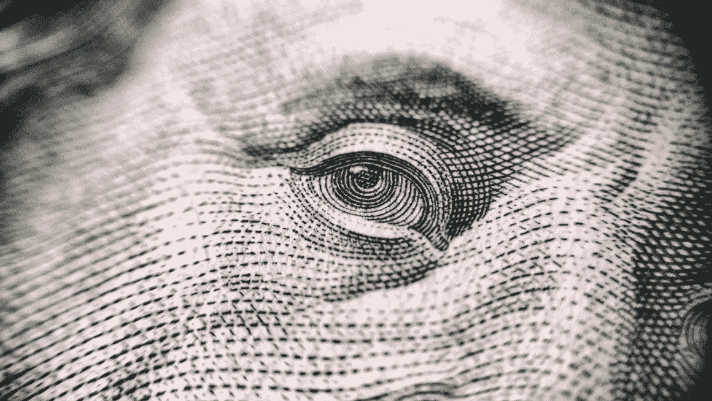

# 左派在基本的经济激励上失败了

> 原文：<https://medium.com/hackernoon/leftism-fails-at-basic-economic-incentives-4dbd1c9f133e>

美国政府目前正在补贴太阳能和风能公司。你认为这是个好主意吗？是的。为什么？因为你认为风能和太阳能会很有价值。

美国政府目前也在所谓的“罪恶税”下对烟草和酒精等产品征收重税。这是个好主意吗？当然可以。为什么？来减缓社会对这些东西的使用。

# 分析

这是另一个例子，说明为什么我说左派是半方程的宗教。到目前为止，我们所看到的一切似乎都有道理，但让我们更深入地分析一下。这两个例子中隐藏的假设是什么。我们已经说过补贴太阳能是好的，因为太阳能是好的。但是谁说补贴某些东西会鼓励更多的东西呢？同样，谁说对某件事征税会让人们少做这件事？事实证明，从经济角度来说，这两种说法都是正确的。经济学和实验研究都证实了这一点。

好的，到目前为止还不错。补贴鼓励使用，征税阻碍使用。我们都知道，你想说什么？

# 笑点是

我的观点是，左翼人士知道这是事实，但他们无法始终如一地应用它。当前的左派政纲每年都在为低收入或无收入人群争取更多福利，为高收入人群争取更多税收。

让我明白这一点。变得清晰了吗？这种方法补贴了工作的缺乏，并对生产性工作征税。有哪些明显的后果？每年这些政策生效时，你都在减少生产性工作的数量，增加不工作的人的数量。这是简单的经济学。

# 发送出去

以上内容摘自我即将出版的新书《T2 大解锁:经济、政治和精神启蒙之路》。在下面注册，以便在图书发行时得到通知。

> [黑客中午](http://bit.ly/Hackernoon)是黑客如何开始他们的下午。我们是 [@AMI](http://bit.ly/atAMIatAMI) 家庭的一员。我们现在[接受投稿](http://bit.ly/hackernoonsubmission)并乐意[讨论广告&赞助](mailto:partners@amipublications.com)机会。
> 
> 如果你喜欢这个故事，我们推荐你阅读我们的[最新科技故事](http://bit.ly/hackernoonlatestt)和[趋势科技故事](https://hackernoon.com/trending)。直到下一次，不要把世界的现实想当然！

