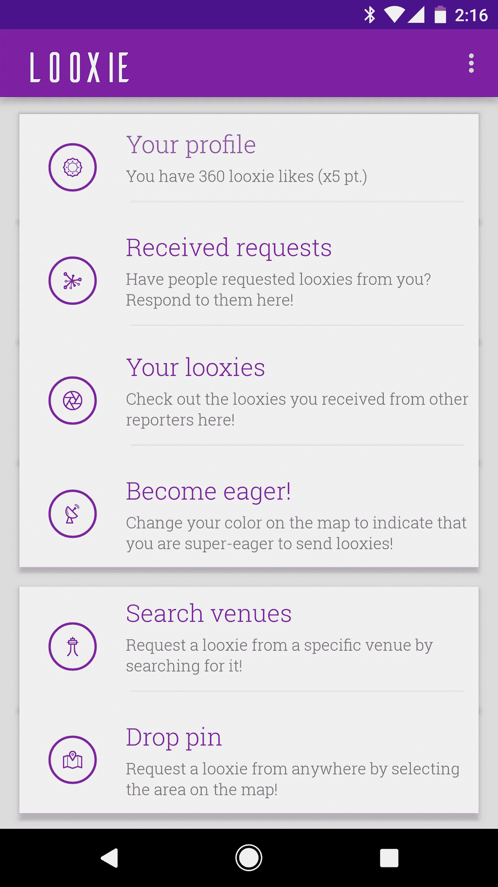
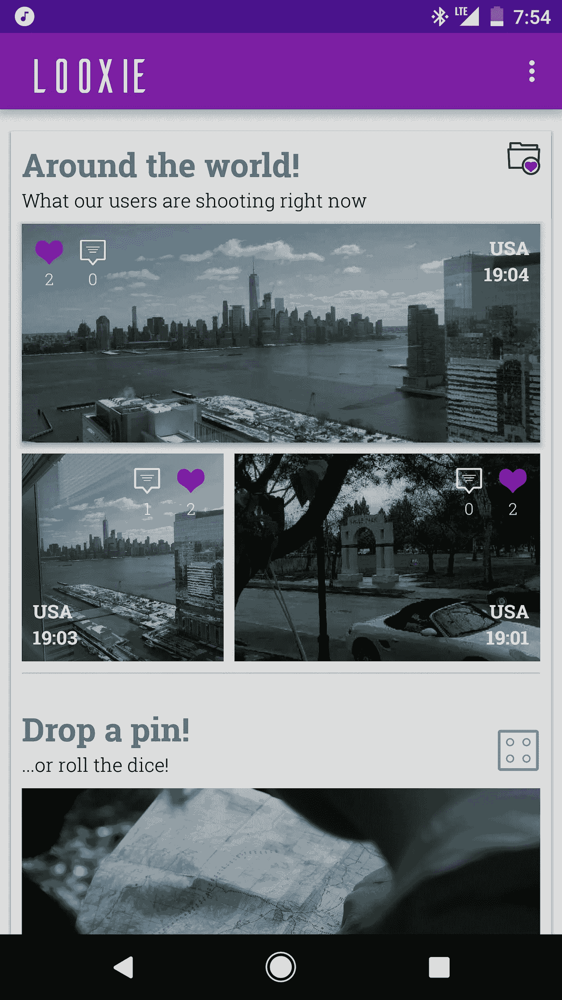
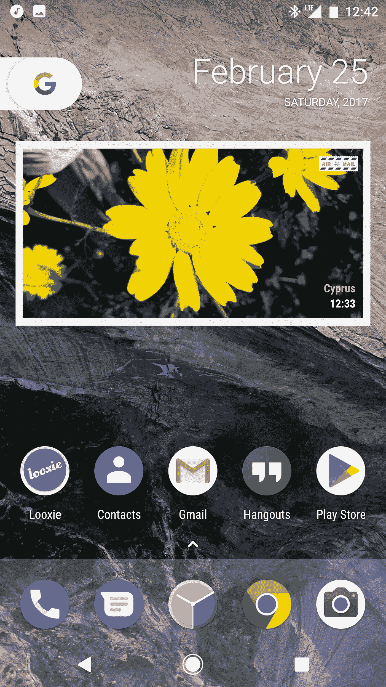
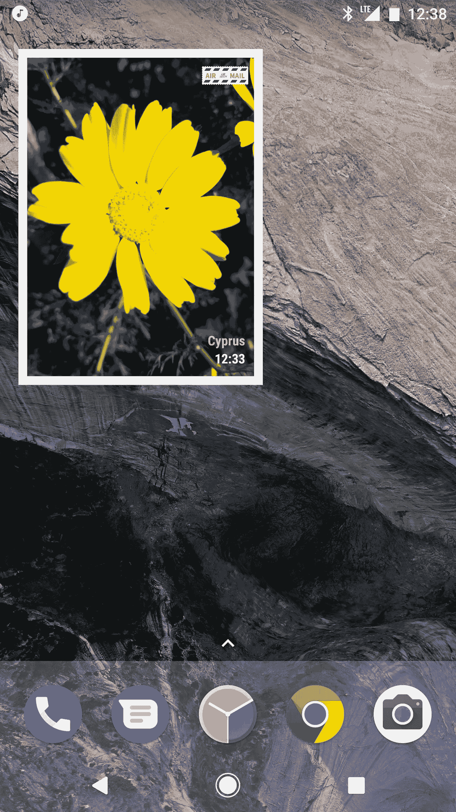

# 乐高化它！

> 原文：<https://medium.com/hackernoon/lego-ize-it-c40806bd6035>

Lego Stormtrooper. Single, cultured, secretly loves Rebels, enjoys long walks on the beach

## 利用 Android 的最佳功能之一

我不想撒谎。

至少在接下来的 5 分钟左右，你不会花时间去读这篇文章。

我的激情项目是 [Looxie](https://play.google.com/store/apps/details?id=com.saladdressing.looksie) 。我在 2016 年夏天发布了这个应用程序，因为我对世界各地发生的事情有着永不满足的好奇心。

> 吹牛的权利:Looxie 被 PhoneArena、Phandroid 和 AndroidWorld.nl 评为本周最佳的五款应用之一

Looxie 的基本功能可以这样描述:你点击(谷歌)地图，在地图上放置一个大头针，并向该位置周围的任何用户请求一张照片(可选描述你想看的内容)。

用户只能用实时拍摄的照片来回应。因此，如果你在晚上 9 点 53 分收到一张照片，你就知道这张照片是在那个确切的时刻拍摄的，只不过是在世界上的某个地方。这就是为什么我的应用程序口号是“你的世界之窗”。我期待着伯特·巴卡拉克的谎言随时停止。

当我开始设计 Looxie 的界面时，我想尝试一下，所以我没有把导航抽屉作为主要的导航工具。而且，在任何情况下，酷孩子已经决定导航抽屉不是一个用户友好的导航模式。伙计们，这一周都是关于底部标签的！

相反，我选择了相对“古老”的使用仪表板导航模式的方法，即你可以采取的行动列表，就在应用程序的主屏幕上，就像这样

很明显，对吧？点击你想执行的动作，进入屏幕，做你想做的事情。

虽然我认为屏幕本身很美观，但我从来没有真正喜欢过它，因为

*   它看起来像一个电子表格应用程序或其他东西的屏幕。这都是生意，不是游戏
*   在这个屏幕上实际上不能采取任何操作。相反，你必须点击一个动作，然后在下一个屏幕上执行你想要的动作或查看你收到的照片。一个增加应用程序摩擦的不必要的步骤
*   随着功能被添加到应用程序中，它们必须被添加到这个列表中，这个列表一天比一天大。在上面的截图中，缺少了一项，因为您必须滚动到列表底部才能找到“添加场地”操作

我试图纠正这一点，我称之为公告，在屏幕顶部有一个更容易接近的部分，有一个世界各地最近拍摄的三张照片的网格，以及一个随机或在地图上发送请求的更简单的方法。它在这里

现在它看起来更像一个面向照片的应用程序，但它仍然是一个列表。上面的樱桃？我保留了新列表/网格下面第一个截图中的列表，供习惯旧界面的人使用(至少在我准备逐步淘汰它之前，这是会逐渐发生的)。现在，您必须滚动大约**两个半屏幕**才能到达仪表板的底部，查看所有可用的操作。不是世界末日，但真的不直观。

我现在有以下选择

*   保持原样。诱人但非最佳
*   围绕一些更合适的东西，比如(也许)选项卡式界面，完全重新设计我的用户界面范例。
*   去喝一杯或者去厕所。或者去厕所喝一杯。诱人的*和*优

然后我脑子里突然灵光一现。

A light bulb. Not the one that went off in my head.

## 我让用户设计他们自己的界面怎么样？

Android 有一个可爱的概念，叫做主屏幕小部件。迷你应用程序，本质上，运行在主屏幕上，向用户提供最新的信息。关于他们的另一件很酷的事？它们是互动的。

小部件的功能有限(实际上，主要是显示的内容)。主要问题是这些

*   并非所有 AdapterViews 或 View / ViewGroup 子类都可用。我看到的主要问题是没有输入文本的 EditText 支持，尽管现在通知支持即时回复并在通知上显示一个输入字段(这也是一个 RemoteView，像一个小部件),也许它将在更高的 API 级别上可用。只是一个理论。
*   尝试使用自定义字体或制作动画是一项令人沮丧的工作，需要技巧和奇怪的变通方法。

这些对我来说并不是一个巨大的挑战，因为我并不真的打算在我的部件上做动画，我可以忍受在它们上使用 Roboto Condensed 而不是 Roboto Slab。

现在，我不是在这里写如何创建小部件的教程。Android 开发者网站有一个[非常好的教程](https://developer.android.com/guide/topics/appwidgets/index.html)关于如何完成这个，所以点击 dat 链接！

我在这里主要是概述我的计划，也许会启发你在自己的应用程序中使用这种模式。所以我们开始吧。

## Looxie 特征

Looxie 有一个

*   “个人资料”部分:它显示你的喜欢，upvotes 和你通过向其他用户发送照片或在数据库中输入场地而积累的总点数。
*   “收到的请求”部分:当你收到一张照片的请求，它在这里。你点击它，你就会被带到一个相机应用程序来拍照。
*   “你的 Looxies”部分:你从其他用户那里收到的最后 10 或 20 张照片(取决于你的级别)
*   “变得渴望”部分:只是一个开关，当打开时，通过使地图上的点变成绿色来告诉其他用户你真的渴望发送照片。这真的很容易使用，因为它就像一个开关，不会把你带到不同的屏幕。
*   “搜索场馆”部分:假设已经有人将场馆输入到数据库中，你可以通过名称来搜索场馆，而不是在地图上放置大头针(见下面的“添加场馆”)
*   “放置大头针”部分:在地图上，在你感兴趣的地方放置一个大头针，并从那里请求一张照片
*   “添加一个地点”部分:当你在一个特定的地方，通过输入它的名称和类型(酒吧/纪念碑/商店等)捕获它，并使它可供其他人搜索
*   在公告栏上，你可以看到来自世界各地用户的三张最新照片，通过敲击骰子随机发送请求，并向最活跃的用户请求照片。

大多数用户使用“你的 Looxies”、“已收到请求”和“放置大头针”部分，也喜欢通过公告向最活跃的用户请求照片。

所有这些都是有意义的，因为它们使得 Looxie 使用起来很有趣。“添加场地”部分很少使用，尽管该应用程序会在您每次捕捉到一个场地时奖励您一分。笨蛋！我打赌你不知道！

想象一下:与其把一个布局强加给用户，给他们一些他们可能永远不会用到的选项，为什么不让他们在自己怪异的主屏幕上用模块化组件构建自己的界面呢？现在，*那个*是最优的！

## 我的视野。不，不是*那只*的视力。很酷的那个。

在我的设想中，你有一个公告窗口小部件，它向你显示最近拍摄的六张照片。另一个小工具可以作为你的图库，显示你从世界各地收到的最新照片列表。

进入另一个屏幕响应请求？哈哈，你疯了吗？为什么不在你的主屏幕上列出最新的请求，点击它们，然后直接从你的主屏幕转到相机应用程序呢？或者有一个 1x1 的小工具，当你点击它的时候，你就可以完成最新的请求？

个人资料小工具可以在你的主屏幕上一直显示你的 Looxie 状态。另一个名为“最活跃用户”的小工具可以让你点击其中一个用户来请求拍照，同样是在你的主屏幕上。

诸如此类。

最精彩的部分？不在乎自己的简介和积分？没问题，不要把那个小工具放在你的主屏幕上！不在乎发给其他人的照片？好吧。移除公告窗口小部件，并添加一个显示*您的*最新照片的小部件。

换句话说，允许我将应用程序乐高化，并在你的主屏幕的任何页面上，用我，你友好的邻居开发者，提供给你的可调整大小的组件，构建你自己的界面。用你想要的，抛弃其他一切。

听起来不错？我对观点感兴趣，因为我对这种可能性感到非常兴奋。

我看到的唯一缺点是

1.  额外的开发工作，我一点也不介意
2.  如果有人曾经将 Looxie 移植到 iOS，他们将无法移植主屏幕窗口小部件模块化接口范例。但谁会在乎那些 iOS 平民呢，对吧？

我已经开始实施我的计划，最新的更新包括计划中的第一个小部件，名为“明信片”，是来自世界各地用户的最新照片。

它看起来像这样

…我对此非常兴奋，今晚可能会失眠！是的，你也可以调整它的大小

Go on. Resize all you want!

> [黑客中午](http://bit.ly/Hackernoon)是黑客如何开始他们的下午。我们是 [@AMI](http://bit.ly/atAMIatAMI) 家庭的一员。我们现在[接受投稿](http://bit.ly/hackernoonsubmission)，并乐意[讨论广告&赞助](mailto:partners@amipublications.com)机会。
> 
> 如果你喜欢这个故事，我们推荐你阅读我们的[最新科技故事](http://bit.ly/hackernoonlatestt)和[趋势科技故事](https://hackernoon.com/trending)。直到下一次，不要把世界的现实想当然！

