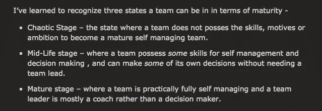

# “不太成熟”的团队

> 原文：<https://medium.com/hackernoon/less-mature-teams-e509dd0b6bd4>

## 以及关于学徒模式的一些注释

Apprentice At Work….

我经常听到组织中的人(经理、领导)谈论“不太成熟”的团队。通常是在解释为什么这些“不太成熟”的团队需要不同于“更成熟”的团队的外观和操作的背景下。忍者们正在解决大问题，而白带们正在直升机管理、规范性工作和护栏流程的海洋中挣扎。忍者是“从 Scrum 中成长起来的”,而白带必须“按章办事”。

[http://5whys.com/blog/the-3-maturity-stages-of-a-software-team-and-how-scrum-fails.html](http://5whys.com/blog/the-3-maturity-stages-of-a-software-team-and-how-scrum-fails.html)

这真的让我很生气！为什么？

因为它无视人们如何成为熟练的工匠！产品开发是一项团队运动。在一个组织中拥有*成熟*和*不成熟*的团队——并区别对待它们——剥夺了经验较少的人作为参与者体验高效团队的动力。这是一个孤注一掷的方法。有时“不太成熟”的团队会想出办法。有时他们会挣扎。

为什么不要求所有团队都有相同的高绩效标准呢？

这就是学徒制模式有效的地方。学生们与一位大师级工匠(或多位工匠)一起工作。"学生不断地与成功的工具、老师和工作的受益者互动."有“持续指导”

每个团队都应该接触到一个大师级的工匠，他*在做工作*(不是指导或管理)和教学。

一些来自维基百科文章的学徒信息。阅读这篇文章让我对学徒制和助理/实习生/传统管理模式的区别有了一些想法。

# 学徒期

来源[导师老师/学徒模式](https://en.wikibooks.org/wiki/Mentor_teacher/Apprenticeship_model)、[学徒制](https://en.wikipedia.org/wiki/Educational_theory_of_apprenticeship)教育理论、[学徒制](https://en.wikipedia.org/wiki/Apprenticeship)。

*   将正式培训与在职培训相结合
*   在工艺大师的监督下。与专家“并肩”工作
*   与专家合作，以达到可接受的水平
*   不是在基础水平上学习技能，而是在特定行业接受的水平上学习技能
*   学徒接受持续的指导。辅导不被视为单独的活动
*   主人示范完成任务的正确方法
*   选择适合学徒的任务的师傅。指导适应学徒的需要
*   反思性模仿、模仿性重建和选择性重建
*   提供“结构化的高价值学习和可转移的技能和知识”
*   通过个人、文化工具和社会群体之间的互动进行学习
*   职业认同是通过掌握新技能的过程发展起来的
*   新手从“外围合法参与”到“全面参与”
*   由有经验的成员观察活动的表现
*   学生沉浸在“真实的活动”中。活跃、社交和真实
*   学习实现目标的实用的、心照不宣的策略
*   学生不断地与成功的工具、老师和工作的受益者互动