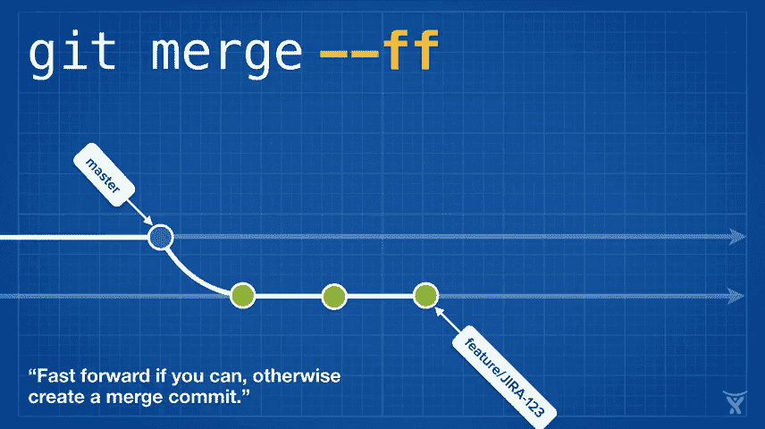
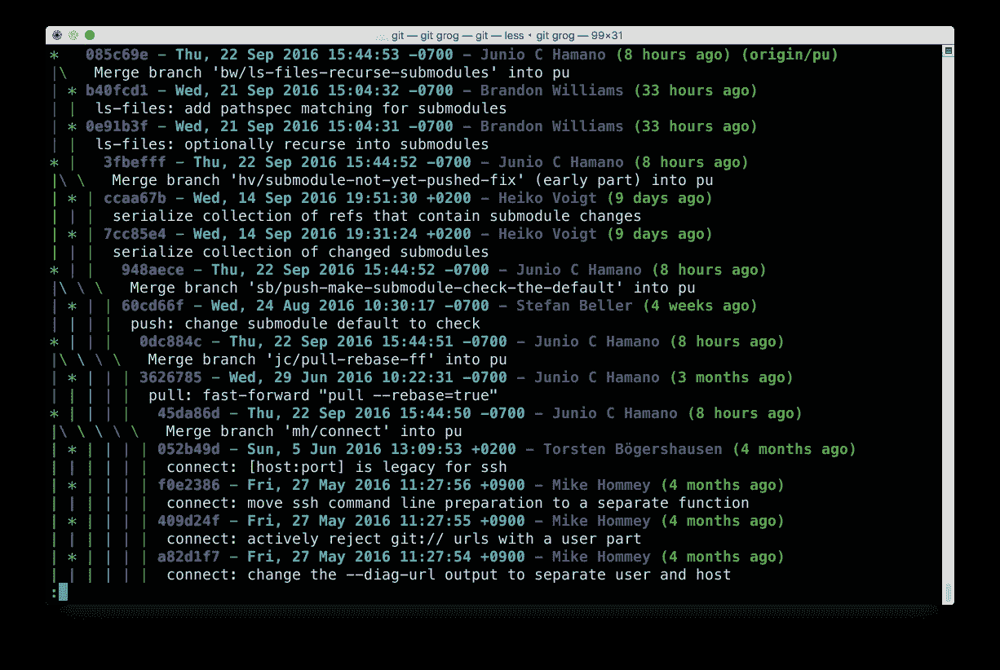
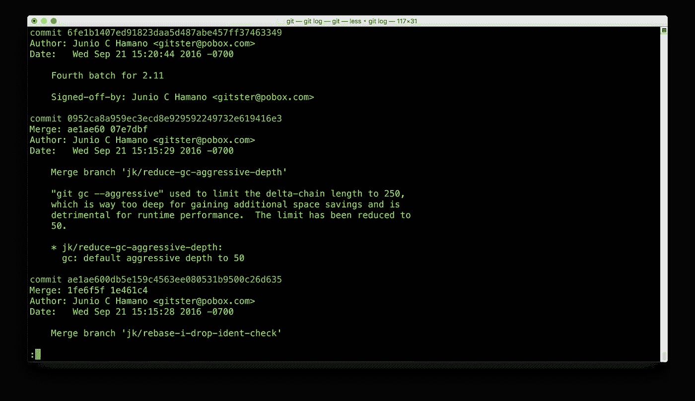
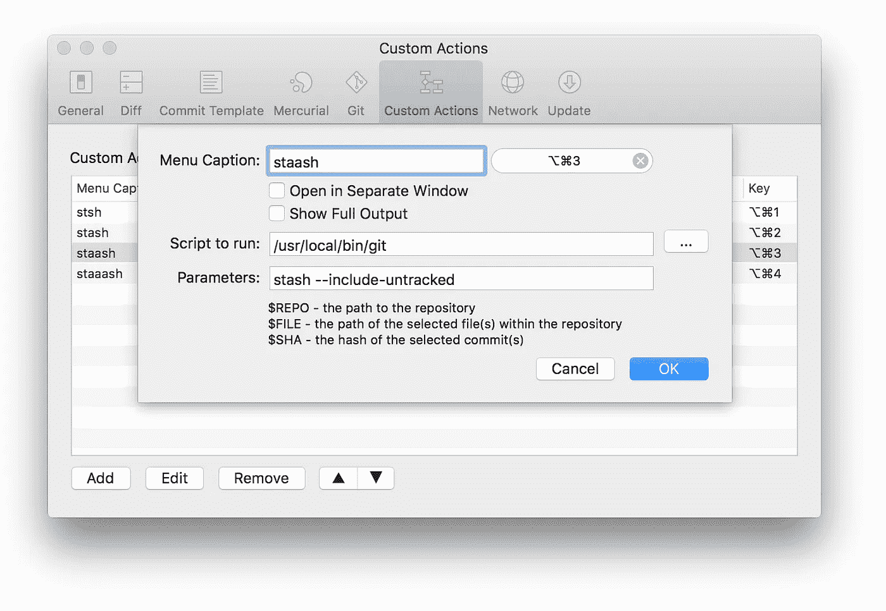
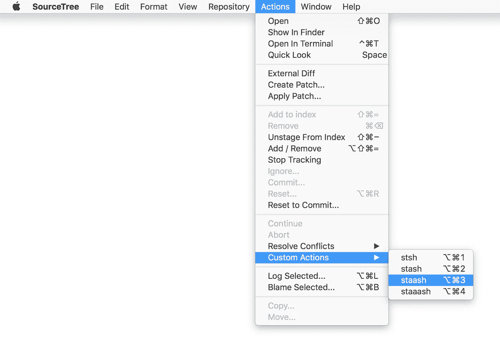

# 鲜为人知的 Git 命令

> 原文：<https://medium.com/hackernoon/lesser-known-git-commands-151a1918a60>

Git 对向后兼容性有很强的承诺:许多强大的特性隐藏在选项后面，而不是作为默认行为公开。幸运的是，Git 还支持*别名*，因此您可以创建自己的命令来实现各种各样的 Git 魔术。下面是我的*中定义的一些更有用(或者至少有趣)的别名。gitconfig* :

# 请给我

```
$ git config --global alias.please 'push --force-with-lease'
```

每个开发人员都和他们的团队领导讨论过强制推进到共享分支(即不要这样做)。重置、修改和挤压。都很有趣，直到你重写了一些共享的历史，并且在你的存储库中到处都是重复的提交。幸运的是，Git 不会让你随意在服务器上重写历史。你必须显式地将 *- force* 选项传递给 *git push* 来表明你是认真的。但是强制推送有点重:它用您的本地版本踩踏上游分支，并且您尚未获取的任何更改都将从历史中删除。


Quality meme courtesy of [@tarkasteve](https://twitter.com/tarkasteve)

Git 的[*-force-with-lease*](https://developer.atlassian.com/blog/2015/04/force-with-lease/?utm_source=medium&utm_medium=blog&utm_campaign=lesser-git)*选项要客气得多:它会在覆盖之前检查您正在覆盖的 ref 的本地副本是否是最新的。这表明您至少已经获取了将要踩踏的更改。因为*git push-force-with-lease*每次都要输入很多，所以我为它创建了一个礼貌的别名: *git please**

# *给予表扬*

```
*$ git config --global alias.commend 'commit --amend --no-edit'*
```

*有没有提交后马上意识到忘记上传文件的经历？别再烦恼了！gitcomm 荐悄悄地将任何暂存文件添加到您创建的最后一次提交中，重用您现有的提交消息。所以，只要你还没有努力，没有人会知道。*

```
*$ git add Dockerfile
$ git commit -m ‘Update Bitbucket pipeline with new Docker image’
# (facepalm)
$ git add bitbucket-pipelines.yml
$ git commend*
```

# *抓住它*

```
*$ git config --global alias.it \
'!git init && git commit -m “root” --allow-empty'*
```

*存储库的第一次提交不能像常规提交一样被重新确定基础，所以创建一个空提交作为存储库根是一个好的实践。git it 在一个快速的步骤中初始化您的存储库并创建一个空的根提交。下次你启动一个项目时，不要只是把它添加到版本控制中: *git it* ！*

```
*$ cd shiny-new-thing
$ git it
Initialized empty Git repository in /shiny-new-thing/.git/
[master (root-commit) efc9119] root*
```

# *git staaash*

```
*$ git config --global alias.stsh 'stash --keep-index'
$ git config --global alias.staash 'stash --include-untracked'
$ git config --global alias.staaash 'stash --all'*
```

*[*git stash*](https://www.atlassian.com/git/tutorials/git-stash/?utm_source=medium&utm_medium=blog&utm_campaign=lesser-git) 是最令人愉快和有用的 git 命令之一。它会对你的工作树中被跟踪的文件进行任何修改，然后*将它们藏起来*以备后用，给你留下一个干净的工作树，让你开始处理其他东西。然而，如果你已经创建了任何*新的*文件并且还没有暂存它们，默认情况下 *git stash* 不会接触它们，留给你一个脏的工作树。同样，默认情况下不会隐藏未跟踪或忽略的文件的内容。*

*我已经创建了几个方便的别名来处理不同种类的 *git stash* ，基于你的工作树的哪些部分你需要存储:*

```
*git stsh      # stash only unstaged changes to tracked files
git stash     # stash any changes to tracked files
git staash    # stash untracked and tracked files
git staaash   # stash ignored, untracked, and tracked files* 
```

*如果有疑问，长的那个( *git staaash* )将总是把你的工作树恢复到看起来像你的库的一个新克隆。*

# *矮子*

```
*$ git config --global alias.shorty 'status --short --branch'*
```

*我运行 [*git status*](https://www.atlassian.com/git/tutorials/inspecting-a-repository/?utm_source=medium&utm_medium=blog&utm_campaign=lesser-git) 的次数可能比任何其他 git 命令都多。这些年来，Git 的内联帮助变得更加友好，这对初学者来说非常好，但是对于那些更熟悉 Git 的人来说，输出过于冗长。例如， *git status* 发出 **18 行代码**告诉我，我有几个分阶段的、未分阶段的和未跟踪的变更:*

```
*$ git status
On branch master
Changes to be committed:
  (use “git reset HEAD <file>…” to unstage) modified: package.jsonChanges not staged for commit:
  (use “git add <file>…” to update what will be committed)
  (use “git checkout -- <file>…” to discard changes) modified: package.jsonUntracked files:
  (use “git add <file>…” to include in what will be committed) index.js*
```

**git shorty* 用三行告诉我同样的事情:*

```
*$ git shorty
## master
AM test
?? .gitignore*
```

*(好吧，为了简单起见，我实际上把这个别名叫做 *git st* ，但是我无法抗拒。)*

# *git merc*

```
*$ git config --global alias.merc 'merge --no-ff'*
```

*如果你正在使用一个标准的非基础分支工作流，运行一个标准的 *git merge* 来合并主功能分支实际上并不理想。在没有选项的情况下， *git merge* 使用 *- ff* 合并策略，该策略仅在主分支上没有新的更改时创建合并提交，否则它会简单地“快进”您的主分支以指向您的特性分支上的最新提交。只有*有时候*创建一个合并提交会让你在查看你的 git 历史时很难推断出哪个代码是在哪个分支上开发的。*

**

**git merc* 使用 *- no-ff* 策略，总是创建一个合并提交。*

**

*顺便提一下， *- no-ff* 也是我们在[位桶](https://bitbucket.org?utm_source=medium&utm_medium=blog&utm_campaign=lesser-git)中合并拉请求时使用的(默认情况下)。*

# *git grog*

```
*$ git config --global alias.grog 'log --graph --abbrev-commit --decorate --all --format=format:"%C(bold blue)%h%C(reset) - %C(bold cyan)%aD%C(dim white) - %an%C(reset) %C(bold green)(%ar)%C(reset)%C(bold yellow)%d%C(reset)%n %C(white)%s%C(reset)"'*
```

*我的别名 *git grog* (或“ **gr** aphical l **og** ”)已经发展了这么多年，我已经不确定自己是否确切了解它的功能。但是它看起来很漂亮:*

**

**git grog**

*下面是标准的 *git 日志*用于比较:*

**

*git log*

*有各种各样的[漂亮的格式](https://git-scm.com/docs/pretty-formats)可用，所以分叉上面的命令，让它成为你自己的！*

# *对于 GUI 粉丝来说*

*如果你是 Git GUI 爱好者，并且使用 Mac 或 Windows，你可能会使用我们的免费 Git 客户端:Atlassian SourceTree。如果是这样的话，您可以通过在您的 [SourceTree](https://hackernoon.com/tagged/sourcetree) 首选项中创建一个新的*自定义操作—* 和可选的键盘快捷键来利用这些别名:*

**

*然后您可以通过*动作*->-*自定义动作*菜单或您选择的键盘快捷键来访问它:*

**

*快乐别名！如果你自己有一些整洁的 Git 别名，请在评论中分享，或者发推特给我 [@kannonboy](https://twitter.com/kannonboy) 。*

*[](http://bit.ly/HackernoonFB)**[](https://goo.gl/k7XYbx)**[](https://goo.gl/4ofytp)*

> *[黑客中午](http://bit.ly/Hackernoon)是黑客如何开始他们的下午。我们是这个家庭的一员。我们现在[接受投稿](http://bit.ly/hackernoonsubmission)并乐意[讨论广告&赞助](mailto:partners@amipublications.com)机会。*
> 
> *如果你喜欢这个故事，我们推荐你阅读我们的[最新科技故事](http://bit.ly/hackernoonlatestt)和[趋势科技故事](https://hackernoon.com/trending)。直到下一次，不要把世界的现实想当然！*

*[](https://goo.gl/Ahtev1)*