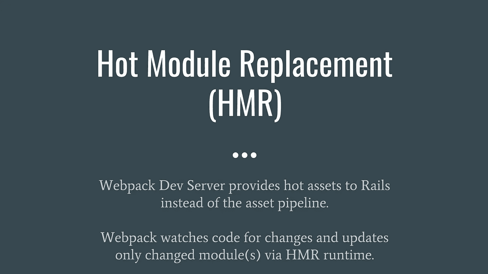
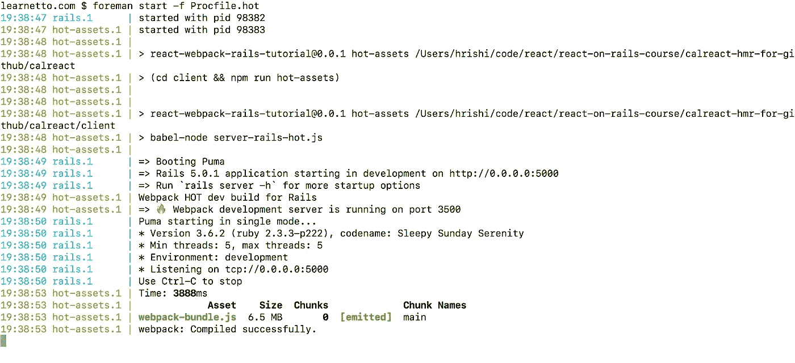
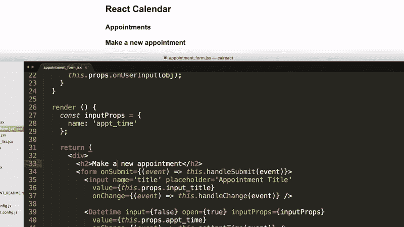
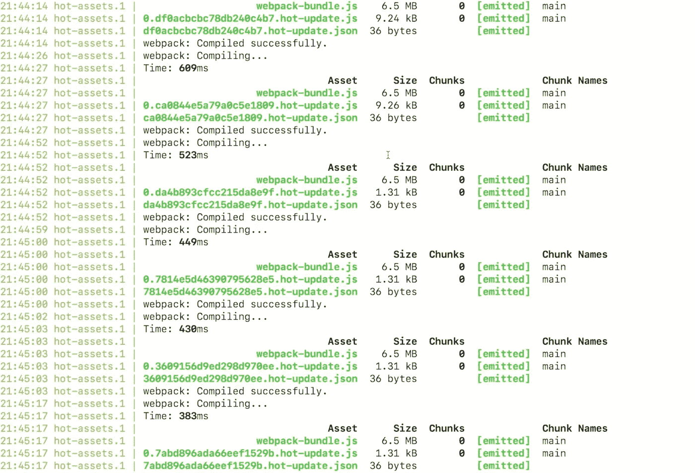

# 🔥Rails 中热模块替换的分步 React 教程

> 原文：<https://medium.com/hackernoon/lesson-5-hot-module-replacement-for-react-in-rails-using-the-react-on-rails-gem-643c5b01f3d7>


[source](https://upload.wikimedia.org/wikipedia/commons/8/8a/Darvasa_gas_crater_panorama.jpg)

你不讨厌每次修改一点代码就刷新浏览器吗？

> 这是来自[完整的 React on Rails 课程](https://learnetto.com/users/hrishio/courses/the-complete-react-on-rails-5-course?utm_source=hackernoon&utm_campaign=hackernoon_hmr&utm_medium=hackernoon_hmr)的一课，该课程帮助 Ruby on Rails 开发人员变得非常擅长使用 React.js 在 Rails 中构建 ui。它只适用于那些在生产中认真使用 React 的人，所以[不要点击这个链接](https://learnetto.com/users/hrishio/courses/the-complete-react-on-rails-5-course?utm_source=hackernoon&utm_campaign=hackernoon_hmr&utm_medium=hackernoon_hmr)，除非你是其中之一。

在本课中，我们将了解如何在带有热模块替换的 react_on_rails 应用程序中使用热资产重装。

我们正在构建的应用是一个日历约会应用。你可以在 [Github](https://hackernoon.com/tagged/github) 上找到代码:

 [## GitHub - learnetto/calreact-hmr

### 在 GitHub 上创建一个帐户，为 calreact-hmr 的开发做出贡献。

github.com](https://github.com/learnetto/calreact-hmr) 

热重新加载意味着在浏览器中自动显示实时代码更改，而不必在每次更改时重新加载页面。

在开发中还是挺有用的。您可以让代码和浏览器窗口相邻，只需编写代码并保存它，就可以立即看到更改，而无需切换到浏览器或刷新浏览器。

[react_on_rails gem](http://github.com/shakacode/react_on_rails) 使用一种特殊类型的热重载，称为热模块替换或通过 Webpack Dev server 的 HMR，向 rails 提供热资产，而不是资产管道。



当您启动应用程序时，Webpack 会构建包，然后继续观察源文件的变化。如果它检测到源文件发生了更改，它将只重建已更改的模块，并通过 HMR 运行时在浏览器中更新这些模块。

react_on_rails gem 有一个关于如何设置的[自述文件](https://github.com/shakacode/react_on_rails/blob/master/docs/additional-reading/hot-reloading-rails-development.md)。

但是他们提供的示例代码有很多额外的部分，很容易在 npm 地狱中迷失，试图一次完成所有这些。

所以我做了这个超级简化的一步一步的教程，教你怎么做。🙂

我建议您在您的计算机上克隆 react_on_rails repo，并在 [spec/dummy 目录](https://github.com/shakacode/react_on_rails/tree/master/spec/dummy)中查找热重载设置代码示例。

您必须更改许多文件和设置，所以我将带您一步一步地完成设置。

您可以对任何资源进行热重新加载，包括 [Javascript](https://hackernoon.com/tagged/javascript) 、CSS 和图像，但在本课中，我们将只对 Javascript 使用它。

热重装只适用于开发，所以我们需要生成两组配置文件——一组用于开发以使用热重装，另一组用于生产(使用静态资产)。

让我们首先进行热重装的设置，稍后我们将添加额外的设置来为生产中的静态文件提供服务。

**1。我们首先要安装一些我们需要的 javascript 包。**

两个关键的包是 **react-transform-hmr** (支持通过热模块替换 API 重新加载)和 **webpack-dev-server** (服务于实时资产的开发服务器)。

此外，我们还需要一个巴别塔插件来应用转换。

我们需要将这些添加到我们的 [client/package.json 文件](https://github.com/learnetto/calreact-hmr/blob/master/client/package.json):

```
“babel-plugin-react-transform”: “^2.0.2”,
“react-transform-hmr”: “^1.0.4”,
“webpack-dev-server”: “^1.16.2”
```

我们还将在这里添加 jquery 和 jquery-ujs，以便它们被 webpack(而不是 Rails)捆绑，并对依赖它们的任何其他包可用。

```
“jquery”: “^3.1.1”,
“jquery-ujs”: “^1.2.2”,
```

那我们跑吧:

```
$ npm install
```

包装完成了。

**2。接下来，让我们设置 webpack 配置文件。**

我们需要一个由[热配置](https://github.com/learnetto/calreact-hmr/blob/master/client/webpack.client.rails.hot.config.js)和[静态配置](https://github.com/learnetto/calreact-hmr/blob/master/client/webpack.client.rails.build.config.js)共享的[基本配置](https://github.com/learnetto/calreact-hmr/blob/master/client/webpack.client.base.config.js)。

我已经将这些配置文件从 react _ on _ rails repo spec/dummy/client 目录复制到我的应用程序中，并对它们进行了简化，只使用我们需要的基本内容。

让我们快速浏览一下。

基本配置主要设置要解析的入口点和文件扩展名。它保留特定于环境的配置文件的输出设置。

```
// Common client-side webpack configuration used by
// webpack.client.rails.hot.config and webpack.client.rails.build.config.const webpack = require('webpack');
const path = require('path');const devBuild = process.env.NODE_ENV !== 'production';
const nodeEnv = devBuild ? 'development' : 'production';module.exports = {// the project dir
  context: __dirname,
  entry: [
      'babel-polyfill',
      'es5-shim/es5-shim',
      'es5-shim/es5-sham',
      'jquery-ujs',
      'jquery',
      './app/bundles/Appointments/startup/registration',
  ],
  resolve: {
    extensions: ['', '.js', '.jsx'],
    alias: {
      libs: path.join(process.cwd(), 'app', 'libs'),
      react: path.resolve('./node_modules/react'),
      'react-dom': path.resolve('./node_modules/react-dom'),
    },
  },plugins: [
    new webpack.DefinePlugin({
      'process.env': {
        NODE_ENV: JSON.stringify(nodeEnv),
      },
      TRACE_TURBOLINKS: devBuild,
    }),],
  module: {
    loaders: [
      { test: require.resolve('jquery'), loader: 'expose?jQuery' },
      { test: require.resolve('jquery'), loader: 'expose?$' },    
    ],
  },
};
```

它还将 jQuery 公开为一个全局变量，这样依赖于它的任何其他包都可以使用它。

现在我们来看看热配置。它建立在基本配置的基础上。

它引入了基本配置，并为热重装添加了一些额外的东西。它设置 webpack dev 服务器将运行的端口(3500)。

```
// Run with Rails server like this:
// rails s
// cd client && babel-node server-rails-hot.js
// Note that Foreman (Procfile.dev) has also been configured to take care of this.const path = require('path');
const webpack = require('webpack');const config = require('./webpack.client.base.config');const hotRailsPort = process.env.HOT_RAILS_PORT || 3500;
```

它添加了两个入口点——第一个是来自 webpack dev server 的活动资产，第二个是它需要的模块。

```
config.entry.push(
  `webpack-dev-server/client?[http://localhost:${hotRailsPort}`](http://localhost:${hotRailsPort}`),
  'webpack/hot/only-dev-server'
);
```

[](https://learnetto.com/users/hrishio/courses/the-complete-react-on-rails-5-course?utm_source=hackernoon&utm_campaign=hackernoon_hmr&utm_medium=hackernoon_hmr)

Want this lesson on video? Click on the image above

然后它设置输出文件名和路径。我们称之为网络包捆绑。

```
config.output = {
  filename: 'webpack-bundle.js',
  path: path.join(__dirname, 'public'),
  publicPath: `[http://localhost:${hotRailsPort}/`](http://localhost:${hotRailsPort}/`),
};
```

如果你看一下 [react_on_rails 回购示例](https://github.com/shakacode/react_on_rails/blob/master/spec/dummy/client/webpack.client.rails.hot.config.js)，他们[把它分成两个文件](https://github.com/shakacode/react_on_rails/blob/master/spec/dummy/client/webpack.client.base.config.js)——一个用于应用程序，一个用于供应商文件。

但是我们在这里保持简单，只创建一个输出文件。

这里最重要的一点是这个加载器，它获取我们的 jsx 文件，并通过一个 babel 插件应用 hmr 转换。

```
config.module.loaders.push(
  {
    test: /\.jsx?$/,
    loader: 'babel',
    exclude: /node_modules/,
    query: {
      plugins: [
        [
          'react-transform',
          {
            transforms: [
              {
                transform: 'react-transform-hmr',
                imports: ['react'],
                locals: ['module'],
              },
            ],
          },
        ],
      ],
    },
  },
  {
    test: require.resolve('jquery-ujs'),
    loader: 'imports?jQuery=jquery',
  }
);
```

然后我们将 hmr 插件添加到配置中并导出它。

```
config.plugins.push(
  new webpack.HotModuleReplacementPlugin(),
  new webpack.NoErrorsPlugin()
);config.devtool = 'eval-source-map';console.log('Webpack HOT dev build for Rails');module.exports = config;
```

[](https://learnetto.com/users/hrishio/courses/the-complete-react-on-rails-5-course?utm_source=hackernoon&utm_campaign=hackernoon_hmr&utm_medium=hackernoon_hmr) [## Rails 5 课程的完整反应

### Max Rose-Collins，RankTracker 的联合创始人和 Ruby 工程师你很了解 Rails。你已经用了一段时间了，在…

learnetto.com](https://learnetto.com/users/hrishio/courses/the-complete-react-on-rails-5-course?utm_source=hackernoon&utm_campaign=hackernoon_hmr&utm_medium=hackernoon_hmr) 

**3。下一步是根据我们是否使用热重装，在我们的** [**Rails 应用程序布局文件**](https://github.com/learnetto/calreact-hmr/blob/master/app/views/layouts/application.html.erb) **中包含每个环境的正确 webpack 资产文件。**

我们将使用视图助手来配置要加载的正确资产——根据环境，可以是“热”资产，也可以是“静态”资产。

```
<!DOCTYPE html>
<html>
  <head>
    <title>Calreact</title>
    <%= csrf_meta_tags %> <%= stylesheet_link_tag    'application', media: 'all', 'data-turbolinks-track': 'reload' %>

    <%= env_javascript_include_tag(hot: ['[http://localhost:3500/webpack-bundle.js'](http://localhost:3500/webpack-bundle.js')]) %> <%= env_javascript_include_tag(static: 'application_static',
                  hot: 'application_non_webpack',
                  'data-turbolinks-track' => true) %>
  </head> <body>
    <%= yield %>
  </body>
</html>
```

这里，env_javascript_include_tag 是 react_on_rails 提供的一个帮助器方法，它根据环境变量是否设置为使用热重载来包含热或静态资产文件。

这里我们有两个标签，一个用于加载不使用 turbolinks 的热资产，另一个用于静态资产。

然后我们需要创建这两个文件。

[应用 _ 静态. js](https://github.com/learnetto/calreact-hmr/blob/master/app/assets/javascripts/application_static.js) :

```
//= require webpack-bundle
//= require application_non_webpack
```

我们首先需要 webpack-bundle，然后需要 application_non_webpack。

让我们现在创建该文件—[application _ non _ web pack . js . erb](https://github.com/learnetto/calreact-hmr/blob/master/app/assets/javascripts/application_non_webpack.js.erb):

```
<% if ENV["DISABLE_TURBOLINKS"].blank? %>
  <% require_asset "turbolinks" %>
<% end %>
```

react_on_rails 使用这段代码来要求基于 env 变量的 turbolinks。我们可以使用它轻松地禁用或启用 turbolinks。

好了，都准备好了。

现在，如果我们想要使用静态资产，那么我们将只包含 application_static 文件，该文件包含 webpack_bundle 和任何非 webpack 资产。

如果我们使用热重装，那么我们将包括来自 webpack dev server 的热资产和非 webpack 资产，如来自 application_non_webpack 的 turbolinks。

**4。接下来，我们需要确保将 webpack 生成的文件包含在我们的** [**资产初始化器配置文件**](https://github.com/learnetto/calreact-hmr/blob/master/config/initializers/assets.rb) **中。**

```
type = ENV["REACT_ON_RAILS_ENV"] == "HOT" ? "non_webpack" : "static"
Rails.application.config.assets.precompile +=
  [
    "application_#{type}.js"
  ]
```

同样，在这里，基于这个 env 变量，我们设置要包含在预编译资产中的文件名。

**5。接下来，我们需要为热重装创建一个新的 Procfile。**

我们把它叫做 [Procfile.hot](https://github.com/learnetto/calreact-hmr/blob/master/Procfile.hot) 。请记住，它位于应用程序目录的根目录中。

它有几个过程

```
# Procfile for development with hot reloading of JavaScript and CSS
rails: REACT_ON_RAILS_ENV=HOT rails s -b 0.0.0.0# Run the hot reload server for client development
hot-assets: HOT_RAILS_PORT=3500 npm run hot-assets
```

首先是 rails 服务器——它用设置为`HOT`的`REACT_ON_RAILS_ENV`变量来运行它。

第二个是`hot-assets`，这是一个通过 webpack dev 服务器在端口 3500 上提供热资产的脚本。

这就是 Procfile.hot 全部完成。

**6。我们需要将运行 webpack dev 服务器的**[**server-rails-hot . js**](https://github.com/learnetto/calreact-hmr/blob/master/client/server-rails-hot.js)**脚本添加到我们的客户端目录中。**

这个文件导入 webpack、webpackdevserver 和我们的热配置，然后创建一个新的 dev 服务器并在端口 3500 上运行它。

```
import webpack from 'webpack';
import WebpackDevServer from 'webpack-dev-server';import webpackConfig from './webpack.client.rails.hot.config';const hotRailsPort = process.env.HOT_RAILS_PORT || 3500;const compiler = webpack(webpackConfig);const devServer = new WebpackDevServer(compiler, {
  contentBase: `[http://lvh.me:${hotRailsPort}`](http://lvh.me:${hotRailsPort}`),
  publicPath: webpackConfig.output.publicPath,
  hot: true,
  inline: true,
  historyApiFallback: true,
  quiet: false,
  noInfo: false,
  lazy: false,
  stats: {
    colors: true,
    hash: false,
    version: false,
    chunks: false,
    children: false,
  },
});devServer.listen(hotRailsPort, 'localhost', err => {
  if (err) console.error(err);
  console.log(
    `=> 🔥  Webpack development server is running on port ${hotRailsPort}`
  );
});
```

npm 脚本需要使用该文件。这是拼图中最后缺失的一块。

7。让我们在两个 package.json 文件中添加一些脚本，让 npm 运行我们的热重装代码

先来做根目录下的[包。](https://github.com/learnetto/calreact-hmr/blob/master/package.json)

```
"scripts": {
    "postinstall": "cd ./client && npm install",
    "build:clean": "rm -r app/assets/webpack/* || true",
    "build:dev:client": "(cd client && npm run build:dev:client --silent)",
    "hot-assets": "(cd client && npm run hot-assets)"
  }
```

build:dev:client 脚本是针对静态资产的，我们一会儿就会看到。

但是热资产是我们热重装所需要的。

它被放入客户端目录，npm 运行另一个名为 hot-assets 的脚本。

现在让我们将它添加到[客户端包文件](https://github.com/learnetto/calreact-hmr/blob/master/client/package.json)中:

```
"scripts": {
    "build:test": "npm run build:client && npm run build:server",
    "build:client": "webpack --config webpack.client.rails.build.config.js",
    "build:dev:client": "webpack -w --config webpack.client.rails.build.config.js",
    "hot-assets": "babel-node server-rails-hot.js"
  },
```

因此，在这里您可以看到 hot-assets 脚本使用我们之前设置的 server-rails-hot.js 文件运行 babel-node(babel 提供的命令行工具)。

这就是我们需要设置的一切，以使我们的 javascript 热重载工作。

现在让我们来看看它的实际效果吧！

让我们去终端用我们的新 Procfile 激发 foreman。hot:

```
$ foreman start -f Procfile.hot
```



foreman start -f Procfile.hot

您可以看到 Webpack 开发服务器正在端口 3500 上运行

我们的包编译成功了。

现在让我们在浏览器中测试我们的应用程序。

为了测试热重装，我将把我的代码编辑器放在浏览器旁边，您将看到我所做的实时更改自动出现在浏览器中。

[](https://learnetto.com/users/hrishio/courses/the-complete-react-on-rails-5-course?utm_source=hackernoon&utm_campaign=hackernoon_hmr&utm_medium=hackernoon_hmr)

Changes made to React components and utilities code appear immediately in the browser 🔥

如果我们查看日志，我们会看到 webpack dev 服务器正在提供这些热更新。



看看更新文件的大小。它们是几个字节。所以这相当快。

好了，这就是为开发设置的热重装。

**8。现在，最后一件事是设置配置，以便为生产中使用的静态资产提供服务，或者如果我们不想在开发中使用实时重载。**

我们需要几样东西——一个静态 webpack 配置和一个静态 Procfile。

让我们先添加 [webpack 配置](https://github.com/learnetto/calreact-hmr/blob/master/client/webpack.client.rails.build.config.js):

```
// Run like this:
// cd client && npm run build:client
// Note that Foreman (Procfile.dev) has also been configured to take care of this.const webpack = require('webpack');const config = require('./webpack.client.base.config');const devBuild = process.env.NODE_ENV !== 'production';config.output = {
  filename: 'webpack-bundle.js',
  path: '../app/assets/webpack',
  publicPath: '/assets/',
};// See webpack.client.base.config for adding modules common to both the webpack dev server and railsconfig.module.loaders.push(
  {
    test: /\.jsx?$/,
    loader: 'babel-loader',
    exclude: /node_modules/,
  },
  {
    test: require.resolve('react'),
    loader: 'imports?shim=es5-shim/es5-shim&sham=es5-shim/es5-sham',
  },
  {
    test: require.resolve('jquery-ujs'),
    loader: 'imports?jQuery=jquery',
  }
);config.plugins.push(
  new webpack.optimize.DedupePlugin()
);if (devBuild) {
  console.log('Webpack dev build for Rails');
  config.devtool = 'eval-source-map';
} else {
  console.log('Webpack production build for Rails');
}module.exports = config;
```

我使用了 react_on_rails spec/dummy 示例中的 web pack . client . rails . build . config . js 文件，并将其简化为只包含我们需要的部分。

与 hot webpack 配置类似，它建立在基本配置的基础上。它设置输出文件名并添加我们需要的加载程序。

现在让我们添加一个 [Procfile](https://github.com/learnetto/calreact-hmr/blob/master/Procfile.static) :

```
# Run Rails without hot reloading (static assets).
rails: REACT_ON_RAILS_ENV= rails s -b 0.0.0.0# Build client assets, watching for changes.
rails-client-assets: sh -c 'npm run build:dev:client'# Build server assets, watching for changes. Remove if not server rendering.
#rails-server-assets: sh -c 'npm run build:dev:server'
```

我们需要最上面的两个过程，一个用于 rails，另一个用于服务资产。

最后一个过程是服务器渲染，我已经注释掉了。

rails-client-assets 脚本运行我们之前在 package.json 中定义的`build:dev:client`，如下所示:

```
"build:dev:client": "webpack -w --config webpack.client.rails.build.config.js",
```

它使用我们刚刚创建的构建配置文件运行 webpack。

好了，这就是生产的设置。

我们可以通过用 Procfile.static 运行 foreman 来测试它:

```
$ foreman start -f Procfile.static
```

我们将不再在日志中获得 webpack dev 服务器消息，我们将只让 rails 应用程序在端口 5000 上运行。

现在，如果我们对组件进行更改，它不会自动出现在浏览器中。我们需要手动重新加载页面才能看到变化。

这就是使用热模块替换热重装 javascript 资产！

> 💚 💚如果你觉得这个教程有用，请点击绿色的心。💚💚

哦，别忘了[看看我的课程](https://learnetto.com/users/hrishio/courses/the-complete-react-on-rails-5-course?utm_source=hackernoon&utm_campaign=hackernoon_hmr&utm_medium=hackernoon_hmr)，里面有本课完整详细的视频和 3 个多小时的课程，将带你从零到英雄使用 React with Rails。

> 这是来自[完整的 React on Rails 课程](https://learnetto.com/users/hrishio/courses/the-complete-react-on-rails-5-course?utm_source=hackernoon&utm_campaign=hackernoon_hmr&utm_medium=hackernoon_hmr)的一课，该课程帮助 Ruby on Rails 开发人员变得非常擅长使用 React.js 在 Rails 中构建 ui。它只适用于那些在生产中认真使用 React 的人，所以[不要点击这个链接](https://learnetto.com/users/hrishio/courses/the-complete-react-on-rails-5-course?utm_source=hackernoon&utm_campaign=hackernoon_hmr&utm_medium=hackernoon_hmr)，除非你是其中之一。

[](https://learnetto.com/users/hrishio/courses/the-complete-react-on-rails-5-course?utm_source=hackernoon&utm_campaign=hackernoon_hmr&utm_medium=hackernoon_hmr) [## Rails 5 课程的完整反应

### Max Rose-Collins，RankTracker 的联合创始人和 Ruby 工程师你很了解 Rails。你已经用了一段时间了，在…

learnetto.com](https://learnetto.com/users/hrishio/courses/the-complete-react-on-rails-5-course?utm_source=hackernoon&utm_campaign=hackernoon_hmr&utm_medium=hackernoon_hmr) [](http://bit.ly/HackernoonFB)[](https://goo.gl/k7XYbx)[](https://goo.gl/4ofytp)

> [黑客中午](http://bit.ly/Hackernoon)是黑客如何开始他们的下午。我们是 [@AMI](http://bit.ly/atAMIatAMI) 家庭的一员。我们现在[接受投稿](http://bit.ly/hackernoonsubmission)并乐意[讨论广告&赞助](mailto:partners@amipublications.com)机会。
> 
> 如果你喜欢这个故事，我们推荐你阅读我们的[最新科技故事](http://bit.ly/hackernoonlatestt)和[趋势科技故事](https://hackernoon.com/trending)。直到下一次，不要把世界的现实想当然！

