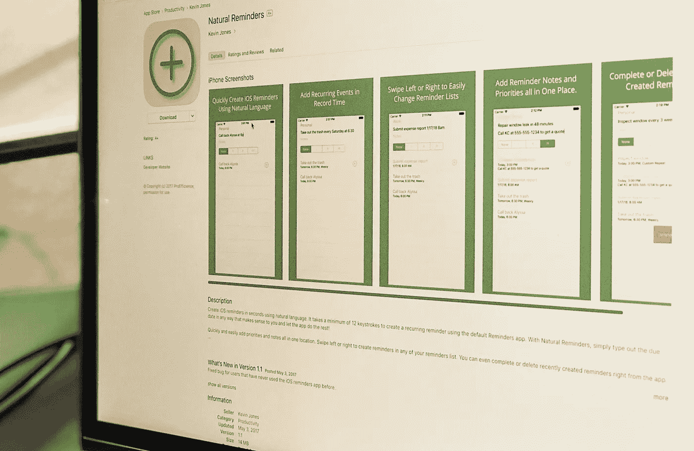
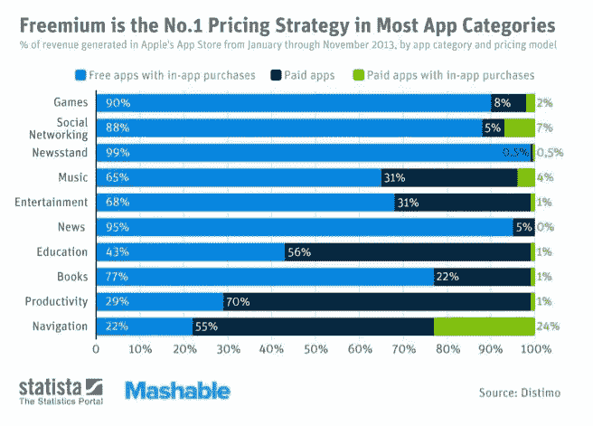
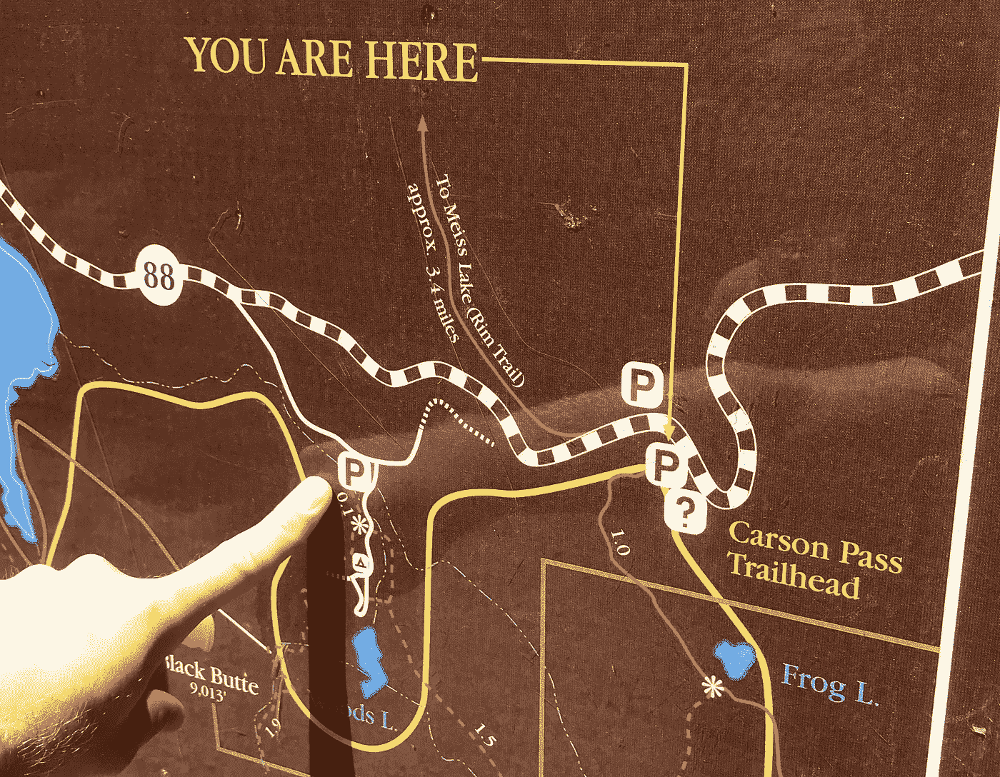

# 经验丰富的开发人员的第一个单独应用程序的教训

> 原文：<https://medium.com/hackernoon/lessons-from-an-experienced-devs-first-solo-app-521bae1411f>

## 启动副业项目的技巧

早就想搞副业了。在我的职业生涯中，我已经创建或帮助创建了许多成功的网络和移动应用程序。我喜欢建设和创造。然而，随着我在工作中承担更多的领导角色，我写代码的时间减少了。

因此，今年早些时候，我开始创建我的第一个单独的移动应用程序。主要目标是完成整个开发和部署过程。我想要一个易于构建的应用程序来尝试一下。没有值得编辑选择的。

我对生产力充满热情。从安卓换到 iPhone 后，我知道苹果的提醒应用其实已经接近我需要的了。唯一的问题是添加提醒有多难。使用 Siri 添加提醒事项有日期解析，但 iOS 应用没有。我和 Siri 大部分时间都不怎么说话。所以我创建了[自然提醒](https://itunes.apple.com/us/app/natural-reminders/id1227097884?mt=8)。

Natural Reminders

后来我取消了我的 Todoist 会员资格，这个应用已经成为我日常工作流程的一部分。我在 App Store 上以 0.99 美元的价格发布了它，它已经被下载了惊人的… 5 次。我认识这五个人。然而，这并不是一次失败。以下是我在这个过程中学到的一些东西。

# 创建一个 MVP

对你正在创造的产品的兴趣程度有一个衡量标准是很重要的。如果你不相信它，你最好现在就停止。我知道我想要自然的提醒。这足以让我开始并坚持下去。

但是我花了太多时间去完善一些小事。花太多时间添加我不需要的额外功能。我本可以提前一个月发布这款应用。我不会说那一个月是浪费时间。但我本可以着手一个新的副业项目，或者花更多的时间来获得用户。

下一次，我将着重于创建一个最小可行产品(MVP)。可能缺少某些功能的固体产品。您可以随时添加功能。你可以随时根据顾客的反馈进行调整。没有客户就不行。接受你的损失，继续前进。

# 免费是关键

我没有花太多时间考虑定价。我想我应该打广告，称之为好。经过一些研究，知道我有多不喜欢广告，我决定反对它。生产力应用程序通常是要花钱的，所以我把它定价为 0.99 美元，仅此而已。

[Source](http://sourcebits.com/app-development-design-blog/paid-vs-free-apps-app-store-vs-google-play/)

一块钱在 App Store 里不算多。我知道有人一个人花了几百块买了 Pokemon Go。但对你一无所知的东西来说，对一个你一无所知的人来说，这太多了。

我的 5 个下载者中有几个甚至嘲笑我不得不在我的应用上花一美元的想法。他们是一家人！我怎么能指望一个陌生人对此感到惊奇呢？生产力应用程序可能通常是昂贵的，但你必须有一些背景。

下一次，有些东西必须是免费的。我只记得有几次我在商店里买了一些没有上下文的东西。只有在尝试了有限的版本后，我才确信这应该是我工作流程的一部分。

# 推出产品需要时间

上周末，我和妻子去远足。这是一段美好的时光，回到停车场时，我们兴奋不已。却发现那是错误的。我们的车在大约 3 英里外。哎呀。通常 3 英里是容易的，但是我们到达停车场的时候，心里想着我们已经完了。那是艰难的 3 英里。

Not Quite Done

同样，当我称应用程序制作就绪时，我也很兴奋。我想它很快就会出现在商店里，我已经为我的下一个项目做好了准备。我已经准备好向前看了。我只想知道如何发射它。但这是一个非常耗时的过程。

我是一名软件开发人员。我从事副业的主要动机之一是专注于编码的能力。在开发过程中，我能够做到这一点。但是现在是时候启动这个东西了。现在我必须成为一名营销人员。一个推销员。这里面有很多东西。

经过一番研究，我发现免费获得产品的最简单方法是[产品搜索](https://www.producthunt.com/posts/natural-reminders)。我以“产品搜寻”的方式做每一件事。我找到了一个人，并对这个应用进行了测试。我甚至花时间为它创建了一个[营销网站](http://proefficience.com/natural/)。

> 该应用程序推出后，总共获得了 4 张支持票。

下次，我会计划在营销上花更多的时间。我已经准备好继续前进了，所以没有在营销上花足够的时间。当然，我知道这个特别的应用不值得推广。但关键是要经历整个过程。

# 成功是你自己创造的

综上所述，我的第一次应用尝试似乎是失败的。但我不这么认为。创作者永远不应该将任何已完成的项目视为失败。我完成了我的目标，完成了整个开发和部署过程。

不仅如此，我仍然将该应用程序作为我日常工作流程的一部分。我在 Todoist 订阅上每月节省了 2.99 美元。我也有一些很棒的日期解析代码，我可以在未来的工作/个人项目中使用。这个副业项目很成功。

# 后续步骤

既然我并不急于离开这个项目，我仍然可以用它做一些事情。我能做的最好的实验就是让它免费。我可以通过应用内购买提供核心功能来解锁一切。看看这是否会增加用户会很有趣。

不过，更重要的是，继续我的下一个副业。所有程序员都应该有副业。吸取的教训是无价的。他们在简历上看起来不错。你甚至可能做出成功的东西。但是项目的成功不是目标。尽管项目本身很成功，但副业是提升你价值的最佳方式之一。